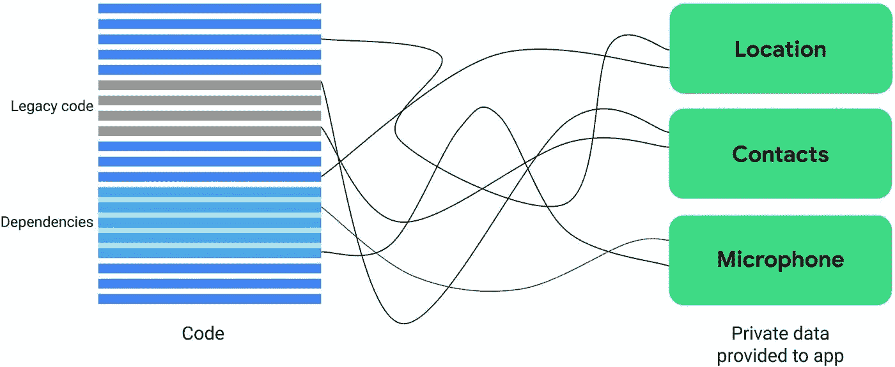
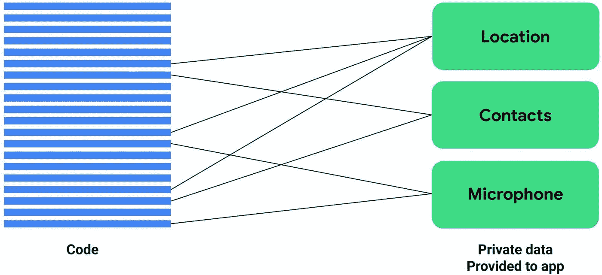
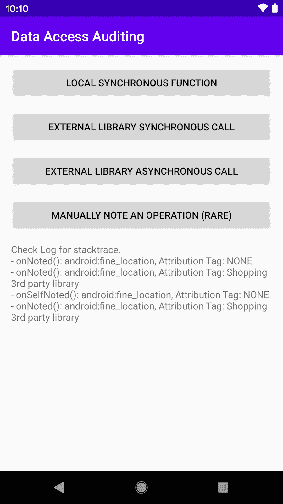

# 新的 Android 11 工具使应用程序更加隐私和稳定

> 原文：<https://medium.com/androiddevelopers/new-android-11-tools-to-make-apps-more-private-and-stable-c9dcea0af415?source=collection_archive---------0----------------------->

*Illustration by* [*Molly Hensley*](https://dribbble.com/Molly_Hensley)

*供稿人:京基和齐夫·斯奈*

作为我们帮助您构建高质量应用的持续努力的一部分，我们经常寻找我们可以投资工具和资源的领域，以便让您更好地了解您的应用的性能。

# **大新闻**

在 Android 11 中，我们引入了两个新工具，数据访问审计 API 和进程退出原因，让您更加透明地了解您的私有数据访问和进程退出原因。

# 数据访问审计 API

Android 鼓励开发人员在访问敏感数据时要考虑周到和有意识。在 Android 11 中，您将可以访问新的 API，这将使您更加透明地使用私有和受保护的数据。这可能是有用的，例如，对于可能有遗留代码的大型应用程序和那些使用第三方库或 SDK 的应用程序。

*It may not be easy for large apps to attribute private data usage.*

第一个 API 是一个回调函数，允许应用程序[回溯运行时许可保护的数据使用](https://developer.android.com/preview/privacy/data-access-auditing#log-access)到触发使用的代码。为了得到通知，任何应用程序都可以在 [AppOpsManager](https://developer.android.com/reference/android/app/AppOpsManager.OnOpNotedCallback) 中设置一个回调，每当一段代码使用私有数据时，就会调用这个回调，比如获取位置更新。您可以创建特定的逻辑来跟踪、接收和分析数据。

*Data access auditing API in Android 11 helps back track private data usage to your code.*

第二个 API 面向具有多种特性的复杂应用。社交应用程序可能有查找朋友功能和照片标记功能。每个功能都使用敏感数据的子集，例如查找朋友使用位置和联系人，照片标签使用位置、联系人和相机。在 Android 11 中，你可以创建一个新的上下文对象，允许你[将应用程序代码的子集](https://developer.android.com/preview/privacy/data-access-auditing#audit-by-attribution-tag)归属于一个或多个特性。因此，今后，每个权限的使用都将被追溯到与上下文相关联的特性。

您还可以在我们的[代码示例](https://github.com/android/permissions-samples/tree/master/DataAccessAuditingKotlin)中看到这些 API 的运行。

除了帮助您识别私人数据访问，Android 11 还包括新的 API，以帮助查明这些领域中并非总是微不足道的崩溃问题。

# 流程退出原因

你还告诉我们，很难找到你的应用程序被终止的原因，这可能是由于各种原因:ANR、崩溃或用户选择强制停止应用程序。为了帮助诊断原因，一些开发人员正在添加定制代码，以便建立自己的分析来改善应用程序的健康状况。

考虑到这一点，我们找到了一种方法来简化诊断过程。

Android 11 引入了一个新的 [ActivityManager](https://developer.android.com/reference/kotlin/android/app/ActivityManager#gethistoricalprocessexitreasons) API 来报告与应用程序进程终止相关的历史信息。

您的应用程序可以使用 API 来检索任何可用的历史进程退出诊断信息，例如进程终止是由于 ANRs、内存问题还是其他原因。

如果应用由于 ANR 而终止，`[ApplicationExitInfo.getTraceInputStream()](https://developer.android.com/reference/kotlin/android/app/ApplicationExitInfo?hl=en#gettraceinputstream)` 将返回一个 InputStream 到应用终止前的堆栈跟踪转储。这在较新的操作系统版本上尤其有用，由于隐私和安全考虑，[提取 ANR 跟踪](https://developer.android.com/topic/performance/vitals/anr#pull_a_traces_file)会更加复杂。从 InputStream 中读取数据后，只需记住关闭它以避免资源泄漏。

此外，您可以使用新的`[ActivityManager.setProcessStateSummary()](https://developer.android.com/reference/kotlin/android/app/ActivityManager#setprocessstatesummary)`方法来存储定制的状态信息。这是一种保存任意进程数据的有用方法，可以用来调试导致应用程序崩溃的代码部分。对于一些开发人员来说，了解应用程序在进程终止前的状态也是至关重要的，例如，游戏开发人员可能想知道用户在进程终止前的当前游戏级别，一种常见的方法是将其持续保存到存储中，并在下一次应用程序启动时读取它。请注意，输入数据的大小非常有限。任何保存的流程状态信息都可以通过`[ApplicationExitInfo.getProcessStateSummary()](https://developer.android.com/reference/kotlin/android/app/ApplicationExitInfo#getprocessstatesummary)`方法检索。

**资源**

我们希望这些额外的工具有助于让您的应用程序更加注重隐私和稳定。要了解更多信息，请查看我们的开发人员文档中关于[数据访问审计](https://developer.android.com/preview/privacy/data-access-auditing)和[进程退出原因 API](https://developer.android.com/preview/features#app-process-exit-reasons)的内容。