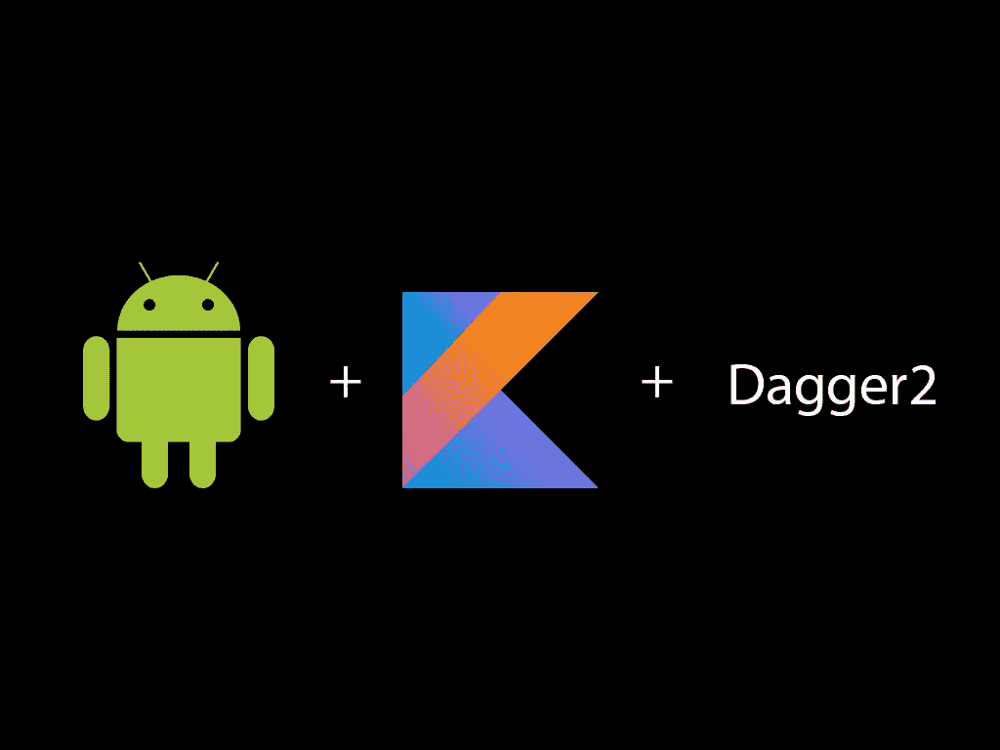

# New Android Injector Dagger 2 + MVP + Kotlin = Awesome!

> 原文：<https://medium.easyread.co/new-android-injector-dagger-2-mvp-kotlin-awesome-d4495d8f1883?source=collection_archive---------1----------------------->

Ketika kita sebagai mobile developer khususnya Android tentunya sudah tidak asing lagi dengan istilah “Dependency Injection”. Alasan utama DI menjadi hal yang paling banyak disukai karena reusing classnya itu keren banget jadi gak perlu lagi kita new instance sendiri dan juga skema untuk testing antar class dependencynya itu testable banget.

Ditambah lagi belakangan ini salah satu bahasa baru yaitu kotlin tumbuh berkembang sangat cepat. Dukungan komunitas serta udah offically dari google sendiri setelah Google IO 17\. yang perlu kita tancap di mindset itu kata — kata ini.

> Kotlin bukan untuk mengantikan Java tp kotlin dibuat untuk berjalan dengan java berbarengan.

Maksud quote diatas adalah kalau kalian mengalami suatu hal yang gak bisa dilakukan oleh kotlin tp bisa dijava, so jangan ngotot untuk kekeh pake kotlin. gabungkanlah keduanya, sebab mereka itu bisa jalan secara berbarengan didalam satu project yang sama.

Balik ke topik awal tentang “New Android Injector Dagger2 + Kotlin”, jadi belakangan ini ada Injector baru dari dagger yang membuat hidup dependency injection kita menjadi lebih simple. Apakah kalian ingat dengan potongan kode di bawah ini ?

Potongan kode diatas itu merupakan cara lama kita untuk mendaftarkan sebuah activity agar teregister disebuah app component. hal ini dilakukan agar kita bisa menggunakan kelas — kelas lain yang terdaftar pada app module didalam kelas yang bersangkutan.

Coba kalian pikirkan apabila ada dev baru kemudian dia lupa untuk mendaftarkan classnya menggunakan perintah diatas maka akan menyebabkan error saat kelas itu ada yang pake injection dari kelas lainnya. Solusinya sekarang ada injector baru untuk menggantikan cara lama tersebut, agak lebih panjang sedikit untuk setup awalnya namun lebih terstruktur.

“HasActivityInjector” ,dia itu sebuah interface baru dari dagger yang ngasih tau bahwa app kita didalamnya ada injector dari activity (gak harus activity doang loh bisa fragment juga). gimana cara mendaftarkannya didalam app kita ?

Jadi awalnya kita daftarkan has activity injector di level app, ini tandanya didalam app component kita mempunyai activity sebagai component utama yang terdaftar pada app component ( 1 tingkat dibawahnya). kemudian setelah itu kita perlu membuat sebuah abstract class module baru ( kita sebut ActivityBuilder)

Setelah kita membuat class activity builder baru ini , tandanya kita mendaftarkan ke app component kalau kita punya module activity builder yang isinya itu list activity yang kita punya include sama module2nya kalau ada. btw kelas ini sebenarnya yang menjadi pengganti cara lama kita melakukan injection disetiap kelas.

Kerennya disini ada yang namanya @Component.Builder, jadi kita bisa bebas membuat interface sendiri buat builder dari setiap component. sebagai contoh diatas kita hanya memerlukan bind instance untuk application dan function build sendiri yang nilainya direturnkan kembali ke app component.

Setelah semuanya disetup kita bisa melakukan injection diactivity atau kelas yang kita buat. untuk kebutuhan gradlenya teman — teman hanya perlu menambahkan gradle versi 2.11 (yang saya gunakan) dan kotlin extensionnya di enable.

tambahan konfigurasi gradle pada level project

tambahan konfigurasi gradle pada level app

Setelah Dependency Injectionnya selesai kita buat. Kenapa sih diduet sama kotlin jadi awesome ? simple sih karena kotlin itu lebih simple dari pada java trus dia juga punya android extension yang bisa langsung direct access komponen xml di kelas tanpa findViewById.

Kalau udah pake yang namanya android extension berarti kita bisa say goodbye buat **butterknife** untuk saat ini (lumayankan ngurangin size apk). untuk penamaannya sih memang agak jadi aneh kalau kita pake format “_” untuk penamaan komponen xmlnya.

untuk lebih detailnya kalian bisa lihat di repo dari project gua yang ini ya, karena setiap developer pasti males baca maunya bukti dulu haha :D. jadi makanya gua buatin reponya. karena gua sendiri orangnya lebih suka praktek dari pada ngalay teori hehe. “Teori penting sebelum kita praktek. tp jangan lama — lama teorinya” :D. # **Happy Coding Guys !**

Jika teman — teman merasa artikel ini bermanfaat jangan lupa untuk share dan tap clapnya ya :D. kalau ada pertanyaan silahkan komen aja

Complete reponya ada disini [https://github.com/astroidnu/NewAndroidInjector](https://github.com/astroidnu/NewAndroidInjector)