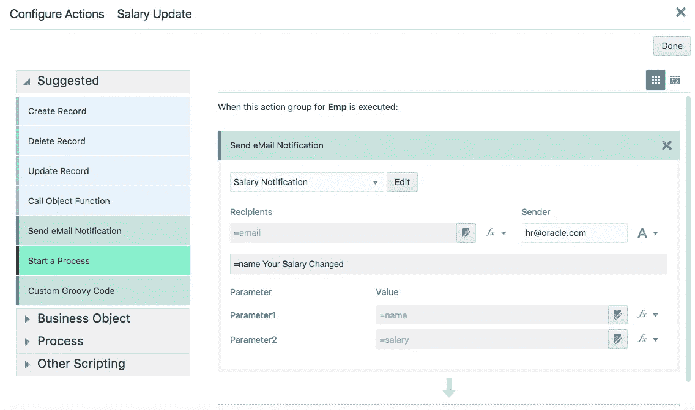
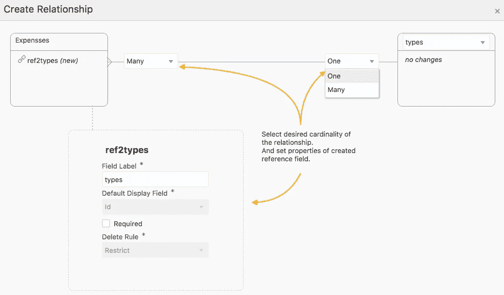
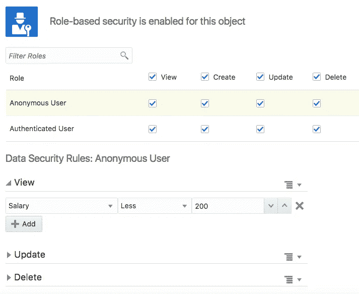

# Oracle Visual Builder 云服务九月版中的新特性

> 原文：<https://medium.com/oracledevs/new-features-in-the-september-release-of-oracle-visual-builder-cloud-service-fdfd5a0c2584?source=collection_archive---------3----------------------->

如果您是 Oracle Visual Builder Cloud Service 的用户，那么当您在长周末后回到工作岗位时，您可能已经注意到了环境中的一些新特性。我们推出了一个新版本，为开发者提供了许多有用的新功能。这里简要回顾一下您现在可以利用的新功能！

**导入/导出数据命令行** —您是否需要从 VBCS 的自定义对象中自动导入或提取数据？现在，您可以使用新的命令行界面来完成这项工作。这对于日常数据加载或者将数据复制到外部报告系统非常有用。

**从动作发送电子邮件** — VBCS 现在可以为你发送电子邮件了。新的“发送电子邮件通知”在您的操作流编辑器中可用。您可以定义可重用的电子邮件模板并向其传递参数。例如，您可以定义在员工的工资更新时向其发送电子邮件。

**图表摘要**——需要在图表中显示数据的总和——现在有一种简单的方法可以做到这一点。这当然不仅限于总和，您还可以进行其他类型的聚合计算，如平均值、计数、最大值和最小值。

**高级关系** —我们现在提供了一个很好的界面来定义业务对象之间的关系。我们还增加了对 m:m 和 1:1 映射的支持。

**行级安全性** —需要确保不是每个人都能看到自定义对象中的全部数据吗？现在，您可以根据每行字段中的值来限制向哪个角色显示哪些行。

这个版本中包含了更多的新功能，所以不要错过阅读我们的[新功能文档](http://docs.oracle.com/en/cloud/paas/app-builder-cloud/abcsw/index.html#ABCSW-GUID-973441CA-3991-4BD6-B196-722F19954E60)，它还会为您提供关于这些功能的详细文档。

我们将很快在博客上公布这些功能的更多细节——所以请关注我们的频道—[https://medium.com/tag/vbcs/latest](/tag/vbcs/latest)