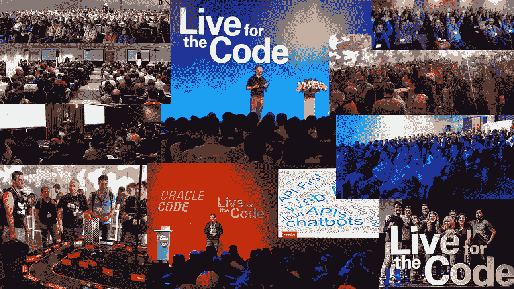
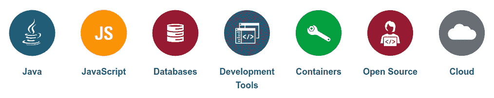

# 新游戏。新名字。Oracle 开发人员社区

> 原文：<https://medium.com/oracledevs/new-game-new-name-oracle-developer-community-87540c4e8b6d?source=collection_archive---------2----------------------->

技术推动了如此多的变化，以至于除了最引人注目的创新之外，人们几乎已经忘记了所有的创新。但重要的是要记住，每一波创新都是从一次击键开始的，一行代码中的一个字符，然后是另一个，然后是另一个。重要的是要记住，按下那个键的手指是连着一个人的。一个开发商。

开发人员推动变革，而变革反过来又推动开发人员。这是一个永久的进化循环，需要个人和组织层面的永久适应。

技术领域正在发生重大转变，Oracle 也是如此。这种发展是由多样化的软件开发人员推动的。为了适应这种发展， ***甲骨文技术网络*现已成为甲骨文开发者社区**，在过去的一年里，我们创建了一些项目来支持人们构建现代、开放、云原生的应用。

Live for the Code!

# Oracle 代码事件

在这个国际[系列免费活动](https://developer.oracle.com/code)中，开发人员通过主题演讲、会议和动手实验室，从技术专家、行业领袖和其他开发人员那里了解最新的技术、实践和趋势。为了确保每个开发人员都能访问这些内容， [Oracle Code Online](http://developer.oracle.com/code/online) 将相同的内容和专家直接呈现在您的屏幕上。[更多信息…](https://developer.oracle.com/code)

# 社交媒体和内容聚合

现在，您可以通过各种社交媒体渠道与 Oracle 开发人员社区联系:

*   博客:[甲骨文开发者博客](https://blogs.oracle.com/developers/)
*   Twitter: [@OracleDevs](https://twitter.com/OracleDevs)
*   facebook.com/OracleDevs
*   中:[medium.com/OracleDevs](https://medium.com/oracledevs)
*   YouTube:[youtube.com/c/OracleDevelopers](https://youtube.com/c/OracleDevelopers)
*   播客:oracledevs.podbean.com
*   论坛:[community.oracle.com](https://community.oracle.com/)

# Oracle 开发人员门户

将所有这些整合在一起的是[甲骨文开发者门户](https://developer.oracle.com/)。这个包容性的空间是为我们所有的语言和技术特定的社区，我们热情支持。您会发现各种各样的内容，包括:

# 开发者冠军

开发者冠军拥有现代软件和云开发的专业知识，包括微服务、容器、DevOps、持续交付、开源技术和 SQL/NoSQL 数据库。这些专业人士是开源项目的贡献者，当代开发方法的作者，以及著名 Oracle (Oracle Code，JavaOne)和顶级行业会议(如 Devoxx、开发者周、Velocity 和 QCon)的发言人。迎接[新开发者冠军计划](https://blogs.oracle.com/developers/new-developer-champion-program)。

因此，请积极参与推动创新，成为[甲骨文开发者社区](https://developer.oracle.com/)的一员。

*原贴于***。**