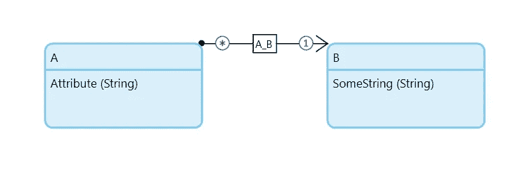

# 新实例还是参考？检索什么时候返回什么？——门迪克斯和我

> 原文：<https://medium.com/mendix/new-instance-or-just-a-reference-when-does-a-retrieve-return-what-mendix-and-me-fa9881877c4b?source=collection_archive---------5----------------------->

当这个话题引发了一个真实项目中的真实问题时，我偶然发现了它。长话短说，代码中的变化将对象的状态从自动提交更改为正常。这在我们的应用程序中产生了一个完全不同的地方，不再像以前那样反应。对对象的更改突然不再反映在数据库中。

# 发生了什么事？

让我们首先看看下面的数据模型。

这两个实体的属性在这里并不重要。它们也可以是任何其他属性和类型。

要提交最佳实体在列表中。在这个过程的最后，这个列表被提交。在此之前，实体 A 的列表被迭代。在该迭代中，B 类型的对象通过关联检索被单独检索，并且它们中的值在改变动作中被改变。在以前的版本中，这些更改也反映在列表中。通过关联检索创建了对列表中已有对象的同一实例的另一个引用。当提交列表时，更改被提交并反映在数据库中。

然而，在其他地方进行代码更改后，它的行为完全不同。“按关联检索”现在创建了同一对象的新实例。因此，迭代中所做的更改不再反映在列表中，也不会写入数据库。

# 但是为什么呢？

那么发生了什么变化呢？在恢复之前的版本并进行直接比较之后，结果是 B 的对象在迭代时具有“自动提交”的状态。然而，在新版本中，它们的状态为“正常”。

假设状态决定是否引用对象的缓存版本，或者是否创建对象的新实例。

[https://bit.ly/MXW21](https://bit.ly/MXW21)

# 哪个状态如何表现？

为了找到答案，我创建了一个简单的演示应用程序，它可以运行所有可能的变体。结果是，通过关联到处于“实例化”或“自动提交”状态的对象的检索创建了对缓存对象的新引用，而对处于“正常”状态的对象的相同检索创建了新实例，即使该对象仍在缓存中。

# 结论

如果您在开发微流时利用了通过关联进行检索时可以创建一个新实例或者只是一个引用这一事实，那么记住对象在执行时可能具有的状态以及它们是否会被代码更新所改变是很重要的。如果它们发生变化，可能会产生意想不到的后果。尤其是在复杂的流程中，这些错误不容易发现，因为原因和结果可能位于代码中完全不同的位置。

祝你试用愉快。一如既往，我期待您的反馈。

## 阅读更多

 [## Mendix World 2021 |召集您的应用开发团队 2021 年 9 月 7 日至 9 日

### 好像你需要说服…在一个全球制造商社区，他们想通过探索什么来相互学习…

bit.ly](https://bit.ly/MXW21)  [## 曲目|门迪克斯世界 2021

### 在今年 Mendix World 开幕之前，手工制作您的议程。浏览专为您量身定制的 8 个专题讲座中的 85 个以上专题讲座…

www.mendix.com](https://www.mendix.com/mendix-world/tracks/) 

*2021 年 5 月 7 日*[*https://mendixamme . de*](https://mendixandme.de/index.php/2021/05/07/neue-instanz-oder-nur-eine-referenz-wann-liefert-ein-retrieve-was/)*原文为德文。*

*来自发布者-*

*如果你喜欢这篇文章，你可以在我们的* [*媒体页面*](https://medium.com/mendix) *或我们自己的* [*社区博客网站*](https://developers.mendix.com/community-blog/) *找到更多类似的内容。*

*希望入门的创客，可以注册一个* [*免费账号*](https://signup.mendix.com/link/signup/?source=direct) *，通过我们的* [*学苑*](https://academy.mendix.com/link/home) *获得即时学习权限。*

有兴趣加入我们的社区吗？你可以加入我们的 [*Slack 社区频道*](https://join.slack.com/t/mendixcommunity/shared_invite/zt-hwhwkcxu-~59ywyjqHlUHXmrw5heqpQ) *或者想更多参与的人，看看加入我们的*[*Meet ups*](https://developers.mendix.com/meetups/#meetupsNearYou)*。*