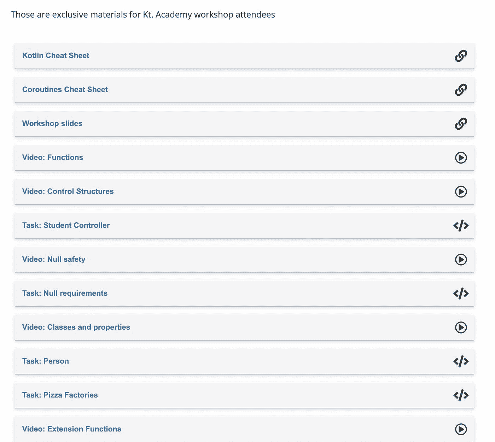
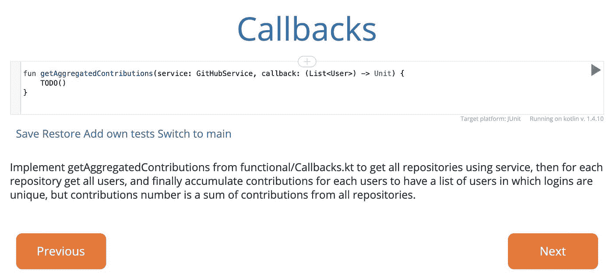
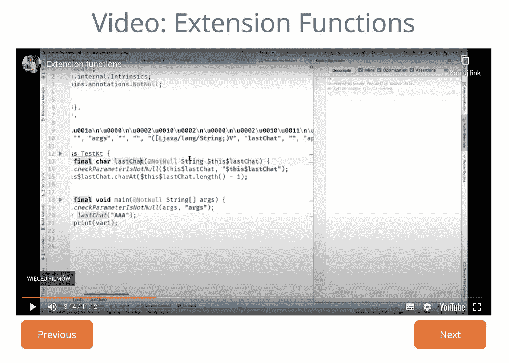
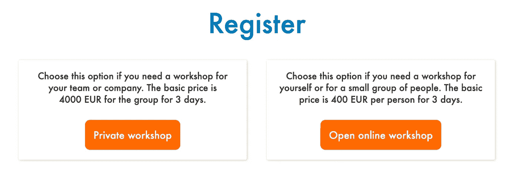
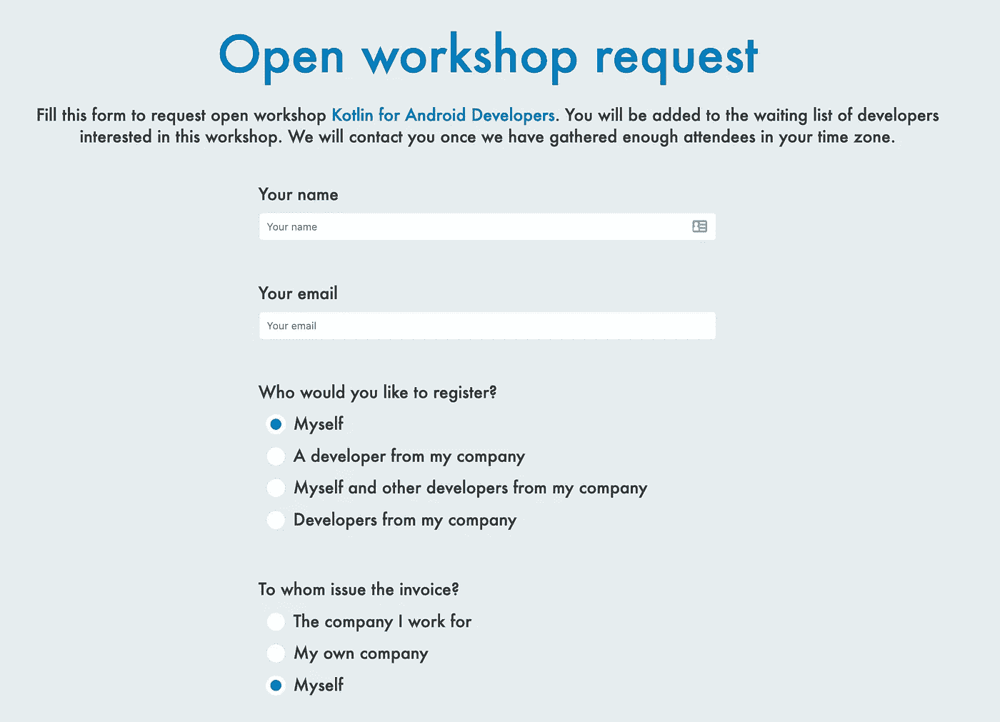
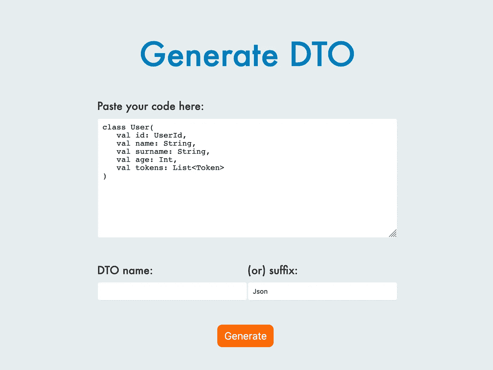
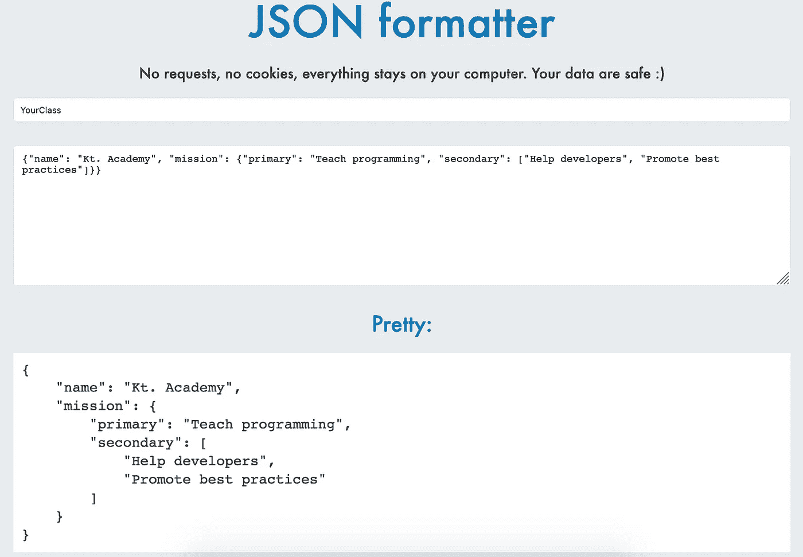

# 我们网站上的新工具

> 原文：<https://blog.kotlin-academy.com/new-tools-on-our-website-22d603b88b75?source=collection_archive---------5----------------------->

我们一直在努力改进我们的网站，使其更易于使用。这就是为什么我们最近添加了一些额外的工具，让您的体验更好、更直观。

[**在线课程功能**](https://kt.academy/course) —我们创建了这个工具来分享开放课程，并为我们的研讨会参与者留下后续材料。所有研讨会与会者现在都可以在线访问课程视频和练习(以及一些额外内容)、资源以及关于下一步学习内容的建议。所有其他人都可以将[作为我们的准备指南](https://kt.academy/course/preparation)或[kot Lin 2018](https://kt.academy/course/advent-of-kotlin-2018)演习的到来。

如果您参加了我们的任何课程或由 [Marcin Moskala](https://medium.com/u/171dab54cea9?source=post_page-----22d603b88b75--------------------------------) 主持的课程，并且您没有收到任何电子邮件(检查垃圾邮件)，这意味着我们没有您的电子邮件地址。登录后通过邮件联系我们 [contact@kt.academy](http://contact@kt.academy) 。

[**开放研讨会请求**](https://kt.academy/workshop) —我们知道你们中的一些人想要请求在你们所在的地区举办一次开放的在线研讨会，但是我们的网站不支持。现在有了！公司内部和开放式研讨会申请的单独表格。

[**DTO 生成器**](https://kt.academy/generate)**——因为在后端应用中我们需要生成大量类似的类(DTO、json、文档/实体、断言)，所以我们做了一个生成器。**

****

**[**JSON 格式化程序**](https://kt.academy/json)**——**使 JSON 漂亮并生成 TypeScript 类型以及 Kotlin 类定义。运行在您的浏览器上，不发送或保存您的代码到任何地方！**

****

**我们希望你喜欢这些变化！如果您有任何建议或有任何其他想要分享的内容，请通过 [contact@kt.academy](http://contact@kt.academy) 联系我们。我们很乐意帮忙！🙂**

***编码快乐！
Kt。学院队***

****