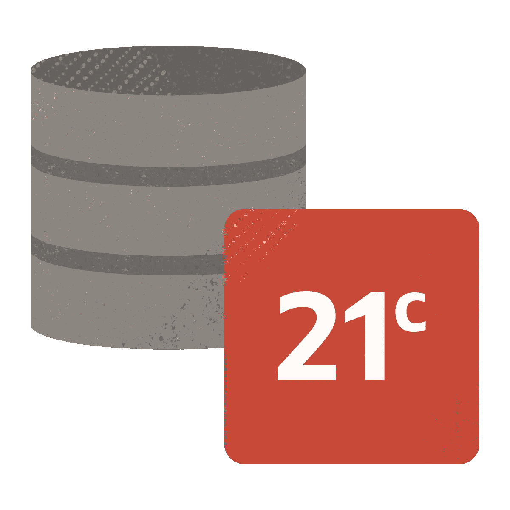

# 新视频:甲骨文 21c。NET 和 Visual Studio 代码开发

> 原文：<https://medium.com/oracledevs/new-videos-oracle-21c-net-and-visual-studio-code-development-b520575308e5?source=collection_archive---------0----------------------->

在过去的几个月里，Oracle 发布了几个新的 21c 软件更新。NET 和 Visual Studio 代码开发人员。在这篇博文中，我将重点介绍新的视频，以帮助您开始使用这些版本并了解新内容。

# **甲骨文数据库 21c 速成版**

首先，我们有 [Oracle 数据库 21c 快速版(XE)](https://www.oracle.com/database/technologies/xe-downloads.html) 。毕竟，在创建. NET 数据库应用程序之前，您需要数据库。

Oracle Database 21c XE 拥有开发人员想要的所有属性。它可以免费使用、部署和分发，并且可以通过 Windows 和 Linux 本地安装程序获得。它包括所有主要的 Oracle 数据库企业版特性，因此开发人员可以将他们的代码和开发经验用于任何 Oracle 数据库版本的生产部署，或者他们可以在生产中使用 XE。

当然，XE 是为内部数据库开发人员设计的。对于云开发，Oracle Database 21c 可通过 [Oracle 云免费层](https://www.oracle.com/cloud/free/)中的 Oracle 自治数据库免费获得。该层对于最多两个数据库实例始终保持空闲。它永远不会过期。

为了帮助您开始使用 Oracle Database 21c XE，我的同事 Christian Shay 制作了一个视频来开始安装和设置数据库。

# ODP。网络 21c

既然您已经有了最新的数据库版本，那么是时候了解一些新的 21c 了。NET 开发人员功能。我以前在博客上[讨论过 ODP.NET 21c 的这些新特性](/oracledevs/introducing-odp-net-21c-ef-core-5-json-and-more-ea0843e89dea)，其中包括二进制 JSON 列类型和客户端发起的连续查询通知(CICQN)。所以，我就不赘述了。由于 Oracle Database 21c 在内部和云上都可用，我制作了一个视频，重点描述和演示这两个很酷的开发人员特性。

# 面向 Visual Studio 代码 21c 和更多 ODP.NET 版本 21c 的 Oracle 开发人员工具

工具对于开发人员的生产力至关重要。Oracle 推出了新的 21c VS 代码工具更新。我的同事 Christian Shay[在博客中介绍了新的 21c 工具版本，包括 Oracle 自主数据库集成](/oracledevs/visual-studio-code-integration-with-oracle-autonomous-database-9c558cd761fc)。后来，我们在 Oracle Database World 上共同展示了新的 ODP.NET 和 Oracle Developer Tools for VS Code(ODT)特性。

这段录音让我能够描述和演示更多 ODP.NET 21c 的特性，包括对。NET 6、Entity Framework Core 6 和用户定义的类型，以及前面提到的二进制 JSON 和 CICQN。在视频的后半部分，Christian 演示了 ODT 21c 的最新功能。

我希望您能更多地了解 Oracle 的新功能。NET 21c 用这些视频。我们计划在未来几个月提供更多的教程和视频。

如果你有兴趣。现在，你可以通过注册一个 [OCI 免费层账户](https://signup.cloud.oracle.com/?language=en)来开始配置你自己的云实例！

# 加入对话！

如果你对甲骨文开发人员在他们的自然栖息地发生的事情感到好奇，来加入我们的[公共休闲频道](https://oracledevrel.slack.com/join/shared_invite/zt-uffjmwh3-ksmv2ii9YxSkc6IpbokL1g#/shared-invite/email)！我们不介意成为你的鱼缸🐠