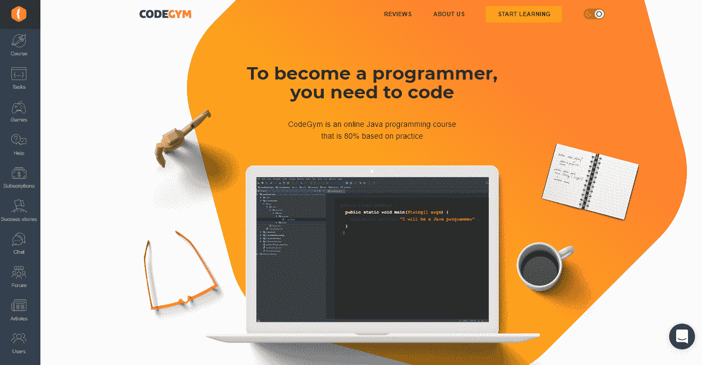
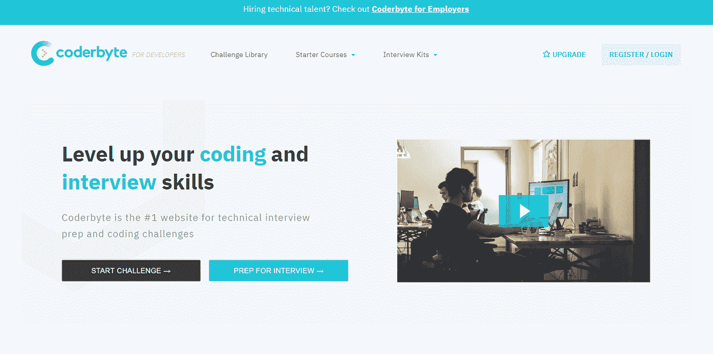
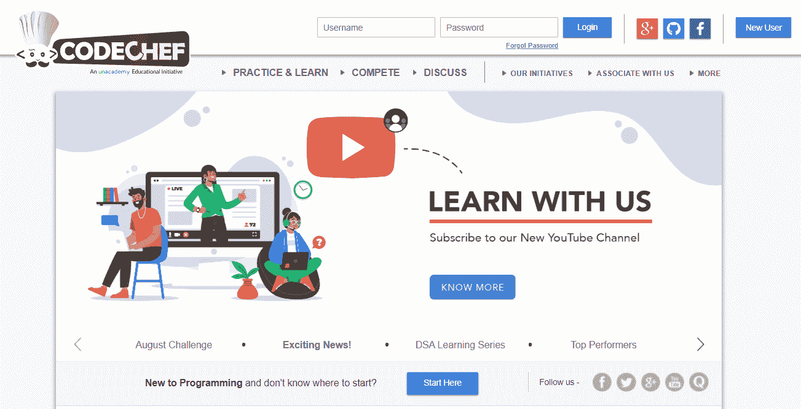

# 新手程序员指南:如何开始你的开发生涯

> 原文：<https://medium.com/quick-code/newbie-programmers-guide-how-to-start-your-development-career-ef5c54045704?source=collection_archive---------1----------------------->

Photo by [NOAA](https://unsplash.com/@noaa?utm_source=medium&utm_medium=referral) on [Unsplash](https://unsplash.com?utm_source=medium&utm_medium=referral)

所有的犹豫都结束了，决定已经做出:你将成为一名程序员！万岁！

掌握一个新的职业是一次伟大的冒险。既然你要成为一名软件开发人员，下一步就来了。但是下一步是什么？似乎有几十种选择。有多种学习资源，数百种编程语言和框架，以及各种类型的软件要创建。你甚至不知道你应该在哪里编码。这可能真的有点让人不知所措。

别担心！我会带你穿过这片森林。我们走吧。

# 如何成为程序员的 10 个技巧

# 1.选择你想成为的程序员类型

你可能想成为各种类型的程序员。如果你想创建网站或网络应用，去找一个网络程序员吧。梦想制作下一个微软 Office 或 Photoshop？努力成为一名桌面应用程序员。如果你的志向和成为高负载企业级服务器应用的发明者一样高，那就选择成为一名分布式应用程序员，甚至是系统程序员。如果你的目标是创建移动应用，那么显然应该选择移动开发者。想要创造新的引人入胜的互动游戏体验？肯定要学 Java，C 或者 C++成为一名游戏开发者。

一旦你选择了你想成为的程序员类型，你就可以更容易地学习编码语言或框架。

# 2.选择编程语言

一旦你完成了技术领域，现在是时候做下一个选择了:编程技术。根据地区的不同有很多种。

例如:

*   企业级应用程序— Java
*   网站前端— JavaScript、TypeScript
*   网站后端——Python、Ruby、PHP
*   web 应用的服务器端— Java、Python
*   移动应用——Java、Kotlin、Swift

一个更重要的技术是 SQL，它不是一种编程语言，但它是每个程序员的必备工具。

好吧，让我们为你减轻这件事。下面是一些最流行的编程技术。

*   **Java**

这是世界上最受欢迎的技术之一。几乎在所有编程语言排名中，它都名列第一。如果你掌握了它，你几乎可以用它做任何事情:后端开发，在 Android 上创建移动应用，大型企业级项目，或者只是维护好的旧代码。Java 开发人员是就业市场上最受欢迎的专家之一。

Java 开发人员在 [Glassdoor](https://www.glassdoor.com/) : 16165。

平均基本工资:79137 美元/年。

*   **Python**

数据科学的现在和未来——欢迎来到 Python。这种语言是现在最广泛使用的语言之一，未来也很有希望。它用于开发 web 应用程序、基于 GUI 的应用程序等等。但让 Python 更加有利可图的是，这是数据科学的头号技术，被广泛用于机器学习、基于人工智能的项目等。

Python 开发者在 [Glassdoor](https://www.glassdoor.com/) 上的职位空缺:13140。

平均基本工资:76526 美元/年。

*   **JavaScript**

JavaScript (JS)是网络语言。web 应用的前端和后端部分都可以完全用 JS 编写。它命令网页以这种或那种方式运行。全球网络光明的交互面通常是运行 JS 代码的结果。而且更重要的是，有时候 JS 会用在机器人或者游戏开发上。

在 [Glassdoor](https://www.glassdoor.com/) : 13915 上的 JavaScript 开发人员职位空缺。

平均基本工资:79137 美元/年。

*   **HTML\CSS**

这些并不是真正的编程语言，而是两种独立的技术，它们都用于前端开发。几乎每个网页都是在他们的帮助下建立的。HTML(超文本标记语言)为浏览器构建了页面上的信息。CSS(层叠样式表)帮助浏览器理解页面应该是什么样子。

HTML\CSS 开发人员在 [Glassdoor](https://www.glassdoor.com/) 上的职位空缺:6028。

平均基本工资:68524 美元/年。

# 3.定期练习(定期！我是认真的！)

没有哪本教科书会让你成为伟大的程序员。诊所会的。所以你需要做的是下载一个代码工具。不同的语言需要不同的程序(例如，对于 Java 你可以使用 [Intellij IDEA](https://www.jetbrains.com/idea/) ，对于 C#和 C++ — [Visual studio](https://visualstudio.microsoft.com/) )然后开始编写。做一些简单的任务，写程序，给能帮你的人看。理想情况下，你应该为自己找一个这方面的导师，但是也可以在一些专业论坛上寻求反馈。

作为一个很好的选择，使用程序员培训平台。这是我认为的前三名。

*   [**代码库**](https://codegym.cc/)

如果你选择学习 Java，这是第一个选择。它有超过 1200 个基于实际问题的结构良好的任务。你的解决方案有一个在线验证器，所以你一完成任务就可以得到你的结果，看到你的进展。虽然它只专注于一种技术，但创作者的团队对它有深刻的了解，并有能力一步一步地教授这门语言。

*   

****

**这个资源有几个很好的选项。第一，你可以拿起技术来学习。那么你可能会选择经历编码挑战。您可以检查一下您对 SQL、React、Node.js、Python、Ruby 等编程技术的了解。最后，有一个专门的垂直准备工作面试。**

*   **[**主厨**](https://www.codechef.com/)**

****

**厨师为你做了一些比赛。您可以在平台上编译和运行代码，参加各种竞赛，并在论坛上讨论您的工作。(获得专业建议总是一个好主意！)伙计们举办比赛，接受 35 种以上编程语言的解决方案，如 C、C++、Java、Python 等。**

# **4.阅读他人的代码**

**开源项目提供了窥探其他开发者想法的巨大机会。仔细看看他们的解决方案。注意他们是如何找到解决这个或那个问题的方法的。试着找到你自己的方法去做。这是练习编码的另一种方式。因为你是一个初学者，不知道很多答案(还没有！)，分析别人的例子是一个很好的学习方法。不要把《密码》当作一部文学作品，而是当作一个谜语。像**[**GitHub**](https://github.com/)， [**GitLab**](https://gitlab.com/explore) ，或者**[**SorceForge**](https://sourceforge.net/)这样的资源都是可以去的地方。******

# ****5.与其他开发人员交流****

****许多新手程序员努力寻找一位导师，带领他们走过编程的黑暗。但这可能感觉像跨栏赛跑。所以我建议你找一个替代方案:搜索一个程序员社区。加入一个程序员小组，参加一个黑客马拉松，或者尝试参加一个开源项目。网上有很多这样的网站:一般感兴趣的技术社区，围绕不同技术的团体，等等。展示你的作品并听取反馈。分享你的知识吧！而且，你也可以在类似这样的论坛上和其他开发者联系。****

****[**Reddit 频道**](https://www.reddit.com/)****

****一般编程:****

*   ****r/编程****
*   ****学习编程****
*   ****r/代码在一起****
*   ****r/编程工具****
*   ****r/游戏开发****
*   ****r/Prog articles****
*   ****r/webdev****
*   ****r/每日程序****

****编程语言:****

*   ****Java: r/java，r/javahelp****
*   ****JavaScript: r/javascript，r/LearnJavaScript****
*   ****Swift: r/swift****
*   ****目标 C:r/目标 C****
*   ****r/php****
*   ****Python: r/python，r/learnpython****
*   ****C#: r/csharp****
*   ****c:r/c _ 编程****

****[**阴沟**](https://slack.com/)****

****常规:****

*   ****#标签开发者****
*   ****#欧洲发展探索者****
*   ****#Angular JS 聊天****
*   ****#DevOps 聊天****

****编程语言:****

*   ****#红宝石****
*   ****#php****
*   ****#python****
*   ****#node.js****
*   ****#去吧****

****[**StackOverflow**](https://stackoverflow.com/) 是全球顶尖的开发者社区之一。你可以找到几乎任何技术问题的答案，找到一个队友，或者找到一份工作。在你的资源清单上，这是必备的。****

****[**SitePoint**](https://www.sitepoint.com/) 是另一个学习网络编程和加入活跃社区的好地方。该平台还发布职位。当您开始搜索时，这个选项可能会很方便。****

# ****6.开始建立你的项目组合****

****当你开始练习时，你会发现你的一些代码相当不错。把它们放在某个地方，准备好展示给你未来的雇主或客户。一份整洁的文件夹会帮助你更快地找到你的第一份工作。展示你的工作是给雇主一个稳定的信号，表明你认真对待软件开发。****

# ****7.申请工作****

****你决定学编程不只是为了好玩吧？给自己写一份简历，开始寻找初级职位。成为一名成功的软件开发人员的另一个重要部分是向雇主展示你自己和你的技能。所以准备好你的简历和作品集，掌握一些演讲技巧。工作面试可能是一次充满压力的经历，所以不要指望在第一次面试后马上找到工作。继续练习两种技能:编码技能和表达技能。同时，你也可以做一些自由职业来保持职业健康。****

# ****8.看看另一种编程技术****

****也许现在听起来像是遥远的未来，但是一旦你对一种编程技术有了信心，就去学习另一种不同范式的编程技术的入门课程。这将首先增强您的编码体验。当你比较这两种不同的技术时，它打开了一个新的视角。****

****从我的个人经验来看，我可以说，有时让你的大脑转向一些不同的东西是非常有用的。我建议我的学生，当他们厌倦了埋头学习时，他们应该看看其他技术。这样你从主要的学习中休息了一会儿，但同时，你并没有放弃它。例如，如果你学习 Java 或 C#或任何其他后端语言，了解前端技术的基础知识总是有益的，比如 HTML、CSS 或 JavaScript。你不必深究这些技术。涵盖基本面。****

# ****9.磨练你的软技能****

****团队合作是任何工作的重要组成部分，包括软件开发。每个人都想和好人一起工作。如果天生对你来说很难，努力学习如何沟通、在团队中工作、展示自己以及感同身受。现实中的技术工作不是坐在显示器后面敲键盘。它与其他开发人员、产品经理、项目经理等一起工作。编码是团队合作。此外，职业发展可能真的更多地取决于你是什么样的人——尤其是当 HR 不得不在两个同样优秀的程序员之间做出选择的时候。****

# ****10.永远不要停止学习****

****技术世界是一个不断变化的地方。不时会出现新的语言或框架。项目正在转换他们的主要平台。人们发明了与机器交流的新方法。你不可能学一次科技语言就万事大吉了。即使在你最熟悉的技术中，也会出现一些新事物。因此，一个很好的终生学习方法就是不断学习新的东西:一段语法、一个开源项目，甚至是一种全新的技术。瞬息万变的就业市场无时无刻不需要最新的知识。****

# ****包裹****

****现在你知道如何成为一名没有学位的程序员，以及从哪里开始。选择您的领域、语言和技术库，浏览学习资源，并立即开始。加入专业社区以获得对您的编码的反馈。不要忘记软技能。你是什么样的人，会比仅仅写一段好的代码更快地推进你的学习和事业。今天是开始的最好一天！****