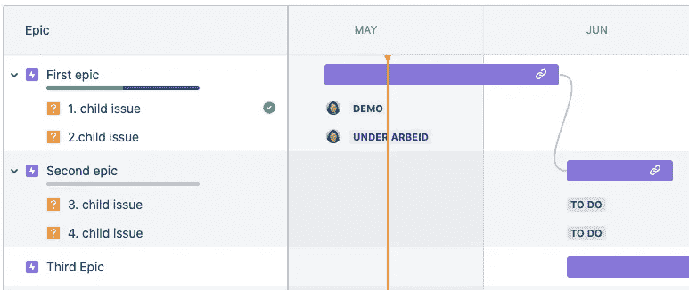
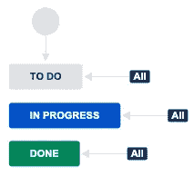
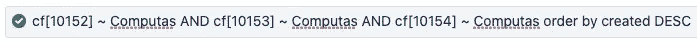

# Next Generation i Jira — klar til bruk?

> 原文：<https://medium.com/compendium/next-generation-i-jira-klar-til-bruk-818029355310?source=collection_archive---------3----------------------->

Jeg har den glede av å jobbe i et team som har ekspertise på smidig produktutvikling, endringsledelse og arbeidsmetodikk generelt. Vi bistår våre kunder med å kunne ta riktige steg for å drive kontinuerlig forretningsutvikling og lykkes med innovasjon. Endringsarbeid og arbeidsmetodikker har ingenting med de tekniske verktøyene å gjøre, målet med verktøyene er at de skal støtte den nye måten å arbeide sammen på. Dette kan du lese mer om i [Ellen Dalengs glimrende artikkel](/grensesnittet/slik-skaper-smidige-organisasjoner-mer-verdi-raskere-deada8ce6db0) .

Men, vi trenger da ofte verktøy som kan støtte oss i vårt daglige arbeid. I teamet mitt jobber vi daglig med Atlassians produktportefølje. Produktporteføljen består av wiki-basert dokumentasjonsportal samt ulike samarbeidsverktøy som dekker behovet for små og store bedrifter og team. Verktøyene tilbys blant annet med Cloud hosting. Gleden og, for noen sikkert, utfordringen med å benytte løsninger som tilbys med Cloud hosting er den rivende utviklingen som skjer nærmest daglig.

Photo Credit: Joshua Aaron — compfight.com

Hvordan skal en klare å henge med og vite når den funksjonaliteten du lenge har savnet plutselig er på plass? Når er utviklingen kommet langt nok til at tjenestene endelig passer deg og ditt behov? Jeg og mitt team synes det er utrolig moro å følge med, teste ut og vurdere nyutviklingene. Så her er mitt lille bidrag for å hjelpe deg på veien. Kall meg gjerne din Skybert på din tur til NextGen prosjektstøtte i Jira.

> Autonomi og selvstyre

Med sine Next Gen prosjekter i Jira Cloud ønsker Atlassian å tilby et oppsett skreddersydd for en enklere administrering av prosjektene og med dette tilby en løsning skreddersydd for autonome team. I Next Gen-prosjekter kan den enkelte prosjektleder selv kan konfigurere hele oppsettet av prosjektet. I tillegg tilbyr Next Gen prosjektene ny funksjonalitet i form av roadmap, en Ganntifisert fremvisning av Epics med tilhørende oppgaver.

Photo Credit: Ingrid Heitmann (image from Jira Next Gen project)

# Fordeler med Next Gen-prosjektene

*   Det er meget enkelt å komme i gang med nytt prosjekt, ingen administrasjon påkrevd av en Jira Admin
*   Det er lett å legge til nye arbeidsflyt statuser. En ny kolonne i Boardet = ny saksstatus
*   Pr idag er to automatiseringsregler (rules) tilgjengelig; automatisk tilordning av saker og oppdatering av felt. Med andre ord noe skreddersøm i arbeidsflyt er mulig
*   Prosjektleder kan lett legge til nye egendefinerte felt noe som gir mulighet til å få fanget akkurat den informasjon som prosjektet trenger
*   Den Ganntifiserte fremvisningen i Roadmap av Epic og tilhørende saker. En visuell fremstilling som ofte tiltaler ulike meningsbærere
*   I boardet kan den enkelte bruker selv velge å se kolonner med eller uten svømmebaner

Men, som alltid er det noen utfordringer også.

# Ulemper med Next Gen-prosjektene

Photo Credit: Ingrid Heitmann (image from Jira)

*   Det er ikke mulig å benytte avansert arbeidsflyt. Det betyr at alle statuser saker kan ha vil få alle-til-alle transisjonsmulighet
*   De egendefinerte feltene i ett NextGen-prosjekt vil ikke være tilgjengelige i andre prosjekter. Dette betyr at de informasjonsfelt som er relevante å ha i flere Jira-prosjekter må defineres opp i hvert enkelt NextGen prosjekt.
*   Skal du så opprette søk og filtre som er prosjektovergripende vil du måtte søke og filtere pr egendefinert felt, til tross for at feltene kan være satt opp helt identisk med samme navn. Skulle for eksempel organisasjonen ønske å et egendefinert felt *Kunde* i alle sine prosjekter, vil JQL spørringen se slik ut når en ønsker å søke etter spesifikt kundenavn (her: Computas):

Photo credit: Ingrid Heitmann

*   Prosjektene tilbyr kun 4 rapporter. 3 av rapportene krever at sprinter og backlog benyttes i prosjektet
*   Og er prosjektadministratoren litt “slumsete” (i mangel av et bedre ord) når han/hun oppretter nye kolonner i boardet (= nye statuser) og egendefinerte felt vil det for resten av Jira-brukerne kunne bli et oppkom av forskjellige statuser og feltnavn de må vurdere og evaluere når de ønsker å søke etter saker i andre prosjekter

# **Vurdering**

Som beskrevet kan Next Gen benyttes for en kjapp og intuitivt enkelt oppsett og bruk av Jira. Dersom din organisasjon har et fåtall Jiraprosjekter der det er lite sammenfallende behov for felles felt, felles søkemuligheter på tvers og lite behov for rapporter, ja da er kanskje Next Gen prosjekttypen for dere. Men for større organisasjoner er jeg nok mer usikker på om Next Gen utviklingen har kommet langt nok. Next Gen krever at den enkelte prosjektadministrator kan mer om de underliggende strukturer i Jira enn det som ofte er vanlig.

Og dersom det er behov for prosjektovergripende søk og rapportering vil bruken av Next Gen oppsettet utfordre dette. Erfaringsmessig ønsker mange de jeg jobber for også en større fleksibilitet med tanke på arbeidsflyt og mulighet for variasjon mellom sakstypene. Dette er pr nå ikke mulig i Next Gen prosjektene.

Dersom en likefullt starter med et NextGen oppsett, men ser senere behov for ytterligere funksjonalitet tilgjengelig i Classic, er det er naturligvis mulig å flytte saker over til et Classic prosjekt på senere tidspunkt. Men, vær da klar over at Epic-lenker vil bli brutt, data for Velocity og Burnup reports vil ikke lenger være tilgjengelig og storypoint estimeringer vil bli tapt.

# Vi er kanskje ikke blitt helt Next Gen enda?

Oppsummert er min generelle anbefaling til du ikke oppretter nye prosjekter med Next Gen oppsett helt enda. Skulle du derimot likefullt ønske det oppfordrer jeg deg til sterkt å sette deg godt inn i alle fordelene og ulempene først.

Det er viktig å presisere at Next Gen prosjektoppsett stadig er under utvikling. De ble lansert høsten 2018 og har siden det stadig blitt forbedret med tanke på tilgjengelig funksjonalitet. I roadmapen beskriver Atlassian følgende “… long term goal is to build NextGen to have all the power of classic projects, while maintaining the simplicity of a consumer application”.

Jeg gleder meg til å følge den videre utviklingen!