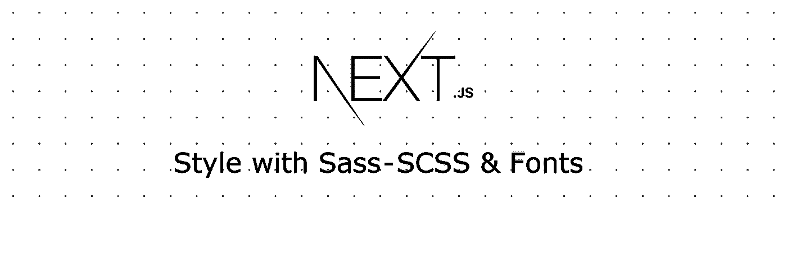

# Next.js 样式，带 Sass-SCSS 和字体

> 原文：<https://medium.com/quick-code/next-js-style-with-sass-scss-fonts-54e9cef70377?source=collection_archive---------0----------------------->

Next.js 是非常流行的服务器端渲染 react 框架。这是非常有用的，但我们应该如何用 SCSS 或萨斯风格呢？

使用 next.js 创建应用程序后，可以使用与 create-next-app 相同的模板，并在 js 文件中编写自己的 css。