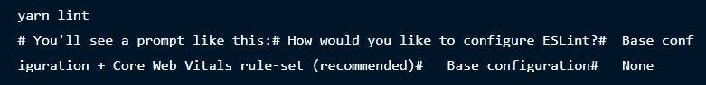

# 有用的 Next.js 特性来开发快速和用户友好的 Web 应用程序

> 原文：<https://medium.com/quick-code/nextjs-features-e5ba82309093?source=collection_archive---------0----------------------->

## Top Next.js 特性来开发超快的 web 应用程序


## Next.js 是什么？

> Next.js 是一个开源的 JavaScript 框架，允许开发人员构建快速且用户友好的静态网站以及 web 应用程序。

作为一名开发人员，如果您正在寻找一种技术堆栈，除了提供 TypeScript 支持、智能绑定和其他此类任务之外，它还能使混合、静态和服务器渲染成为现实，那么 Next.js 是您应该使用的。

技术堆栈是一个 JavaScript 框架，由 Vercel 和开源社区创建，它还有助于确保最终解决方案提供数据安全性等优势，缩短上市时间，并可通过用户使用的任何设备访问。

因此，它毕竟是值得使用的。

## 用 Next.js 可以开发什么？

使用 Next.js，您可以构建大量数字产品和界面，例如:

*   最小可行产品
*   单一网页
*   Jamstack 网站
*   门户网站
*   SaaS 产品
*   电子商务和零售网站
*   交互式用户界面
*   复杂的 web 应用程序

## Next.js 的优点

*   建立超快的静态网站。通过重新渲染流量来更新现有页面。因此，他们很容易确保静态内容变成动态内容。
*   帮助从 JavaScript 文件无缝导入 CSS 文件。
*   提供快速的实时编辑体验。
*   非常有利于用户体验
*   伟大的搜索引擎优化
*   提供自动编译和捆绑，使生产活动从一开始就变得易于执行。
*   社区支持

## Next.js 的缺点

*   路由问题
*   有限的建造时间

继续阅读，了解使其成为开发者完美选择的特性列表。

## Next.js 的顶级特性使其成为 Web 开发人员的完美之选

**1。静态页面生成**

如果你正着手为市场营销、电子商务产品列表等创建网页。建议生成静态页面。这是 Next.js 提供的东西。由于其在构建时对网页 HTML 的预渲染支持，无需收集相关页面的数据，因此，数据检索变得轻而易举。

只需使用 ***getStaticProps*** ，获取必要的数据就变得很容易，这样在传递每个道具时都可以无缝返回数据，在 UI 上的显示也变成了一个完美的过程。

**2。内置路由**

通过此功能，基于文件的路由成为一项简单的任务。有了这个特性，开发专家只需要在页面的目录中创建一个记录。这将有助于无缝地构建各种路由。

因此，使用 tech stack 提供的快速链接组件，重定向到不同的页面就成了一项简化的任务。

**3。下一个-授权库**

由于 tech stack 分别为客户端身份验证、服务器端身份验证和 API 路由身份验证等任务提供了大量帮助，跨任何数据库的数据持久性都变得容易执行。

尤其是由于提供了 GET、POST、PATCH 等路由。捕捉它们也是一项天衣无缝的任务。

**4。开发&生产构建系统**

这是技术堆栈中的另一个独特元素。有了它，更容易把重点放在代码而不是配置上。

接下来是它在热重装中提供的支持。因此，在开发服务器中，当执行静态站点生成时，为每个请求预先呈现 HTML 变得很容易。

**5。头部组件**

使用它，开发人员可以很容易地提供一个标题和应用程序描述的标题。这是因为爬虫的可用性有助于检查标题和带有描述的元数据。因此，搜索引擎优化排名变得更高的最终解决方案。

**6。ESLint**

当前版本的 Next.js 11 提供了集成的 ESLint 体验。它只需要将“next.js lint”作为脚本添加到 package.json 中。

```
"scripts": { "lint": "next lint"}
```

这将确保为那些目前可能在其应用程序中没有 ESLint 配置的人提供配置流程。

看看下面的图片可以更好地理解这一点。



Source: angularminds.com

**7。快速刷新**

默认情况下，Next.js 上的所有项目都提供这个特性，它允许开发人员立即获得建议。这些建议主要是关于他们对 React 组件所做的编辑。

因此，在此功能的支持下，很容易观察到所做的编辑，而不会对组件状态造成任何可能的损失。

这意味着-

*   当开发人员开始执行导出 React 组件的记录编辑任务时，使用快速刷新将对特定文档本身执行代码刷新，然后执行组件呈现。
*   修改一个不需要导出 React 组件的记录，该特性将确保文档重新运行，并使不同的记录变得易于执行。

知道了使 Next.js 成为 web 开发人员的完美选择的特性后，你可能会有一个问题，是否只有这些特性使它成为最好的。这个问题的答案是否定的。技术堆栈还拥有一些其他独特的功能，这是它受欢迎的原因。

***他们是-***

*   静态 HTML 导出缓存 CDN 中的静态文件或服务器需求为零的地方。这确保了请求立即向客户端提供文件。
*   依赖于 CMS 的应用程序的预览模式。这使得当这种模式支持 SSR 或静态站点生成时，基于每个请求的 HTML 服务器生成变得容易执行。
*   重定向来执行临时和永久重定向。这是通过 next.config.js 文件中的简单配置实现的。

有了这些元素的想法，很明显 Next.js 是一个用来让你的 [web 应用开发](https://www.xongolab.com/progressive-web-app-development/)项目滚动的框架。

## 结尾词

寻找一个能够有效处理不同工具和配置并允许构建完全健壮的 web 应用程序的框架？Next.js 是您应该使用的。利用这一技术组合的力量，您可以开发一个交互式、高度动态的 web 应用程序，为最终客户和企业提供高性能。此外，由于它被誉为“**React 生产框架**”，它将确保您的项目得到更快的开发，您的生产力得到革命性的提高。