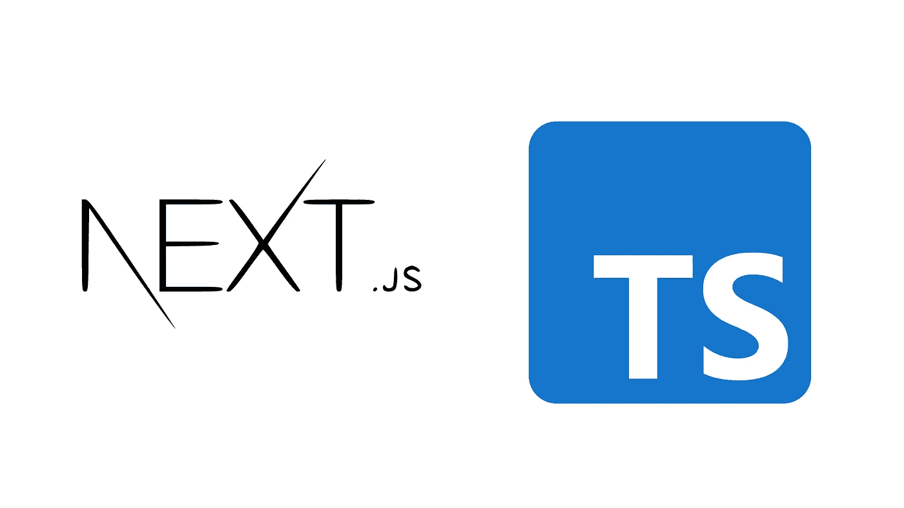

# Nextjs 与 Typescript 集成和示例

> 原文：<https://medium.com/quick-code/nextjs-with-typescript-integration-and-example-dd2e13da668b?source=collection_archive---------0----------------------->



本教程将展示如何将 TypeScript 集成到您的 Nextjs 应用程序中。为此，我们应该为我们的 Nextjs 项目安装所需的 typescript 库。

如果您正在开始一个新项目，并且从 Typescript 开始，那么您也可以在几秒钟内创建一个新的 nextjs 应用程序

```
npx create-next-app your-app-name
```