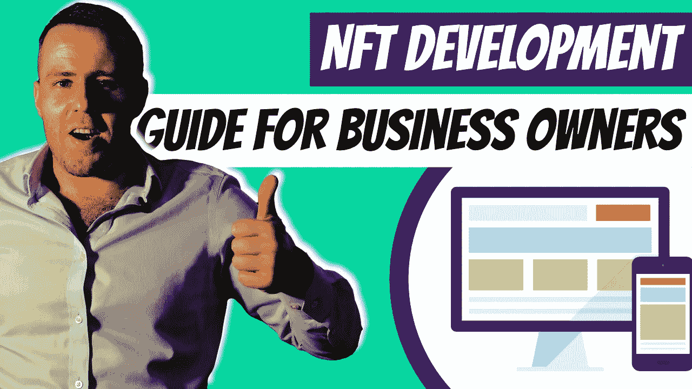

# 企业主 NFT 发展指南

> 原文：<https://medium.com/duomly-blockchain-online-courses/nft-development-guide-for-business-owners-36f9a1709ca3?source=collection_archive---------4----------------------->

[NFT Development Guide for Business Owners](https://www.blog.duomly.com/nft-development-guide/)

本文最初发表于:[https://www.blog.duomly.com/nft-development-guide/](https://www.blog.duomly.com/nft-development-guide/)

如果你是一个企业主，你知道在竞争中保持领先是成功的关键。为了保持领先，你需要不断创新和发展你的商业模式。但是你是怎么做到的呢？当你周围的一切看起来如此熟悉时，你怎么能创造新的东西呢？