# Ng v8 至 v9 —专业知识

> 原文：<https://medium.com/globant/ng-v8-to-v9-the-know-how-8ee83a072616?source=collection_archive---------0----------------------->

> 更小的包，更快的编译，更好的调试，改进的模块和组件的动态加载，利用 AOT 开发构建

**是**，Angular v9 带来了第三代角度渲染器的完整指南。

> “Ng v9 更多的是对框架的改变，而不是我们写的代码！”

这让我们开发者很容易。要升级到 v9，我们不必深入到单个文件或组件中，自己更新任何代码。新的 Ivy 渲染器适用于我们当前的所有代码。

在本文中，我们将回顾 angular 从 v8 更新到 v9 后面临的障碍。我们还将基于 angular v9 带给我们的几个重要特性进行讨论。

我们可以在[***update . angular . io***](https://update.angular.io/#8.0:9.1)上找到从 v8 升级到 v9 的分步说明

只是快速提醒一下，确保我们使用的是 ***节点 v10.13*** 或更高版本。

让我们告别棱角分明的 v8！！

# 瞧…你的项目已经更新到 Angular 版本 9！！！

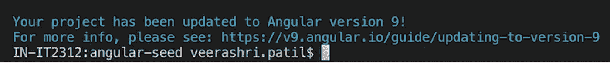

在更新过程中，我们应该会看到许多消息，告诉我们 CLI 在幕后到底在做什么。它还会告诉我们哪些文件被修改和更新。

根据项目所在的位置，我们可能会看到其他文件被修改。例如，如果项目具有较旧的惰性加载语法，或者如果项目在服务文件中缺少**@ injectible()**，这些也将得到更新。

一旦完成，前往我们的 ***package.json*** 我们会看到我们是最新的 Angular v9！

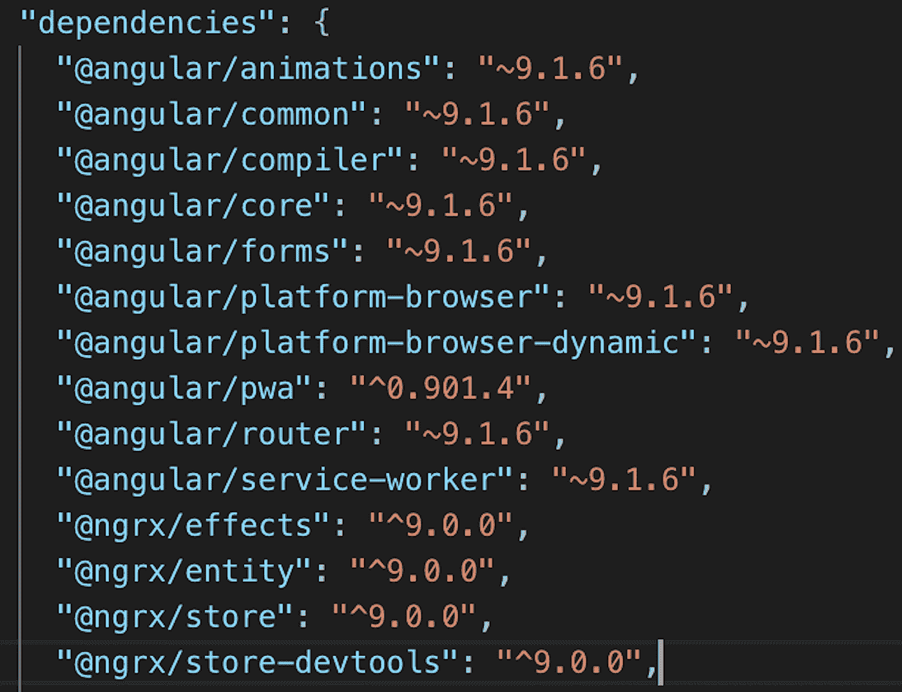

现在让我们使用***ng serve****再次运行应用程序，我们开始吧。糟糕！！*

## *打字稿过时了*

> *Angular 编译器要求安装的 Typescript >=3.6.4 和< 3.9.0 but found 3.4.5 instead*

*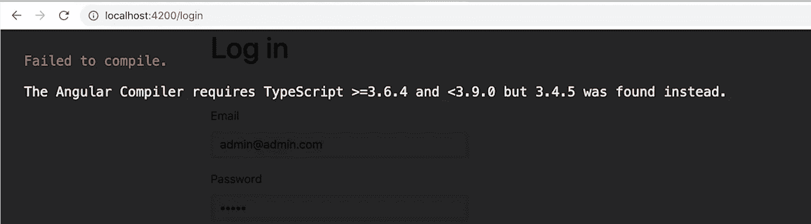*

*You should have version ***3.6+*** (所以 3.7 也可以)。不再支持 3.4 和 3.5 版。在我们的****package . JSON***中更新 TypeScript 版本**

**我们现在重新运行并检查一下。**

## **Angular devkit 已过时**

> **未捕获的引用错误:__importDefault 未定义**

**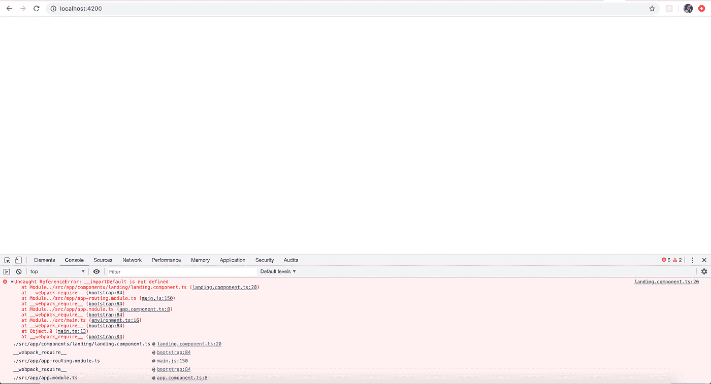**

**大多数人在从 v8 升级到 v9 时都会遇到这个错误。常见的解决方法是升级到正确的 TypeScript 版本。但是在我们的例子中，已经安装了正确的 TypeScript 版本。那么是什么导致了这个错误呢？**

**嗯，我们的角度钢筋混凝土依赖是过时的，应该升级到最新的 AIO 指南。我们需要更新***@ angular-devkit/build-angular***到 ***package.json*** 中的****~ 0 . 900 . 7 "******

## **NgRx 过期**

> **包@ngrx/effects 与@angular/core 具有不兼容的对等依赖关系(需要^7.0.0(扩展)，将安装 9.1.6)**

**修复 devkit 版本后，当我们再次运行我们的应用程序时，我们通过了，应用程序服务成功。我们在这个 app 中使用了 used ***NgRx*** 进行状态管理。因此，为了确保我们在导航到使用 ***NgRx*** 的路线时一切正常，我们看到了上面的错误。**

**想知道为什么这个错误？**

**那么，当我们的应用从 v8 升级到 v9 时，我们使用了 ***ng update*** 。这可以防止任何对等依赖关系自动更新。这意味着我们必须使用以下命令手动完成:**

***ng 更新—下一个—force @ ngrx/store @ ngrx/effects***

## **NgRx 运行时检查**

> **错误类型错误:无法分配给对象“[object Object]”的只读属性“id”**

**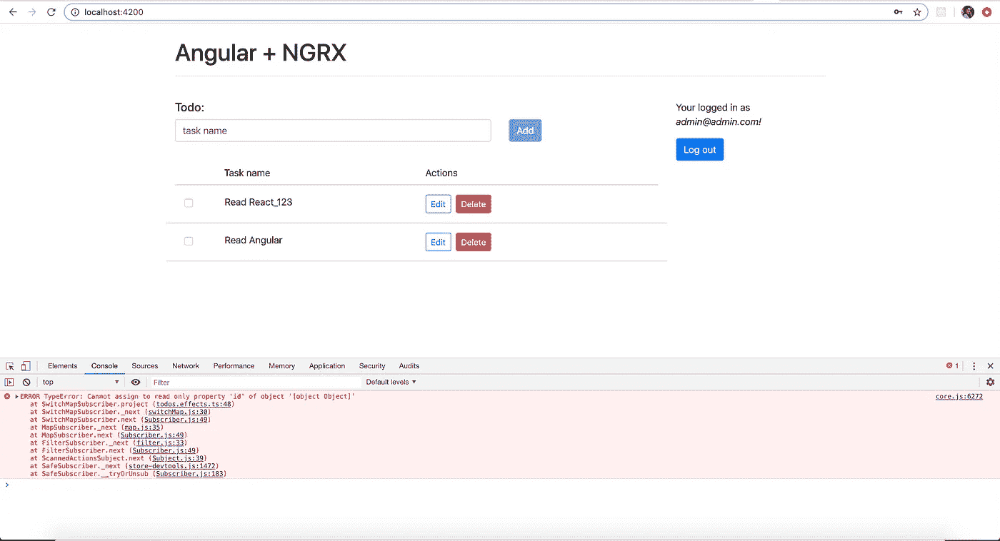**

**在更新 ***NgRx*** 并遵循他们的指导方针后，遇到了引入的运行时检查。为了试验和验证相同的东西，我们变异了一个对象，然后遇到了上面的错误。**

**此错误由 [*NgRx 运行时检查*](https://ngrx.io/guide/store/configuration/runtime-checks) 抛出。运行时检查指导开发人员遵循 NgRx 和 Redux 核心概念和最佳实践。在开发过程中，当违反规则时，会抛出一个错误，通知您什么地方出错了。**

*****@ ngrx/store****出货 5 个内置运行时检查，这些检查必须在***app-store . module . ts***文件中覆盖(如下图)才能修复上述错误。***

**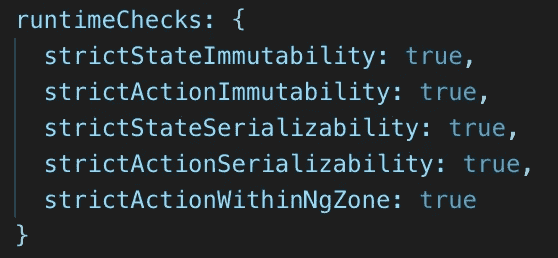**

**贴出以上所有修正后，我们的应用程序现在可以在 **Angular v9** 上运行了！！**

# **我们的应用程序大小缩小了吗？**

****Ivy 编译器**Angular v 9 附带的最重要的特性之一。Ivy 是 Angular 新的内部构建和渲染管道。**

***渲染器是一个引擎，它将您输入的指令与模板一起放入角度组件，然后将它们翻译成更改 DOM 的指令。***

## **树摇晃**

**在 Angular 9 中，Ivy 是标准的渲染器。如果渲染器更有效或更容易实现，这意味着您可以发布更少的代码，因为需要更少的指令，这就是 Ivy 的目的。Ivy 编译器寻找 Angular 中没有被使用的部分。它使用树抖动(一种检测未使用代码的方法，也称为死代码删除)，并且它为每个角度分量生成较少的代码。**

**通过这种方式，Ivy 产生了小得多的 JavaScript 包，并解决了 Angular 的包弱点。它改变了游戏规则，因为它在性能和尺寸方面将角度应用带到了一个全新的水平。**

> **Ivy 没有改变 Angular 的使用方式，但确实改变了 app 的生成方式。**

## **差异加载**

**Angular 团队专注于像 Angular 附带的现代 JavaScript 的差异加载这样的计划。这意味着将创建不同的聚合填充包并一起部署。在运行时，仅加载特定浏览器所需的聚合填充，从而导致下载较少的代码。**

## ****说够了，给我看看统计数据！****

**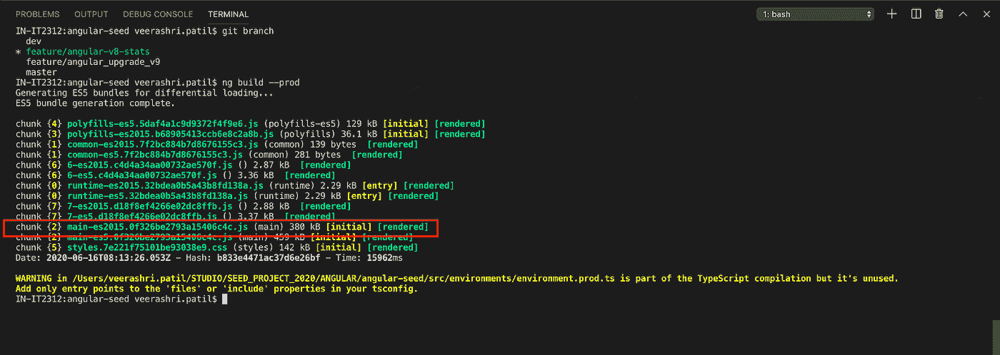**

**v8**

**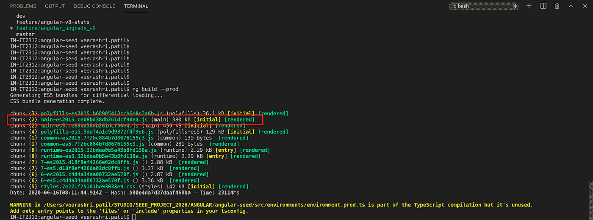**

**v9**

**好吧，消息不是很好。例如，main-es2015 捆绑包在两种角度版本中都是 380kB。对于我们的应用程序，包的大小没有缩小。那么 ***main.js*** 到底是怎么回事呢？这意味着要小得多，因为更好的树木摇角！**

**让我们看看 ***main.js*** 由什么组成:**

**1.角度库**

**2.实用程序库**

**3.不能延迟加载的组件/服务**

**实用程序库与 Ivy 无关，与 Angular Services 也一样。留给我们的是:Angular 框架和组件库。**

**对于 Angular 9，每个 Angular 库——框架本身、组件库、NgRx——现在都需要使用 ***ngcc*** 工具重新编译，以便与 Ivy runtime 一起运行。 ***ngcc*** 用 Ivy 编译器重新编译 node_modules 库。这个过程可能会使组件变大一点。**

**启用 Ivy 后文件更大的另一个原因是生成的惰性加载块更少。结果更多的代码也进入了 ***main.js*** 中。**

**这可能与我们使用的库将要修复的 [Ivy 兼容性指南](https://angular.io/guide/ivy-compatibility#payload-size-debugging)中描述的突破性变化有关。如上所述，我们有案例#2。**

> **"检查导入的库是否被标记为无副作用。如果你的应用程序从共享库中导入，而共享库是为了避免副作用，那么在它们的 **package.json** 中添加“side effects”:false。这将确保如果库被导入但不被直接引用，它们将被正确地树摇动。更多详情请看原刊[此处](https://github.com/angular/angular-cli/issues/16799#issuecomment-580912090)**

**所以我们开始吧。**

**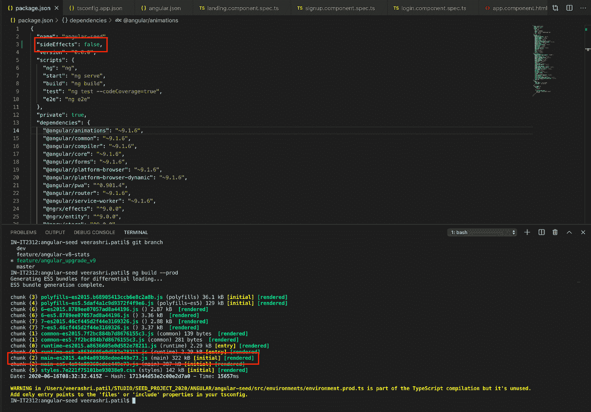**

**它创造了奇迹！！我们现在有 **322kB** ！**

> **总的来说，Ivy 构建小了 **58kB** ，这大约是包大小的 **15%** 收缩。**

**但这只是暂时的。Angular 10 的最初计划是在没有 ngcc 的情况下工作。我相信，现在我们有了 v10，这些值将会小得多。原因如下:**

*   **目前，库以 JIT 模式编译，然后用 ngcc 重新编译**
*   **Angular v10:图书馆将出版由艾薇和 AOT 编译的代码**
*   **然后，我们将不再需要 ngcc 组件的兼容层**
*   **AOT 编译的输出是额外的奖励，使图书馆更小**

# **我们的应用程序表现如何？**

> **正如 Angular 专家 Bonnie Brennan 所说，“要想让 Angular 发挥最大性能，你需要把它当成一辆跑车，而不是一辆皮卡。”**

**这意味着 Angular 应该非常瘦和快，所以让它自由运行。**

**新的常春藤是如此之快，以至于在等待我们的构建完成时，我们离开的机会会更少。嗯，常春藤知道我们的应用程序的事情，它总是支付它的债务。Ivy 大大加快了我们的构建时间。更快的构建时间意味着我们在构建应用时更少离开电脑。**

**我们去看看。**

**生产制造**

**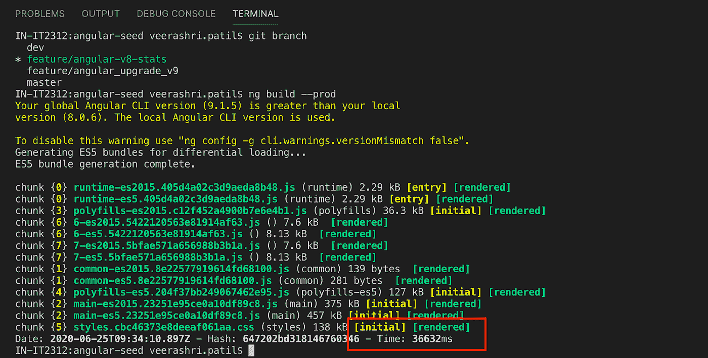**

**v8**

**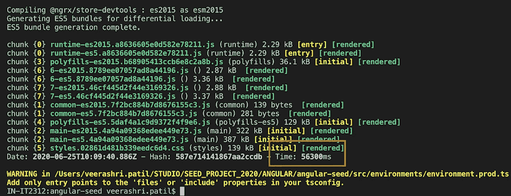**

**v9**

**由于显而易见的原因，差异加载会使构建变慢，它需要生成两个相同代码的包。Ivy 对这两个版本都有帮助，应该可以节省时间。但是呢？我们从 36.6 秒到 56.3 秒增加了大约 20 秒**

**DEV 版本怎么样？因为在 Angular v9 之前，AOT 编译步骤只在我们使用 production 标志执行时运行。*好消息是 Angular v9 也将 AOT 带到了开发版本中！***

**开发构建**

**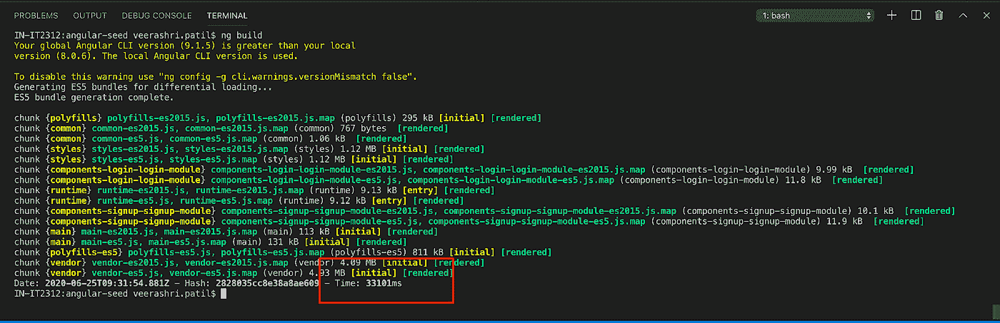**

**v8**

**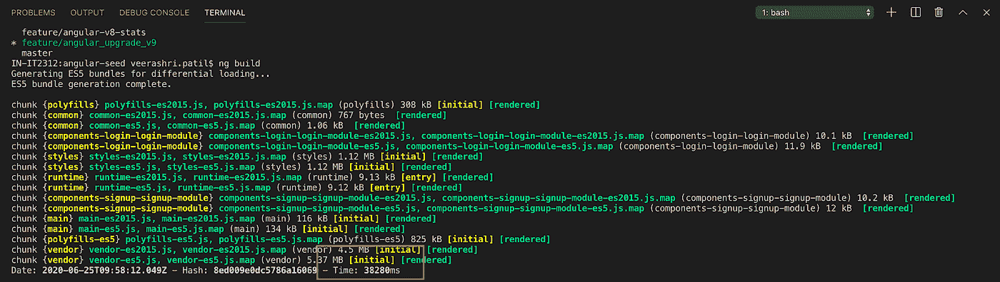**

**v9**

**在开发版本中，我们从 33.1 秒增加到 38.2 秒，增加了大约 5 秒。**

**对于开发构建，没有差异加载。我们要么编译 ES2015，要么编译 ES5，从不两者都编译。因此， ***DEV*** 构建比 ***PROD*** 构建要快，但性能仍然不如 v8 编译时间。**

**让我们检查一下重新编译的时间，看看我们是否有显著的差异。**

**重建时间**

**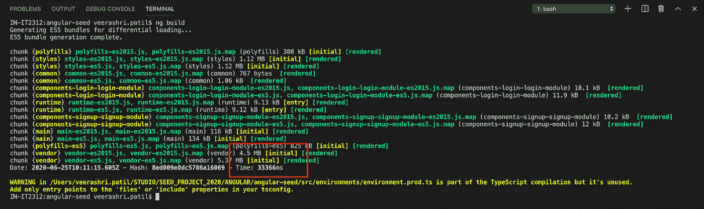**

**v9 dev build compilation**

**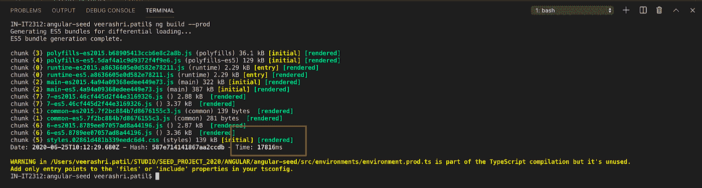**

**v9 prod build compilation**

## **是啊！**

**那些结果值得等待。**

**重新编译的时间很大程度上取决于你正在编辑的地方。较小的、惰性加载的模块比 ***main.js*** 中的模块重新编译更快。**

**我们已经观察到在升级到 Angular 8.2 之后，重新编译时间有了显著的改进(主要是由于 TypeScript 的改进)，但是耶！Ivy compiler 设法将时间压缩得更多。**

> **DEV : ***33.3s*** 而不是 ***38.2s*****
> 
> **PROD: ***17.8s*** 而不是 ***56.3s*****

****但是！**如前所述， ***库*** ，那些需要在编译前用 ngcc 工具重新编译。对于我们来说，9.1°角的成本为 20-30 秒**

**令人高兴的是，在 Angular 9.1 中， ***ngcc*** 足够智能，可以按需运行，而不是每次编译和每次安装后更改。但是是的，开销只有在添加/更改依赖项后的第一次运行时才可见。**

# **结束语**

**你可能会觉得结果不值得升级。但是没有！不是这样的。 ***ngcc*** 在尺寸和速度上都增加了一些开销，但我们对 Angular v9 有很多期待。我们有 AOT 编译与常春藤提供更快的构建时间和常春藤是更小的包大小，只是举几个例子！正如作者所说:**

> **“艾薇是一个推动者。更多信息请见 Ng v10”**