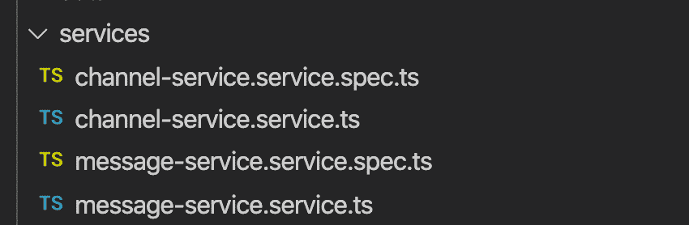
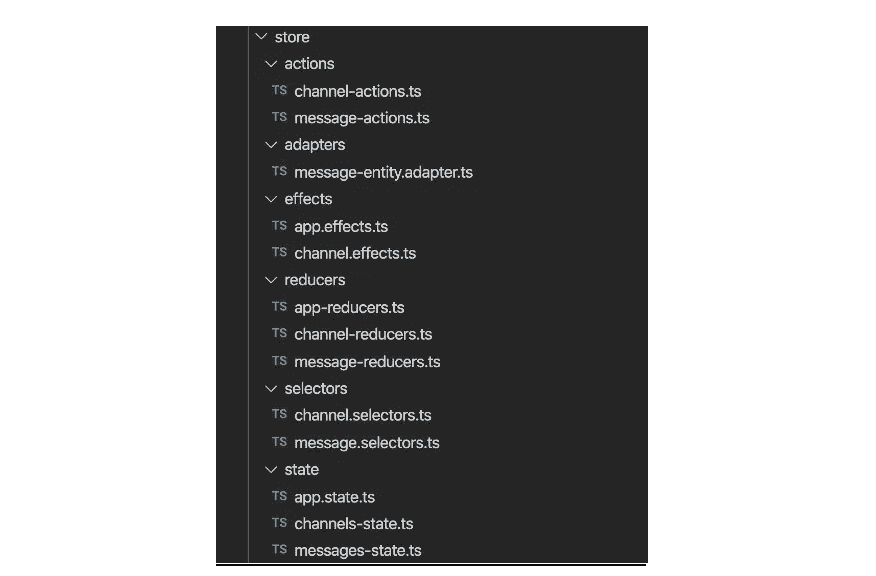

# NgRx 与可观察服务:庄严的事务

> 原文：<https://medium.com/capital-one-tech/ngrx-vs-observable-services-stately-matters-8e6b7a35723b?source=collection_archive---------2----------------------->

## *比较应用程序中处理数据流的两种流行方式*

关于维护应用程序中的状态，拥有单一的真实来源是一件好事，但这可能会带来麻烦的开销。

就像生活中的所有事情一样，在发展中你不能鱼和熊掌兼得。当然，如果有一个解决方案可以帮助开发者解决常见的问题，比如事件汤和变更检测，而不需要任何额外的工作，那就太好了。但是，唉，这不是世界的方式。

我今天要谈论的两个流行的维护状态和优化数据流的解决方案是 [NgRx](https://ngrx.io/) 和[可观察服务](https://blog.angular-university.io/how-to-build-angular2-apps-using-rxjs-observable-data-services-pitfalls-to-avoid/)，前者采用 redux 风格的方法，后者包含应用程序“片段”的期望状态，订阅可以在其中创建。

对于本文，我实现了一个迷你聊天应用程序来演示 NgRx 和 observable services 之间的代码差异。我还将讨论我实现这两个目标的经验。

# NgRx 是什么？

我无法改进来自 [NgRx 文档的定义，所以让我直接引用它们](https://ngrx.io/docs) -

*“NgRx 是一个在 Angular 中构建反应式应用的框架。NgRx 为*提供了库

*   *管理全局和局部状态。*
*   *隔离副作用，促进更干净的组件架构。*
*   *实体收藏管理。*
*   *与角路由器集成。*
*   *在构建许多不同类型的应用程序时，增强开发人员体验的开发人员工具。”*

# 什么是可观察的服务？

Angular 中的可观察服务是可以注入到应用程序中的单例服务。它提供了访问器来操作数据(比如向数组中添加一个项)和存储数据。

# 我们的示例迷你聊天应用程序

是时候看看他们两个的行动了！今天，我们将使用一个基本的“聊天”应用程序，它不消耗任何服务/后端 API。使用此应用程序，您可以:

1.  查看预设频道列表
2.  更新频道名称
3.  从内存缓存中读取消息
4.  发送消息
5.  切换频道

对于每个“特性”,我将分析每个实现之间的差异。

# 可观察服务的结构与 NgRx 的结构

## 可观察服务:

所需要做的就是运行两次`ng g s <service_name>`，一次用于通道服务，另一次用于消息服务。只需要两个服务——一个处理通道相关的逻辑，另一个处理消息。

## NgRx:

这里还有更多的工作要做——记住，这是*不包括*减速器和效果的规格。生成的每个文件都包含有自己特定职责的代码。文件很多，但至少我在遵循[# single responsibility principle](https://en.wikipedia.org/wiki/Single-responsibility_principle)。

# 功能分解——可观察服务与 NgRx

在这里，我将讨论每个特性在方法上的差异。

# 功能 1:查看预设频道列表

## 可观察服务:

我有一个频道列表，它存储在`ChannelService`的一个本地成员变量中。我通过监听`channelsChanged$`可观察信号来获取频道和频道更新。

[https://gist . github . com/Michael-mckenna/9 BD 5a 7a 0 CFA 8 E0 be 634 a 27 a4 Fe 281d 58](https://gist.github.com/michael-mckenna/9bd5a7a0cfa8e0be634a27a4fe281d58)

最后，在组件中，我订阅了频道，

[https://gist . github . com/Michael-mckenna/2 D1 ce 87 c 027 DC 62 f 6526d 721506 f 7434](https://gist.github.com/michael-mckenna/2d1ce87c027dc62f6526d721506f7434)

## NgRx:

首先，我定义状态是什么样子，然后提供默认值:

[https://gist . github . com/Michael-mckenna/e 4795 Abe 3289 C4 c 372 AC 50 fedd 8 D1 ce 3](https://gist.github.com/michael-mckenna/e4795abe3289c4c372ac50fedd8d1ce3)

然后，我必须创建一种方法来获取通道，这是通过一个选择器来完成的。这可以被认为是一个“查询”:

[https://gist . github . com/Michael-mckenna/94b 60 ce e 9528 f 346 e 20d 3c 03 CBE 9d 92d](https://gist.github.com/michael-mckenna/94b60cee9528f346e20d3c03cbe9d92d)

最后，在组件中，我告诉商店使用我创建的选择器来获取这部分数据。

`this.selectedChannelId$ = store.pipe(select(selectCurrentChannelId));`

不算太坏。

# 功能 2:更新频道名称

## 可观察服务:

1.  在服务中创建`updateChannel`方法。
2.  从组件调用方法。

例:[https://gist . github . com/Michael-mckenna/CD E3 Fe 5383307 AE 39461804 C2 fcb 61 ef](https://gist.github.com/michael-mckenna/cde3fe5383307ae39461804c2fcb61ef)

请注意如何使用 spread 运算符。这通过返回一个新数组来触发变化检测。

## NgRx:

1.  创建一个`UpdateChannel`动作。
2.  在 reducer 中添加逻辑以更新相应的通道。
3.  在组件中调度`UpdateChannel`动作。

我知道这次应该更新哪个频道，因为我为频道硬编码了一些 id。我不必更新选定的频道，因为对该频道的引用没有改变。

# 功能 3:阅读消息

## 可观察服务:

1.  创建一个`MessageService`。
2.  为了获取消息，我使用通道 id 作为键，使用消息数组作为一个`messageDB`变量中的值。`messages`字符串数组用于跟踪当前通道的消息，并处理`messageSubject`中的推送和返回值。
3.  订阅可从消息列表组件中观察到的`messages$`。

这里我建立了`messageDB`以及`messages` getter 和 setter。我还从用户改变频道时发生的`messageDB`中获得当前频道的消息:

[https://gist . github . com/Michael-mckenna/CAE 21 c 80099 a9 da 7212036 Fe 42 b 0d 061](https://gist.github.com/michael-mckenna/cae21c80099a9da7212036fe42b0d061)

然后在组件中:

[https://gist . github . com/Michael-mckenna/54fd 4a 985 b 1199 BC 1 de 35 c 426 e 7130 c 2](https://gist.github.com/michael-mckenna/54fd4a985b1199bc1de35c426e7130c2)

## NgRx:

这有点复杂。然而，一旦把所有的部分放在一起，就有意义了。逻辑的核心是 [EntityAdapter](https://ngrx.io/guide/entity/adapter) 。

1.  创建实体适配器，并设置主键。在这种情况下，我希望 channel ID 成为主键。该值将是一个包含`entities`的对象，这是我们的消息数组所在的位置。我使用的是一个拥有`channelId`和一个`Message`数组的`MessageContainer`对象。`channelId`作为消息的唯一标识符。此处举例:[https://gist . github . com/Michael-mckenna/b 7389299 c 534 a 97625 a6de 783 b 84 fa 20](https://gist.github.com/michael-mckenna/b7389299c534a97625a6de783b84fa20)
2.  创建选择器。我必须利用选择器组合，这是一种从选择器中创建选择器的奇特方式。我有一个获取所选通道 ID 的选择器，一个获取`MessageContainers`(每个通道的消息)列表，然后我使用这两个获取所选通道的消息。这里举例:[https://gist . github . com/Michael-mckenna/056 baea 580 d6d 7 BC 0 f 5013 f 8 dee 0 BF 4d](https://gist.github.com/michael-mckenna/056baea580d6d7bc0f5013f8dee0bf4d)
3.  要获取消息，我只需使用在(2)中创建的组合选择器。这里举例:[https://gist . github . com/Michael-mckenna/db 93226 b 0796572d 627495 c 316 c 088 a 6](https://gist.github.com/michael-mckenna/db93226b0796572d627495c316c088a6)

# 功能 4:添加消息

## 可观察服务:

1.  给`MessageService`添加一个函数来添加消息。
2.  从组件中调用这个服务函数。

[https://gist . github . com/Michael-mckenna/400 b 175683 f7c 2504016 CCE 1c 5 ca 86 FB](https://gist.github.com/michael-mckenna/400b175683f7c2504016cce1c5ca86fb)

## NgRx:

1.  创建一个`AddMessage`动作。
2.  在消息缩减器中添加一个 case，将消息添加到所选通道 ID 对应的实体的消息数组中。
3.  从组件调度操作。例:[https://gist . github . com/Michael-mckenna/d04e 8706 C2 d 04 ceba 7 cfe 38 c 0d 6 f 12 c 9](https://gist.github.com/michael-mckenna/d04e8706c2d04ceba7cfe38c0d6f12c9)

# 功能 5:切换频道

## 可观察服务:

1.  在`MessageService`中，添加一个`selectedChannelId`属性。这在调用`getInitialMessagsForChannel(channelId: number)`时被设置。
2.  当用户选择一个频道时，我在`ChannelService`和`MessageService`中记录该频道的 ID。当`ChannelService`中的值更新时，它会更新上面列出的函数中`MessageService`中的值。这样做的缺点是会产生紧耦合。

参见此处第 24–26 行:[https://gist . github . com/Michael-mckenna/CAE 21 c 80099 a9 da 7212036 Fe 42 b 0d 061 #文件-消息-服务-ts-L24-L27](https://gist.github.com/michael-mckenna/cae21c80099a9da7212036fe42b0d061#file-message-service-ts-L24-L27)

## NgRx:

1.  创建一个`SelectChannelId`通道动作*和*消息动作(记住，在这两种状态下都将跟踪所选的通道 id)。
2.  在缩减器中增加一个 case，设置通道缩减器和消息缩减器中的`selectedChannelId`。
3.  创建`selectChannel`选择器。
4.  一些新的东西——创造一个`selectChannel$` [效果](https://ngrx.io/guide/effects)。我想在通道状态中设置选定的通道 id，但我也需要在消息状态中设置。这被称为[副作用](https://softwareengineering.stackexchange.com/questions/40297/what-is-a-side-effect)(因此 NgRx 给它起了这个名字)。创建的效果调度一个新的动作，该动作被消息缩减器获取，因此它也可以更新它选择的通道 id。另一种方法需要将消息状态与通道状态相结合。但是，这种方法会有问题，因为消息状态依赖于另一个状态的值来组成它的选择器，这是一种反模式。

# 关于 NgRx 与可观察服务的最终想法

这些都是基于我个人使用两者的经验，可能并不适用于所有的团队或用例。

# 可观察到的服务利弊

## 可观察服务的优点:

可观察服务方法的实现要快得多。它更苗条，学习曲线非常短。相对快速地完成一件事是值得的。

## 可观察服务的缺点:

我遇到了如何处理跨通道存储消息的问题。我希望消息被缓存，这样当返回到一个频道时，它们“已经”在那里了。我用一个使用[记录](https://www.typescriptlang.org/docs/handbook/utility-types.html#recordkt)类型的假数据库实现了一个解决方案，最终不喜欢它，然后想出了一个以我创建的`messageDB`结束的解决方案。仍然不确定是否有更好的方法。

我还遇到了一个问题，在跟踪所选频道的 id 时，我必须耦合`ChannelService`和`MessageService`。要是有一个他们可以阅读的中央商店就好了。🤔

我可以看到大型应用程序的服务快速增长。这就需要仔细规划如何以及何时创建服务。您不会希望让单个服务过载

# NgRx 利弊

## NgRx 的优点:

没有紧密耦合。

应用程序流中的每个逻辑位都存储在各自的组件中(例如，缩减器、效果等)。这有助于确保在代码中什么应该放在哪里没有问题。这反过来有助于分解应用程序流，因此您只需在任何时间点关注拼图的各个部分，而不是试图在短期内存中保留大部分流，就像大型可观察服务的情况一样。

单向数据流和干净的副作用处理。这与第一点有关，但是有一种机制来处理副作用并帮助最小化事件混乱有助于保持代码的整洁。

## NgRx 的缺点:

*(故事时间—TL；dr it was way longer)我一直在从事一个使用 NgRx 的成熟项目，这仍然比可观察的服务实现花费了更长的时间。我从来没有参与过从零开始设置商店(所有的动作、状态、选择器、效果和减少器)的项目，所以设置一切需要一个学习曲线。有一次，我不得不学习一个叫做实体适配器的新概念(用于获取给定了特定通道 ID 的消息)，这也需要一个学习过程。*

为了客观地看待问题，我规划了应用程序结构，创建了组件，创建了 UI 设计，并首先添加了可观察到的服务逻辑，整个过程仍然比只添加 NgRx 实现要快(NgRx 实现重用了 UI 并在很大程度上重用了组件)。

然而，这并不一定意味着 NgRx 更差，这只是因为它花了更长的时间！这可能更多地表明了我必须经历的两条学习曲线。

## NgRx 的更多缺点:

*   在大型应用程序中，跟踪发生的一系列动作/效果/减少会变得很困难。一旦熟悉了代码库，这一点就变得很清楚了，但是对于新的开发人员来说，或者对于重新阅读不久前编写的代码的开发人员来说，仍然需要一个较长的学习曲线。
*   所有的文件。如前所述，这个真的没有办法。这只是必要的文件夹结构是建立在尽可能好的方式，以方便导航。随着代码库越来越大，这变得越来越重要，因为文件的数量将呈指数级增长。
*   总体上写更多的代码。您必须编写动作、效果、减少器和选择器，然后为它们中的每一个编写测试。然而，因为这些组件都是解耦的，并被分解成更小的纯函数，这使得编写测试更容易，也使得测试更干净。

# 我应该使用可观察服务还是 NgRx？

你可能已经听过一遍又一遍了，但是*使用任何对你的团队有效的东西*。问自己正确的问题会有所帮助。

如果你的团队中没有人有使用 NgRx/redux 的经验，但是你真的想使用它，你能抽出额外的时间来学习它吗？你的组织需要自动化的单元测试吗(例如 Karma，Cypress)，或者你依赖手工测试来应付吗？NgRx 已经有许多文件和组件，每个都需要有一个相关的单元测试，所以您需要记住维护这个大型测试套件所需的额外工作。

*披露声明:2022 资本一。观点是作者个人的观点。除非本帖中另有说明，否则 Capital One 不隶属于所提及的任何公司，也不被这些公司认可。使用或展示的所有商标和其他知识产权是其各自所有者的财产。*

*最初发表于*[T5【https://www.capitalone.com】](https://www.capitalone.com/tech/software-engineering/comparison-of-ngrx-and-observable-services/)*。*