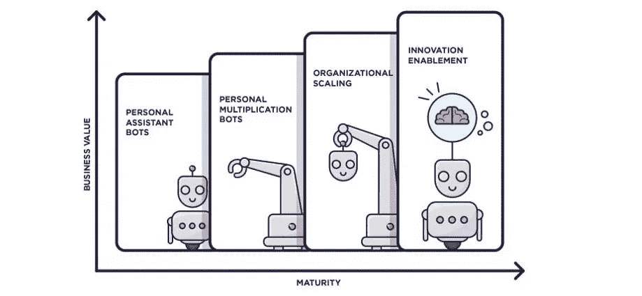

# 很高兴知道，在开始使用 RPA 之前…

> 原文：<https://medium.com/globant/nice-to-know-before-start-with-rpa-e80416f25860?source=collection_archive---------1----------------------->

从设定期望开始总是好的，所以我们不会浪费任何人的时间，我们保证如果你正在阅读这篇文章，是因为你是正确的公众的一部分:

*   这不是一篇“*你需要知道的一切*”的文章:这是一篇简单而轻松的文本，包含一些“很高兴知道”**的事情，从 RPA** 开始。
*   这不是一篇“*主题专家文章*”:实际上我们是一个完全不专业的团队，阅读、学习、尝试、失败、再尝试。从中我们收集了许多关于 RPA 的经验，因此这更像是一次学习课程的结果。
*   这不是一篇了解如何构建或开发 RPA 的*技术文章:这更像是一篇“为傻瓜”的文章，可以从功能的角度提供一些在开始使用 RPA 计划之前的关键知识。*

*你还在吗？太好了。我们很乐意为你写作！让我们继续，先了解一下什么是 RPA:*

> *RPA 是一种强大的技术，它通过软件用户界面模拟几乎任何种类的人类动作，但几乎消除了两个最常见的人类弱点:操作能力降低和高错误风险；并且当没有可用的 API 资源时(通常在遗留软件中)特别有用。诞生于众所周知的 BPM(业务流程管理)和管理所有业务流程的需求。一旦公司达到管理它们的重要里程碑，下一步就是优化。这里是 RPA 故事开始的地方…*

# *甜味和苦味*

*此时此刻，RPA 技术是**趋势**。但是，请:不要被满满的 RPA 爱好者热情冲昏了头脑！(对了，没错，我们是 RPA 爱好者)。我们必须承认，每项技术都有其优缺点，RPA 也不例外，我们不想一开始就认为一切都是完美的，不是吗？让我们看看:*

*如果您认为使用 RPA 可以解决您的所有问题，让我告诉您重新考虑是很重要的。RPA 不适用于所有流程。为了实施 RPA 项目，您必须对流程进行初步评估，并牢记以下两个主要条件:*

1.  *为了支持手动任务，该过程必须是重复的，并且必须遵循标准模式。它包括数据输入、过程的所有步骤和输出。*
2.  *这个过程不应该包括决策。这将是一个 IA。要自动化的候选过程必须遵循一组明确的标准，以便确定在特定场景中如何表现。*

*要在流程上实施 RPA，您必须始终保证这是一个长期稳定的流程。如果有手动构建的输入数据，相关用户必须遵守严格的规则，以保持所有变量与 RPA 预期的一样。总之，这意味着在自动化任何流程之前，您必须有一个定义好且高度可信的业务流程。*

*听完这个解释还想继续学习 RPA 吗？如果你的答案是肯定的，让我告诉你更多关于 RPA 的事情:RPA 的主要优点是你作为人可以专注于更有价值的任务，而不是通过做无聊和重复的任务来破坏你的大脑。此外，公司可以提高生产率，从而增加利润。*

*即使 RPA 被认为是自动化点击的替代方案，现在也不是了！现在你有很多插件和集成来避免像人类用户一样执行这个过程。因此，除了您可以自动化人工流程之外，您还可以以更优化的方式来执行此操作，不仅在时间方面，而且在资源方面。*

# *该做和不该做的事情:*

**

*对于一些人来说，这可能是显而易见的，但是在这里，我们将开始使用我最喜欢的黄金法则:*没有什么是显而易见的。*因为就像有人在与 RPA 合作 5 年后读到这篇文章一样，有人刚刚读到这篇文章，它就变成了 RPA 世界中的一个前灯。因此，在这里，我们与您分享一些简单的建议，告诉您当我们考虑从 RPA 开始时，什么是肯定的，什么是绝对不可能的:*

*怎么办？*

1.  *评估大量可能成为自动化候选的流程。如果流程性质不同，甚至来自不同部门就更好了。*
2.  *从小处着手，从最低的果实开始，这样它们就能代表快速的胜利。始终牢记预期的投资回报是什么(在时间、收入、减少错误方面)。*
3.  *将具有高度成熟度的过程作为候选过程，并且您知道它们在短期内不会遭受重大变化。*
4.  *最佳候选必须是对大量人类用户有积极影响的过程。*
5.  *考虑那些由于工作量大而需要每天投入大量工作时间的流程。例如:假设一个流程在 2 分钟内完成，但由于工作量大，一天至少要完成 50 次，并且要管理一个 50 人的团队。*
6.  *考虑参与项目的所有参与者。这意味着技术/平台业务领域，并作为一个单位工作。评估所有参与者的稳定程度。可能业务区域稳定，但是涉及的平台属性不一样。*

*不要做什么？*

1.  *尝试自动化之前没有被改进或分析过的流程。例如:需要批准的流程，必须以打印的纸张形式提交，并由公司的 CEO 签字。
    这种性质的流程必须首先进行重组，这样它才能成为自动化的良好候选。*
2.  *让员工理解过程自动化是公司减少工资的一个机会。这将导致员工不采用自动化解决方案，导致您投资在短期内不会有明确投资回报的资金。*
3.  *不要自动化错误。不要将糟糕的业务流程自动化。当一个过程的分析是由专家完成的，并且自动化解决方案是基于它的描述时，创建的机器人可能会继续犯以前已经发现的同样的错误。*
4.  *验证码。可能似乎是显而易见的，但事实并非如此。验证码就像机器人的氪星石。避免包括读取验证码或检测图像(或图像中文本)的自动化过程。*

*每当设计自动化解决方案时，对其进行端到端的分析并确保其设计能够最大限度地减少过程中可能出现的错误是非常重要的。*

*如果 RPA 有商业目的，避免用个人计算机实施 RPA 项目。尝试投资一个良好的基础设施，能够升级和改进机器人。*

# *RPA 何去何从？*

**

*我们了解了 RPA 的由来和现状，也知道了它的发展方向:*

*RPA 现在是一种技术趋势的一部分，在未来几年将被广泛使用。，世界各地的公司都在接受数字化转型，以提高容易出现人为错误的手动活动的效率。RPA 面向:*

***智能自动化:***

*RPA 是公司投入人工智能流程的第一步。对于已经在使用这些技术(包括机器学习)的公司来说，机器人和算法的结合正在减少重复任务，并有助于建立一个复杂的系统，机器人可以为不断发展并从提供的数据中学习的 IT 系统提供信息。*

***客户体验:***

*RPA 被用来减少客户与服务公司之间交互的瓶颈。通过使用这种技术，世界各地的公司可以轻松有效地与其客户进行交互，在关注问题或创建新请求方面为他们提供无缝的用户体验。通过实施 RPA，客户旅程定义可以帮助弥补差距，这些差距通常是由服务台提供支持的角落案例，这里的自动化提供了最短的 SLA 时间响应和全面的客户体验。*

***跨行业支持:***

*由于 RPA 在云服务上的实施，不同的行业可以获得并利用该技术进行改进，实现数字化转型。例如，医疗保健、银行和保险业务线是在其流程中使用 RPA 来处理大量数据并帮助存储或删减数据的行业的一部分。*

*那么，你准备好下一步了吗？…*

**

*Written by: [https://medium.com/@chabe.sp](/@chabe.sp), [https://medium.com/@fredy.carvajal](/@fredy.carvajal), [https://medium.com/@juan.montano](/@juan.montano), [https://medium.com/@juanesteban.arboleda](/@juanesteban.arboleda), [https://medium.com/@michael.giraldo](/@michael.giraldo)*