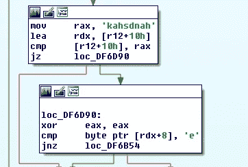
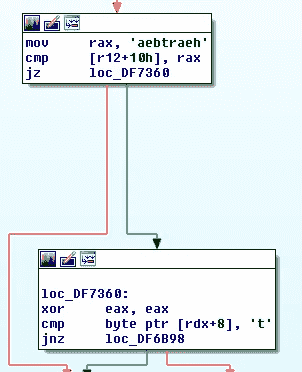
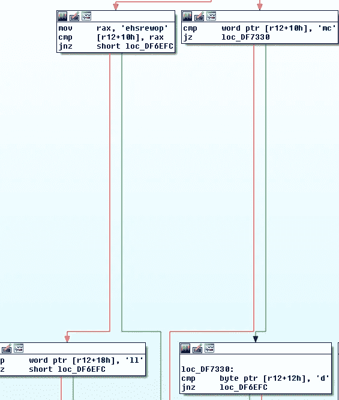
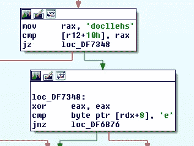
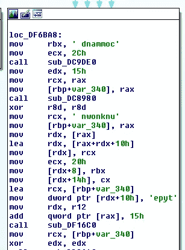
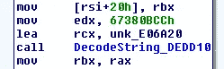
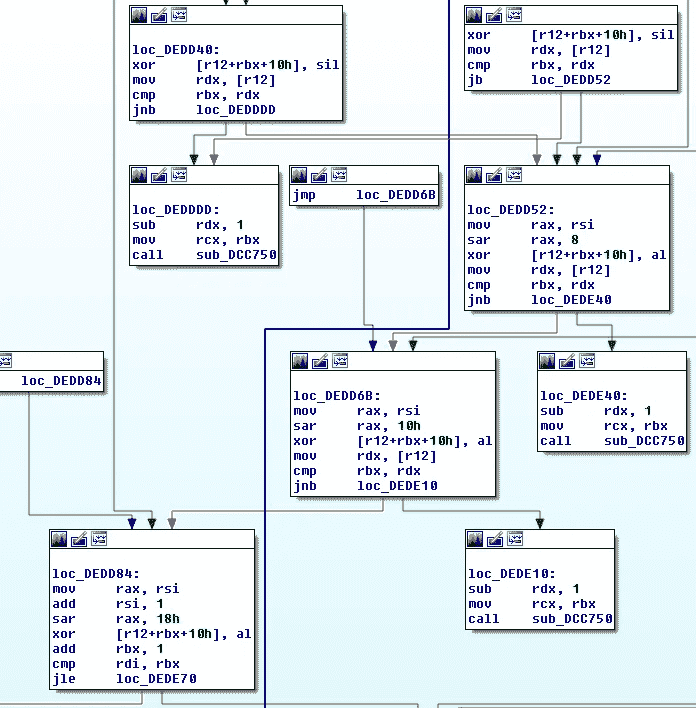
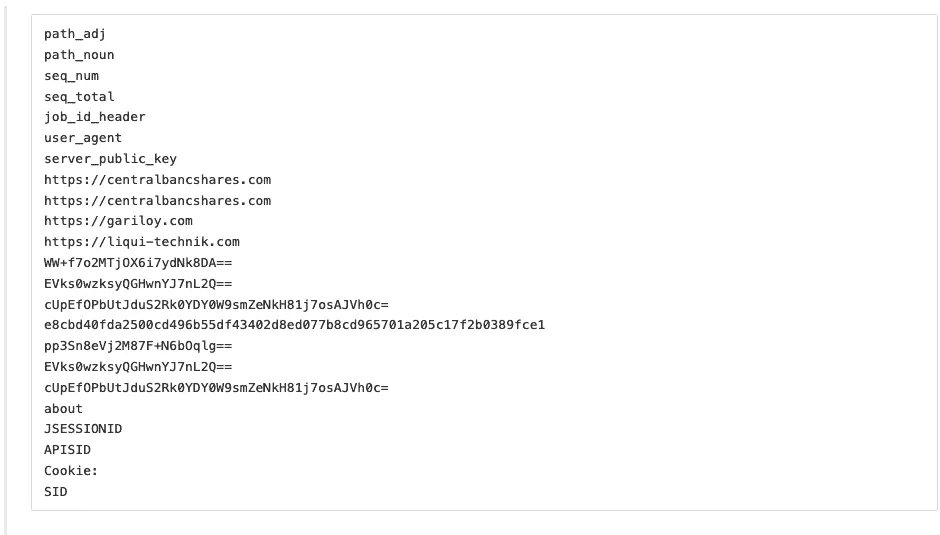
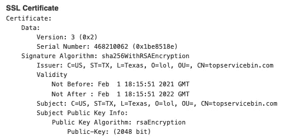
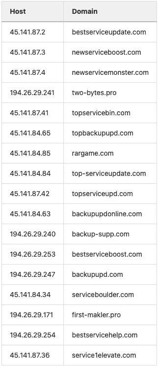

# Nimar 装载机

> 原文：<https://medium.com/walmartglobaltech/nimar-loader-4f61c090c49e?source=collection_archive---------3----------------------->


```
By Joshua Platt & Jason Reaves
```


在过去的一年里，多家安全供应商认为，BazarLoader & BazarBackdoor 是 Trickbot 背后有组织的网络犯罪集团所为。最初出现在 2020 年 4 月左右，该恶意软件利用以前用于分发 Trickbot 的基础设施在电子邮件活动中传播。[[1](https://twitter.com/pancak3lullz/status/1252303608747565057)bazar loader 一词是由于依赖和使用区块链域名系统以及用于与控制器通信的相关 bazar 域而产生的。从那时起，Baza 或 Bazarloader 这两个术语就被交替使用来指代这一特定的恶意软件家族。

在 Baza 最初出现后，出现了多个将各种代码归属于恶意软件家族的报告。[ [2](https://blog.fox-it.com/2020/06/02/in-depth-analysis-of-the-new-team9-malware-family/) ] [ [3](https://www.cybereason.com/blog/a-bazar-of-tricks-following-team9s-development-cycles) 越来越明显的是，开发正在进行，多个项目正在建设中。这种公众追随的不利一面是普遍接受基于以前 TTPS 的活动。将 TTP(例如将 powershell stagers 加载到 red team 实用程序中)与类似的活动结构和 C2 流量模式相结合，会很快导致恶意软件家族和参与者的错误归属。

2 月 3 日，我们检测到了以前属于 Baza 的活动，但恶意软件利用了不同的请求标头。其他几个人也注意到了奇怪之处。进一步的分析指出了一些完全不同的新东西。Nimar loader 与 baza 家族的代码库不同。

NimarLoader 或 Nimrod 最近被误认为 BazarLoader，是用 Nim 编码的。恶意软件被混淆，但不包含在大规模活动中看到的典型硬化。由于这是新开发的东西，隐藏样本是不必要的，但奇怪的是，它没有使分析变得不那么困难。从字符串中，可以清楚地看到对该功能的暗示。

```
verb in @["GET", "POST"]
[@https](http://twitter.com/https)
[@fKHMP](http://twitter.com/fKHMP)]
[@SPMVDSD](http://twitter.com/SPMVDSD)
job_type
job_args
job_results
[@heartbeat](http://twitter.com/heartbeat) set
[@HEARTBEAT](http://twitter.com/HEARTBEAT) set Failed
[@HEARTBEAT](http://twitter.com/HEARTBEAT) set
[@Shellcode](http://twitter.com/Shellcode) Done
[@heartbeat](http://twitter.com/heartbeat)
[@shellcode](http://twitter.com/shellcode)
[@handshake](http://twitter.com/handshake)
[@No](http://twitter.com/No) update data recieved
agentId
pathAdj
pathNoun
seqNum
seqTotal
jobIdHeader
userAgent
serverPubKeyEncoded
jitterParamStr
sessionKey
sessionDie
```

命令表允许握手、心跳、外壳代码、powershell 或 cmd，如在执行期间看到的字符串所示。



Image1: handshake



Image2: heartbeat



Image3\. powershell or cmd



Image4: shellcode



Image5: unknown command

虽然一些字符串是可见的，但是存在一个字符串编码和解码例程。



Image6: Decoding routine

解码循环将编码字符串的每个字节与密钥的每个字节进行 XOR 运算，然后将密钥递增 1，由于 XOR 运算的工作方式，这与用单个 XOR 字节对每个字节进行 XOR 编码并在滚动单字节 XOR 循环中通过迭代器递增密钥是相同的。



Image7: Decoding Loop

运行该例程后，以下字符串被解密:



如前所述，该示例的功能有点像加载器，能够处理外壳代码并通过 cmd 或 powershell 执行任务或作业。与大多数 Baza 战役相似，执行的任务以钴击舞台的形式出现。使用这种“无文件”机制的好处是不需要接触磁盘。

执行时，stager 对`topservicebin[.]com`进行调出。在活动期间，域解析为包含以下 SSL 证书的 ip `45.141.87 .41`。



Image8: SSL Cert

以下是所有具有匹配或相似证书的 Cobalt Strike 服务器，共享同一个主机提供商。



几乎相同的基础设施不仅与 BazarLoader 的部署密切相关，还与 Mandiant 去年 10 月部署 RYUK 的部署密切相关。[ [6](https://www.fireeye.com/blog/threat-research/2020/10/kegtap-and-singlemalt-with-a-ransomware-chaser.html)

Nimar Loader 似乎部分基于现有的代码，或者这个想法可能源自其他地方。TrickBot 背后的行为者在过去为了他们自己的邪恶目的(MiniLZO、BloodHound、CobaltStrike、PowerSploit、Obfuscator-LLVM、adv Obfuscator……)而整合了网络安全或开源社区开发的免费实用程序和软件。虽然 nim 语言在攻击性场景中并不陌生，但它与 Trickbot 的传统工具有很大的不同。[ [7](https://github.com/byt3bl33d3r/OffensiveNim)

# 参考资料:

1.  [https://twitter.com/pancak3lullz/status/1252303608747565057](https://twitter.com/pancak3lullz/status/1252303608747565057)
2.  [https://blog . fox-it . com/2020/06/02/depth-analysis-of-the-new-team 9-malware-family/](https://blog.fox-it.com/2020/06/02/in-depth-analysis-of-the-new-team9-malware-family/)
3.  [https://www . cyber eason . com/blog/a-bazar-of-tricks-following-team 9s-development-cycles](https://www.cybereason.com/blog/a-bazar-of-tricks-following-team9s-development-cycles)
4.  [https://Twitter . com/James _ in _ box/status/1357009652857196546](https://twitter.com/James_inthe_box/status/1357009652857196546)
5.  [https://twitter.com/Casperinous/status/1357013722955399170](https://twitter.com/Casperinous/status/1357013722955399170)
6.  [https://www . fire eye . com/blog/threat-research/2020/10/keg tap-and-single malt-with-a-ransomware-chaser . html](https://www.fireeye.com/blog/threat-research/2020/10/kegtap-and-singlemalt-with-a-ransomware-chaser.html)
7.  【https://github.com/byt3bl33d3r/OffensiveNim 