# Nitty gitties

> 原文：<https://medium.com/walmartglobaltech/nitty-gitties-69998e14cc92?source=collection_archive---------1----------------------->

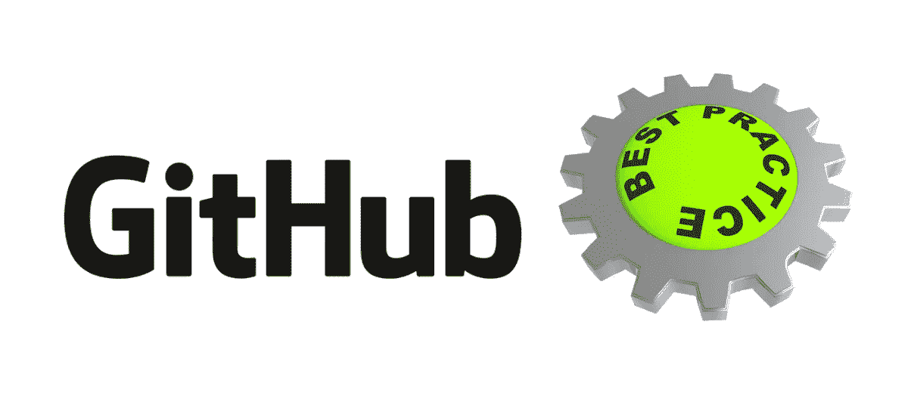

[Photo Credit](https://pixabay.com)

我第一次接触“git”是在几年前我以前工作的地方。理解它需要一些时间，但是一旦我熟悉了这些概念，我就喜欢上了使用 git。我绝不是 git 的高级用户，但是在不同的团队和项目中工作时，我尝试从我的同事和导师那里学习一些技巧。这些技巧和诀窍确实让我的生活变得更轻松，所以我在这里分享它们，希望你会觉得有用。

***1)在“主”的“分支”上处理你正在处理的任何任务，并从那里发送“拉请求”***

当处理一个 bug 修复或者一个特性时，特别是在团队环境中，从`master`(或者被认为是主的分支)仓库中创建一个分支并处理它。一些工程师也更喜欢做他们自己的 fork，并在完成后从 fork 发送一个`Pull Request` 。这两种方法各有利弊，由团队来决定要遵循哪种策略。我个人更喜欢在分支上工作，而不是在分叉上工作，这里是我看到的这种方法的一些优点

1.  团队成员可以知道团队中其他人在做什么(偷偷摸摸，但确保透明:)
2.  如果某个团队成员中途离开了项目，其他人可以接手他们的工作(假设分支中的提交是最新的)
3.  小的创业公司不需要每个人有更多的账户，因为他们只能共享一个账户(坦白地说，我还没有在没有 git 账户的公司或项目中工作过)

选择哪种方法(fork vs branch from master)最适合他们，完全取决于团队和个人。在这两种情况下，总是建议在分支上工作。

对于这篇博客中的例子，让我们假设我们正在开发这个很酷的新[计算器](https://github.com/pranavparikh/calculator)项目。因此，要开始为项目做贡献，您需要访问这个存储库。一旦你有了它，克隆存储库，从主库创建一个新的分支并开始贡献。

```
git clone [git@github.com](mailto:git@github.com):pranavparikh/calculator.git
```

确保当前分支机构是`master`

```
git branch -v
```

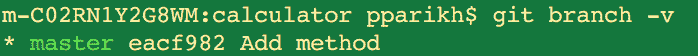

现在，如果你想开始在一个特性上添加减法工具，创建一个名为`subtract`的新分支

```
git checkout -b subtract
```

***2)在您的本地分支上频繁提交，并持续推动它们***

在处理一项任务时，无论是 bug 修复还是特性，都要经常提交。并将这些提交推送到您的分支。在一天结束时，你不希望由于硬盘崩溃而失去你的努力工作。

现在，假设我们添加了一些很酷的东西，并提交到分支。我们的日志看起来像这样

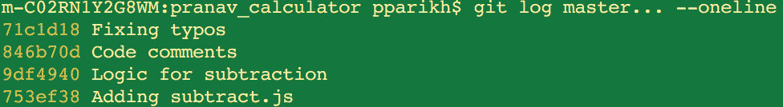

***3)通过将您的提交压缩为一个或几个逻辑提交来删除不相关的提交消息***

现在，我们有四个提交，但感兴趣的是最终结果(或最终代码)而不是不同的提交消息。例如，为什么在 git 历史中，修复输入错误的提交值得特别提及？我们可以把提交压缩成一个单独的提交，这样 Git 和世界都认为这是一个单独的提交。

在这种情况下，我们希望将最后 4 次提交合并成一次提交，所以我们这样做了

```
git rebase -i HEAD~4
```

在执行上面的命令时，git 将打开一个`vi`编辑器，看起来像这样

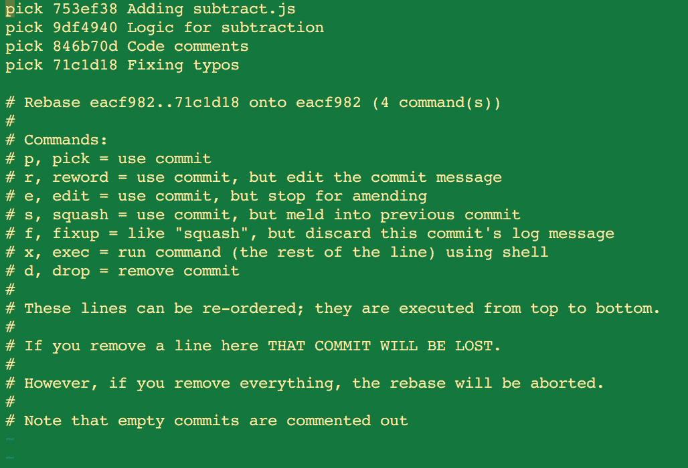

点击`I`进入`Insert`模式。请注意，提交是以升序显示的。选择最早的提交并挤压(用`squash`替换`pick`这个词)剩余的提交。

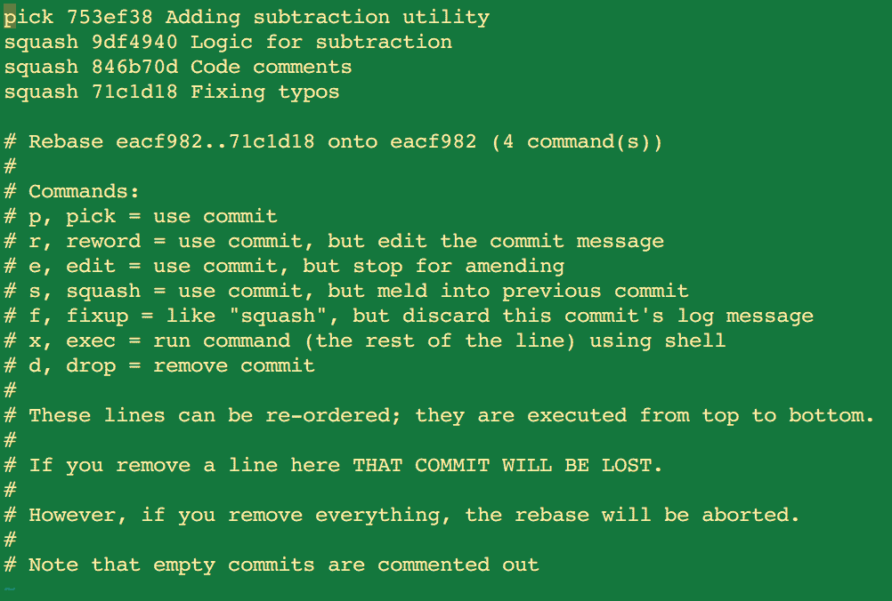

请注意，您还可以更改所选提交的消息。一旦你完成了这些，保存你的修改并退出(:wq)。这将打开另一个`vi`编辑器，您可以在其中对您不希望出现在历史记录中的消息进行注释(通过在行首放置#)。

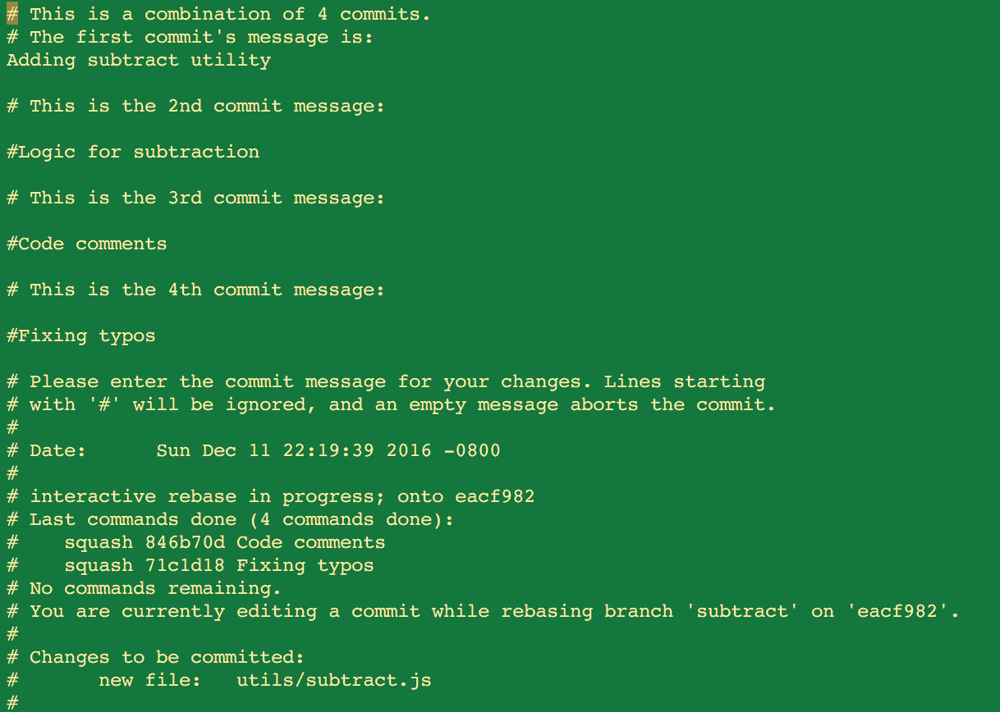

完成后，保存并退出(:wq)。您将看到类似这样的内容

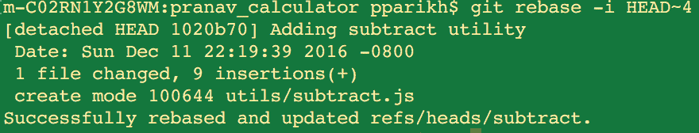

现在，如果您再次看到日志，您应该只看到一次提交。

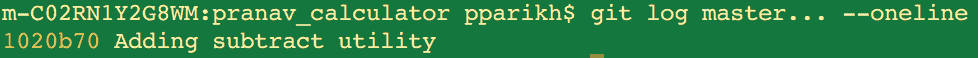

万岁！！！我们成功地粉碎了不想要的提交。

现在，您的特性的第 1 阶段正在运行，并且经过了很好的测试，当您发送 PR 时，Git 将只显示一次提交。

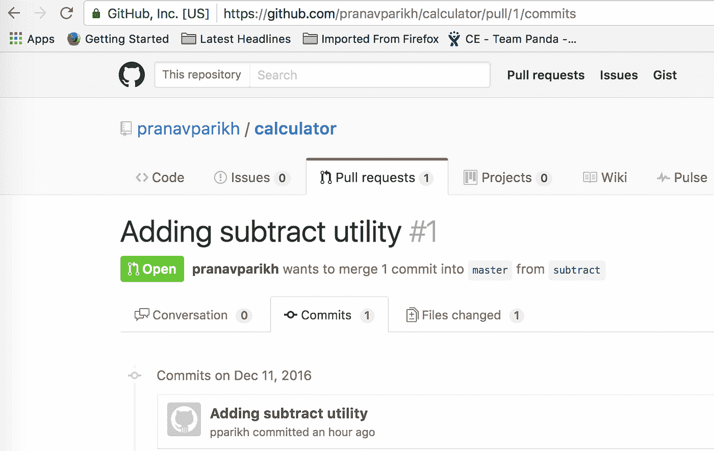

***4)通过使用重置基础选项*** 从主文件中提取变更

您将继续为下一阶段工作。一旦您的代码在`master`中，其他贡献者也可以开始处理相同的代码。让我们假设有人在减法代码中发现了一个 bug，并且他们发送了一个补丁，这个补丁被评审并合并到 master 中。因此，您需要再次引入更改以保持同步。在这种情况下，不要做常规的`git pull`而是总是选择带有`rebase`选项的`git pull`。这将确保您从主服务器获取更改，然后您的本地更改将应用到主服务器上。

```
git pull --rebase origin master
```

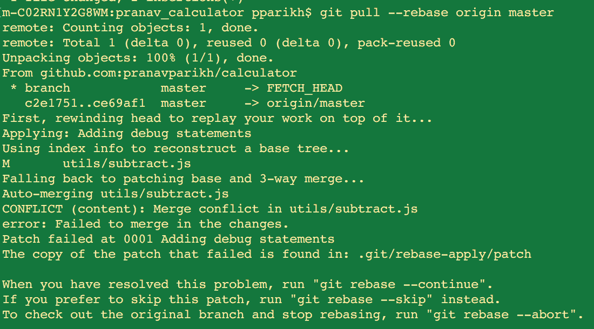

如果其他人修改了您正在处理的相同文件或代码，您将会看到冲突。在这种情况下，您需要在继续重设基础之前手动修复冲突。

在我的编辑器中，我看到了这些冲突

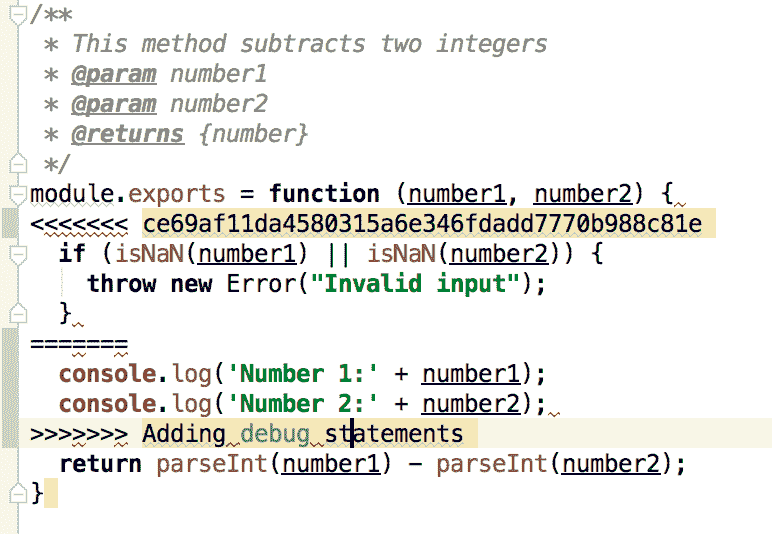

这是一个简单的解决方法，我继续解决了这些冲突

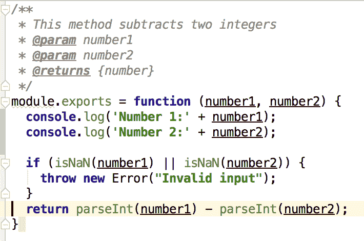

一旦您解决了冲突，并且对您的更改感到满意，您就需要添加已更改的文件。

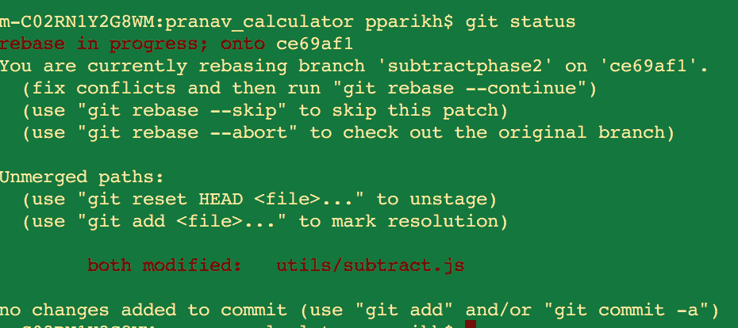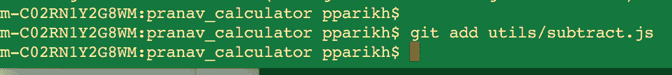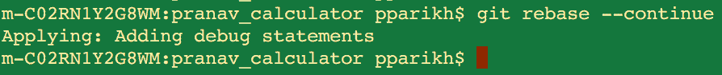

***5)遵循“关注点分离”原则提交***

在开发特性 A 时，不要为特性 B 添加相同的代码，也不要进行不相关的错误修复。您可以通过为每个 bug 修复或提交使用不同的分支来实现这一点。这也有助于保持你的拉取请求的简洁和精确。

***6)收拾***

越少杂乱越好，对吗？一旦一个拉请求被合并到您的`master`中，删除您的分支。你可以从 Github UI 中完成。

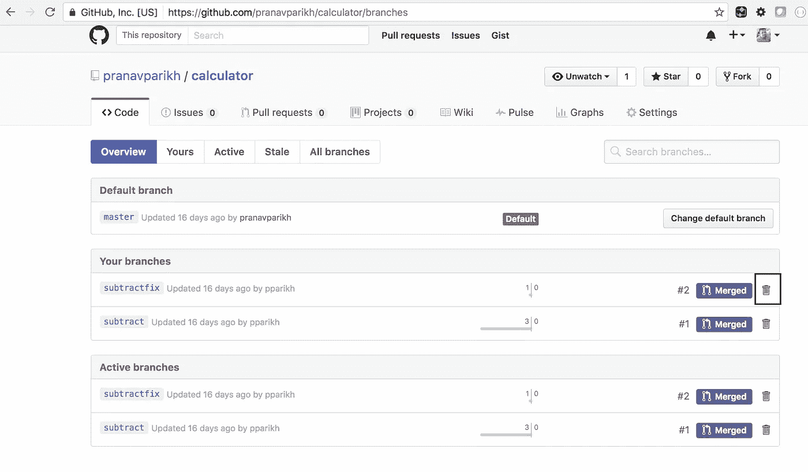

这些是我在使用 Git 时遵循的一些实践，并且在生产率方面产生了丰厚的回报。当我发现一些有用的东西时，我会继续添加到这个列表中。如果你有任何建议，请随意评论这个博客或者联系我。祝你快乐！