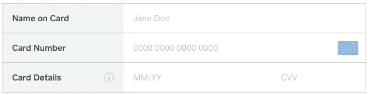

# 没有账单邮政编码？没问题！

> 原文：<https://medium.com/square-corner-blog/no-billing-postal-code-no-problem-4067c3e31840?source=collection_archive---------6----------------------->

## 如何删除邮政编码字段(方形付款表单)

> 注意，我们已经行动了！如果您想继续了解 Square 的最新技术内容，请访问我们的新家[https://developer.squareup.com/blog](https://developer.squareup.com/blog)

随着 Square 的[电子商务平台](https://squareup.com/developers#ecommerce)扩展到美国和加拿大之外，我们已经听到了来自其他国家(如日本&澳大利亚)的开发者的反馈，在这些国家，请求支付邮政编码并不常见，他们希望删除他们的[电子商务支付表单](https://docs.connect.squareup.com/articles/adding-payment-form)中的邮政编码字段。

好消息！从今天起，要删除邮政编码字段，您只需更改一行代码。



当您加载[电子商务支付表单](https://docs.connect.squareup.com/articles/adding-payment-form)时—替换:

```
postalCode: {
        elementId: 'sq-postal-code'
      }
```

包含以下内容:

```
postalCode: false
```

完成后，付款表单将在没有邮政编码字段的情况下加载！

**警告**:邮政编码字段**仍然是**为美国、加拿大和英国的商户处理在线支付所必需的。移除字段将导致这些交易被**拒绝**。显示以下错误信息:

```
{
  "errors": [
    {
      "category": "INVALID_REQUEST_ERROR",
      "code": "INVALID_VALUE",
      "detail": "Postal code is required for nonces used by merchants in `US`"
    }
  ]
}
```

# 附加阅读

如果你有兴趣了解更多关于如何设计支付表单的样式，你可以在这里阅读。