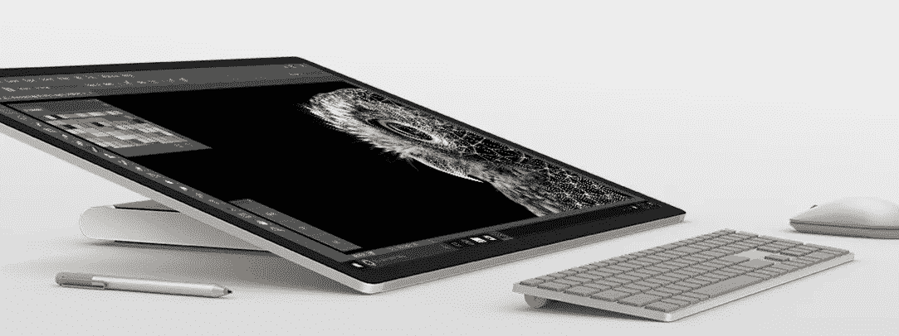

# 无处可逃？微软午餐要吃苹果了

> 原文：<https://medium.com/javascript-scene/no-escape-microsoft-is-about-to-eat-apple-for-lunch-1fbef5048086?source=collection_archive---------2----------------------->

The new Surface Studio

苹果公司宣布了新的 MacBook 系列，就像他们似乎对每个主要产品发布所做的那样，他们已经放弃了一些人们认为理所当然并且无法想象生活中没有的东西。这一次是**退出键**。

他们用 Touch Bar 代替了它。在期待触摸屏多年后，它是如此令人失望，我甚至不会用一张照片来烦你。

**人们正在失去理智。**和许多 MacBook 粉丝一样，我感到非常失望。我已经等了很久了，想要一台带触摸屏的 MacBook Pro。相反，我们得到了触摸栏，对我来说这是一个伟大的大警察了。就像他们在说，“我们还没有想出如何给人们提供他们想要的触摸屏，所以这里有一个小小的触摸屏。”

但触摸显示屏的全部意义在于直接与内容互动，这在很多方面提供了非常出色的用户体验。很难透过一扇小小的窗户做到这一点。

然而，让 MacBook 用户恼火的不是仍然没有真正的触摸屏，而是他们对**退出键**的强烈不满。说到点子上了。

> 苹果，退出键的喧嚣是你最少的问题。

当你正忙着宣布革命性的 touch bar 时，微软投下了这个炸弹:

对于仅售 2999 美元的来说，这是一个巨大的华丽屏幕空间。而且**是触摸屏**。而且它有一个**惊人的互动转盘**，可以直接放在屏幕上。你可以用钢笔在上面画画。

地球上的每一个专业平面设计师都会在这上面砸钱。每个音乐制作人也是。当你阅读这篇文章时，每个建筑公司都在忙着预订。

这些行业大多由苹果公司主导。直到今天。

> 今天，苹果失去了他们用户群的很大一部分。

有了这么多的不动产和这么酷的机器的惊人潜力，每个软件开发者也应该得到一台。想象一下你可以为它开发的应用程序。

除了全戴增强现实眼镜，这是我能想象的最具革命性的机器。这提醒了我。微软也带头发起了这场冲锋:

因此，如果你只是对新 MacBook Pro 上丢失的 escape 键感到困惑，你可以看看市场上最可靠的笔记本电脑系列之一，华硕 ZenBook 系列(它似乎明显受到了 MacBook Pro 的启发，可以提升到比 MacBook 更好的规格):

 [## 华硕 ZenBook Pro UX501VW 15.6 英寸 4K 触摸屏笔记本电脑(酷睿 i7-6700HQ CPU，16 GB DDR4，512 GB…

### 买华硕 ZenBook Pro UX501VW 15.6 寸 4K 触屏笔记本电脑(酷睿 i7-6700HQ CPU，16 GB DDR4，512 GB NVMe SSD，GTX960M…

www.amazon.com](https://www.amazon.com/dp/B01CQRNBJG/ref=psdc_13896615011_t1_B01ERKH0FG) 

…但如果你真的很聪明，你会为 Surface Studio 和 HoloLens 攒钱。

# 给开发者的建议

这些新技术对开发者意味着什么？

嗯，首先，如果你认为所有可能的应用程序都已经编写好了，这些新的沉浸式技术正在为新类型的应用程序打开大门，这些应用程序到目前为止还没有被想象过。

巨大的触摸屏和增强现实可能带来的新的互动水平开辟了各种选择。我迫不及待地想看看你做了什么。

# 这对 JavaScript 意味着什么？

如果你想开始学习如何为 HoloLens 开发应用程序，请查看 [Windows 全息学院](https://developer.microsoft.com/en-us/windows/holographic/academy)。

对 3D 和手势 API 的良好开发人员支持最终会出现在 JavaScript 和 web 平台上。许多聪明人已经在开辟道路，但是 JavaScript 要赶上还需要一段时间。

## JavaScript 将继续存在

**JavaScript 仍然是网络平台的标准语言**，我坚信网络平台不会消失。网络提供了太多不容忽视的价值，坦率地说，这些新技术可能还需要 5-10 年才能掌握在普通消费者手中。

这意味着你今天构建的网络应用至少还有几年的保质期，但是我不认为 JavaScript 会就此结束。

我的预测是，所有可能的应用程序最终都会迁移到网络上。网络会赶上来的。未来的网络可能是全息的、3D 的、增强现实的网络，但它仍然是网络，JavaScript 仍然很重要。

> 未来的网络可能是全息的、3D 的、增强现实的网络…

在不太遥远的将来，我希望我们将获得对 surface dial 和 surface pen 的良好 API 访问(参见 [WebUSB API](https://wicg.github.io/webusb/) )。但是浏览器支持还需要一段时间。耐心点。

目前，您的应用程序仍然需要服务 API 和其他服务器端的东西，为此， [Node](https://nodejs.org/en/) 将非常适合许多用例。

JavaScript 仍然是世界上最流行的编程语言，我认为这种情况不会很快改变。

> “任何可以用 JavaScript 制作的应用都会用 JavaScript 制作。”~阿特伍德定律。

以下是我的补充和预测:

> “任何可以想象的 app，都可以用 JavaScript 做出来。”

# [跟随 Eric Elliott 学习 JavaScript】](https://ericelliottjs.com/product/lifetime-access-pass/)

***埃里克·艾略特*** *著有* [*【编程 JavaScript 应用】*](http://pjabook.com) *(奥赖利)，以及* [*【跟埃里克·艾略特学 JavaScript】*](http://ericelliottjs.com/product/lifetime-access-pass/)*。他为 Adobe Systems******尊巴健身*******华尔街日报*******【ESPN*******BBC****等顶级录音师贡献了软件经验******

**他大部分时间都在旧金山湾区和世界上最美丽的女人在一起。**