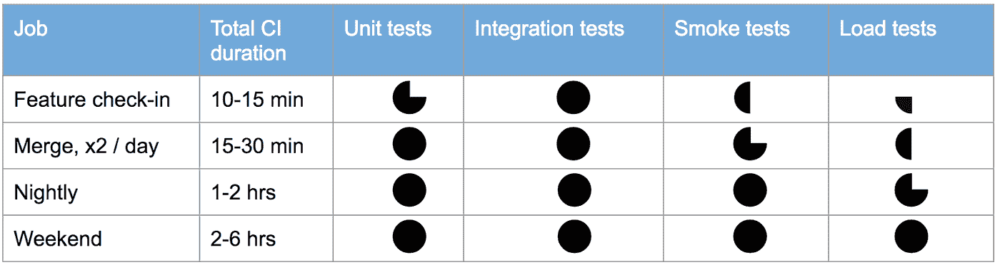

# 没有测试策略，没有开发运维

> 原文：<https://medium.com/capital-one-tech/no-testing-strategy-no-devops-915287e1b4fd?source=collection_archive---------0----------------------->

本文旨在帮助软件和测试工程师开发一个“合适规模”的测试策略，以满足交付的快速步伐，并与 DevOps 文化的核心原则保持一致。

在 DevOps 圈子里，人们倾向于狭隘地关注有助于自动化的工具；但是现在，关于 QA 和测试如何适应 DevOps 产品生命周期，有一个迫在眉睫的危机。团队如何在不阻碍工作流程的情况下，充分了解小的、递增的变更所带来的潜在风险？答案在于持续的改进，特别是对于测试来说，一种为团队的共同目标定制测试策略的实践。

# 测试策略中有什么？

简单地说，测试策略是你如何通过一系列活动完成质量目标的计划。虽然测试策略包括用于执行测试的技术，但是如果测试策略的答案是“我们使用 Selenium 和 Jenkins”，那么在现有的策略定义中包括“为什么”和“为谁”的重要性就有一个致命的盲点。

在 DevOps 中，目标是快速向客户交付价值，支持活动默认是自动化的。但缺少的是“计划”。没有计划，你怎么知道你的自动化测试正在帮助你完成目标呢？

一个真正有用的 DevOps 测试策略需要与“快速”和“价值”保持一致，同时继承所有事情自动化的倾向。考虑测试策略的以下组成部分:

*   **所需输入:**测试需要哪些代码、二进制文件、文档和优先级？
*   **结果:**什么是“成功的”测试结果，什么信息允许您继续交付，而不是停止并修复某些东西？
*   **风险:**测试将如何暴露团队已经优先考虑的风险？
*   **时间表:**什么时候需要来自各种测试活动的反馈来支持流程？
*   **人力资源:**谁创建/监督自动化测试，谁确切地拥有通过/失败的结果，以及测试时间如何被考虑到团队的交付节奏中
*   **技术资源:**自动化测试将使用什么工具，在什么基础设施上进行；这些资源能确保团队拥有正确的信息来做出好的决策吗？
*   **进入标准:**什么触发了测试的开始，团队应该等待什么时候开始测试？
*   **退出标准:**什么触发测试成功结束或“快速失败”？
*   **影响/投资回报:**该测试如何在提高客户/最终用户体验的同时减少优先风险和技术债务？

这些组件帮助您为以客户为中心的工作定制测试计划。结果是这样一个策略:

“为了交付这种有价值的东西并产生[影响]，我们需要[投入/资源/进入标准]来按照[交付时间表]产生[结果]，从而确保[风险]的可见性。”

通过预先回答这些问题，团队很有可能执行的自动化测试活动将有效地帮助实现您的目标并避免测试瓶颈。

# **手动测试不适合 DevOps**

我要说出来，我要说出来。我看不出随着 DevOps 的兴起，传统的手工测试如何能像现在这样生存下去。手工制作的东西每次都要花费相同的成本，而且经常容易出错，缺乏可读性。在 DevOps 中，像手动测试这样的无规模、高风险的操作已经过时了。

然而，我们的目标是为其他*人*构建东西:应用程序、API、工具……它们最终都会以某种方式被真正的用户使用。因此，工程团队执行“验证”，本质上是问“我们构建了正确的东西吗”…这是一个(目前)自动化度量本身无法回答的问题。

另一方面，验证会问这样一个问题“我们构建得对吗？”这些任务可以而且实际上*必须*尽可能自动化，并且在适当的流程、技能和技术下是完全可行的。手动执行这些测试效率非常低，回归测试中自动化的复合效率进一步巩固了手动测试作为规则的例外，而不是运行率运动。

当然，也有暂时的例外，如移动指纹登录、检查屏幕闪烁或视频撕裂、视觉验证…但这些要么很快就会自动化(通常由开源贡献者完成)，要么通过一些变通方法容易划分活动。

人工测试的市场正在萎缩。然而，对熟练测试工程师的需求持续增长，因为对良好用户体验的关注比以往任何时候都更加重要。速度和质量是不可分割的，就像 Eliyahu Goldratt 的《目标》这样的作品告诉我们的那样；只有将持续改进的“Kaizen”心态应用到工作中，团队才能期望将软件交付中的挑战转变为整个团队的胜利。

# 在“DevOps Theater”中测试反模式

为了便于讨论，让我们在渴望“做开发工作”的高速团队中走过一个典型的特性发布生命周期。一些开发人员从他们的看板板上接受一个用户故事，然后开始结对编程。经过数小时的原型制作、设计、编码和本地运行，他们提交了变更。与此同时(也许)，各种自动化测试被编写来允许工作在一个连续的交付管道中被验证和确认。然后他们向内部团队演示(可能)并安排发布。

巧合的是，团队编写单元和集成测试来*验证*他们的特性按照设计工作。来自运行这些测试的代码覆盖度量帮助团队识别潜在的高风险代码区域，当团队加速他们的工作流程时尤其重要。在端到端系统上运行的一些智能选择的功能和性能测试(可能是 UAT、试运行，甚至是生产)有助于阐明工作应该如何在自动化管道中得到*验证*。随着需求和基础设施的变化，这些 E2E 测试还会被监控工具消耗，以提供关于其特性的实时综合反馈。

现在 DevOps 测试策略涅槃已经达到，可视化从代码一直到运行软件的重要度量，具有最佳的自主性和最少的重复工作。听起来很不错，对吧？对我来说不是。Dev 说:“我不想提前考虑，我想保持自主，让我的代码在风中流动，继续我的下一个任务*发布增量版本到日落*。”

# 没有策略的自动化测试会失败

即使做得很好，自动化测试也是一项堆积如山的工作，即使人们真的知道他们在做什么！在 DevOps 中，QA 的角色转变为顾问、程序员、业务分析师和黑客。真正优秀的测试和发布工程师不断提升他们的技能，推动一致性，增加团队学习，并向他们的产品团队提供快速、有用的反馈。

> Capital One 的高级测试专家 Aashish Kapoor 说:“我的团队遵循的原则是——尽早测试、自动测试和经常测试”。“为了成功地遵循这个咒语，我们在工作中识别模式，并以这样一种方式编写自动化回归代码，使得整个团队只需通过编写配置文件就可以设置测试自动化套件。生产套件的总时间显著减少。我们甚至在开始实际的应用程序开发之前就已经遵循了编写测试套件的惯例，以便在开发过程中可以进行测试。”

在这些类型的环境中，自动化是整个团队共同参与构建的必要条件。测试是一项团队工作，对每个人都有好处。

# 测试反模式的真实成本

回到虚构的“涅槃”管道。不幸的是，由于那些自动化的端到端(E2E)测试需要几分钟而不是几秒钟来执行，它们经常被推到一个“硬化”阶段，迫使团队减少测试的数量，因此增加了潜在的风险或延迟交付到产品，直到测试可以发生。雪上加霜的是，已经很慢的 E2E 测试套件经常抛出误报，直到测试被标记为不可靠，或者只是被关闭以通过发布。由于没有时间回去修复它们，现在存在质量差距，让缺陷泄漏给用户。

就性能和可伸缩性而言，迁移到云被宣传为一种不用担心性能的手段。但是，过去生产事件中的一些英雄事迹与 API 性能的意外下降、影响端到端延迟的基础设施边界以及次优数据查询有关。这些东西不像典型的故事点那样简单，通常需要跨架构、开发、数据库、基础设施、网络管理和业务分析的主题专业知识。所以球又被踢了，就像被禁用的片状测试一样，使最后一次发布“准时”晚了几天。

当没有负载或安全测试时，当 UX 度量不能作为基线时，软件团队接受未来的痛苦。当人们说“船到桥头自然直，否则就不是精益”时，他们通常会推迟关键决策，而不仅仅是精益管理之神所要求的承诺。虽然[有数据显示](http://paulsbruce.io/blog/2017/08/performance-is-still-a-feature-not-a-test/)更快的团队预先处理了性能问题，但是被功能需求和产品冲突淹没而没有时间进行“额外的”质量相关的改进会扼杀速度。

结果是团队花更多的时间在重新工作上，在生产中救火，玩有紧急系统行为的碰碰车，而花更少的时间在新的和改进的工作上。

# 开发运维中的 QA:使测试活动与业务优先级保持一致

一刀切的测试永远不会奏效。无论你编写和运行多少单元测试，它们都不能明确地回答“为什么它不能在我的用户的手机上工作？”。在这种情况下，[移动设备超过了我们 web 应用使用量的一半](https://www.smartinsights.com/mobile-marketing/mobile-marketing-analytics/mobile-marketing-statistics/)，分析能力的下降通常与错误的页面组件和缓慢的响应时间有关。

为了弄清楚什么是真正重要的，质量必须以对商业模式有价值的术语来框架。用户和收入流失的根本原因是一个好的开始，但为时已晚。一个良好定制的测试策略在节省返工(即缺陷成本)、质量趋势的可见性以及对系统的集合、潜在和突发属性的共同理解方面提供了积极的 ROI。

不同类型的测试提出不同的问题，逐渐将现实融入结果。单元测试有助于开发团队知道他们什么时候打破了一些基本的东西，但是在真实平台上的功能测试和性能测试是在发布之前知道新特性和修复实际上完成了他们的目标的唯一方法。

目标又是什么？哦，是的，在 DevOps 中就是:“快速向客户交付价值”。只有当团队与业务的优先级一致时，他们才能完成这个目标的任何部分。测试策略必须被定制，以便不仅针对开发团队，也针对业务涉众。

> “在 DevExchange Gateway scrum 团队中，我们尊重 WSJF 优先的 backlog，其中包括来自业务和技术的功能”，Capital One 的高级经理和软件工程 Jeff Michel 说。“我们在计划和执行过程中努力按照优先顺序提供这些功能，同时也努力遵守日期限制。功能实现是在贡献者分叉的回购协议上开发的，并作为拉式请求(PR)提交。我们的代码审查流程要求通过 PR 作者的集成测试，作为将 PR 合并到我们交付的 GitHub repo 的先决条件。作为预生产 CI-CD 管道和蓝绿生产部署流程的一部分，我们对一项功能进行集成和性能测试，利用该功能的 PR 提供的测试。”

# 从测试活动到策略:构建你的流程

你的下一步取决于你的目标是什么，你在这个旅程中的位置，以及已经到位的东西。这就是为什么使用工作流程，可能是您的管道、您的代码升级触发事件、您的业务模型的高风险区域，或者甚至可能是您的客户旅程来映射您的测试策略是重要的。

测试活动的管道视图可能如下所示:

既然我已经满怀希望地让你相信了测试策略的重要性，我必须声明 ***仅有一个“测试策略”本身是不够的*** 。测试实际上只是为开发、操作和产品管理提供有用反馈的活动。测试的真正目标是利用这种有用的反馈来改进每个“工作中心”，在每个阶段内化“质量”，并尽早发现问题，以降低成本和风险。成功推动这一成果的方法是将测试活动嵌入到自动化管道的每个阶段。

有些人更擅长使用表格和列表。从发布管理的角度来看，持续集成中跨触发事件的测试覆盖图可能看起来更像这样:

请记住，剪裁和改善心态在每种情况下都会产生不同的结果。重要的部分是让您的整个团队看到并积极参与到您的测试策略的演进中。在这方面进行合作的几种方式有:

*   在你的故事/看板板附近建立一面墙来可视化你的测试策略，强调测试活动是各种反馈循环的关键部分
*   问贡献者他们哪里需要更好的反馈，更有用还是更经常；与测试中小型企业合作，将“程序思维”应用到这些改进项目中
*   积极参加团队回顾和改进会议；带着见解和建议来参加会议
*   强调测试策略中的差距:低覆盖率和资源限制的区域，您有证据表明它们导致了缺陷逃逸
*   识别围绕工作中心的流程中的瓶颈:功能团队、长周期测试活动、开发和修复上的操作 MTTR

# 结论:一起到达，一起停留

我合作过的最优秀、最有成就感的工程团队有两个共同点:他们透明地做决策，并对高效执行负责。

在做决定的时候，我不能夸大“把人带在身边”的重要性。没有人喜欢被命令如何工作。让每个人朝着同一个方向前进的一个重要部分是让人们尽早参与决策过程。作为计划过程的一部分，包含对质量的考虑的测试策略正是这样做的；它让人们在实际建造任何东西之前，就开始思考我们到底在建造什么，以及我们在为谁建造。

每个团队成员都必须对事先达成的一致负责(例如,“完成”对每个任务意味着什么，哪些功能计划应该包括浅层和深层性能测试，当新代码违反 SLA 时应该做什么，等等)。).如果对团队定义的“完成”的某个方面期望过高，以回顾的方式提供反馈，表明对您工作流程的影响。

工程中的“合适”永远是一个过程。当团队公开讨论测试策略的改进，并使他们的测试活动与业务的优先级一致时，副产品是“合适的”策略，学习成为一种新的文化规范。

# 关于作者

Paul Bruce 是一名 DevOps 顾问，帮助改造企业软件团队和交付实践。他目前在 Neotys 团队担任高级性能工程师，并且是 Growgistics 的创始人。他的研究领域包括云管理、API 设计和体验、大规模持续测试以及组织学习框架。他在世界各地的企业和关键行业中撰写、聆听和教授软件交付模式。您可以通过以下网址了解更多信息: [http://paulsbruce.io](http://paulsbruce.io)

