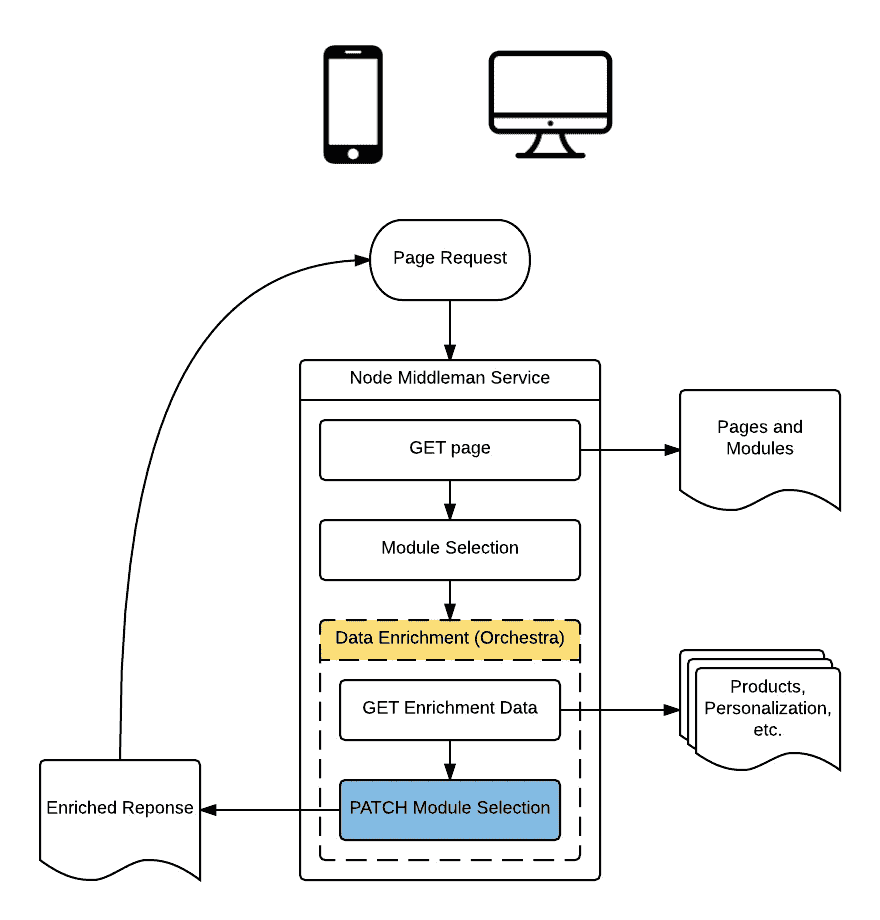
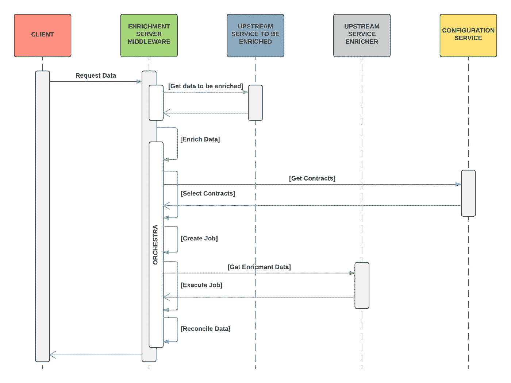
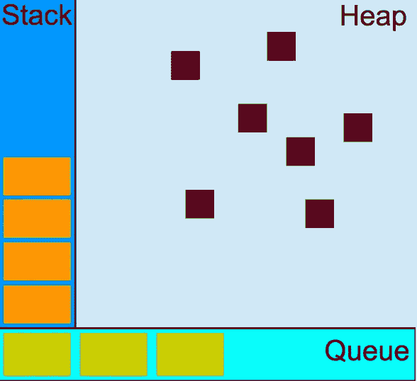

# 节假日节点:25 号或 6 点到 4 点

> 原文：<https://medium.com/walmartglobaltech/node-for-holidays-25-or-6-to-4-d5bddcd15a63?source=collection_archive---------2----------------------->

Photo Credit: [liesel24](https://pixabay.com/en/christmas-balls-deco-christmas-1831975/)

你可能听说过沃尔玛一直在大量使用[节点](https://nodejs.org)，尤其是 UI 层——服务器端渲染、[反应](https://facebook.github.io/react/)、[还原](http://redux.js.org)、[电极](http://www.electrode.io)等。在这种背景下，你可能会继续听到更多关于 Node 和沃尔玛的消息，以及 Node 在假期取得的成功。然而，在这篇文章中，我将在一个不同的背景下写节点和我的个人旅程——我，一个前端工程师，作为上游 Java 服务和节点 UI 层之间的中间人([walmart.com](http://www.walmart.com))跳入服务层和节点。

# 前后，左右，等等…

在过去 10 年左右的职业生涯中，我一直在前端工作。我没有计算机专业学位，HTTP 规范我也不熟，你的实体关系图我也看不懂。所以服务团队的职位是完美的匹配，对吗？

不管对错，我加入了服务团队，因为那里需要帮助。不用说，我很快意识到我对端到端软件工程的了解是多么的少。这是一次极其令人羞愧的经历。我最终设法把自我放在一边，开始敞开心扉去学习。我打算通过一系列博客文章来分享其中的一些经验，从我所学到的关于请求计时度量和节点的知识开始。

# 客厅墙后面

在深入学习计时标准之前，我想先介绍一下我们为本次学习和其他学习建立的背景。对于假期，我们的任务是替换业务逻辑，该业务逻辑编排服务调用并将现有 monolith Java 应用程序中的数据转换为独立的服务，该服务可以由不同的垂直行业(页面)和本地移动应用程序调用。考虑到页面区域(槽、桶、出口等)中的模块调度，该服务需要返回要呈现的页面定义和模块。)和 A/B 测试。除了这些需求之外，该服务还需要扩充数据，如模块数据中包含的产品标识符，以及来自上游服务的形状产品数据。还有其他与上游服务的集成，如个性化。下面是更详细描述基于配置的解决方案的高级概述和序列图。我们已经开源了数据修补库 [json-patchwork](https://www.npmjs.com/package/json-patchwork) ，并将在未来开源编排层。

## 高级概述

System Overview

## 数据丰富详细信息

Orchestrates the selection and execution of contracts that enrich service data with upstream service responses based upon contract declarations.

所有这些都需要扩展到每秒处理 48，000 个请求，但那是另一回事了。剧透:我们放大了。

# 中年的一天

前端具有挑战性，但这些挑战中的大多数都被沙盒化到浏览器环境中，例如渲染性能。后端同样具有挑战性，但挑战分布在不同的层，如缓存、数据库、服务总线等。所有这些都通过一个网络连接在一起，而这个网络有其自身的挑战。在中间层，每个人的挑战(问题)都是你的。如果 UI 应用程序报告您的服务有高延迟，那么不管延迟是在您的服务中、上游还是网络中，它都会自动成为您的问题。这是因为你是他们的下一层。简而言之，排行中间的孩子确实过得不好。

# 这完全是时间问题

那么，当您的服务的消费者向您展示他们的日志或漂亮的图表，并说“您运行得比平时慢”，或者更糟糕的是“您没有满足 SLA”时，您该怎么办呢？你的第一反应可能是内心恐慌，同时说，“谢谢你让我们知道；我们会调查的”。这件事在我身上发生过好几次。

## 不要相信和验证

人们常说，“信任，但要核实”。我发现当设计软件时，这不是很有帮助的建议。这并不是说我认为人们不诚实，这只是因为系统是复杂的，如果你对出现的每个问题都做出反应，你可能会浪费大量时间试图解决一个无关紧要的问题。

在报告延迟的情况下，通常情况下，在我们的日志显示我们确实达到并超过了我们的 SLA 之后，我们的服务不应受到责备。

## 沃尔多在哪？

然而，仅仅因为我们的日志表明我们没有错，并不意味着没有问题。这只是意味着 UI 应用程序和服务日志之间存在差异，我们需要确定为什么存在差异。我们做的第一件事是比较我们测量的是什么。

我们的服务日志测量了我们的服务发送对请求的响应所花费的时间。UI 应用程序日志测量从发出请求到 UI 应用程序收到响应的时间。这让我们找到了缺失的一环——网络(延迟)。找到了。—不完全是。试图解决一个联网问题是 ***难*** 。条件从不相同，网络的行为也从不一致。就在你认为你已经发现问题的时候，事情发生了变化。我将直接切入正题，让你知道在这种情况下，网络不是问题所在。

## 测量两次，切割一次

追着尾巴看完网络，我们又回到了起点。所以我们决定再次更仔细地检查我们测量的东西。首先，我们仔细检查了我们的服务遥测。一旦我们感到满意，我们就决定深入研究 UI 应用程序代码和遥测技术。一切看起来都很正常，除了应答计时测量发生在应答体被解析之后。这增加了一些时间，但不足以解释应用程序报告的延迟。然而，尽管无关紧要，这一发现却成了真正的发现时刻。

## 知道是成功的一半

有人说，作为一名工程师，你至少应该理解比你工作的层次低一个层次的东西。基本原理是，这有助于您在实现特性时做出更好的决策，因为您将知道您的指令在做什么，以及环境的优点和缺点。对我们来说，下面的层次是一些库，如[请求](https://www.npmjs.com/package/request)、[异步](https://www.npmjs.com/package/async)等。、节点和 JavaScript 运行时本身。

***回到手头的讲座……***

我们之前在 UI 应用程序遥测中发现了一个小差异，在响应体解析之后测量请求响应时间，这让我们想到了回调和 JavaScript 并发模型，即事件循环。

JavaScript 本质上有一个队列，其中包含一个由初始函数调用创建的帧堆栈。当初始函数调用返回时，堆栈被清除。

JavaScript Concurrency model and Event Loop — [MDN](https://developer.mozilla.org/en-US/docs/Web/JavaScript/EventLoop)

因此，当队列很大时，这意味着任何被推送到队列中的请求-应答回调可能需要等待一段时间，等待队列中的其他消息运行完成，然后才能执行。

这正是 UI 应用程序在高流量期间开始报告服务延迟时所发生的情况。所以我们不需要修复，但是我们通过识别延迟的根源，即 UI 应用程序中的事件循环延迟，间接地帮助提高了 UI 应用程序的性能。这反过来帮助 UI 应用程序团队识别和修复瓶颈。这些修复从渲染优化到添加更多的应用服务器。

# 外卖食品

我曾经认为在前端工作是困难的，因为每个问题通常都是首先针对 UI 提出的，所以人们通常认为 UI 总是应该受到责备，不管实际问题发生在堆栈的哪个位置。我现在认为中间部分更具挑战性，因为它不仅是后端的前端(它受到 UI 的所有指责)，而且在调试时，你还必须从两个方向看，而不是一个方向。您必须了解调用您的前端和后端接口，以及网络。你还需要与双方和所有相关团队建立稳固的关系，以培养合作意识，而不是在出现问题时相互指责。

就技术要点而言，了解运行时环境，即具有事件循环并发模型的单线程，是调试问题的关键。此外，除了应用程序和服务遥测之外，还要确保您正在收集事件循环延迟等指标。最后，永远不要相信数据，永远要验证它。

好了，现在就这样。希望你觉得这很有趣，也很有用。下一次，我将分享 keep-alive 是如何不止一次差点害死我们的。