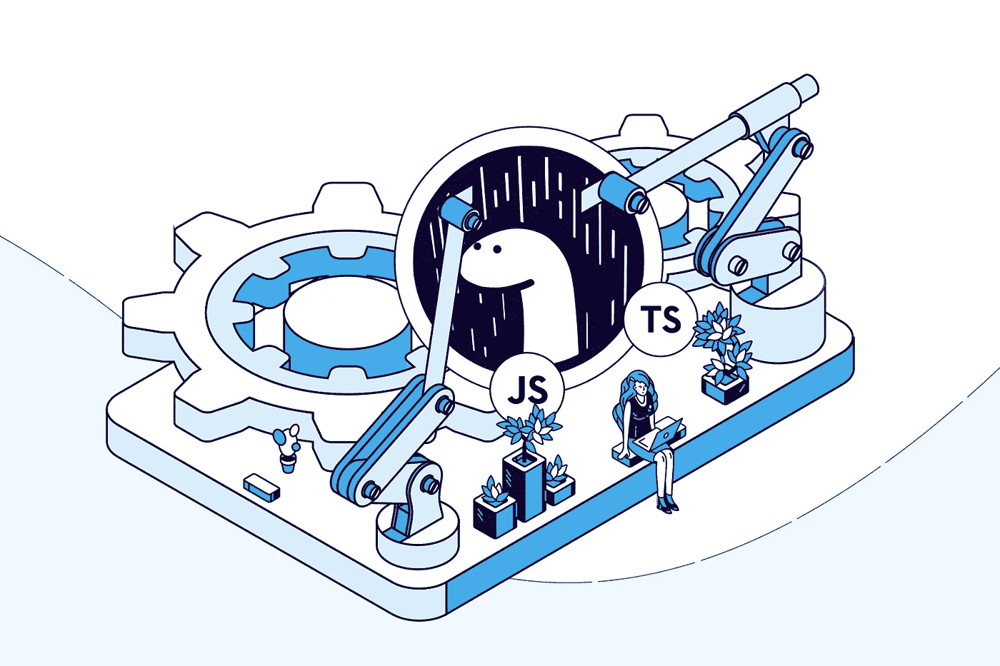

# 节点是历史！或者是？

> 原文：<https://medium.com/globant/node-is-history-or-is-it-4d2616f01d83?source=collection_archive---------1----------------------->



Node.js 的原创者 Ryan Dahl 在他的谈话《Node.js 我后悔的 10 件事》中宣布了 2018 年的 Deno。他在 Node.js 中发现了一些程序员通常不会想到的缺陷，比如整个包管理是如何事后想起的。此外，Ryan 对于将 npm 与包管理联系在一起也不太满意——或者他可能很早就跳到了 async/await，而忽略了承诺的一些潜在优势。Deno 1.0 正式版于 2020 年 5 月 13 日发布

# **什么是 Deno？**

> Deno 基于 V8 JavaScript 引擎和 Rust 编程语言。Deno 像 Node.js 执行 JavaScript 一样在你的系统上执行 JavaScript 和 TypeScript。默认情况下，它是安全的，并提供了很好的开发人员体验。首先，Deno 不仅仅是 Node.js 和 TypeScript 的组合，它是一个从头开始设计的全新系统。但是，如果可以轻松地将 TypeScript 编译器集成到 Node.js 中进行静态类型检查，那么为什么还要使用 Deno 呢？

Deno 与 Node.js 的主要区别在于以下几个方面:

1.  Deno 不使用`npm` 和`package.json`，它使用模块作为 URL 或文件路径引用。
2.  Deno 中的所有异步操作都返回一个承诺。因此，它提供了与 Node.js 不同的 API。
3.  Deno 需要明确的网络、文件和环境访问权限。
4.  使用“es 模块”，不支持`require()`。第三方模块通过 URL 导入:
    `import * as log from "https://deno.land/std@0.79.0/log/mod.ts";`


# 装置

在您的系统上安装 Deno 的一行命令。您只需要运行以下命令来安装。
带壳:

```
curl -fsSL [https://deno.land/x/install/install.sh](https://deno.land/x/install/install.sh) | sh
```

这个简单的 shell 脚本将 deno 二进制文件下载到您主目录中的. Deno 目录。它包括 TypeScript 编译器、V8 JavaScript 引擎、Rust binding crates 等。之后，使用以下命令将“deno”二进制文件添加到 PATH 变量中:

```
echo ‘export DENO_INSTALL=”/home/user/.deno”’ >> ~/.zshrc
echo ‘export PATH=”$DENO_INSTALL/bin:$PATH”’ >> ~/.zshrc
```

要测试您的安装，运行`deno --version`。如果这给出了 Deno 版本，则安装成功。


# **走吧**

显示了使用标准库提供的 HTTP 服务器的基本服务器。

```
import { serve } from “https://deno.land/std@0.57.0/http/server.ts";
const server = serve({ port: 8080}); console.log(“http://localhost:8080/"); 
for await (const request of server) { 
    request.respond({ body: “Welcome to Deno\n” });
}
```

> 与 HTML 的脚本标签相似，Deno 可以从任何地方获取和执行脚本。您也可以在代码中这样做。Node.js 中没有类似 npm 模块的“模块”概念。Deno 只需要一个指向有效 TypeScript 文件的 URL，它将运行/导入该文件。您还会看到如上所示的导入语句。

记下我们讨论的 URL 导入。接下来，创建一个名为 server.ts 的文件，输入以下代码，并尝试运行它:

```
deno run server.ts
```

运行后，我们将得到一个权限问题错误，我们应该可以通过执行“sudo”来解决这个问题，对吗？不完全是。就像它说的，你必须用一个'- -allow-net '标志来运行它，以便手动允许它访问网络。让我们再试一次:

```
deno run --allow-net server.ts
```

Deno 在默认情况下是安全的。这是 Node.js 中完全缺失的另一个方面。您必须显式地授予这些资源权限，这增加了一层安全性和同意。

让我们看一个与数据库交互的例子。用 Deno 连接 MongoDB 实例是开发人员经常做的另一件事。

对于一个 MongoDB 实例，让我们用下面的代码构建一个基本的 MongoDB 容器:

```
docker run --name test-mongo -p 27017:27017 -d mongo
```

现在，让我们创建文件 database.ts，下面的代码将创建一个包含集合“employees”的文档。

```
import { MongoClient } from "https://deno.land/x/mongo@v0.8.0/mod.ts"; const client = new MongoClient();
client.connectWithUri("mongodb://localhost:27017"); const db = client.database("sample");
const users = db.collection("employees");// insert
const insertId = await users.insertOne({  
      name: "Rishikesh",  
      email: "rishikesh@gmail.com",  
      mobile: 9999999999
});
console.log(`Successfully inserted with the 
id: ${JSON.stringify(insertId)}`)
```

现在，如您所见，这看起来非常类似于 Node.js 代码。事实上，大多数编程风格保持不变，您可以遵循类似的模式。接下来，让我们运行这个命令，将文档插入到 MongoDB 容器中:

```
deno run -A database.ts
```

发生的情况是，您会得到如下所示的错误:

```
load deno plugin “deno_mongo” from local “/home/user/.deno_plugins/deno_mongo_2970fbc7cebff869aa12ecd5b8a1e7e4.so”
error: Uncaught TypeError: Deno.openPlugin is not a function 
return Deno.openPlugin(localPath);
^at prepare(https://deno.land/x/plugin_prepare@v0.6.0/mod.ts:64:15)
at async init (https://deno.land/x/mongo@v0.8.0/ts/util.ts:41:3)
at async [https://deno.land/x/mongo@v0.8.0/mod.ts:13:1](https://deno.land/x/mongo@v0.8.0/mod.ts:13:1)
```

这是因为我们甚至给了“-A”标志，允许访问所有类型的资源。

让我们用'--不稳定'标志重新运行它:

```
deno run -A --unstable database.ts
```

现在，这似乎运行了，输出应该类似于:

```
load deno plugin “deno_mongo” from local “/home/user/.deno_plugins/deno_mongo_2970fbc7cebff869aa12ecd5b8a1e7e4.so
”Successfully inserted with the id:{“$oid”:”5ef0ba4a000d214a00c4367f”}
```

这是因为 MongoDB 驱动程序使用了一些额外的功能(准确地说是“哎呀”)。它们不存在于 Deno 的运行时中，所以它添加了一个插件。虽然 Deno 有一个插件系统，但接口本身并没有最终确定，而是隐藏在*'--不稳定的'*标志后面。默认情况下，Deno 不允许脚本使用不稳定的 API，但同样，有这个标志来强制它。

# Node.js 有那么差吗？


为什么我们需要不同的视角？Node.js 的问题大到我们需要一个新的系统来取代它吗？嗯，不。许多人甚至不会认为它们是问题，但 Deno 背后有一个中心思想，使其存在合理，设计选择可以理解。节点明显偏离了浏览器的做事方式。

例如，当一个网站想要录制音频时的权限；浏览器会要求用户同意。Node 中没有这种权限，但是 Deno 将它们带了回来。

关于依赖性，浏览器只理解可以从网络上任何地方链接的脚本，而不是节点模块。Node.js 不一样。您必须制作并发布一个模块，以便它可以被导入并在全球范围内重用。以获取 API 为例。Node.js 中有一个不同的 node-fetch 模块来使用 fetch，Deno 回到简单的脚本，尽力做类似于浏览器的事情。

这是实施细节和总体主题。从长远来看，这可能会更好。

# 澄清🦕

**如果它原生运行 TypeScript，那么速度呢？因为 V8，节点很快。**

重要的问题是 Deno 实际上“运行”TypeScript。

嗯，是的，但实际上不是。

Deno 执行 TypeScript，但是它也使用 V8 来运行代码。所有的类型检查都是预先完成的，在运行时，只有 JavaScript。一切都是从开发者这边抽象出来的，不用安装配置 ***tsc*** 。

所以是的，它很快，因为它也运行在 V8 上，并且没有运行时类型。

**URL 导入看起来丑陋而脆弱。当其中一个依赖关系的网站关闭时会发生什么？**

第一件事是 Deno 下载并缓存每个依赖项，他们建议在您的项目中检查这些，以便它们总是可用的。

如果您不想在代码中看到 URL 导入，您可以做两件事:

1.在本地重新导出依赖项:要在本地导出标准 HTTP 服务器，您可以使用下面的代码行*“export { serve } from "*[*https://deno.land/std@0.57.0/http/server.ts*](https://deno.land/std@0.57.0/http/server.ts)*" '*创建一个名为“local_http.ts”的文件，然后在原始代码中从此文件导入。

2.使用导入映射:创建一个 JSON 文件，将 URL 映射到您希望在代码中使用的名称。因此，创建一个名为“importmap.json”的文件，并向其中添加以下内容:

```
{ 
  “imports”: { 
      “http/”: “https://deno.land/std/http/" 
   }
}
```

现在，当您运行该脚本时，您只需要提供它作为要使用的 importmap:

```
deno run -A --importmap=importmap.json script.ts
```

您可以从 HTTP 名称导入 serve 函数，如下所示:

```
import { serve } from “http/server.ts”;
```

‍ **依靠 URL 进行版本控制安全吗？如果开发人员在同一个 URL 上推送最新版本，而不是新版本，会发生什么？**

嗯，那就是开发者的错了，npm 模块系统也会出现这种情况。但是如果您不确定是否已经缓存了最新的依赖项，那么可以选择重新加载它们。


# 关闭思想！

至少可以说，Deno 是一个有趣的项目。我们只有第一个稳定版，还有很长的路要走。例如，他们正积极致力于提高 TypeScript 编译器的性能。此外，在*'--不稳定'*标志背后隐藏着大量的 API。这些可能会在即将发布的版本中发生变化。像 TypeScript first 和浏览器兼容模块这样的想法当然很有吸引力，这使得 Deno 值得关注。