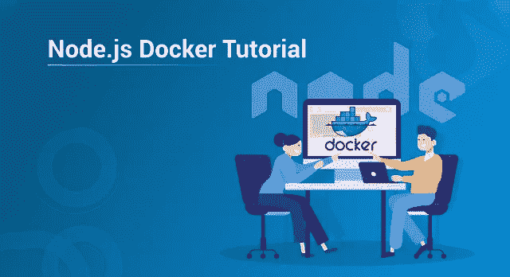
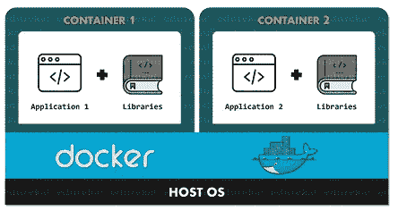
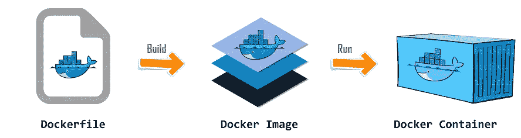
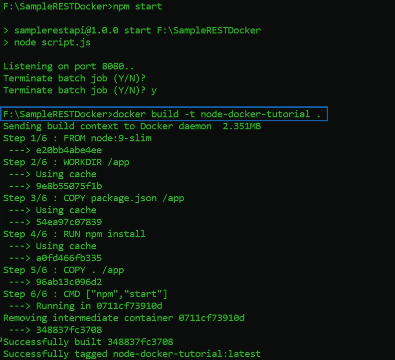

# 了解如何对 Node.js 应用程序进行停靠

> 原文：<https://medium.com/edureka/node-js-docker-tutorial-72e7542d69d8?source=collection_archive---------1----------------------->



Node.js Docker Tutorial — Edureka

每个 Node.js 开发人员总是尽最大努力让他的应用程序摆脱任何类型的环境依赖。但是，尽管他们采取了措施，但意外总是会发生，导致应用程序失败。好吧，这就是码头工人来救援的地方。在本文中，我将向您介绍如何从头开始对 Node.js 应用程序进行 Dockerize。

以下是我将在 Node.js Docker 文章中涉及的主题:

*   Docker 是什么？
*   Docker 基础:docker 文件、图像和容器
*   为什么要将 Node.js 与 Docker 一起使用？
*   演示

让我们从这篇文章开始。

# Docker 是什么？

Docker 是一个容器化平台，用于将应用程序及其依赖项一起打包到 Docker 容器中。这确保了无论环境如何变化，我们的应用程序都能轻松流畅地运行。

因此，您可以将 Docker 视为一种工具，它旨在使使用容器的应用程序的创建、部署和执行变得更加容易和高效。

说到 Docker 容器，它只不过是一个标准化的单元，用于部署特定的应用程序或环境，并且可以动态构建。可以有 Ubuntu，CentOS 等任何容器。基于您对操作系统的要求。此外，这些容器不仅限于操作系统，您还可以拥有面向应用的操作系统。这种容器的几个例子是 CakePHP 容器、Tomcat-Ubuntu 容器等。

为了更好地理解这一点，请参考下图:



在这个图中，你可以看到每一个应用程序都运行在一个独立的容器上，有自己的依赖项和库。这确保了每个应用程序都独立于其他应用程序，使开发人员能够独立构建应用程序，而不受其他应用程序的任何干扰。因此，作为开发人员，您可以简单地构建一个安装了不同应用程序的容器，并将其交给 QA 团队。然后 QA 团队只需要执行容器来复制开发人员的环境。

现在，让我来解释一下 Docker 的本质，这将有助于您更好地理解 Docker 化 Node.js 应用程序的过程。

# Docker 基础:docker 文件、图像和容器

在使用 Docker 之前，你必须知道的三个最重要的方面是:

1.  Dockerfile 文件
2.  Docker 图像
3.  码头集装箱



在上图中，你可以看到当一个 Docker 文件被构建时，它给你一个 Docker 映像。此外，当您执行 Docker 映像时，它最终会给您一个 Docker 容器。

现在让我们来详细了解其中的每一项。

## Dockerfile 文件

Dockerfile 基本上是一个包含命令列表的文本文档，用户可以使用命令行调用该列表来组合图像。因此，通过从这个 Docker 文件中读取指令，Docker 自动构建图像。

要连续执行多个命令行指令，您可以使用以下命令创建自动构建:

```
docker build
```

## Docker 图像

Docker 映像可以被视为类似于通常用于构建 Docker 容器的模板。换句话说，这些只读模板不过是 Docker 容器的构建块。为了执行映像并构建容器，您需要使用以下命令:

```
docker run
```

使用此命令创建的 Docker 映像存储在 Docker 注册表中。它可以是用户的本地存储库，也可以是 Docker Hub 这样的公共存储库，它允许多个用户协作构建应用程序。

## 码头集装箱

Docker 容器是 Docker 映像的运行实例。这些容器包含执行应用程序所需的完整包。因此，这些基本上是随时可用的应用程序，这些应用程序是从 Docker 映像创建的，这是 Docker 的最终用途。

# 为什么要用 Docker 搭配 Node.js？

下面我列出了一些在 Node.js 应用程序中使用 Docker 的最有趣的理由:

*   Docker 有助于加快应用程序部署过程
*   它使得跨其他机器的应用程序移植更加容易
*   它使版本控制更容易，并促进组件重用
*   使用 Docker，人们可以很容易地共享 Docker 图像和 Docker 文件
*   Docker 占用的内存非常少，因此应用程序的开销很小
*   它的使用和维护简单易行

我希望这能给你足够的理由马上开始使用 Docker。

# 演示

在 Node.js 中使用 Docker 之前，您需要确保 Docker 已经安装在您的系统中，并且您有使用它的权限。

既然安装过程已经完成，现在让我们集中精力对 Node.js 应用程序进行 Dockerizing。我假设您的系统中已经安装了 Node.js。

为了对接 Node.js 应用程序，您需要完成以下步骤:

1.  创建 Node.js 应用程序
2.  创建 Docker 文件
3.  构建 Docker 映像
4.  执行

## **创建 Node.js 应用程序**

为了对 Node.js 应用程序进行 Dockerize，首先需要的是 Node.js 应用程序。可以参考我的文章[用 Node.js 构建 REST API。](/edureka/rest-api-with-node-js-b245e345f7a5)

一旦完成了应用程序的开发，您需要确保应用程序在分配的端口上正确执行。在我的例子中，我使用端口 8080。如果应用程序按预期运行，您可以继续下一步。

## **创建一个 Dockerfile**

在这一步中，我们将创建 Dockerfile，这将使我们能够根据我们的需求重新创建和扩展 Node.js 应用程序。要完成这一步，您需要在项目的根目录下创建一个新文件，并将其命名为 ***Dockerfile。***

在这里，我使用了一个轻量级的基于 alpine 的图像来构建我们的 Docker 图像。在创建 Docker 文件时，我们的主要目标应该是保持 Docker 图像尽可能小，同时利用成功运行我们的应用程序所需的一切。

下面我写下了需要添加到您的 docker 文件中的代码:

## **Dockerfile**

```
FROM node:9-slim

# WORKDIR specifies the application directory
WORKDIR /app

# Copying package.json file to the app directory
COPY package.json /app

# Installing npm for DOCKER
RUN npm install

# Copying rest of the application to app directory
COPY . /app

# Starting the application using npm start
CMD ["npm","start"]
```

正如您在上面的代码中看到的，我使用了两个不同的复制命令来减少应用程序的重建时间。由于 Docker 可以隐式缓存每个单独命令的结果，所以每次尝试创建 Docker 映像时，不需要从头开始执行所有命令。

既然已经成功定义了 Docker 文件，下一步就是构建 Docker 映像。在本文的下一部分，我将演示如何轻松地构建 Docker 形象。

## **打造码头工人形象**

构建 Docker 映像相当容易，可以使用一个简单的命令来完成。下面我写下了您需要在终端中键入并执行的命令:

```
docker build -t <docker-image-name> <file path>
```

一旦您执行这个命令，您将在您的终端中看到一个 6 步输出。我已经附上了我的输出截图。



如果您得到的输出类似于上面的截图，那么这意味着您的应用程序工作正常，docker 映像已经成功创建。在这篇 Node.js Docker 文章的下一节中，我将向您展示如何执行这个 Docker 映像。

## **执行 Docker 图像**

既然您已经成功地创建了 Docker 映像，现在您可以使用下面给出的命令在这个映像上运行一个或多个 Docker 容器:

```
docker run it -d -p <HOST PORT>:<DOCKER PORT> <docker-image-name>
```

这个命令将根据 docker 映像启动 Docker 容器，并在机器的指定端口上公开它。在上面的命令 ***-d 标志*** 表示你想以分离模式执行你的 Docker 容器。换句话说，这将使您的 Docker 容器能够在主机的后台运行。而 ***-p 标志*** 指定哪个主机端口将连接到对接端口。

要检查您的应用程序是否已经成功停靠，您可以尝试在您在上面的命令中为主机指定的端口上启动它。

如果您想查看系统中当前运行的映像列表，可以使用下面的命令:

```
docker ps
```

你可以使用更多的 [Docker 命令](/edureka/docker-commands-29f7551498a8)。

这就把我们带到了这篇 Node.js Docker 文章的结尾。如果你想查看更多关于人工智能、Python、道德黑客等市场最热门技术的文章，你可以参考 Edureka 的官方网站。

请留意本系列中的其他文章，它们将解释 Node.js 的各个方面

> 1. [NodeJS 教程](/edureka/node-js-tutorial-800e03bc596b)
> 
> 2.[使用 Node.js 和 MySQL 构建一个 CRUD 应用程序](/edureka/node-js-mysql-tutorial-cef7452f2762)
> 
> 3.[使用节点构建 CRUD 应用程序。JS 和 MongoDB](/edureka/node-js-mongodb-tutorial-fa80b60fb20c)
> 
> 4.[提出 Node.js 请求的 3 种最佳方式](/edureka/node-js-requests-6b94862307a2)
> 
> 5.[从头开始构建 Node.js】](/edureka/rest-api-with-node-js-b245e345f7a5)
> 
> 6.[用 Node.js 构建 REST API](/edureka/rest-api-with-node-js-b245e345f7a5)
> 
> 7.[提出 Node.js 请求的 3 种最佳方式](/edureka/node-js-requests-6b94862307a2)
> 
> 8. [Express.js 基础](/edureka/learn-node-js-b3a9c6fb632c)

*原载于 2019 年 7 月 8 日 https://www.edureka.co**T21*[。](https://www.edureka.co/blog/node-js-docker-tutorial/)