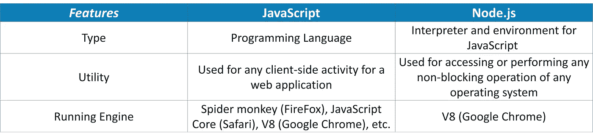
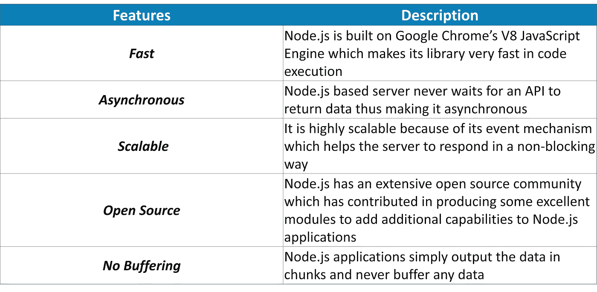
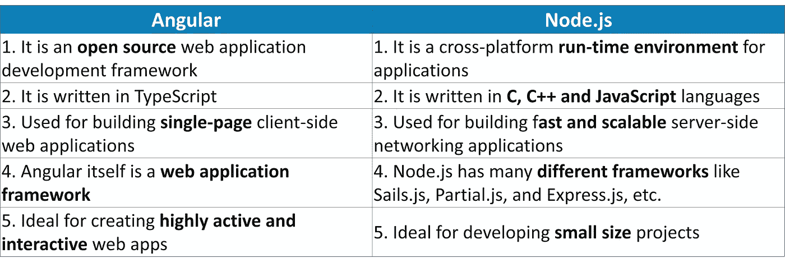
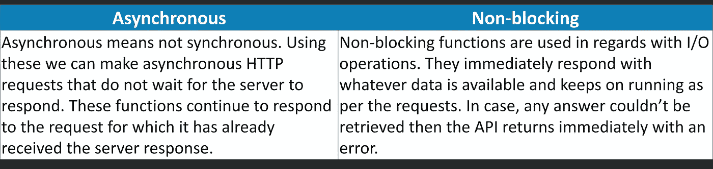
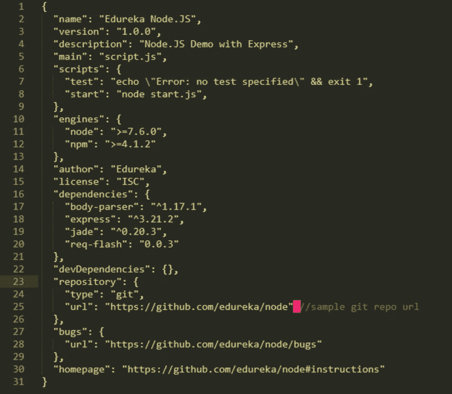
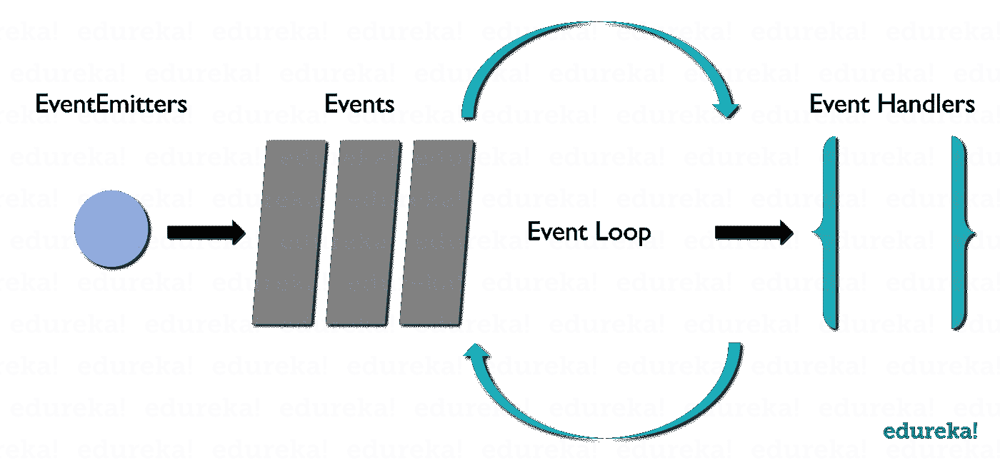
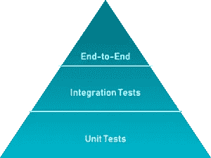
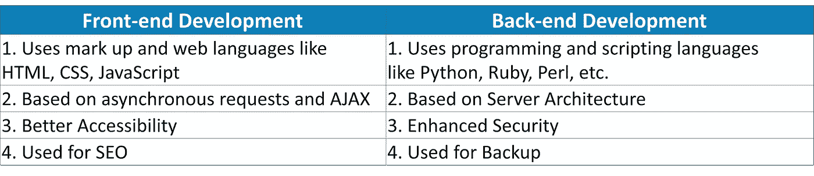

# Top Node.js 你必须准备的面试问题

> 原文：<https://medium.com/edureka/node-js-interview-questions-cbfb78f2714f?source=collection_archive---------4----------------------->


Node.js Interview Questions — Edureka

服务器端脚本工具 Node.js 使用 JavaScript——一种受全球数百万开发人员欢迎的语言——确保它的学习曲线低得多，即使对于完全的初学者也是如此。使用 Node.js，可以轻松构建任何东西，从简单的命令行程序到复杂的企业级 web 应用程序。这就是为什么大多数行业需要一个经过认证的 Node.js 开发人员来管理整个服务器端。Node.js 也带来了不同层次的就业机会。如果你打算在不久的将来参加 Node.js 面试，我们在这里帮助你列出 2019 年你必须准备的 50 个 Node.js 面试问题。

在这篇 Node.js 面试问题文章中，我根据问题的难度将问题分为 3 个部分:

*   Node.js 面试问题—初学者水平
*   Node.js 面试问题—中等水平
*   Node.js 面试问题—高级水平

在我开始这篇 Node.js 面试问题的文章之前，让我向最近可能参加过 Node.js 面试的读者提出一个请求。所以，如果你遇到了在采访中被问到但在这篇文章中没有的问题，请在下面的评论区提出这些问题。我们将努力尽早回答这些问题，以便其他人也能从中受益。

现在，让我们开始吧。

# Node.js 面试问题—初学者水平

## 1.区分 JavaScript 和 Node.js。



Node.js 是在 Chrome 的 V8 JavaScript 引擎上开发的强大框架，它将 JavaScript 直接编译成本机代码。它是一个轻量级框架，用于创建服务器端 web 应用程序，并扩展 JavaScript API 以提供常见的服务器端功能。它通常用于大型应用程序开发，尤其是视频流网站、单页面应用程序和其他 web 应用程序。

## 2.Node.js 是什么？

Node.js 是在 **Chrome 的 V8 JavaScript 引擎**上开发的强大框架，它将 JavaScript 直接编译成本机代码。它是一个轻量级框架，用于创建服务器端 web 应用程序，并扩展 JavaScript API 以提供常见的服务器端功能。它通常用于大型应用程序开发，尤其是视频流网站、单页面应用程序和其他 web 应用程序。

## 3.列出使用 Node.js 的主要好处？



## 4.Angular 和 Node.js 有什么区别？



## 5.为什么 Node.js 是单线程的？

Node.js 使用单线程模型来支持异步处理。使用异步处理，应用程序可以在 web 负载下执行得更好，可伸缩性更强。因此，Node.js 使用单线程模型方法，而不是典型的基于线程的实现。

## 6.Node.js 是如何工作的？

Node.js 是一个虚拟机，它使用 JavaScript 作为脚本语言，运行在 v8 环境中。它在单线程事件循环和非阻塞 I/O 上工作，提供高速率，因为它可以处理更多的并发请求。此外，通过使用“HTTP”模块，Node.js 可以在任何独立的 web 服务器上运行。

## 7.Node.js 可以用在哪里？

Node.js 可用于开发:

*   实时网络应用
*   网络应用
*   分布式系统
*   通用应用

## 8.Node.js 中有多少种类型的 API 函数？

Node.js 中有两种类型的 API 函数:

*   异步、非阻塞函数
*   同步、阻塞功能

## 9.异步和非阻塞的区别是什么？



## 10.package.json 是什么？

Node.js 中的 **package.json 文件**是整个应用程序的核心。它基本上是包含项目元数据的清单文件，我们在其中定义包的属性。



## 11.你所理解的事件驱动编程是什么？

事件驱动编程是一种大量利用事件来触发各种功能的编程方法。事件可以是鼠标点击、按键等等。当事件发生时，会执行一个已经注册到元素的回调函数。这种方法主要遵循发布-订阅模式。由于事件驱动编程，Node.js 比其他技术更快。

## 12.Node.js 中的事件循环是什么，它是如何工作的？

Node.js 中的事件循环处理应用程序中的所有异步回调。这是 Node.js 最重要的方面之一，也是 Node.js 拥有非阻塞 I/O 的原因。由于 Node.js 是一种事件驱动的语言，您可以轻松地将侦听器附加到事件，然后当事件发生时，回调将由特定的侦听器执行。每当调用 setTimeout、http.get 和 fs.readFile 等函数时，Node.js 都会执行事件循环，然后继续执行下一个代码，而不等待输出。整个操作完成后，Node.js 接收输出，然后执行回调函数。这就是为什么所有的回调函数都放在一个循环的队列中。一旦收到响应，它们就会被逐一执行。



## 13.在 Node.js 的上下文中解释 REPL

Node.js 中的 REPL 代表 **R** ead、 **E** val、 **P** rint、 **L** oop。它代表一个计算机环境，如窗口控制台或 Unix/Linux shell，在这里可以输入任何命令，然后系统可以输出响应。默认情况下，Node.js 与 REPL 环境捆绑在一起。REPL 可以执行下列任务:

*   **Read:** 读取用户的输入，将其解析成 JavaScript 数据结构，然后存储在内存中。
*   **Eval:** 接收并评估数据结构。
*   **打印:**打印最终结果。
*   **循环:**循环提供的命令，直到 *CTRL+C* 被按下两次。

## 14.列出应该使用事件循环异步完成的任务？

下面是必须使用事件循环异步完成的任务列表:

*   输入输出操作
*   繁重的计算
*   任何需要封锁的东西

## 15.列出 Node.js 中使用哪个“控制流”控制函数调用的步骤？

1.  控制执行顺序
2.  收集数据
3.  限制并发
4.  调用程序中的下一步

# Node.js 面试问题—中等水平

## 16.你对测试金字塔的理解是什么？

测试金字塔基本上是一个图表，它描述了为了项目的成功开发需要编写多少单元测试、集成测试和端到端测试的比率。



## 17.Node.js 中的错误优先回调是什么？

Node.js 中的错误优先回调用于传递错误和数据。您需要传递给这些函数的第一个参数必须是一个错误对象，而其他参数代表相关数据。因此，您可以传递错误对象来检查是否有任何错误并处理它。如果没有问题，你可以继续进行随后的争论。

```
var myPost = new Post({title: 'edureka'});
myPost.save(function(err,myInstance){
if(err){
//handle error and return
}
//go ahead with `myInstance`
});
```

## 18.解释 module.exports 的用途？

Node.js 中的一个模块用于将所有相关的代码封装到一个单独的代码单元中，通过将所有相关的函数转移到一个单独的文件中，可以对该代码单元进行解释。例如，假设您有一个名为 greet.js 的文件，其中包含如下所示的两个函数:

```
module.exports = {
greetInHindi: function(){
return "NAMASTE";
},
greetInKorean: function(){
return "ANNYEONGHASEYO";
}};
```

如您所见，module.exports 提供了两个函数，可以使用下面的代码将它们导入到另一个文件中:

```
var eduGreets = require ("./greet.js");
eduGreets.greetInHindi() //NAMASTE
eduGreets.greetInKorean() //ANNYEONGHASEYO
```

## 19.Node.js 中的 Reactor Pattern 你是怎么理解的？

**node . js 中的反应器模式**基本上是一个非阻塞 I/O 操作的概念。这种模式提供了一个与每个 I/O 操作相关联的处理程序，一旦产生了 I/O 请求，它就会被提交给一个*解复用器*。这个解复用器是一个通知接口，它能够以非阻塞 I/O 模式处理并发性。它还有助于以事件的形式收集每个请求，然后将每个事件放入队列中。从而导致事件队列的生成。同时，我们有我们的事件循环，它迭代事件队列中的事件。

## 20.“前端”和“后端”开发有什么区别？



## 21.Node.js 的 LTS 版本是什么？

**LTS** 看台**L**ONG**T**erm**S**node . js 的支持版本，接收所有关键的错误修复以及安全更新和性能改进。这些版本至少支持 18 个月，主要关注稳定性和安全性。对 LTS 版本的修改仅限于错误修复、安全升级、npm 和文档更新、性能改进等。

## 22.列出 Node.js 中主要的安全实现？

Node.js 中的主要安全实现有:

1.  认证
2.  错误处理

## 23.你所理解的回调地狱是什么？

回调地狱也被称为末日金字塔。这是一种由密集嵌套的回调导致的模式，不可读且难以处理。它通常包含多个嵌套的回调函数，这反过来使得代码难以阅读和调试。这是由异步逻辑的不正确实现引起的。

```
async_A(function(){
async_B(function(){
async_C(function(){
async_D(function(){
....
});
});
});
});
```

## 24.解释一下 libuv。

Libuv 是 Node.js 的一个多平台支持库，主要用于异步 I/O。它最初是为 Node.js 开发的，随着时间的推移，它已广泛应用于其他系统，如 Luvit、pyuv、Julia 等。Libuv 基本上是基于平台的围绕 libev/ IOCP 的抽象，为用户提供基于 libev 的 API。libuv 的一些重要特性是:

*   全功能事件循环支持
*   文件系统事件
*   异步文件和文件系统操作
*   异步 TCP 和 UDP 套接字
*   子进程

## 25.解释 Node.js 中中间件的概念？

一般来说，中间件是一个接收请求和响应对象的功能。换句话说，在应用程序的请求-响应周期中，这些函数可以访问各种请求和响应对象以及周期的下一个函数。中间件的下一个功能是借助一个变量来表示的，这个变量通常叫做 next。中间件功能最常执行的任务是:

*   执行任何类型的代码
*   更新或修改请求和响应对象
*   完成请求-响应循环
*   调用堆栈中的下一个中间件

## 26.解释 URL 模块的概念。

Node.js 的 **URL 模块**为 **URL** 解析和解析提供了各种实用工具。它是一个内置模块，有助于将网址拆分成可读格式:

```
var url = require('url');
```

**例如:**

```
var url = require('url');
var adrs = '[http://localhost:8082/default.htm?year=2019&month=april'](http://localhost:8082/default.htm?year=2019&month=april');
var q = url.parse(adr, true);
console.log(q.host); //returns 'localhost:8082'
console.log(q.pathname); //returns '/default.htm'
console.log(q.search); //returns '?year=2019 and month=april'
var qdata = q.query; //returns an object: { year: 2019, month: 'april' }
console.log(qdata.month); //returns 'april'
```

## 27.你对 ESLint 的理解是什么？

ESLint 是一个开源项目，最初由 Nicholas C. Zakas 在 2013 年开发，旨在通过一个插件为 JavaScript 提供一个林挺实用程序。Node.js 中的 Linters 是搜索某些 bug 类的好工具，尤其是那些与变量作用域相关的 bug 类。

## 28.对于 Node.js，Google 为什么要用 V8 引擎？

谷歌使用 V8，因为它是一个 Chrome 运行时引擎，可以将 JavaScript 代码转换为本机代码。这反过来加快了应用程序的执行和响应过程，并为您提供了一个快速运行的应用程序。

## 29.解释控制流函数的工作原理。

在 Node.js 中，控制流函数基本上是在异步函数调用之间执行的代码。下面是执行它必须遵循的步骤:

1.  首先，必须控制执行的顺序。
2.  然后，需要收集所需的数据。
3.  接下来，必须限制并发性。
4.  一旦完成，就必须调用程序的下一步。

## 30.列出 async.queue 作为输入的两个参数？

下面是 async.queue 作为输入的两个参数:

1.  任务功能
2.  并发值

## 31.Node.js 中 spawn()和 fork()方法的区别？

在 Node.js 中，spawn()用于通过提供的命令集启动一个新进程。该方法不会创建新的 V8 实例，只有一个节点模块副本在处理器上是活动的。当您的子流程向节点返回大量数据时，您可以调用此方法。

语法:

```
child_process.spawn(command[, args][, options])
```

而 Node.js 中的 fork()是 spawn()的一个特殊实例，它执行 V8 引擎的一个新实例。这种方法仅仅意味着多个工作者在单个节点代码库上运行各种任务。

语法:

```
child_process.fork(modulePath[, args][, options])
```

## 32.Node.js 中的全局对象你是怎么理解的？

在 Node.js 中，Globals 是本质上是全局的对象，在应用程序的所有模块中都可用。您可以在应用程序中直接使用这些对象，而不必显式包含它们。全局对象可以是模块、函数、字符串、对象等。此外，其中一些对象可以在模块范围内，而不是在全局范围内。

## 33.解释 Node.js 中存根的概念。

在 Node.js 中，存根基本上是用于模拟模块或组件行为的程序或函数。在任何测试用例中，存根提供函数的固定答案。

## 34.assert 在 Node.js 中是如何工作的？

在 Node.js 中，assert 用于编写测试。它只在任何运行的测试用例失败时提供反馈。这个模块给你一组断言测试，然后用来测试不变量。它基本上由 Node.js 内部使用，但是使用 require('assert ')代码，它也可以用于其他应用程序。

```
var assert = require('assert');
function mul(a, b) {
return a * b;
}
var result = mul(1,2);
assert( result === 2, 'one multiplied by two is two');
```

## 35.定义测试金字塔的概念。根据 HTTP APIs 解释实现它们的过程。

测试**金字塔**基本上是一个由迈克·科恩开发的概念。据此，与通过 GUI 运行的高级端到端**测试**相比，你应该有更多的低级单元**测试**。

就 HTTP APIs 而言，它可以定义为:

*   每个模型有更多的低级单元测试
*   测试模型交互的较少集成测试
*   用于测试实际 HTTP 端点的较少的验收测试

## 36.解释 ExpressJS 包的用途？

Express.js 是一个构建在 Node.js 之上的框架，有助于管理服务器和服务器端应用程序中的路由之间的数据流。它是一个轻量级的灵活框架，提供了 web 和移动应用程序开发所需的广泛特性。Express.js 是在名为 Node.js 的中间件模块上开发的。connect 模块进一步利用一个 **http** 模块与 Node.js 通信。因此，如果您正在使用任何基于 connect 的中间件模块，那么您可以很容易地与 Express.js 集成。

## 37.区分 process.nextTick()和 setImmediate()？

在 Node.js 中，process.nextTick()和 setImmediate()都是计时器模块的函数，帮助在预定义的一段时间后执行代码。但是这些功能在执行时有所不同。process.nextTick 函数等待动作的执行，直到事件循环中的下一次循环，或者一旦事件循环完成，它将调用回调函数。另一方面，setImmediate()用于在事件循环的下一个周期执行回调方法，该方法最终将其返回到事件循环，以便执行 I/O 操作。

## 38.解释一下 Node.js 中缓冲类的用法？

Node.js 中的 Buffer 类用于以类似于整数数组的方式存储原始数据。但是它对应于位于 V8 堆之外的原始内存分配。它是一个易于访问的全局类，可以在应用程序中访问，而无需导入缓冲模块。使用 Buffer 类是因为纯 JavaScript 与二进制数据不兼容。因此，当处理 TCP 流或文件系统时，有必要处理八进制流。

## 39.Node.js 如何处理子线程？

一般来说，Node.js 是一个单线程进程，不公开子线程或线程管理方法。但是您仍然可以使用 spawn()将子线程用于一些特定的异步 I/O 任务，这些任务在后台执行，通常不执行任何 JS 代码，也不会妨碍应用程序中的主事件循环。如果您仍然想在应用程序中使用线程概念，您必须显式包含一个名为 ChildProcess 的模块。

## 40.解释 Node.js 中的 stream 及其各种类型。

Node.js 中的流是类似于数组和字符串的数据集合。使用这些对象，您可以连续地从源读取数据或向目标写入数据。它可能不会立即可用，也不需要存储在内存中。这些流对于读取和处理大量数据特别有用。在 Node.js 中，有四种基本类型的流:

1.  *可读:*用于从数据源读取大块数据。
2.  *可写:*用于将大块数据写入目标。
3.  *双工:*用于两种功能；读和写。
4.  *转换:*是一个双工流，用于修改数据。

# Node.js 面试问题—高级水平

## 41.NODE_ENV 有什么用？

如果项目处于生产阶段，Node.js 会推广使用 NODE_ENV 变量来标记它的约定。这有助于在项目开发过程中做出更好的判断。此外，当您将 NODE_ENV 设置为生产时，您的应用程序的执行速度往往会提高 3 倍。

## 42.Node.js 中 readFile 与 createReadStream 的区别？

Node.js 提供了两种读取和执行文件的方法，分别是使用 readFile 和 CreateStream。readFile()是一个完全缓冲的进程，只有当整个文件被推入缓冲区并被读取时，它才返回响应。这是一个占用大量内存的过程，如果文件很大，处理速度会非常慢。而 createReadStream 是部分缓冲的，它将整个过程视为一个事件序列。整个文件被分割成块，然后处理这些块并作为响应一个接一个地发送回去。一旦完成，它们最终会从缓冲区中移除。与 readFile 不同，createReadStream 对于处理大文件非常有效。

## 43.列出 Node.js 的各种计时特性。

Node.js 提供了一个 Timers 模块，其中包含了在指定的时间段后执行代码的各种函数。下面我列出了该模块提供的各种功能:

*   **setTimeout/clear time out**—用于在指定的毫秒数后调度代码执行
*   **setInterval/clearInterval**—用于多次执行一个代码块
*   **set immediate/clear immediate**—用于在当前事件循环周期结束时执行代码
*   **process.nextTick** —用于调度需要在事件循环的下一次迭代中调用的回调函数

## 44.解释 Node.js 中 Punycode 的概念？

在 Node.js 中，Punycode 是一种编码语法，用于将 Unicode (UTF-8)字符串转换为基本的 ASCII 字符串。这很重要，因为主机名只能理解 ASCII 字符。因此，Node.js 版本 0.6.2 以后，它与默认的节点包捆绑在一起。如果您想在以前的版本中使用它，您可以通过使用下面的代码轻松地做到这一点。

语法:

```
punycode = require('punycode');
```

## 45.Node.js 和 Ajax 的区别？

Node.js 和 Ajax 最基本的区别在于，Node.js 是服务器端 JavaScript，而 Ajax 是客户端技术。简单来说，Ajax 主要用于更新或修改网页内容，而无需刷新网页。另一方面，Node.js 需要开发通常由服务器而不是 web 浏览器执行的服务器软件。

## 46.Node.js 提供任何调试器吗？

Node.js 提供了一个简单的基于 TCP 的协议和内置的调试客户端。为了调试您的 JavaScript 文件，您可以使用下面的 debug 参数，后跟您想要调试的 **js** 文件名。

语法:

```
node debug [script.js | -e "script" | <host> : <port> ]
```

## 47.描述 Node.js 的退出代码。

在 Node.js 中，退出代码是一组用于完成特定流程的特定代码。这些过程也可以包括全局对象。下面是 Node.js 中使用的一些退出代码:

*   未捕获的致命异常
*   不用的
*   致命错误
*   内部异常处理程序运行时失败
*   内部 JavaScript 评估失败

## 48.你所理解的 Node.js 中的一个事件发射器是什么？

EventEmitter 是一个 Node.js 类，它包含所有能够发出事件的对象。这些对象包含一个 eventEmitter.on()函数，通过该函数可以将多个函数附加到由对象发出的命名事件。每当 EventEmitter 对象抛出一个事件时，该特定事件的所有附属函数都会被同步调用。以下代码显示了如何在您的应用程序中使用 EventEmitter:

```
const EventEmitter = require('events');
class MyEmitter extends EventEmitter { }
const myEmitter = new MyEmitter();
myEmitter.on('event', () => {
console.log('an event occurred!');
});
myEmitter.emit('event');
```

## 49.Node.js 支持加密吗？

是的，Node.js 通过一个名为 Crypto 的模块支持加密技术。该模块提供了各种加密功能，如加密、解密、签名和验证功能，以及一组用于开放 SSL 散列 HMAC 的包装器等。例如:

语法:

```
const crypto = require'crypto');
const secret = 'akerude';
const hash = crypto.createHmac('swaEdu', secret).update('Welcome to Edureka').digest('hex');
console.log(hash);
```

## 50.解释为什么 Express 的“应用程序”和“服务器”必须分开。

express“app”和“server”必须分开，因为这样做可以将 API 声明与网络相关的配置分开，这在以下方面有好处:

*   它允许在进程中测试 API，而不必执行网络调用
*   更快的测试执行
*   获得更广泛的代码覆盖度量
*   允许在灵活和不同的网络条件下部署相同的 API
*   更好的关注点分离和更干净的代码

API 声明应该位于 app.js 中:

```
var app = express();
app.use(bodyParser.json());
app.use("/api/events", events.API);
app.use("/api/forms", forms);
```

服务器网络声明应该位于/bin/www:

```
var app = require('../app');
var http = require('http');
//Get port from environment and store in Express
var port = normalizePort(process.env.PORT || '8000');
app.set('port', port);
//Create HTTP server.
var server = http.createServer(app);
```

到此，我们来结束这篇文章。我希望你发现它的信息量大，有助于增加你的知识。如果你想查看更多关于人工智能、Python、道德黑客等市场最热门技术的文章，你可以参考 [Edureka 的官方网站。](https://www.edureka.co/blog/?utm_source=medium&utm_medium=content-link&utm_campaign=top-node-js-interview-questions-2016)

请留意本系列中的其他文章，它们将解释 Node.js 的各个方面

> *1。* [*NodeJS 教程*](/edureka/node-js-tutorial-800e03bc596b)
> 
> *2。* [*使用 Node.js 和 MySQL*](/edureka/node-js-mysql-tutorial-cef7452f2762) 构建 CRUD 应用程序
> 
> *3。* [*使用节点构建 CRUD 应用程序。JS 和 MongoDB*](/edureka/node-js-mongodb-tutorial-fa80b60fb20c)
> 
> *4。* [*最佳 3 种方式让 Node.js 请求*](/edureka/node-js-requests-6b94862307a2)
> 
> *5。* [*如何对 Node.js App 进行 Dockerize？*](/edureka/node-js-docker-tutorial-72e7542d69d8)
> 
> *6。* [*用 Node.js 构建 REST API*](/edureka/rest-api-with-node-js-b245e345f7a5)
> 
> *7* 。[从头开始构建 Node.js】](/edureka/rest-api-with-node-js-b245e345f7a5)
> 
> *8。*[*express . js*](/edureka/learn-node-js-b3a9c6fb632c)

*最初发表于*[*https://www.edureka.co*](https://www.edureka.co/blog/interview-questions/top-node-js-interview-questions-2016/)*。*