# 如何使用节点构建 CRUD 应用程序？JS 和 MongoDB？

> 原文：<https://medium.com/edureka/node-js-mongodb-tutorial-fa80b60fb20c?source=collection_archive---------0----------------------->

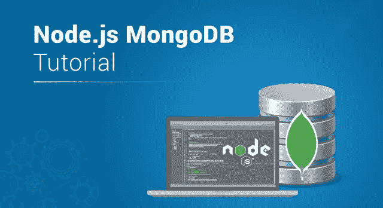

Node.js MongoDB Tutorial — Edureka

就高速应用程序开发而言，Node.js 是最受欢迎的 [JavaScript 框架](https://www.edureka.co/blog/top-10-javascript-frameworks?utm_source=medium&utm_medium=content-link&utm_campaign=node-js-mongodb-tutorial)。Node.js 专业人员通常选择 NoSQL 数据库，它可以跟上 Node.js 的速度，同时保持应用程序的性能。MongoDB 非常适合这种需求，因为它的开发周期非常快，执行起来非常高效。因此，我带来了这篇 Node.js MongoDB 教程，我将在其中演示如何毫不费力地使用 Node.js 和 MongoDB 从头开始开发应用程序。

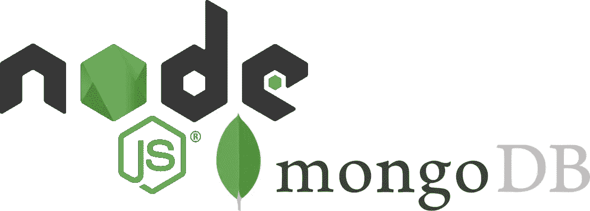

以下是我将在 Node.js MongoDB 教程中涉及的主题:

*   什么是 NoSQL 数据库？
*   MongoDB 简介
*   Node.js MongoDB 演示

那么，我们开始吧。

# 什么是 NoSQL 数据库？

**N**ot**o**only**SQL**数据库或更通俗地称为 NoSQL 数据库是一种数据库设计方法，它提供了一种存储和访问各种非结构化数据的机制。这种非结构化数据可以包含多种数据模型，包括键值、文档、列和图形格式等。NoSQL 数据库对于处理海量的分布式数据集特别有用。这些数据库有一个动态模式，没有特定的查询语言，没有或只有很少的关系。但是它以集合和文档的形式存储数据，从而能够快速更新。

这里有一个 NoSQL 数据库的列表，这些数据库在行业中被大量使用，我在下面列出了其中的一些:

1.  MongoDB
2.  [Hbase](https://www.edureka.co/blog/hbase-tutorial?utm_source=medium&utm_medium=content-link&utm_campaign=node-js-mongodb-tutorial)
3.  卡桑德拉
4.  亚马逊 SimpleDB
5.  超表格

在本文中，我将只关注这些数据库中的一个，现在您可能已经猜到了，那就是 MongoDB。但是在我向您展示如何使用它之前，让我们先熟悉一下它的本质。

# MongoDB 简介

MongoDB 是一个开源的非关系数据库，它以集合和文档的形式存储数据。这种数据库保留了大部分功能，同时提供了水平可伸缩性。这通过为数据提供持久性并增强灵活性，减轻了开发人员的工作。

MongoDB 以具有动态模式的集合的形式存储 JSON 文档。它将所有相关信息存储在一起，从而提高了查询处理的速度。这样，它也有助于缩小键值存储和关系数据库之间的差距。

下面我列出了 MongoDB 的一些最有趣的特性:

*   **索引:**它利用索引来帮助提高搜索性能。
*   **复制:** MongoDB 将数据分布在不同的机器上。
*   **特别查询:**它通过使用独特的查询语言索引 BSON 文档&来支持特别查询。
*   **无模式:**增强了数据的灵活性，不需要脚本来修改或更新数据。
*   **分片:**它利用分片来简化大型数据集的部署，并提供高吞吐量操作。

现在您已经熟悉了 MongoDB，让我们继续阅读本文，看看在系统中安装 MongoDB 有多简单。

# MongoDB 安装

**第一步:**从官方网站下载最新版本的 MongoDB 服务器:[https://www.mongodb.com/download-center/community](https://www.mongodb.com/download-center/community)

**第二步:**接下来点击“服务器”选项卡，如下图所示。

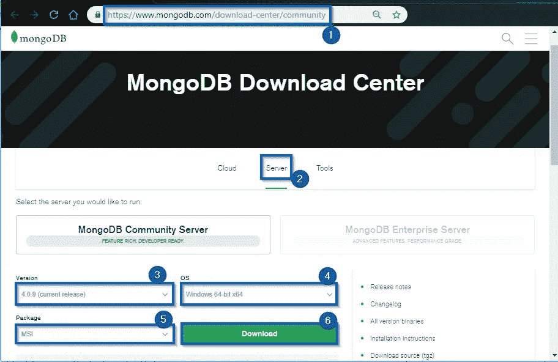

**第三步:**如果您正在寻找任何特定版本，您可以从下拉列表中选择，或者您可以下载最新版本。

**第四步:**从下拉列表中选择您的操作系统。由于我在 Windows 上工作，我将选择 Windows 64 位。

**第五步:**现在，选择软件包作为 MSI。

**第六步:**最后，点击“下载”开始下载过程。

**步骤七:**下载完成后，双击 MSI 文件将其打开，并继续安装向导。

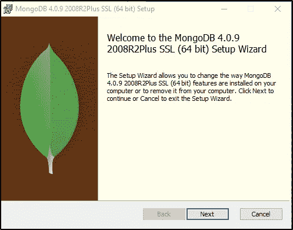

现在，为了启动 MongoDB 服务器，您必须运行。exe 文件并分配数据库文件夹。为了使工作更容易，您需要做的就是在记事本文件中写下几行代码，并用。蝙蝠分机。换句话说，您只需要创建一个批处理文件，它将毫不费力地为您启动 MongoDB 服务器。要在下面的代码中创建批处理文件类型:

```
cd C:Program FilesMongoDBServer.0in (MongoDB path)
mongod.exe --dbpath F:MongoDBdata (database dump destination)
```

现在，每当您想要启动 MongoDB 服务器时，您需要做的就是双击这个批处理文件并打开 MongoDB Compass 应用程序。

**第九步:**接下来，你需要启动‘MongoDB Compass’并同意它的使用条款。

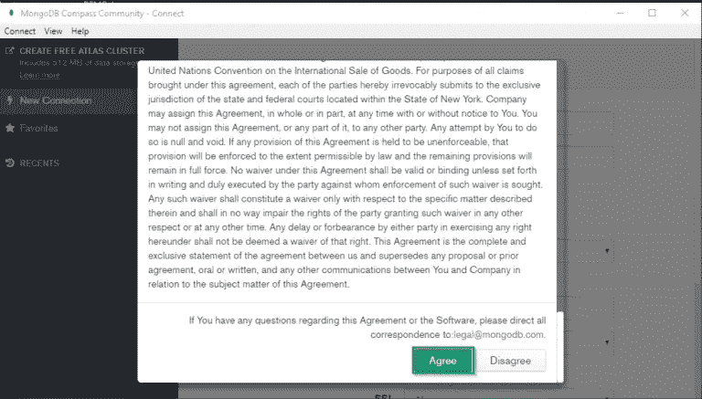

**第 X 步:**现在您需要提供服务器配置并点击“连接”。

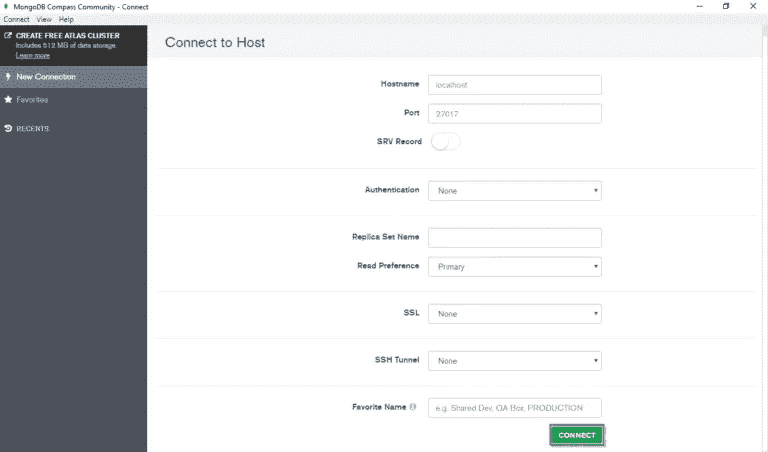

**步骤 XI:** 接下来，点击“创建数据库”。

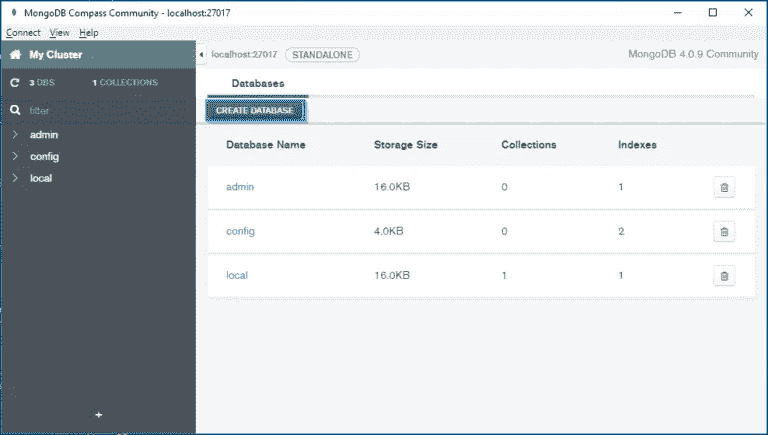

**步骤 XII:** 现在，为您的数据库和集合提供一个相关的名称，并点击“创建数据库”。

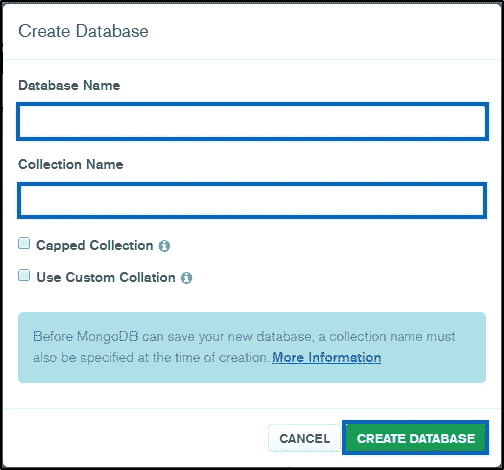

我想，现在你已经准备好开始实际的部分了，所以不要再耽搁了，让我们开始写代码吧。

# Node.js MongoDB 演示

在这里，我将借助 [Node.js 和 Express.js](https://www.edureka.co/blog/rest-api-with-node-js?utm_source=medium&utm_medium=content-link&utm_campaign=node-js-mongodb-tutorial) 创建一个用于课程管理的 CRUD 应用程序，并使用 MongoDB 来存储数据。在这个应用程序中，我将把姓名、id、持续时间和费用等课程细节作为输入。为此，我将创建几个视图文件作为接口。为了处理数据，我还需要一个控制器来帮助处理数据。最后，我将需要一些模型文件来存储数据。所以基本上，我将遵循 MVC 模式进行应用程序开发。所以，现在让我们进入开发阶段。

我们的应用程序将具有以下层次结构:

**NodejsMongoDbDemo**

*   package.json
*   script.js
*   **控制器**

1.  课程控制器. js

*   **img**

1.  logo.jpg

*   **车型**

1.  课程.模型. js
2.  mongodb.js

*   **视图**

1.  **课程**

a.courseAddEdit.hbs

b.list.hbs

**2。布局**

*   mainLayout.hbs

因此，让我们通过为项目创建一个目录来开始应用程序开发。完成后，打开命令提示符并导航到您的项目目录。现在您需要为此设置项目配置，键入以下命令并提供必要的详细信息:

```
npm init
```

现在，您需要安装所需的软件包。因此，在这个项目中，我使用以下软件包:

*   **express.js:** 是一个 web 框架。
*   **express-handlebars:** 它是一个模板引擎，帮助创建客户端应用程序。
*   猫鼬:帮助与 MongoDB 沟通。
*   **body-parser:** 帮助将 POST 数据转换成请求体。
*   **nodemon:** 有助于在代码改变时自动重启服务器。

为了安装这些软件包，请键入以下命令:

```
npm i --s express express-handlebars mongoose body-parser
```

因为我想安装 nodemon，以便它可以访问目录中的任何文件，所以我将使用全局命令来安装它:

```
npm i -g nodemon
```

完成软件包的安装后，最终的 JSON 文件应该类似于下面的文件:

**package.json**

```
{
"name": "samplenodemongo",
"version": "1.0.0",
"description": "Edureka demo on how to build a Node.js application with MongoDB",
"main": "script.js",
"scripts": {
"test": "echo "Error: no test specified" && exit 1"
},
"author": "Edureka",
"license": "ISC",
"dependencies": {
"body-parser": "^1.19.0",
"express": "^4.16.4",
"express-handlebars": "^3.0.2",
"mongoose": "^5.5.6",
"nodemon": "^1.19.0"
}
}
```

正如您所看到的，在 dependencies 部分，所有已安装的软件包都已成功列出。现在，让我们创建将在本演示中使用的数据库。为此，启动批处理文件并打开 MongoDB 应用程序。现在，创建一个新的数据库并提供一个集合名称。在我的应用程序中，我将使用“EdurekaCoursesDB”作为数据库名称，使用“courses”作为集合。

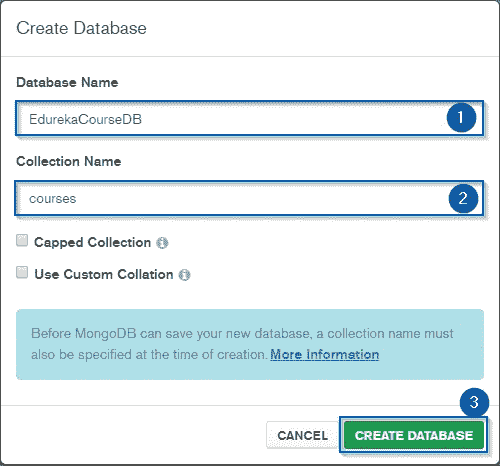

现在，切换回您的代码编辑器，我们将在其中创建文件来建立 Node.js 和 MongoDB 之间的连接。为此，首先，您需要在项目目录中创建一个文件夹，并将其命名为“model”。在这个文件夹中，创建一个名为' **mongodb.js** '的 javascript 文件，并输入以下代码:

**mongodb.js**

```
const mongoose = require('mongoose');

mongoose.connect('mongodb://localhost:27017/EdurekaCoursesDB', {useNewUrlParser: true}, (err) => {
if (!err) {
console.log('Successfully Established Connection with MongoDB')
}
else {
console.log('Failed to Establish Connection with MongoDB with Error: '+ err)
}
});

//Connecting Node and MongoDB
require('./course.model');
```

现在，您需要定义课程数据库的模式。为此，在模型文件夹中创建一个新的 JS 文件，并将其命名为' **course.model.js** '。因此，我在我的课程对象中使用了四个字段，分别是名称、id、持续时间和费用。要创建这个文件，请键入下面给出的代码。

**course.model.js**

```
const mongoose = require('mongoose');

//Attributes of the Course object
var courseSchema = new mongoose.Schema({
courseName: {
type: String,
required: 'This field is required!'
},
courseId: {
type: String
},
courseDuration: {
type: String
},
courseFee: {
type: String
}
});

mongoose.model('Course', courseSchema);
```

现在，您需要创建名为' **script.js** '的根文件。这个文件是这个应用程序的入口点，它将包含所有的连接路径。在这个文件中提供路径时，您需要非常小心，因为这可能会导致错误或应用程序失败。除此之外，它还负责调用服务器并建立连接。为了创建此文件，请键入以下代码:

**script.js**

```
require('./models/mongodb');

//Import the necessary packages
const express = require('express');
var app = express();
const path = require('path');
const exphb = require('express-handlebars');
const bodyparser = require('body-parser');

const courseController = require('./controllers/courseController');

app.use(bodyparser.urlencoded({
extended: true
}));

//Create a welcome message and direct them to the main page
app.get('/', (req, res) => {
res.send('

<h2 style="font-family: Malgun Gothic; color: midnightblue ">Welcome to Edureka Node.js MongoDB Tutorial!!</h2>

 Click Here to go to <b> <a href="/course">Course Page</a> </b>');
});
app.use(bodyparser.json());

//Configuring Express middleware for the handlebars
app.set('views', path.join(__dirname, '/views/'));
app.engine('hbs', exphb({ extname: 'hbs', defaultLayout: 'mainLayout', layoutDir: __dirname + 'views/layouts/' }));
app.set('view engine', 'hbs');

//Establish the server connection
//PORT ENVIRONMENT VARIABLE
const port = process.env.PORT || 8080;
app.listen(port, () => console.log(`Listening on port ${port}..`));

//Set the Controller path which will be responding the user actions
app.use('/course', courseController);
```

接下来，为了处理用户请求，您需要创建路由器文件。首先，创建一个文件夹并将其命名为“controller”，并在该文件夹中创建一个名为“ **courseController.js** 的文件。在这个文件中，我们将处理与雇员相关的 CRUD 操作。下面是创建该文件的代码:

**courseController.js**

```
//Import the dependencies
const express = require('express');
const mongoose = require('mongoose');
//Creating a Router
var router = express.Router();
//Link
const Course = mongoose.model('Course');

//Router Controller for READ request
router.get('/',(req, res) => {
res.render("course/courseAddEdit", {
viewTitle: "Insert a New Course for Edureka"
});
});

//Router Controller for UPDATE request
router.post('/', (req,res) => {
if (req.body._id == '')
insertIntoMongoDB(req, res);
else
updateIntoMongoDB(req, res);
});

//Creating function to insert data into MongoDB
function insertIntoMongoDB(req,res) {
var course = new Course();
course.courseName = req.body.courseName;
course.courseId = req.body.courseId;
course.courseDuration = req.body.courseDuration;
course.courseFee = req.body.courseFee;
course.save((err, doc) => {
if (!err)
res.redirect('course/list');
else
console.log('Error during record insertion : ' + err);
});
}

//Creating a function to update data in MongoDB
function updateIntoMongoDB(req, res) {
Course.findOneAndUpdate({ _id: req.body._id }, req.body, { new: true }, (err, doc) => {
if (!err) { res.redirect('course/list'); }
else {
if (err.name == 'ValidationError') {
handleValidationError(err, req.body);
res.render("course/courseAddEdit", {
//Retaining value to be displayed in the child view
viewTitle: 'Update Course Details',
employee: req.body
});
}
else
console.log('Error during updating the record: ' + err);
}
});
}

//Router to retrieve the complete list of available courses
router.get('/list', (req,res) => {
Course.find((err, docs) => {
if(!err){
res.render("course/list", {
list: docs
});
}
else {
console.log('Failed to retrieve the Course List: '+ err);
}
});
});

//Creating a function to implement input validations
function handleValidationError(err, body) {
for (field in err.errors) {
switch (err.errors[field].path) {
case 'courseName':
body['courseNameError'] = err.errors[field].message;
break;
default:
break;
}
}
}

//Router to update a course using it's ID
router.get('/:id', (req, res) => {
Course.findById(req.params.id, (err, doc) => {
if (!err) {
res.render("course/courseAddEdit", {
viewTitle: "Update Course Details",
course: doc
});
}
});
});

//Router Controller for DELETE request
router.get('/delete/:id', (req, res) => {
Course.findByIdAndRemove(req.params.id, (err, doc) => {
if (!err) {
res.redirect('/course/list');
}
else { console.log('Failed to Delete Course Details: ' + err); }
});
});

module.exports = router;//Import the dependencies
const express = require('express');
const mongoose = require('mongoose');
//Creating a Router
var router = express.Router();
//Link
const Course = mongoose.model('Course');

//Router Controller for READ request
router.get('/',(req, res) => {
res.render("course/courseAddEdit", {
viewTitle: "Insert a New Course for Edureka"
});
});

//Router Controller for UPDATE request
router.post('/', (req,res) => {
if (req.body._id == '')
insertIntoMongoDB(req, res);
else
updateIntoMongoDB(req, res);
});

//Creating function to insert data into MongoDB
function insertIntoMongoDB(req,res) {
var course = new Course();
course.courseName = req.body.courseName;
course.courseId = req.body.courseId;
course.courseDuration = req.body.courseDuration;
course.courseFee = req.body.courseFee;
course.save((err, doc) => {
if (!err)
res.redirect('course/list');
else
console.log('Error during record insertion : ' + err);
});
}

//Creating a function to update data in MongoDB
function updateIntoMongoDB(req, res) {
Course.findOneAndUpdate({ _id: req.body._id }, req.body, { new: true }, (err, doc) => {
if (!err) { res.redirect('course/list'); }
else {
if (err.name == 'ValidationError') {
handleValidationError(err, req.body);
res.render("course/courseAddEdit", {
//Retaining value to be displayed in the child view
viewTitle: 'Update Course Details',
employee: req.body
});
}
else
console.log('Error during updating the record: ' + err);
}
});
}

//Router to retrieve the complete list of available courses
router.get('/list', (req,res) => {
Course.find((err, docs) => {
if(!err){
res.render("course/list", {
list: docs
});
}
else {
console.log('Failed to retrieve the Course List: '+ err);
}
});
});

//Creating a function to implement input validations
function handleValidationError(err, body) {
for (field in err.errors) {
switch (err.errors[field].path) {
case 'courseName':
body['courseNameError'] = err.errors[field].message;
break;
default:
break;
}
}
}

//Router to update a course using it's ID
router.get('/:id', (req, res) => {
Course.findById(req.params.id, (err, doc) => {
if (!err) {
res.render("course/courseAddEdit", {
viewTitle: "Update Course Details",
course: doc
});
}
});
});

//Router Controller for DELETE request
router.get('/delete/:id', (req, res) => {
Course.findByIdAndRemove(req.params.id, (err, doc) => {
if (!err) {
res.redirect('/course/list');
}
else { console.log('Failed to Delete Course Details: ' + err); }
});
});

module.exports = router;//Import the dependencies
const express = require('express');
const mongoose = require('mongoose');
//Creating a Router
var router = express.Router();
//Link
const Course = mongoose.model('Course');

//Router Controller for READ request
router.get('/',(req, res) => {
res.render("course/courseAddEdit", {
viewTitle: "Insert a New Course for Edureka"
});
});

//Router Controller for UPDATE request
router.post('/', (req,res) => {
if (req.body._id == '')
insertIntoMongoDB(req, res);
else
updateIntoMongoDB(req, res);
});

//Creating function to insert data into MongoDB
function insertIntoMongoDB(req,res) {
var course = new Course();
course.courseName = req.body.courseName;
course.courseId = req.body.courseId;
course.courseDuration = req.body.courseDuration;
course.courseFee = req.body.courseFee;
course.save((err, doc) => {
if (!err)
res.redirect('course/list');
else
console.log('Error during record insertion : ' + err);
});
}

//Creating a function to update data in MongoDB
function updateIntoMongoDB(req, res) {
Course.findOneAndUpdate({ _id: req.body._id }, req.body, { new: true }, (err, doc) => {
if (!err) { res.redirect('course/list'); }
else {
if (err.name == 'ValidationError') {
handleValidationError(err, req.body);
res.render("course/courseAddEdit", {
//Retaining value to be displayed in the child view
viewTitle: 'Update Course Details',
employee: req.body
});
}
else
console.log('Error during updating the record: ' + err);
}
});
}

//Router to retrieve the complete list of available courses
router.get('/list', (req,res) => {
Course.find((err, docs) => {
if(!err){
res.render("course/list", {
list: docs
});
}
else {
console.log('Failed to retrieve the Course List: '+ err);
}
});
});

//Creating a function to implement input validations
function handleValidationError(err, body) {
for (field in err.errors) {
switch (err.errors[field].path) {
case 'courseName':
body['courseNameError'] = err.errors[field].message;
break;
default:
break;
}
}
}

//Router to update a course using it's ID
router.get('/:id', (req, res) => {
Course.findById(req.params.id, (err, doc) => {
if (!err) {
res.render("course/courseAddEdit", {
viewTitle: "Update Course Details",
course: doc
});
}
});
});

//Router Controller for DELETE request
router.get('/delete/:id', (req, res) => {
Course.findByIdAndRemove(req.params.id, (err, doc) => {
if (!err) {
res.redirect('/course/list');
}
else { console.log('Failed to Delete Course Details: ' + err); }
});
});

module.exports = router;
```

现在，我们已经完成了后端文件，下一步是创建视图。首先，您需要为子视图创建一个包装器。但在此之前，创建一个名为' **views** 的文件夹。在该文件夹中，使用以下命令再创建两个文件夹，分别名为'**课程**'和'**布局**'。hbs 扩展。现在，在“layouts”文件夹中导航，创建名为“ **mainLayout.hbs** ”的包装器。这个文件将包含应用程序的基本框架，它也将反映在子视图中。在这个文件中，我也插入了一张图片，因此我将创建一个名为 **img** 的本地文件夹，并将我的图片保存在里面。

要创建此文件，请键入以下代码:

**mainLayout.hbs**

```
<!DOCTYPE html>
<html>
<head>
<title>Edureka Node.js MongoDB Demo</title>
<link rel="stylesheet" href="[https://maxcdn.bootstrapcdn.com/bootstrap/4.0.0/css/bootstrap.min.css](https://maxcdn.bootstrapcdn.com/bootstrap/4.0.0/css/bootstrap.min.css)" integrity="sha384-Gn5384xqQ1aoWXA+058RXPxPg6fy4IWvTNh0E263XmFcJlSAwiGgFAW/dAiS6JXm" crossorigin="anonymous">


</head>

<body class = "bg-info">

<div align="center">
<!-- Inserting the image -->

</div>

<div class="row">

<div class="col-md-6 offset-md-3" style="background-color: #fff; margin-top: 40px; padding:20px;">
<!-- retrieving HTML String from the child Views -->
{{{body}}}
</div>

</div>

</body>
</html>
```

最后，在课程文件夹中，我们将创建两个子视图，其中一个用于课程添加或更新，另一个视图将显示可用课程的完整列表。让我们首先关注第一个视图，即 **courseAddEdit.hbs** ，它看起来像下面的截图。

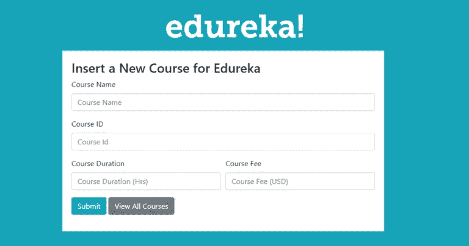

所以，现在让我来展示，如何建立这个观点。

正如您在截图中看到的，该页面将包含四个输入字段和两个按钮。一个按钮将提交用户填写到数据库中的详细信息，第二个按钮将显示数据库中可用课程的完整列表。为了确保输入正确，您还需要添加一些验证。完成后，您将能够使用“/course”URL 查看此视图。以下是代码，您将需要创建 **courseAddEdit.hbs** 文件:

**courseAddEdit.hbs**

```
<!-- Obtaining value from the course controller -->

<h3>{{viewTitle}}</h3>
<form action="/course" method="POST">
<input type="hidden" name="_id" value="{{course._id}}">

<div class = "form-group">
<label>Course Name</label>
<input type="text" maxlength="100" class="form-control" name="courseName" placeholder="Course Name" value="{{course.courseName}}">

<div class="text-danger">
{{course.courseNameError}}</div>
</div>
<div class = "form-group">
<label>Course ID</label>
<input type="number" min='10000' max='99999' class="form-control" name="courseId" placeholder="Course Id" value="{{course.courseId}} " required>
</div>
<div class = "form-row">
<div class = "form-group col-md-6">
<label>Course Duration</label>
<input type="number" min='10' max='99' class="form-control" name="courseDuration" placeholder="Course Duration (Hrs)" "{{course.courseDuration}} " required>
</div>
<div class = "form-group col-md-6">
<label>Course Fee</label>
<input type="number" min='100' max="100000" class="form-control" name="courseFee" placeholder="Course Fee (USD)" "{{course.courseFee}} " required>
</div>
</div>
<div class="form-group">
<button type="submit" class="btn btn-info"><i class="fa fa-database"></i> Submit</button>
<a class="btn btn-secondary" href="/course/list"><i class="fa fa-list-alt"></i> View All Courses</a>
</div>
</form>
```

现在，让我向您展示下一个视图，即 **list.hbs** ，它将从数据库中检索可用课程的完整列表，并将其显示在您的屏幕上:

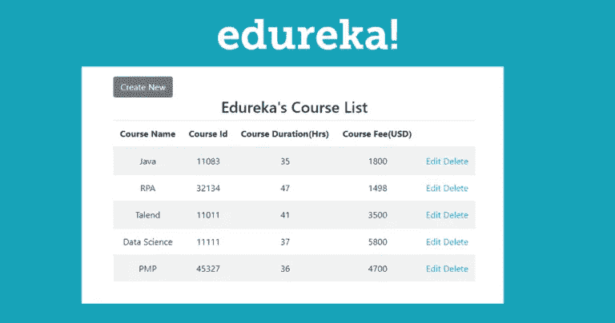

在这个视图中，我使用一个表格来显示课程列表。该表有五列，前四列显示课程详细信息，最后一列允许您直接从应用程序界面编辑/删除记录。这些函数的控制器已经在 **script.js** 文件中创建。因此，剩下的唯一一件事就是添加视图，为了这样做，创建一个 **list.hbs** 文件，并键入下面编写的代码。

**list.hbs**

```
<div>
<a class="btn btn-secondary" href="/course"><i class="fa fa-plus"></i> Create New</a> 

<h3 align="center">Edureka's Course List</h3>
</div>
<table class="table table-striped">
<thead>
<tr>
<th>Course Name</th>
<th>Course Id</th>
<th>Course Duration(Hrs)</th>
<th>Course Fee(USD)</th>
<th></th>
</tr>
</thead>
<tbody>
{{#each list}}
<tr align="center">
<td>{{this.courseName}}</td>
<td>{{this.courseId}}</td>
<td>{{this.courseDuration}}</td>
<td>{{this.courseFee}}</td>
<td>
<a href="/course/{{this._id}}"> Edit </a>
<a href="/course/delete/{{this._id}}" onclick="return confirm('Are you sure to delete this record ?');"> Delete </a>
</td>
</tr>
{{/each}}
</tbody>
</table>
```

编码部分到此结束，现在是时候测试我们的应用程序了。为此，请打开命令提示符并导航到项目文件夹，或者如果您使用的是 IDE，请打开终端并键入以下命令来启动服务器。

```
nodemon script.js
```

现在，您可以在任何浏览器中通过[**http://localhost:8080**](http://localhost:8080)**启动您的应用程序。**

**一旦您添加了自己的数据，您可以返回到 MongoDB 中，检查数据是否已经添加到那里。如果你参考下面的截图，你会看到我所有的数据都已成功添加。这意味着我的 MongoDB 与我的 Node.js API 完美地连接和工作。**

**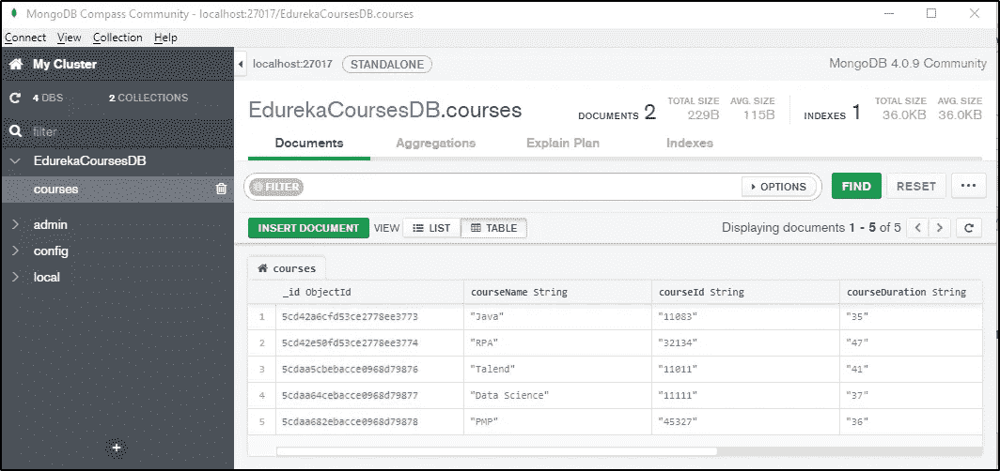**

**到此，我们就结束了这个 Node.js MongoDB 教程。希望我能够保持概念清晰，并帮助您理解 MongoDB 如何与 Node.js 一起工作。如果您希望查看更多关于人工智能、Python、道德黑客等市场最热门技术的文章，那么您可以参考 [Edureka 的官方网站。](https://www.edureka.co/blog/?utm_source=medium&utm_medium=content-link&utm_campaign=node-js-mongodb-tutorial)**

**请留意本系列中的其他文章，它们将解释 Nodejs 的各个方面。**

> **1. [NodeJS 教程](/edureka/node-js-tutorial-800e03bc596b)**
> 
> **2.[使用 Node.js 和 MySQL 构建 CRUD 应用程序](/edureka/node-js-mysql-tutorial-cef7452f2762)**
> 
> **3.[从头开始构建 Node.js】](/edureka/rest-api-with-node-js-b245e345f7a5)**
> 
> **4.[提出 Node.js 请求的 3 种最佳方式](/edureka/node-js-requests-6b94862307a2)**
> 
> **5.[如何对 Node.js App 进行 Dockerize？](/edureka/node-js-docker-tutorial-72e7542d69d8)**
> 
> **6.[用 Node.js 构建 REST API](/edureka/rest-api-with-node-js-b245e345f7a5)**
> 
> **7.[提出 Node.js 请求的 3 种最佳方式](/edureka/node-js-requests-6b94862307a2)**
> 
> **8. [Express.js 基础](/edureka/learn-node-js-b3a9c6fb632c)**

***原载于 2019 年 5 月 14 日*[*https://www.edureka.co*](https://www.edureka.co/blog/node-js-mongodb-tutorial/)*。***