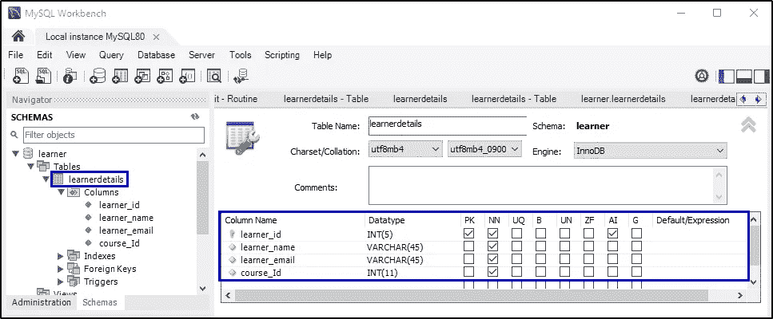

# 如何使用 Node.js 和 MySQL 构建一个 CRUD 应用？

> 原文：<https://medium.com/edureka/node-js-mysql-tutorial-cef7452f2762?source=collection_archive---------0----------------------->


Node.js MYSQL Tutorial — Edureka

MySQL 是开发人员最喜欢的数据库之一，因为它是开源的并且高效。这就是为什么大多数著名的编程语言，如 Java、Python、Node.js 等，都提供了访问和执行 MySQL 事务的驱动程序。在本文中，我将演示如何通过几个简单易行的步骤建立与 MySQL 的连接并执行各种 CRUD 操作。

下面是本文将要讨论的主题的详细列表

*   为什么要用 MySQL 搭配 Node.js？
*   MySQL 安装
*   使用 Node.js 和 MySQL 创建 CRUD 应用程序

让我从解决最基本的问题开始这篇文章，即我们为什么使用 MySQL。

# 为什么要用 MySQL 搭配 Node.js？

简单来说， [MySQL](https://www.edureka.co/blog/what-is-mysql?utm_source=medium&utm_medium=content-link&utm_campaign=node-js-mysql-tutorial) 是一个开源的关系数据库管理系统，可以在各种平台上运行。它是一种 Oracle 产品，提供多用户访问以支持许多存储引擎。不仅如此，MySQL 还有许多有趣的特性，这些特性将应用程序的性能提升了一个档次。下面我列出了其中的一些:

*   *—非常容易下载，那也是免费的。它提供了一个事件调度器的功能，您可以使用它来自动调度任务。*
*   ****健壮的事务支持*** —它拥有 ACID(原子性、一致性、隔离性、持久性)属性，并提供分布式多版本支持。*
*   ****高性能*** —它还提供快速加载实用程序，具有独特的内存缓存和表索引分区。*
*   ****总拥有成本低*** —总体上降低了许可成本和硬件支出。*
*   ****安全数据保护*** —它通过实施强大的机制来提供高安全性，这些机制只允许授权用户访问数据库。*
*   ****高可用性*** —它可以运行高速主/从复制配置，还提供集群服务器。*
*   ****可扩展性&灵活性*** —它可以用来运行深度嵌入式应用程序，并创建容纳海量数据的数据仓库。*

*我想现在你已经非常熟悉 MySQL 在市场上被大量使用的原因了。接下来，让我们看看如何在您的本地系统中安装并开始使用 MySQL。*

# *MySQL 安装*

*有多种方法可以在你的系统中安装 MySQL。安装 MySQL 最简单的方法是使用 MySQL 安装程序。可以从 [**MySQL 官方网站**](https://dev.mysql.com/downloads/installer/) 下载。*

*现在，我为什么使用它是因为 MySQL 安装程序是一个独立的应用程序，它简化了安装和配置 MySQL 产品的复杂性。*

*现在我们已经完成了安装，让我们尝试将 MySQL 与 Node.js 应用程序集成起来。*

# *使用 Node.js 和 MySQL 创建 CRUD 应用程序*

*在这里，我将使用 Node.js 创建一个简单的 CRUD 应用程序，并将其与 MySQL 数据库相链接，以在其中存储学习者的数据。因为我的主要目的是演示来自数据库的数据事务，所以我将主要关注控制器。一旦您对控制器有了足够的了解，您就可以向它添加视图了。*

*现在，让我们专注于我们的项目。该项目将具有以下项目结构:*

***SampleNodeMySQL***

1.  *package.json*
2.  *script.js*

*因此，让我们通过为项目创建一个目录来开始应用程序开发。完成后，打开命令提示符并导航到您的项目目录。现在您需要为此设置项目配置，键入以下命令并提供必要的详细信息:*

```
*npm init*
```

*现在，您需要安装所需的软件包。在这个项目中，我使用以下软件包:*

*   ***express.js:** 它是一个 web 框架。*
*   ***MySQL:**MySQL 的 Node.js 驱动程序*
*   ***body-parser:** 帮助将 POST 数据转换成请求体。*
*   ***nodemon:** 有助于在代码改变时自动重启服务器。*

*为了安装这些软件包，请键入以下命令:*

```
*npm i --s express express-handlebars mongoose body-parser*
```

*因为我想安装 nodemon，以便它可以访问目录中的任何文件，所以我将使用全局命令来安装它:*

```
*npm i -g nodemon*
```

*完成软件包的安装后，最终的 JSON 文件应该类似于下面的文件:*

***package.json***

```
*"name": "samplenodemysql",
"version": "1.0.0",
"description": "Edureka Demo for creating a CRUD application using Node.js and MySQL",
"main": "script.js",
"scripts": {
"test": "echo "Error: no test specified" && exit 1"
},
"author": "Edureka",
"license": "ISC",
"dependencies": {
"body-parser": "^1.19.0",
"express": "^4.16.4",
"mysql": "^2.17.1"
}
}*
```

*正如您所看到的，在 dependencies 部分，所有已安装的软件包都已成功列出。现在，让我们创建将在本演示中使用的数据库。为此，在 MySQL Workbench 中推出了一个新的连接。进入后，创建一个名为“学习者”的新数据库。现在，在该数据库中，创建一个名为“learnerdetails”的新表，并包含以下各列:*

1.  *learner_id (INT) —主键*
2.  *学习者姓名(VARCHAR)*
3.  *学员 _ 电子邮件(VARCHAR)*
4.  *course_Id (INT)*

**

*在表中添加一些值，以便我们可以从 Node.js 应用程序中访问和测试它们。*

*回到应用程序，下一步是创建 **script.js** 文件，这将有助于从新创建的数据库中检索数据。Script.js 是根文件，也是这个应用程序的入口点。它将包含所有的路由器和驱动程序。除此之外，它还负责调用服务器并建立连接。*

*要创建该文件，可以使用任何代码编辑器或 IDE。我正在使用 Webstorm IDE 开发这个应用程序。首先，您需要在应用程序中导入所需的包，为此，您需要键入以下代码:*

```
*const mysql = require('mysql');
const express = require('express');
const bodyparser = require('body-parser');
var app = express();
//Configuring express server
app.use(bodyparser.json());*
```

*接下来，您需要建立与 MySQL 数据库的连接。为此，您必须使用 createConnection()函数并提供所需的详细信息，如主机、用户、密码和数据库。输入详细信息时要非常小心，否则 MySQL 不会授权连接。*

```
*//MySQL details
var mysqlConnection = mysql.createConnection({
host: 'localhost',
user: 'root',
password: 'edu1234',
database: 'learner',
multipleStatements: true
});*
```

*之后，使用 connect()函数连接，使用提供的凭证建立与数据库的连接。这里需要指定如果连接成功 Node.js 应该做什么，如果连接失败应该做什么。*

```
*mysqlConnection.connect((err)=> {
if(!err)
console.log('Connection Established Successfully');
else
console.log('Connection Failed!'+ JSON.stringify(err,undefined,2));
});*
```

*最后，您还需要指定端口，因为我们将通过 HTTP 向服务器发送请求。*

```
*//Establish the server connection
//PORT ENVIRONMENT VARIABLE
const port = process.env.PORT || 8080;
app.listen(port, () => console.log(`Listening on port ${port}..`));*
```

*现在，在终端中键入以下命令:*

```
*nodemon script.js*
```

*一旦您按下回车键，您的连接就成功了，您将能够在终端中看到成功的消息，如下面的快照所示:*

**

*现在让我们继续，尝试创建 GET 路由器，从数据库中获取完整的学习者列表及其详细信息。参考以下代码:*

```
*//Creating GET Router to fetch all the learner details from the MySQL Database
app.get('/learners' , (req, res) => {
mysqlConnection.query('SELECT * FROM learnerdetails', (err, rows, fields) => {
if (!err)
res.send(rows);
else
console.log(err);
})
} );*
```

*我将使用另一个名为 Postman 的应用程序来发出请求。Postman 可以作为插件轻松添加到您的浏览器中。它有助于组织来自客户端的请求并存储请求历史。因此，一旦在系统中安装了 POSTMAN for Node.js，就可以开始启动它了。现在，从下拉列表中选择 GET 并输入下面的 URL:[http://localhost:8080/learners](http://localhost:8080/learners)*

**

*接下来，让我们尝试创建一个路由器，通过传入学习者的 ID 来获取特定学习者的详细信息。键入以下代码来创建此路由器。*

```
*//Router to GET specific learner detail from the MySQL database
app.get('/learners/:id' , (req, res) => {
mysqlConnection.query('SELECT * FROM learnerdetails WHERE learner_id = ?',[req.params.id], (err, rows, fields) => {
if (!err)
res.send(rows);
else
console.log(err);
})
} );*
```

*让我们试着在 POSTMAN 中发送一个带有学习者特定 ID 的请求。*

**

*接下来，让我们创建一个路由器来添加新学员的详细信息。但是在此之前，您需要在数据库中创建一个存储过程来处理您的插入或更新请求。对于开放 MySQL 工作台。在您的学员数据库下，您会发现一个“存储过程”。右键单击以创建一个存储过程，并将其命名为' learnerAddOrEdit '。*

**

*键入以下代码以定义所有必需的例程:*

***learnerAddOrEdit***

```
*CREATE DEFINER=`root`@`localhost` PROCEDURE `learnerAddOrEdit`(
IN _learner_id INT,
IN _learner_name VARCHAR(45),
IN _learner_email VARCHAR(45),
IN _course_Id INT
)
BEGIN
IF _learner_id = 0 THEN
INSERT INTO learnerdetails(learner_name,learner_email,course_Id)
VALUES (_learner_name,_learner_email,_course_Id);
SET _learner_id = last_insert_id();
ELSE
UPDATE learnerdetails
SET
learner_name = _learner_name,
learner_email = _learner_email,
course_Id = _course_Id
WHERE learner_id = _learner_id;
END IF;
SELECT _learner_id AS 'learner_id';
END*
```

*完成后，切换回 script.js 文件，并为 POST 请求键入以下代码。*

```
*//Router to INSERT/POST a learner's detail
app.post('/learners', (req, res) => {
let learner = req.body;
var sql = "SET [@learner_id](http://twitter.com/learner_id) = ?;SET [@learner_name](http://twitter.com/learner_name) = ?;SET [@learner_email](http://twitter.com/learner_email) = ?;SET [@course_Id](http://twitter.com/course_Id) = ?; 
CALL learnerAddOrEdit([@learner_id](http://twitter.com/learner_id),[@learner_name](http://twitter.com/learner_name),[@learner_email](http://twitter.com/learner_email),[@course_Id](http://twitter.com/course_Id));";
mysqlConnection.query(sql, [learner.learner_id, learner.learner_name, learner.learner_email, learner.course_Id], (err, rows, fields) => {
if (!err)
rows.forEach(element => {
if(element.constructor == Array)
res.send('New Learner ID : '+ element[0].learner_id);
});
else
console.log(err);
})
});*
```

*根据我们的代码，值为 0 的学习者 ID 表示该特定条目是数据库中的新条目。因此，无论何时发出插入请求，都要确保将 ID 作为 0 传递。现在打开 POSTMAN，从下拉列表中选择 POST，提供 URL 并在 body 部分输入学员的详细信息。*

**

*现在，当您尝试获取完整的学员列表时，您也会看到新插入的记录。为了进行交叉检查，您可以打开工作台并点击 refresh 按钮来查看表中的新记录。*

**

*接下来，您需要创建一个路由器来更新学员的详细信息。为此，请键入以下代码:*

```
*//Router to UPDATE a learner's detail
app.put('/learners', (req, res) => {
let learner = req.body;
var sql = "SET [@learner_id](http://twitter.com/learner_id) = ?;SET [@learner_name](http://twitter.com/learner_name) = ?;SET [@learner_email](http://twitter.com/learner_email) = ?;SET [@course_Id](http://twitter.com/course_Id) = ?; 
CALL learnerAddOrEdit([@learner_id](http://twitter.com/learner_id),[@learner_name](http://twitter.com/learner_name),[@learner_email](http://twitter.com/learner_email),[@course_Id](http://twitter.com/course_Id));";
mysqlConnection.query(sql, [learner.learner_id, learner.learner_name, learner.learner_email, learner.course_Id], (err, rows, fields) => {
if (!err)
res.send('Learner Details Updated Successfully');
else
console.log(err);
})
});*
```

*让我们尝试实现更新请求。为此，返回到 POSTMAN，从下拉列表中选择 PUT 并提供 URL。*

**

*现在，如果您返回 MySQL workbench 并进行刷新，您将看到特定的记录已经更新。*

**

*最后，让我们创建删除路由器。为此，键入下面给出的代码。*

```
*//Router to DELETE a learner's detail
app.delete('/learners/:id', (req, res) => {
mysqlConnection.query('DELETE FROM learnerdetails WHERE learner_id = ?', [req.params.id], (err, rows, fields) => {
if (!err)
res.send('Learner Record deleted successfully.');
else
console.log(err);
})
});*
```

*完成后，去找邮递员，从下拉列表中选择删除。在 URL 中，提供要删除其详细信息的特定学员 id。点击发送后，您可以在响应正文中看到成功消息。*

**

*为了进行交叉检查，您可以返回到您的工作台并点击刷新。您将看到具有所提供 id 的记录已经从表中删除。*

**

*这就把我们带到了本文的结尾。希望，它有助于增加你的知识价值。如果你想获得更多关于 Node.js 的见解，你也可以参考我的其他文章。*

*如果你想查看更多关于人工智能、Python、道德黑客等市场最热门技术的文章，你可以参考 Edureka 的官方网站。*

*请留意本系列中的其他文章，它们将解释 Node.js 的各个方面*

> *1. [NodeJS 教程](/edureka/node-js-tutorial-800e03bc596b)*
> 
> *2.[使用 Node.js 和 MySQL 构建一个 CRUD 应用程序](/edureka/node-js-mysql-tutorial-cef7452f2762)*
> 
> *3.[从头开始构建 Node.js】](/edureka/rest-api-with-node-js-b245e345f7a5)*
> 
> *4.[提出 Node.js 请求的 3 种最佳方式](/edureka/node-js-requests-6b94862307a2)*
> 
> *5.[如何对 Node.js App 进行 Dockerize？](/edureka/node-js-docker-tutorial-72e7542d69d8)*
> 
> *6.[用 Node.js 构建 REST API](/edureka/rest-api-with-node-js-b245e345f7a5)*
> 
> *7.[提出 Node.js 请求的 3 种最佳方式](/edureka/node-js-requests-6b94862307a2)*
> 
> *8. [Express.js 基础](/edureka/learn-node-js-b3a9c6fb632c)*

**原载于 2019 年 5 月 21 日*[*【https://www.edureka.co】*](https://www.edureka.co/blog/node-js-mysql-tutorial/)*。**