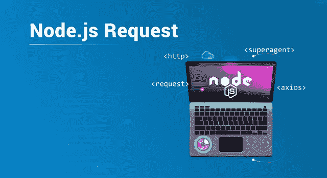
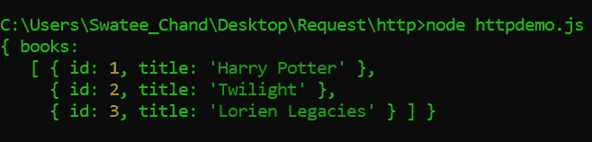
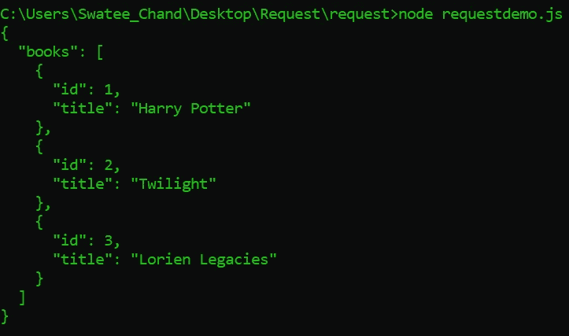
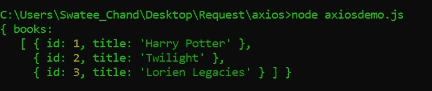
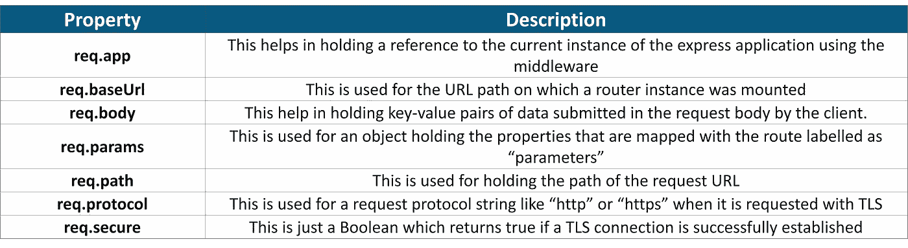

# 了解发出 Node.js 请求的 3 种最佳方式

> 原文：<https://medium.com/edureka/node-js-requests-6b94862307a2?source=collection_archive---------3----------------------->



Node.js Request — Edureka

Node.js 是最流行的前端框架之一，在业界被大量用于创建基于服务器的应用程序。反过来，这些应用程序有助于向用户提供各种数据和信息。但是用户如何将他的需求传递给服务器呢？这是使用 HTTP 请求完成的，这有助于 Node.js 开发人员简化整个过程。通过这篇关于 Node.js 请求的文章，我将为您提供一个完整的 Node.js 请求以及如何绕过它们的演练。

以下是我将在本文中涉及的主题:

*   Node.js 中的 HTTP 请求是什么？
*   发出 Node.js 请求
*   Node.js 请求对象

让我们从本文的第一个主题开始，理解什么是 Node.js 请求。

# 节点中的 HTTP 请求是什么？

在 Node.js 中， **HTTP 请求**基本上是客户端通过 HTTP 向服务器请求的消息，即*超文本传输协议*。您可以将它视为两台计算机之间发送的信息包，作为主要数据集。然后，这个请求由服务器处理，另一个信息包被发送回客户机。该数据包包含客户端请求的所有必要数据，称为响应。在本文中，我们将主要关注请求部分。


因此，让我们从更细的角度来理解 HTTP 请求。HTTP 请求是在客户端和 web 服务器之间传输数据的浏览器模式。这些数据可以是任何东西，包括 API、网站、图像、文本等。

一个 *HTTP 请求*通常由以下内容组成:

1.  *请求行*
2.  *标题[0 或更多]*
3.  *请求体【可选】*

您可以使用各种模块在 web 服务器空间中发出 HTTP 请求并处理服务器请求。在这篇 Node.js Requests 文章中，我将讨论一些在行业中被大量使用的请求。

# 发出 Node.js 请求

下面我列出了 3 种最流行的 HTTP 请求方式:

1.  HTTP 模块
2.  请求模块
3.  AXIOS

因此，让我们从 HTTP 模块开始，更深入地研究每一个模块。

这里，为了方便起见，我将通过对一个“假的”[**API:JSON 占位符 API**](https://my-json-server.typicode.com/edurekaDemo/noderequest) 执行查询来发出 Node.js 请求。

## 1.HTTP 模块


HTTP 模块是发出 HTTP 请求的标准和传统方式。这是一个默认的模块，你只需要插入并开始使用它，而不必安装任何显式的依赖。它是使用 Node.js 联网的核心和关键模块之一。

一般来说，Node.js 的初学者在尝试从 API 请求或获取某些东西时，倾向于使用 http.get 和 https.get。这个模块的主要优点是，它是 API 的原生，因此它减少了安装任何第三方的需要。这使得过程稍微快了一点。下面我写了一个使用 HTTP 模块请求数据的代码。

```
const https = require("https");
const url = "[https://my-json-server.typicode.com/edurekaDemo/noderequest/db](https://my-json-server.typicode.com/edurekaDemo/noderequest/db)";
https.get(url, res => {
res.setEncoding("utf8");
let body = "";
res.on("data", data => {
body += data;
});
res.on("end", () => {
body = JSON.parse(body);
console.log(body);
});
});
```

这将在控制台中为您提供所需的数据。下面我附上了我的代码输出。



但是正如所说，每个硬币都有两面，http 模块也有它的缺点。Node.js 的 HTTP 模块有点啰嗦，不支持‘promises’。这样，用于开发就变得有点不可靠和笨拙了。

在这篇 Node.js Requests 文章的下一节中，我将讨论请求模块，它只不过是 HTTP 模块的高级版本或修改版本。

## 2.请求模块


Node.js 的请求模块是业内最流行的 HTTP 请求 Node.js 包之一。与 HTTP 模块相比，这个包更加用户友好，这也是为什么几年来它被认为是社区的避风港。换句话说，它被设计成以尽可能简单的方式促进 HTTP 请求。它之所以能够这样做，是因为它只是 Node.js 的内置 HTTP 包的包装器。因此，使用 request，您可以以更简单的方式利用 HTTP 的所有功能。

下面我写了一个使用请求模块请求数据的代码。但是在使用该模块发出请求之前，您需要使用以下命令将它安装到您的系统中:

```
npm i request
```

一旦您成功地安装了请求模块，您就可以继续下面给出的例子。

```
const request = require("request");
const url = "[https://my-json-server.typicode.com/edurekaDemo/noderequest/db](https://my-json-server.typicode.com/edurekaDemo/noderequest/db)";
request.get(url, (error, response, body) => {
let json = JSON.parse(body);
console.log(body);
});
```

这将在控制台中为您提供所需的数据。下面我附上了我的代码输出。



因此，如果你正在寻找一个可以轻松处理 HTTP 请求的简单易用的库，请求模块是最好的选择。

但是，尽管它使请求过程变得更容易，但它对承诺没有任何支持，并且有很多依赖性。这就引出了我们的第三种方式，即使用 axios 包进行 Node.js 请求。

## 3.Axios 模块


Axios 是一个基于 Promise 的 HTTP 客户端，可以在浏览器以及 Node.js 环境下工作。这是因为 **Axios** 提供了一个单一的 API 来处理 XML Http 请求和节点的 Http 接口。这个软件包通常用于处理一系列复杂的事件。由于构建异步代码确实令人困惑，Promises 已经成为这个问题最突出的解决方案之一。

下面我写了一个使用请求模块请求数据的代码。但是在使用该模块发出请求之前，您需要使用以下命令将它安装到您的系统中:

```
npm i axios
```

一旦您成功地安装了请求模块，您就可以继续下面给出的例子。

```
const axios = require("axios");
const url = "[https://my-json-server.typicode.com/edurekaDemo/noderequest/db](https://my-json-server.typicode.com/edurekaDemo/noderequest/db)";
const getData = async url => {
  try {
    const response = await axios.get(url);
    const data = response.data;
    console.log(data);
  } catch (error) {
    console.log(error);
  }
};
getData(url);
```

这将在控制台中为您提供所需的数据。下面我附上了我的代码输出。



# Node.js 请求对象

Node.js 中的**请求对象**帮助检索客户端浏览器通过 HTTP **请求**传递给 Node.js 服务器的值。它保存来自用户的信息，并在动态创建网页时进行评估。基于用户输入，它还能够执行各种服务器端操作。你可以说，请求对象用于检索当前 HTTP 请求的信息，如 URL、请求头和数据等。下面我列出了请求对象最常用的属性。



至此，我想结束这篇关于 Node.js 请求的文章。为了让你容易理解，我尽了最大努力保持内容清晰明了。如果你想查看更多关于人工智能、Python、道德黑客等市场最热门技术的文章，你可以参考 [Edureka 的官方网站。](https://www.edureka.co/blog/?utm_source=medium&utm_medium=content-link&utm_campaign=node-js-requests)

请留意本系列中的其他文章，它们将解释 Node.js 的各个方面

> 1. [NodeJS 教程](/edureka/node-js-tutorial-800e03bc596b)
> 
> 2.[使用 Node.js 和 MySQL 构建 CRUD 应用](/edureka/node-js-mysql-tutorial-cef7452f2762)
> 
> 3.[使用节点构建 CRUD 应用程序。JS 和 MongoDB](/edureka/node-js-mongodb-tutorial-fa80b60fb20c)
> 
> 4.[从头开始构建 Node.js】](/edureka/rest-api-with-node-js-b245e345f7a5)
> 
> 5.[如何对 Node.js App 进行 Dockerize？](/edureka/node-js-docker-tutorial-72e7542d69d8)
> 
> 6.[用 Node.js 构建 REST API](/edureka/rest-api-with-node-js-b245e345f7a5)
> 
> 7.[提出 Node.js 请求的 3 种最佳方式](/edureka/node-js-requests-6b94862307a2)
> 
> 8. [Express.js 基本面](/edureka/learn-node-js-b3a9c6fb632c)

*原载于 2019 年 6 月 7 日*[*https://www.edureka.co*](https://www.edureka.co/blog/node-js-requests/)*。*