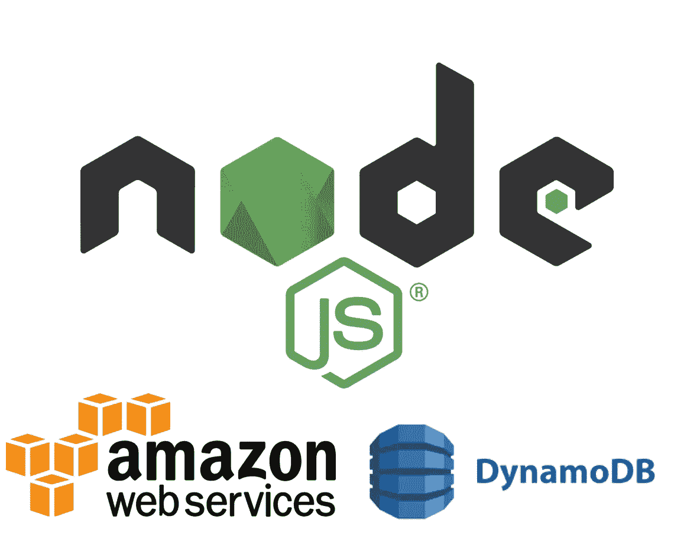
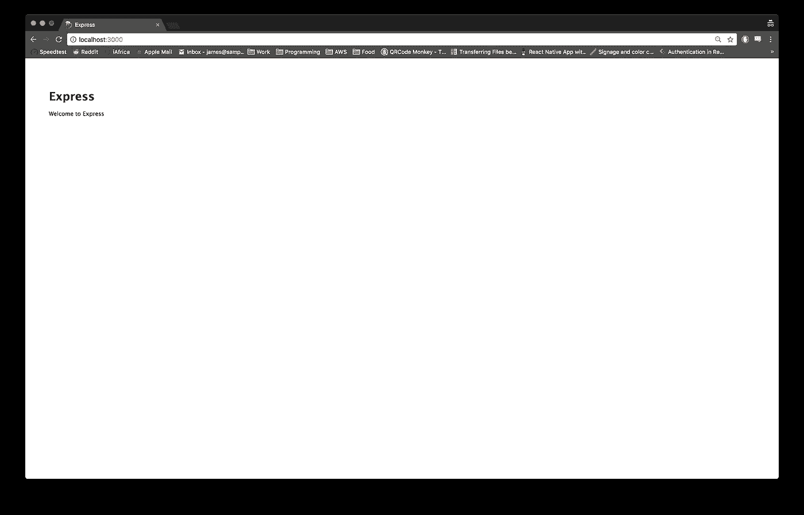

# 带有 DynamoDB Local 的 Node.js RESTful API

> 原文：<https://medium.com/quick-code/node-js-restful-api-with-dynamodb-local-7e342a934a24?source=collection_archive---------0----------------------->



Node 通常在 **MEAN** 栈中与 MongoDB 一起使用。然而，使用 Amazon 的 DynamoDB 有它自己的好处，尤其是在速度、可伸缩性、可负担性以及将您的时间从配置数据库集群/更新中解放出来。通过这篇文章，我将讨论如何在本地用你的节点项目设置 DynamoDB。

## 版本

*   节点 9.2.1
*   特快 4.15.5
*   DynamoDB Local — [最新](https://s3.eu-central-1.amazonaws.com/dynamodb-local-frankfurt/dynamodb_local_latest.tar.gz)
*   [JRE](http://www.oracle.com/technetwork/java/javase/downloads/jre8-downloads-2133155.html) (Java 运行时环境)6.x 或更新版本

## 设置节点项目

为了让事情快速进展，我们将使用 express generator 为我们搭建一个项目。

```
**#bash**$ express node-dynamo-db

   create : node-dynamo-db
   create : node-dynamo-db/package.json
   create : node-dynamo-db/app.js
   create : node-dynamo-db/public
   create : node-dynamo-db/routes
   create : node-dynamo-db/routes/index.js
   create : node-dynamo-db/routes/users.js
   create : node-dynamo-db/views
   create : node-dynamo-db/views/index.jade
   create : node-dynamo-db/views/layout.jade
   create : node-dynamo-db/views/error.jade
   create : node-dynamo-db/bin
   create : node-dynamo-db/bin/www
   create : node-dynamo-db/public/javascripts
   create : node-dynamo-db/public/images
   create : node-dynamo-db/public/stylesheets
   create : node-dynamo-db/public/stylesheets/style.cssinstall dependencies:
     $ cd node-dynamo-db && npm installrun the app:
     $ DEBUG=node-dynamo-db:* npm start$ cd node-dynamo-db
$ npm install
```

启动您的服务器，确保一切正常运行。

```
$ npm start
```

导航到 [http://localhost:3000](http://localhost:3000) ，您将看到来自 express 的欢迎页面，如下所示。



Generic Express Welcome Page

接下来，由于没有实时重新加载，我们将安装 Nodemon 来监视我们的文件，每当发生更改时，它将为我们重新启动服务器。没有 Nodemon，你会很快变得沮丧。安装完成后，我们将更新 **package.json** 中的 **start** 命令，以运行 **nodemon** 命令，而不是 node。

```
**#bash** $ npm install -g nodemon--------------------------------------------------------------------**#package.json** {
  "name": "node-dynamo-db",
  "version": "0.0.0",
  "private": true,
  "scripts": {
 **"start": "nodemon  ./bin/www"**  },
  "dependencies": {
    "body-parser": "~1.18.2",
    "cookie-parser": "~1.4.3",
    "debug": "~2.6.9",
    "express": "~4.15.5",
    "jade": "~1.11.0",
    "morgan": "~1.9.0",
    "serve-favicon": "~2.4.5"
  }
}
```

## 设置 DynamoDB

首先从上面的链接下载文件，解压并导航到目录。您会注意到 DynamoDB 是作为可执行文件提供的。jar 文件。为了启动数据库，我们需要在。jar 文件已定位。

```
**#bash** $ java -Djava.library.path=./DynamoDBLocal_lib -jar DynamoDBLocal.jar -sharedDbInitializing DynamoDB Local with the following configuration:
Port: 8000
InMemory: false
DbPath: null
SharedDb: true
shouldDelayTransientStatuses: false
CorsParams: *
```

嘣，您已经有了一个 DynamoDB 运行的本地实例！问题是，除非你有照相记忆的天赋，否则你很可能不会记住上面的命令，即使你记住了，每次都要写出来也是胡扯。让我们加快速度，在我们的**中创建一个[别名](/@jameshamann/automation-with-cron-d10f7cbbb638)命令。bashrc** 或**。zshrc，**看你用什么了。我的看起来像这样。

```
**#bash .zshrc or .bashrc**alias ddb="cd path/to/dynamodb_local_latest && java -Djava.library.path=./DynamoDBLocal_lib -jar DynamoDBLocal.jar -sharedDb"
```

我将我的别名命名为 **ddb，**，它导航到目录，然后执行。罐子，就这么简单。现在，当重新加载我的终端窗口并运行 ddb 时，DynamoDB 应该旋转起来。

```
**#bash**$ ddbInitializing DynamoDB Local with the following configuration:
Port: 8000
InMemory: false
DbPath: null
SharedDb: true
shouldDelayTransientStatuses: false
CorsParams: *
```

现在，我们已经准备好开始创建我们的表，并开始将一些数据植入我们的表中。为了这个演示的目的，我将制作一个围绕汽车的数据库。

在继续之前，让我们更新一下我们的 **package.json** 来自动化一些我们会经常运行的命令。

```
{
  "name": "crafty-api",
  "version": "0.0.0",
  "private": true,
  "scripts": {
   ** "start": "nodemon app.js",
**    **"create-db": "cd dynamodb && node createCarsTable.js && cd ..",
    "delete-db": "cd dynamodb && node deleteCarsTable.js && cd ..",
    "load-data": "cd dynamodb && node loadCarData.js && cd ..", 
    "read-data": "cd dynamodb && node readDataTest.js && cd .."
**  },
  "dependencies": {
    "aws-sdk": "^2.176.0",
    "body-parser": "~1.18.2",
    "cookie-parser": "~1.4.3",
    "cors": "^2.8.4",
    "debug": "~2.6.9",
    "ejs": "^2.5.7",
    "express": "~4.15.5",
    "jade": "~1.11.0",
    "morgan": "~1.9.0",
    "newman": "^3.9.1",
    "node-uuid": "^1.4.8",
    "serve-favicon": "~2.4.5",
    "uuid": "^3.2.1"
  }
}
```

这就是我目前的样子，它只是加快了很多事情，所以考虑添加您自己的工作流程，以加快您的工作流程。此外，对于初学者来说，[最佳 Node.js 教程](https://blog.coursesity.com/best-node-js-tutorials/)是学习 Node.js 编程的好方法。

首先，我们需要创建一个表并选择一个**分区键。**亚马逊提供了很好的建议[这里](https://aws.amazon.com/blogs/database/choosing-the-right-dynamodb-partition-key/)关于什么是好的密钥。我们需要一个键的原因是，Dynamo DB 将我们的数据划分到多个存储单元，并使用这个键来存储和读取数据。因此，**分区键必须是唯一值**。用户标识和设备标识就是很好的例子。

对于我的表，我选择了 **car_id。**

```
**#JavaScript - createCarsTable.js**var AWS = require("aws-sdk");AWS.config.update({
  region: "eu-west-2",
  endpoint: "[http://localhost:8000](http://localhost:8000)"
});var dynamodb = new AWS.DynamoDB();var params = {
    TableName : "Cars",
    KeySchema: [
        { AttributeName: "id", KeyType: "HASH"}, ** //Partition key**],
    AttributeDefinitions: [
        { AttributeName: "id", AttributeType: "N" },],
    ProvisionedThroughput: {
        ReadCapacityUnits: 5,
        WriteCapacityUnits: 5
    }
};dynamodb.createTable(params, function(err, data) {
    if (err) {
        console.error("Unable to create table. Error JSON:", JSON.stringify(err, null, 2));
    } else {
        console.log("Created table. Table description JSON:", JSON.stringify(data, null, 2));
    }
});
```

现在运行您的 **create-db** 命令，确保 Dynamo DB 在另一个终端窗口的后台运行，端口 8000。

```
**#bash**yarn create-db
yarn run v1.3.2
$ cd dynamodb && node createCarsTable.js && cd ..
Created table. Table description JSON: {
  "TableDescription": {
    "AttributeDefinitions": [
      {
        "AttributeName": "id",
        "AttributeType": "N"
      }
    ],
    "TableName": "Cars",
    "KeySchema": [
      {
        "AttributeName": "id",
        "KeyType": "HASH"
      }
    ],
    "TableStatus": "ACTIVE",
    "CreationDateTime": "2018-02-01T16:08:25.308Z",
    "ProvisionedThroughput": {
      "LastIncreaseDateTime": "1970-01-01T00:00:00.000Z",
      "LastDecreaseDateTime": "1970-01-01T00:00:00.000Z",
      "NumberOfDecreasesToday": 0,
      "ReadCapacityUnits": 5,
      "WriteCapacityUnits": 5
    },
    "TableSizeBytes": 0,
    "ItemCount": 0,
    "TableArn": "arn:aws:dynamodb:ddblocal:000000000000:table/Cars"
  }
}
✨  Done in 0.47s.
```

现在您的表已经设置好了，可以将数据植入其中了。

在这个例子中，我们使用 Dynamo DB 的[**put item**](https://docs.aws.amazon.com/AWSJavaScriptSDK/latest/AWS/DynamoDB.html#putItem-property)**方法将一些数据植入数据库。**

```
#**JSON - carData.json** [
  { "id": 1,
    "type" : "Automatic",
    "name" : "Toyota Yaris",
    "manufacturer" : "Toyota",
    "fuel_type" : "Petrol",
    "description" : "A smooth ride"
  },
  { "id": 2,
    "type" : "Manual",
    "name" : "Volkswagen Golf",
    "manufacturer" : "Volkswagen",
    "fuel_type" : "Petrol",
    "description" : "Good Value"
  }
]------------------------------------------------------------------#**JavaScript - loadCarData.js**var AWS = require("aws-sdk");
var fs = require('fs');AWS.config.update({
    region: "eu-west-2",
    endpoint: "[http://localhost:8000](http://localhost:8000)"
});var docClient = new AWS.DynamoDB.DocumentClient();console.log("Importing Cars into DynamoDB. Please wait.");var cars = JSON.parse(fs.readFileSync('carData.json', 'utf8'));cars.forEach(function(car) {
  console.log(car)var params = {
        TableName: "Cars",
        Item: {
            "id": car.id,
            "type": car.type,
            "name": car.name,
            "manufacturer": car.manufacturer,
            "fuel_type": car.fuel_type,
            "description": car.description
        }
    };docClient.put(params, function(err, data) {
       if (err) {
           console.error("Unable to add Car", car.name, ". Error JSON:", JSON.stringify(err, null, 2));
       } else {
           console.log("PutItem succeeded:", car.name);
       }
    });
});
```

**如果您运行您的 **load-data** 命令，它应该在我们的 **carData.json** 文件中植入两个项目，并将名称记录回控制台，如下所示。**

```
#**bash** yarn load-data
yarn run v1.3.2
$ cd dynamodb && node loadCarData.js && cd ..
Importing Cars into DynamoDB. Please wait.
{ id: 1,
  type: 'Automatic',
  name: 'Toyota Yaris',
  manufacturer: 'Toyota',
  fuel_type: 'Petrol',
  description: 'A smooth ride' }
{ id: 2,
  type: 'Manual',
  name: 'Volkswagen Golf',
  manufacturer: 'Volkswagen',
  fuel_type: 'Petrol',
  description: 'Good Value' }
PutItem succeeded: Toyota Yaris
PutItem succeeded: Volkswagen Golf
✨  Done in 0.46s.
```

**现在我们的数据在那里，但是我们怎么知道？让我们使用 Dynamo DBs[document client](https://docs.aws.amazon.com/AWSJavaScriptSDK/latest/AWS/DynamoDB/DocumentClient.html)进行一个快速测试。获取方法。DocumentClient 只是一个简化 DynamoDB 项目的类。**

```
#**JavaScript - readDataTest.js** var AWS = require("aws-sdk");AWS.config.update({
  region: "eu-west-2",
  endpoint: "[http://localhost:8000](http://localhost:8000)"
});var docClient = new AWS.DynamoDB.DocumentClient()var table = "Cars";var id = 1;var params = {
    TableName: table,
    Key:{
        "id": id
    }
};docClient.get(params, function(err, data) {
    if (err) {
        console.error("Unable to read item. Error JSON:", JSON.stringify(err, null, 2));
    } else {
        console.log("GetItem succeeded:", JSON.stringify(data, null, 2));
    }
});
```

**记住我们的 JSON 文件，我们应该期待**丰田 Yaris** 被返回到控制台…**

```
#**bash**
$ yarn read-data
yarn run v1.3.2
$ cd dynamodb && node readDataTest.js && cd ..
GetItem succeeded: {
  "Item": {
    "name": "Toyota Yaris",
    "description": "A smooth ride",
    "id": 1,
    "type": "Automatic",
    "fuel_type": "Petrol",
    "manufacturer": "Toyota"
  }
}
✨  Done in 0.56s.
```

**嘭！DynamoDB 已经设置好并植入了数据，现在我们只需要将所有的元素放在一起。**

## ****把所有的东西放在一起****

**目前，我们的节点后端实际上根本没有与 Dynamo DB 对话，让我们通过合并上面使用的一些方法来改变这种情况，并创建一条返回所有汽车的路线。**

**为此，我们将使用 [DynamoDBs DocClient](https://docs.aws.amazon.com/AWSJavaScriptSDK/latest/AWS/DynamoDB/DocumentClient.html) 和 **scan** 方法。**

```
#**Javascript app.js**var express = require('express');
var path = require('path');
var favicon = require('serve-favicon');
var logger = require('morgan');
var cookieParser = require('cookie-parser');
var bodyParser = require('body-parser');
var AWS = require("aws-sdk");var app = express();app.listen(3000, () => console.log('Cars API listening on port 3000!'))AWS.config.update({
  region: "eu-west-2",
  endpoint: "[http://localhost:8000](http://localhost:8000)"
});var docClient = new AWS.DynamoDB.DocumentClient();app.use(logger('dev'));
app.use(bodyParser.json());
app.use(bodyParser.urlencoded({ extended: false }));
app.use(cookieParser());
app.set('view engine', 'jade');app.get('/', function (req, res) {
  res.send({ title: "Cars API Entry Point" })
})app.get('/cars', function (req, res) {var params = {
    TableName: "Cars",
    ProjectionExpression: "#id, #name, #type, #manufacturer, #fuel_type, #description",
    ExpressionAttributeNames: {
        "#id": "id",
        "#name": "name",
        "#type": "type",
        "#manufacturer": "manufacturer",
        "#fuel_type": "fuel_type",
        "#description": "description"
    }
};console.log("Scanning Cars table.");
docClient.scan(params, onScan);function onScan(err, data) {
    if (err) {
        console.error("Unable to scan the table. Error JSON:", JSON.stringify(err, null, 2));
    } else {
        res.send(data)
        // print all the Cars
        console.log("Scan succeeded.");
        data.Items.forEach(function(car) {
           console.log(car.id, car.type, car.name)
        });if (typeof data.LastEvaluatedKey != "undefined") {
            console.log("Scanning for more...");
            params.ExclusiveStartKey = data.LastEvaluatedKey;
            docClient.scan(params, onScan);
        }
    }
  }
})
```

**这就是你希望你的 **app.js** 文件看起来的样子。我知道我们可以对此进行重构，并将一些代码移动到 routes 文件夹中，但是为了使这篇文章尽可能地切中要点，我将把这些留给您。**

**如文件所示，我们创建一条名为 **/cars** 的新路线，并创建一个 params 变量，该变量包含表名和我们希望从扫描中返回的内容。然后我们创建一个名为 **onScan** 的函数，它将我们的数据发送到客户端，并将我们的结果记录到控制台。如果您的请求有任何问题，这也包含一些错误捕获。**

**现在，如果您导航到[**http://localhost:3000/cars**](http://localhost:3000/cars)**，您应该会看到类似下面的内容。****

```
**#**JSON - response from** [**http://localhost:3000/cars**](http://localhost:3000/cars){"Items":[{"name":"Volkswagen Golf","description":"Good Value","id":2,"fuel_type":"Petrol","type":"Manual","manufacturer":"Volkswagen"},{"name":"Toyota Yaris","description":"A smooth ride","id":1,"fuel_type":"Petrol","type":"Automatic","manufacturer":"Toyota"}],"Count":2,"ScannedCount":2}**
```

****干得好！现在，您已经使用 AWS DynamoDB 构建了 Node.js RESTful API。此外，您可以[学习 ExpressJS](https://blog.coursesity.com/best-express-js-tutorials/) 在服务器端开发更快更智能的 web 应用程序。****

****让我们再做一条路线，要求 DynamoDB 通过 **id 归还汽车。******

****让我们称我们的路线为 **/cars/:id。**我们将通过请求 url 传递 ID。然后，我们将使用 ID 来查询该表，并返回正确的汽车。我们通过分割字符串得到 id 值，只返回数字。****

****然而，请记住，当我们创建表时，我们指定了 **id 是一个数字类型。**因此，如果我们试图将这个值传递给 DynamoDB，它会返回一个错误。我们首先需要使用 parseInt()将我们的 id 值从字符串转换为整数。****

```
****#JavaScript - app.js**[...]app.get('/cars/:id', function (req, res) {var carID = parseInt(req.url.slice(6));
  console.log(req.url)
  console.log(carID)var params = {
      TableName : "Cars",
      KeyConditionExpression: "#id = :id",
      ExpressionAttributeNames:{
          "#id": "id"
      },
      ExpressionAttributeValues: {
          ":id": carID
      }
  };docClient.query(params, function(err, data) {
    if (err) {
        console.error("Unable to query. Error:", JSON.stringify(err, null, 2));
    } else {
        console.log("Query succeeded.");
        res.send(data.Items)
        data.Items.forEach(function(car) {
            console.log(car.id, car.name, car.type);
        });
    }
});});**
```

****我们将转换后的 **carID** 值保存在一个变量中，并在 params 对象中使用它。然后我们使用**查询**方法收集数据并返回给客户端。如果设置正确，您应该能够导航到[**http://localhost:3000/cars/1**](http://localhost:3000/cars/1)**并看到 Yaris 作为 JSON 返回。如果您检查您的终端，您将看到被查询汽车的 **id、名称和类型**。******

```
**#**JSON -** [**http://localhost:3000/cars/1**](http://localhost:3000/cars/1)[{"name":"Toyota Yaris","description":"A smooth ride","id":1,"type":"Automatic","fuel_type":"Petrol","manufacturer":"Toyota"}]#**bash**$ yarn start
[nodemon] starting `node app.js`
Cars API listening on port 3000!
/cars/1
1
Query succeeded.
1 'Toyota Yaris' 'Automatic'
GET /cars/1 200 47.279 ms - 126**
```

****从这里，您可以添加额外的路线，以通过汽车名称、汽车类型和外观进行搜索，以实现向数据库的发布。提示:这将类似于我们的 **loadCarData.js** 文件，使用 DynamoDB 的 **PutItem** 函数。****

****下一次，我会将我们的示例应用程序与 AWS DynamoDB 一起部署到 AWS Elastic Beanstalk，并使用 CircleCI 实现一个构建管道，使用 Postman 进行测试。****

****如果你愿意，你可以在这里查看所有代码，例如 [Github Repo](https://github.com/jameshamann/node-dynamo-db-example) 。****

****一如既往，感谢阅读，点击👏如果你喜欢你所读的，一定要关注并跟上未来的文章。****

********