# 使用 Node.js 创建用户身份验证应用程序

> 原文：<https://medium.com/edureka/node-js-tutorial-800e03bc596b?source=collection_archive---------0----------------------->


Node.JS Tutorial — Edureka

如果您听说过 Node.js，那么您可能知道它是 JavaScript 最突出和最强大的框架之一。自发布以来，它一直保持着对 it 市场的控制。即使引入了 Angular、React、Meteor 等充满活力的新 JS 框架。，Node.js 的流行似乎从未停止。想知道为什么吗？嗯，在 Node.js 教程的帮助下，我将让您对它有一个完整的了解。所以，准备好爱上 Node.js 吧。

在 Node.js 教程中，我将讨论以下主题:

*   Node.js 是什么？
*   Node.js 架构
*   Node.js 安装
*   NPM(节点包经理)
*   Node.js 模块
*   JSON 文件
*   Node.js 基础知识
*   文件系统
*   事件
*   HTTP 模块
*   快递. js

# **node . js 是什么？**

Node.js 是在 **Chrome 的 V8 JavaScript 引擎**上开发的强大框架，它将 JavaScript 直接编译成本机代码。它是一个轻量级框架，用于创建服务器端 web 应用程序，并扩展 JavaScript API 以提供常见的服务器端功能。它通常用于大型应用程序开发，尤其是视频流网站、单页面应用程序和其他 web 应用程序。Node.js *使用了事件驱动的非阻塞 I/O 模型，这使得它成为数据密集型实时应用的正确选择。*

像任何其他编程语言一样，node.js 使用包和模块。这些是包含各种函数的库，从 npm(节点包管理器)导入到我们的代码中，并在程序中使用。下面列出了定义 Node.js 的一些主要特性:

## **node . js 的特性**

1.  **开源**
    Node.js 是一个开源框架 MIT license，由一个庞大的社区支持。它的社区非常活跃，为 Node.js 应用程序增加了新的功能。
2.  **简单快速** 由于 Node.js 是建立在 Google Chrome 的 V8 JavaScript 引擎上的，所以它的库能够快速执行代码。
3.  **异步** Node.js 的所有库都是异步的，这意味着基于 node . js 的服务器永远不会等待一个 API 发回响应并继续下一个 API。
4.  **高可伸缩性**
    由于事件机制，Node.js 高可伸缩性，辅助服务器进行非阻塞响应。
5.  **单线程** 借助事件循环，Node.js 能够遵循单线程模型。这使得一个程序可以处理多个请求。
6.  **不缓冲** node . js 应用程序的主要功能之一就是从不缓冲任何数据。
7.  **跨平台**
    Node.js 可以在 Windows、MAC、Linux 等各种平台上轻松构建和部署。

所以，现在让我们在这篇 Node.js 教程中更深入地挖掘 Node.js，进一步理解它的内部架构。

# Node.js 架构

通常，像 PHP、ASP.NET、Ruby & Java 服务器这样的服务器端技术都遵循多线程模型。在这种传统的架构方法中，每个客户端请求都会创建一个新的线程或进程。

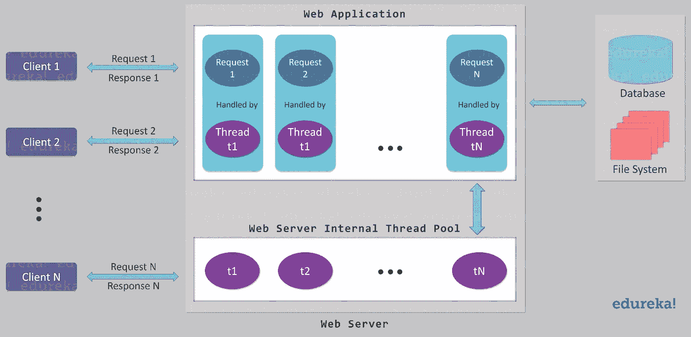

为了避免这一点，Node.js 使用了**单线程事件循环模型** **架构**。这意味着 Node.js 上的所有客户端请求都在同一个线程上执行。但是这个架构不仅仅是单线程的，还是事件驱动的。它帮助 Node.js 同时处理多个客户端。下图显示了单线程事件循环模型架构。

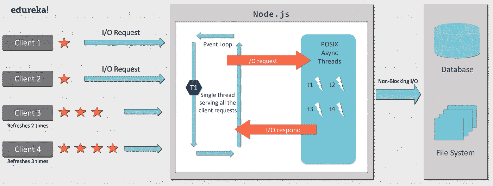

如图所示，主事件循环是单线程的，而 I/O 工作线程是在不同的线程上执行的。这样做是为了适应整个事件循环，其中大多数 Node.js API 被设计为异步/非阻塞的。这减少了服务器响应时间，提高了应用程序吞吐量。

在 Node.js 教程的下一节中，我将指导您完成 Node.js 的安装过程。

# Node.js 安装

为了在您的系统中安装 NodeJS 和开发应用程序，您需要以下 SDK:

1.  节点. js
2.  NPM(节点包经理)
3.  IDE 或文本编辑器

在 NodeJS 教程的这一节，我将演示如何安装 NodeJS。

**第一步:**你可以从 Node.js 的官方网站下载:[https://nodejs.org/en/download/.](https://nodejs.org/en/download/)


**第二步:**在下载页面，你会看到 Node 的各种版本。您只需点击适合您系统配置的方框。

**第三步:**成功下载软件后，转到下载的文件，双击该文件。

**第四步:**只要你点击文件，安装向导就会出现。选择“下一步”并继续安装。

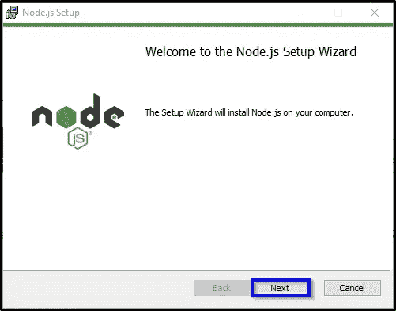

**第 5 步:**选中“我同意”复选框，然后单击“下一步”按钮。

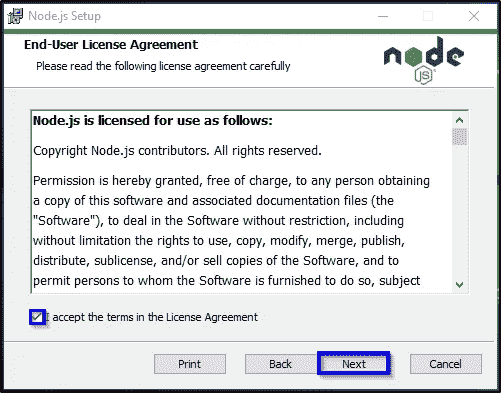

**第 6 步:**点击“更改”，设置 NodeJs 文件的安装路径，然后点击“下一步”。

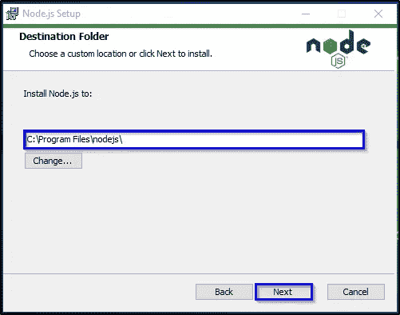

**第 7 步:**再次点击下一步。

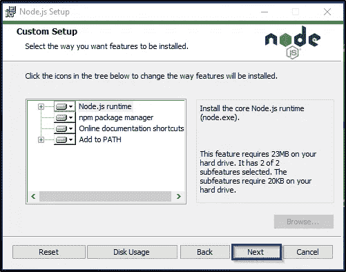

**第 8 步:**现在，点击“安装”按钮，完成安装过程。

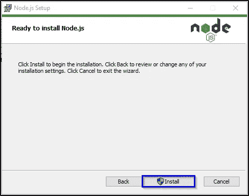

**步骤 9:** 安装完成后，单击“完成”按钮退出安装向导。

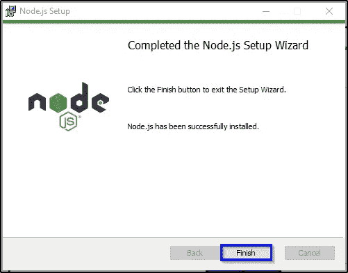

现在，您可以从 Node.js 中的第一个程序开始了。

**要验证安装是否成功，请尝试执行 Node.js 文件。**

打开你的 IDE/文本编辑器，输入下面的代码。

```
console.log('Welcome To Edureka NodeJS Tutorial!');
```

使用. js 扩展名保存文件，例如 filename.js

现在打开 Node.js 命令提示符，导航到包含 js 文件的文件夹。现在，键入下面的命令并按 enter 键，以在您的控制台中显示文本。

```
node filename.js
```

这是一个在控制台上打印数据的基本程序。现在让我们更进一步，看看如何在浏览器上部署实际代码。但在此之前，您需要了解 Node.js 的本质。

在本文的下一部分，我将讨论 Node.js 最重要的组件，即 npm。

# NPM(节点包经理)

NPM 代表节点包管理器，顾名思义，它是 Node.js 包/模块的包管理器。来自节点版本 0.6.0。从现在开始，npm 已作为默认选项添加到节点安装中。它将您从显式安装 npm 的麻烦中解脱出来。

***NPM 主要通过两种方式提供帮助:***

1.  提供并托管 node.js 包/模块的在线存储库，可以轻松下载并在我们的项目中使用。你可以在这里找到他们:[npmjs.com](https://www.npmjs.com/)
2.  提供命令行实用程序，以便安装各种 Node.js 软件包，管理 Node.js 版本和软件包的依赖关系。

但是现在，您一定想知道这些模块到底是什么，它们如何帮助我们构建 Node.js 应用程序。在 Node.js 教程的下一节中，我将向您全面介绍 Node.js 模块。

# Node.js 模块

Node.js 中的模块代表了捆绑到单个或多个 js 文件中的各种功能。这些模块有一个独特的上下文，因此，它们不会干扰或污染其他模块的范围。

这些模块实现了代码的可重用性，提高了易用性。Node.js 基本上提供了三种类型的模块:

1.  核心模块
2.  本地模块
3.  第三方模块

## 核心模块

由于 Node.js 是一个非常 ***轻量级的*** 框架，核心模块捆绑了绝对最少的功能。这些模块通常在节点进程开始执行时加载。您需要做的就是，导入这些核心模块，以便在您的代码中使用它们。

下面我列出了几个重要的核心模块。

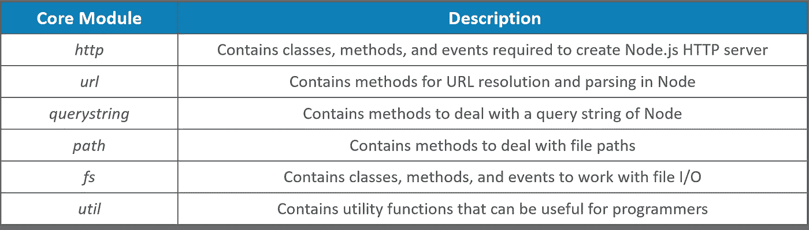

您可以使用下面的代码加载您的核心模块:

```
var module = require('module_name');
```

现在让我们看看，什么是“本地模块”。

## 本地模块

Node.js 的本地模块是用户/开发人员在应用程序中本地创建的自定义模块。这些模块可以包括捆绑到不同文件和文件夹中的各种功能，这些文件和文件夹可以使用 NPM 在 Node.js 社区中轻松分发。

这些模块的加载方式与核心模块相似。让我们用一个基本的例子来告诉你如何去做。

*创建您的自定义/本地 module.js 文件*

```
var detail = {
  name: function (name) {
    console.log('Name: ' + name);
  },
  domain:function (domain) {
    console.log('Domain: ' + domain);
  }
};module.exports = detail;
```

将模块文件包含在主应用程序文件中。

```
var myLogModule = require('./Local_module.js');
myLogModule.name('Edureka');
myLogModule.domain('Education');
```

现在，您可以使用以下命令执行这些文件:

```
node application.js
```

现在让我向您展示什么是外部模块。

## 外部模块

您只能通过 NPM 下载来使用外部或第三方模块。这些模块一般都是其他开发者开发的，可以免费使用。一些最好的外部模块是 express、react、gulp、mongoose、mocha 等。

*全局加载第三方模块:*

```
npm install --g <module_name>
```

*在你的主应用文件中包含你的模块文件:*

```
npm install --save <module_name>
```

# JSON 文件

Node.js 中的 **package.json 文件**是整个应用程序的核心。它基本上是包含项目元数据的清单文件。因此，理解和使用这个文件对于成功的节点项目开发变得非常重要。

package.json 文件通常由应用程序的元数据组成，这些元数据进一步分为以下两类:

1.  **识别元数据属性:**这包括项目名称、当前模块版本、许可证、项目作者、项目描述等属性。
2.  **直接写入文件:**您可以将必要的信息直接写入 package.json 文件，并将其包含在您的项目中。

到目前为止，您已经熟悉了 Node JS 应用程序的各种组件。在 Node.js 教程的下一部分，我将分享一些 Node Js 基础知识，这样我们就可以开始动手了。

# Node.js 基础知识

现在，我将向您介绍一些 Node.js 基础知识，例如:

## 数据类型

像任何其他编程语言一样，Node.js 有各种数据类型，这些数据类型进一步分为基本数据类型和非基本数据类型。

***原始数据类型有:***

1.  线
2.  数字
3.  布尔代数学体系的
4.  空
5.  不明确的

***非原语数据类型有:***

1.  目标
2.  日期
3.  排列

## 变量

变量是保存在程序运行过程中可能变化的值的实体。要在 Node.js 中创建一个变量，需要使用一个保留的关键字 var。您不必指定数据类型，因为编译器会自动选择它。

***语法:***

```
var varName = value;
```

## 经营者

Node.js 支持以下运算符:

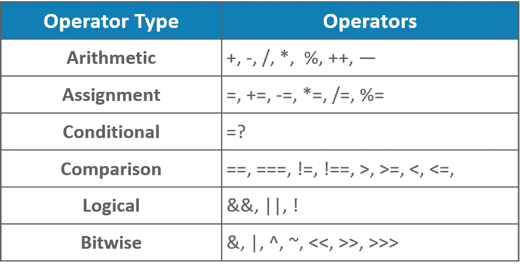

## 功能

Node.js 中的 Functions 是一个有名字的代码块，编写它是为了完成一个特定的任务。您需要使用关键字函数来创建它。函数通常是一个两步过程。首先是定义函数，其次是调用它。下面是创建和调用函数的语法:

***语法:***

```
//Defining a function
function display_Name(firstName, lastName) {
  alert("Hello " + firstName + " " + lastName);
}//Invoking the function
display_Name("Park", "Jimin");
```

## 目标

对象是一种非原始数据类型，可以根据属性和方法保存多个值。Node.js 对象是独立的实体，因为没有类的概念。您可以通过两种方式创建对象:

1.  使用对象文字
2.  使用对象构造函数

***语法:***

```
// object with properties & method
var employee = {
  //properties
  firstName: "Minho",
  lastName: "Choi",
  age: 35,
  salary:50000,
  //method
  getFullName: function () {
    return this.firstName + ' ' + this.lastName
  }
};
```

# 文件系统

为了访问物理文件系统，Node.js 使用了 **fs** 模块，该模块基本上负责所有异步和同步文件 I/O 操作。使用以下命令导入该模块:

```
var fs = require('fs');
```

文件系统模块的一些一般用途包括:

## **读取文件**

1.  fs.readFile()

```
var http = require('http');
var fs = require('fs');
http.createServer(function (req, res) {
  fs.readFile('script.txt', function(err, data) {
    res.writeHead(200, {'Content-Type': 'text/html'});
    res.write(data);
    res.end();
  });
}).listen(8080);
```

## **创建文件**

1.  appendFile()
2.  打开()
3.  writeFile()

## **更新文件**

1.  fs.appendFile()
2.  fs.writeFile()

## **删除文件**

1.  fs.unlink()

## **重命名文件**

1.  fs.rename()

因此，使用这些命令，您几乎可以对文件执行所有需要的操作。现在让我们继续学习 Node.js 教程，看看什么是事件以及它们在 Node.js 中是如何处理的。

# 事件

正如我已经提到的，Node.js 应用程序是单线程和事件驱动的。Node.js 支持并发性，因为它是事件驱动的，因此利用了事件和回调等概念。async 函数调用 help Node.js 来维护整个应用程序的并发性。

基本上，在 Node.js 应用程序中有一个等待和监听事件的主循环，一旦任何事件完成，它就立即启动一个回调函数。

下图显示了 Node.js 中事件的驱动方式

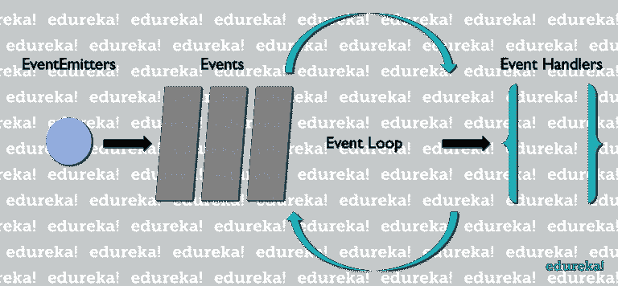

以下代码显示了 Node.js 中事件执行的简单表示。

```
var emitter = require('events').EventEmitter;function iterateProcessor(num) {
  var emt = new emitter();setTimeout(function () {for (var i = 1; i <= num; i++) {
          emt.emit('BeforeProcess', i);console.log('Processing Iteration:' + i);emt.emit('AfterProcess', i);
        }
      }
      , 5000)return emt;
}
var it = iterateProcessor(5);it.on('BeforeProcess', function (info) {
  console.log('Starting the process for ' + info);
});it.on('AfterProcess', function (info) {
  console.log('Finishing processing for ' + info);
```

# HTTP 模块

通常，Node.js 用于开发基于服务器的应用程序。使用它，您可以轻松地创建能够响应客户端请求的 web 服务器。http 和 request 等模块有助于 Node.js 处理服务器请求。

下面我写了一段代码，展示了如何在 Node.js 中开发 Web 服务器。

```
var http = require('http');
var url = require('url');var server = http.createServer(function (req, res) {
  res.writeHead(200, ('Content-Type', 'text/html'));
  var q = url.parse(req.url, true).query;
  var txt = q.year + " " + q.month;
  res.end(txt);
});server.listen(8082);
```

在 Node.js 教程的下一部分，我将讨论 Express.js，它大量用于服务器端 web 应用程序开发。

# 快递. js

Express.js 是一个构建在 Node.js 之上的框架，有助于管理服务器和服务器端应用程序中的路由之间的数据流。它是一个轻量级的灵活框架，提供了 web 和移动应用程序开发所需的广泛特性。

Express.js 是在 Node.js 的中间件模块 ***connect*** 上开发的。connect 模块进一步利用一个 **http** 模块与 Node.js 通信。因此，如果您正在使用任何基于 connect 的中间件模块，那么您可以很容易地与 Express.js 集成

不仅如此，Express.js 的几个主要优势是:

*   使 web 应用程序开发更快
*   帮助构建单页、多页和混合类型的移动和 web 应用程序
*   Express 提供了两个模板引擎，即杰德和 EJS
*   Express 遵循模型-视图-控制器(MVC)架构
*   与 MongoDB、Redis、MySQL 等数据库集成
*   定义一个错误处理中间件
*   简化应用程序的配置和定制。

有了所有这些特性，Express 承担了 MEAN 堆栈中后端部分的责任。Mean Stack 是用于构建动态网站和 web 应用程序的开源 JavaScript 软件堆栈。这里，**表示**代表 **M** ongoDB， **E** xpress.js， **A** ngularJS， **N** ode.js

现在让我们看一个简单的例子来理解 Express.js 如何与 Node.js 一起工作来简化我们的工作。但是在开始使用 Express.js 之前，您需要将它安装到您的系统中。

要全局安装 Express.js，您可以使用以下命令:

```
npm install -g express
```

或者，如果您想将它本地安装到您的项目文件夹中，您需要执行以下命令:

```
npm install express --save
```

既然我们已经完成了所有的准备工作，现在让我们直接进入实际的实现。这里，我将展示一个使用 Node.js 和 Express.js 的简单用户认证应用程序。

为此，我们需要以下文件:

*   package.json
*   script.js
*   视图

1.  index.jade
2.  login.jade
3.  安全.翡翠
4.  未经授权. jade
5.  欢迎，杰德

*   解放运动

1.  routes.js

所以，我们先从 **package.json** 说起。

```
{
  "author": "Edureka",
  "name": "Express_Demo",
  "description": "Express with Node.js",
  "version": "0.0.0",
  "scripts": {
    "start": "node script.js"
  },
  "engines": {
    "node": "~0.4.12"
  },
  "dependencies": {
    "connect-flash": "^0.1.1",
    "cookie-parser": "^1.4.3",
    "express": "^3.21.2",
    "jade": "^0.20.3",
    "req-flash": "0.0.3"
  },
  "devDependencies": {}
}
```

接下来，您需要创建 **script.js** 。

```
var express = require('express');
var http = require('http');
var port = 8999;
var app = express();
const flash = require('connect-flash');
var cookieParser = require('cookie-parser')
var server = http.createServer(app);function checkAuth (req, res, next) {
   console.log('checkAuth ' + req.url);// don't serve /secure to those not logged in
   if (req.url === '/secure' && (!req.session || !req.session.authenticated)) {
      res.render('unauthorised', { status: 403 });
      return;
   }next();
}
    app.use(flash());
   app.use(cookieParser());
   app.use(express.session({ secret: 'example' }));
   app.use(express.bodyParser());
   app.use(checkAuth);
   app.use(app.router);
   app.set('view engine', 'jade');
   app.set('view options', { layout: false });require('./lib/routes.js')(app);app.listen(port);
console.log('Node listening on port %s', port);
```

现在，创建一个名为 view 的文件夹，在这个文件夹下，您将添加负责各种页面视图的 jade 文件。您需要创建的第一个视图文件是 **index.jade** 。

```
!!! 5
html(lang='en')
   head
      title User Authentication Example
      <link href="[https://stackpath.bootstrapcdn.com/bootswatch/4.2.1/darkly/bootstrap.min.css](https://stackpath.bootstrapcdn.com/bootswatch/4.2.1/darkly/bootstrap.min.css)" rel="stylesheet" integrity="sha384-F7cPHYSdE3FzBKvdxDKyFow9Y28Yq7KGHQOKpOI+rwc8s6jJnp///mpEJAib2EM6" crossorigin="anonymous">body
      h1
         center Authentication Demo using Express
         h3 Navigate to
         h4
         ul
            li: a(href="/secure") Secure content
            li: a(href="/welcome") Welcome page
            li: a(href="/logout") Logout
```

现在，创建 **login.jade** 文件。

```
!!! 5
html(lang='en')
   head
      title Express authentication example
      <link href="[https://stackpath.bootstrapcdn.com/bootswatch/4.2.1/darkly/bootstrap.min.css](https://stackpath.bootstrapcdn.com/bootswatch/4.2.1/darkly/bootstrap.min.css)" rel="stylesheet" integrity="sha384-F7cPHYSdE3FzBKvdxDKyFow9Y28Yq7KGHQOKpOI+rwc8s6jJnp///mpEJAib2EM6" crossorigin="anonymous">
   body
      h1
         center Sign-in to this Express authentication example
      center
         p Use <i>user</i> for the username and <i>pass</i> for the password.form(method='post')
            p
            label(for='username') Email Address
            input(type='text', name='username', class='form-control', id='exampleInputPassword1' , placeholder='Email', style='width:400px;')
            p
            center
            label(for='password') Password
            input(type='password', name='password', class='form-control' , id='exampleInputPassword1', placeholder='Password', style='width:400px;')p
            center <button type="submit" class="btn btn-info">Submit</button>
      - each message in flash
         h4(style="color: red;") #{message}
```

下一步是创建 **welcome.jade** 。

```
!!! 5
html(lang='en')
   head
      title User Authentication Example
      <link href="[https://stackpath.bootstrapcdn.com/bootswatch/4.2.1/darkly/bootstrap.min.css](https://stackpath.bootstrapcdn.com/bootswatch/4.2.1/darkly/bootstrap.min.css)" rel="stylesheet" integrity="sha384-F7cPHYSdE3FzBKvdxDKyFow9Y28Yq7KGHQOKpOI+rwc8s6jJnp///mpEJAib2EM6" crossorigin="anonymous">
   body
      h1
         center Welcome To The Edureka Tutorial!
```

接下来，创建 **secure.jade** 文件。

```
!!! 5
html(lang='en')
   head
      title Express Authentication Example
      <link href="[https://stackpath.bootstrapcdn.com/bootswatch/4.2.1/darkly/bootstrap.min.css](https://stackpath.bootstrapcdn.com/bootswatch/4.2.1/darkly/bootstrap.min.css)" rel="stylesheet" integrity="sha384-F7cPHYSdE3FzBKvdxDKyFow9Y28Yq7KGHQOKpOI+rwc8s6jJnp///mpEJAib2EM6" crossorigin="anonymous">
   body
      h1
         center Hi, secure user.
      p Navigate to
         ul
            li: a(href="/secure") Secure content
            li: a(href="/welcome") Welcome page
            li: a(href="/logout") Logout
```

现在，创建**authorized . jade**文件。

```
!!! 5
html(lang='en')
   head
      title User Authentication Example
      <link href="[https://stackpath.bootstrapcdn.com/bootswatch/4.2.1/darkly/bootstrap.min.css](https://stackpath.bootstrapcdn.com/bootswatch/4.2.1/darkly/bootstrap.min.css)" rel="stylesheet" integrity="sha384-F7cPHYSdE3FzBKvdxDKyFow9Y28Yq7KGHQOKpOI+rwc8s6jJnp///mpEJAib2EM6" crossorigin="anonymous">
   body
      h1
         center Unauthorized
      p You're unauthorized to view this page.
      p Please <a href="/login">login</a> to continue
```

现在，您需要创建一个文件夹，并将其命名为 **lib** 。现在，创建一个 **route.js** 文件来映射所有的页面。

```
var util = require('util');module.exports = function (app) {app.get('/', function (req, res, next) {
      res.render('index');
   });app.get('/welcome', function (req, res, next) {
      res.render('welcome');
   });app.get('/secure', function (req, res, next) {
      res.render('secure');
   });app.get('/login', function (req, res, next) {
      res.render('login', {flash: req.flash() } );
   });app.post('/login', function (req, res, next) {// you might like to do a database look-up or something more scalable here
      if (req.body.username && req.body.username === 'user' && req.body.password && req.body.password === 'pass') {
         req.session.authenticated = true;
         res.redirect('/secure');
      } else {
         req.flash('error', 'Username and password are incorrect');
         res.redirect('/login');
      }});app.get('/logout', function (req, res, next) {
      delete req.session.authenticated;
      res.redirect('/');
   });};
```

至此，Node.js 教程到此结束。我希望我能够从头开始解释 Node.js 的概念。如果你想查看更多关于人工智能、Python、道德黑客等市场最热门技术的文章，你可以参考 Edureka 的官方网站。

请留意本系列中的其他文章，它们将解释 Node.js 的各个方面

> 1. [NodeJS 教程](/edureka/node-js-tutorial-800e03bc596b)
> 
> 2.[使用 Node.js 和 MySQL 构建 CRUD 应用程序](/edureka/node-js-mysql-tutorial-cef7452f2762)
> 
> 3.[使用节点构建 CRUD 应用程序。JS 和 MongoDB](/edureka/node-js-mongodb-tutorial-fa80b60fb20c)
> 
> 4.[提出 Node.js 请求的 3 种最佳方式](/edureka/node-js-requests-6b94862307a2)
> 
> 5.[如何对 Node.js App 进行 Dockerize？](/edureka/node-js-docker-tutorial-72e7542d69d8)
> 
> 6.[用 Node.js 构建 REST API](/edureka/rest-api-with-node-js-b245e345f7a5)
> 
> 7.[提出 Node.js 请求的 3 种最佳方式](/edureka/node-js-requests-6b94862307a2)
> 
> 8. [Express.js 基础](/edureka/learn-node-js-b3a9c6fb632c)

*原载于 2019 年 1 月 4 日*[*www.edureka.co*](https://www.edureka.co/blog/nodejs-tutorial/)*。*