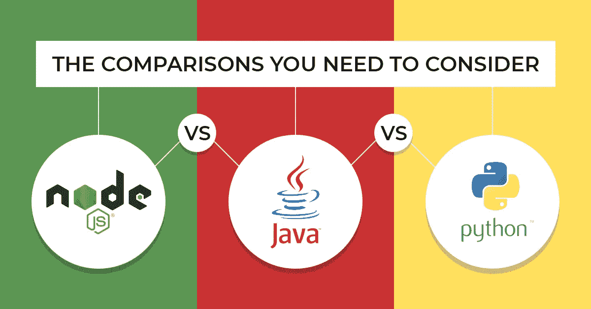
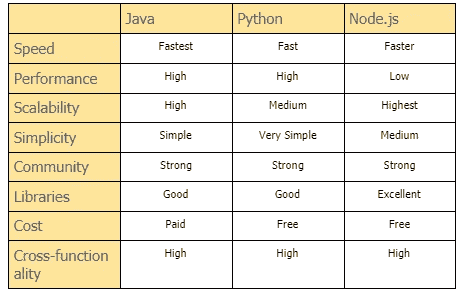
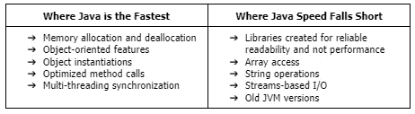
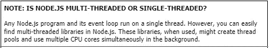

# node . js Vs JAVA Vs Python——如何选择最好的后端技术栈？

> 原文：<https://medium.com/quick-code/node-js-vs-java-vs-python-how-to-choose-the-best-backend-tech-stack-82833df0bb4e?source=collection_archive---------0----------------------->

## node . js Vs JAVA Vs Python——2021 年构建后端的更好方式

Image By: Author

*寻找最好的后端技术堆栈？在 Node.js Vs. Java Vs. Python 之间迷茫？别担心！进行详细的比较，为你的项目选择一个合适的。*

Python、Java 和 Node.js 是流行的后端选择。他们授权给全球成功的品牌，如谷歌、维基百科、网飞、LinkedIn，甚至 NASA。这三家公司都享有突出的市场地位，拥有数百万开发者和价值数十亿的项目开发。

所以，当开发人员坐下来为他们的项目选择后端编程语言时，他们如何决定哪种语言更好呢？

Node.js、Python 和 Java 作为该领域显而易见的先驱陷入了控制权之争。互联网上充斥着 NodeJS 与 Python、NodeJS 与 Java 或 Python 与 Java 的比较信息。但是，作为一名开发人员，我相信关于这个主题的问题已经发生了变化。现在，没有绝对的答案，而是一个间接的选择。

例如，如果我正在选择一个后端，下面是我想知道的。

1.  在 Java、Python 和 NodeJS 中，哪个对我的项目后端有效？
2.  期望他们中的一个赢，成为最好的，公平吗？

这就是我们将在节点间选择最佳后端技术堆栈的优化方法的思维框架。JS、Java 和 Python。

> *让我们努力找到答案，好吗？*

# Java、Node.js 和 Python 简介

在我们深入了解 Node.js 与 Java 和 Python 的本质区别之前，先快速了解一下它们各自是什么。

## Java 是什么？

Java 是一种高级的、基本上面向对象的语言。它从 1995 年就开始运作，并在这 26 年的大部分时间里一直是首选的发展选择。此外，它总是随着市场的变化而变化，并通过多年来的广泛创新和反馈整合来解决其弱点。

## Python 是什么？

Python 是一种有三十年历史的解释型高级脚本语言。它被实现为 web 应用程序的脚本语言，并以其代码可读性而闻名。多年来，它一直是十大最佳后端技术栈中唯一一个地位稳定的语言。它目前被领先的组织使用，如谷歌，欧洲核子研究中心，美国宇航局，脸书，亚马逊，Instagram，Spotify，ITA，雅虎等。

## Node.js 是什么？

与 Python 和 Java 相比，Node。JS 相对来说是个新人。然而，尽管它在 2009 年首次发布，它一直是最好的开源后端运行时环境之一。截至目前，它为全球知名企业提供支持，如微软、GoDaddy、IBM、LinkedIn、网飞、乐天、PayPal、沃尔玛等。

# Node.js 与 Python 和 Java 的比较概述

看看当今开发人员所知的三个最好的后端技术栈。使用这些关键标准对它们进行比较，并为您的项目选择理想的资源。

Image By: Author

## 1.Java Vs. Node.js Vs. Python:速度

在这三者之间，现代 Java 几乎总是提供更高、更优化的速度。其实可以比 Python 或者 PHP 快十倍。原因-

> *有效的本机代码编译器基于线程的内存共享即时编译广泛开发的 Java 虚拟机统计类型化语言字节码预编译*

当然，实现这种潜力很大程度上取决于您如何使用 Java。有些情况下，Java 速度不够快。尽管，不匹配的用例、遗留代码和开发人员在大多数情况下都是罪魁祸首。

Image By: Author

在 Java 不能产生足够快的速度的情况下，Node.js 是 Java 的一个很好的替代品。

而且 Node.js 和 Python 之间，前者胜在速度。Node.js 是最快的服务器端解决方案之一。V8 引擎将 JavaScript 代码解释为机器语言，并优化解决方案以减少加载时间。此外，它遵循事件驱动的架构。由此产生的异步调用通过限制内存问题促进了更好的并发请求处理。

> 这就是为什么尽管是单线程的，Node.js 还是比 Python 快。

Image By: Author

## 2.Java Vs. Node.js Vs. Python:性能

在考虑 Java Vs. Node.js Vs. Python 性能标准之前，要理解用例与性能约束之间的联系。

虽然其中一种后端语言可能适合实时解决方案和任务关键型应用程序，但另一种可能更适合大型项目。因此，在为此目的选择最佳后端技术堆栈之前，真正了解您想要实现的目标至关重要。

Java 内置了多线程。Node.js 的版本是 V8。而 Python，嗯，性能不是它最好的方面。

然而，如果您正在创建一个不需要超快的解决方案，您可以选择 Python。只要您的客户和最终用户能够在解决方案上工作而不会遇到任何明显的速度下降，那么无论您选择哪种后端语言都是可以接受的。

话虽如此，如果你想了解 Node.js 与 Java 和 Python 的确切性能指标，请查看这个[计算机语言基准游戏](https://benchmarksgame-team.pages.debian.net/benchmarksgame/fastest/python.html)。

## 3.Java Vs. Node.js Vs. Python:可伸缩性

*在确定可伸缩性时，问任何语言这样一个问题——是否有通过额外的资源来绕过其性能限制的机会？*

答案会因语言和您的开发需求而异。

由于微服务、事件驱动架构和非阻塞 I/O，Node.js 非常具有可伸缩性。它允许创建微服务和模块。每当解决方案扩展时，这些微服务和模块都求助于动态流程运行，并保持对性能和速度的检查。

Java 提供了大量的扩展机会。

Java 使用自动垃圾收集器进行内存管理。它防止程序员担心手动内存管理，并帮助我们避免内存泄漏。结合优化的生态系统，这个模块使 Java 成为可伸缩 web 开发的不错选择。

然而，Java 生态系统支持某些元素，这些元素使得扩展变得复杂。这些包括-

> *多线程垂直扩展共享内存状态单片组件多层结构。*

您可以跳出框框思考，或者雇佣具有适当经验和技能的 Java 开发人员在 Java 系统中实现可持续的可伸缩性。所以，这不是一场完全失败的游戏。然而，使用 Java 进行伸缩需要理解多个组件、它们的用途和效用。

在扩展系统时，Python 代码很难维护。它是一种动态类型的脚本语言，因此，它的执行速度通常比编程语言慢。Python 代码是在运行时解释的纯文本。随着代码的增长，文本的数量也在增长。最终，系统变得过于复杂，跟踪点可能会丢失。

## 4.Java Vs. Node.js Vs. Python:简单性

编程语言的简单性受其语法、表达式和概念的影响。一门语言越容易写，它的学习曲线就变得越平滑。当在 Node.js 还是 Python 还是 Java 之间做出选择时，简单性对于不完全熟悉目标语言的开发人员来说非常重要。

**Java:**

Java 的语法非常类似于 C/C++，唯一的区别是它完全是基于面向对象编程的原则构建的。它更简单、更轻便、更紧凑，对于任何对基本 OOP 概念有所了解的人来说都非常容易理解。

然而，Java 编程既不是最容易也不是最复杂的语言。您不需要理解内存管理或垃圾收集的复杂性。语法可以很快掌握。但是，虽然这很容易学，但是要学好却很难。

**蟒蛇:**

另一方面，Python 是一种非常易读的编程语言。它展示了视觉上简化的格式、英语关键字和最少的语法异常。因此，它有一个流线型的学习曲线。Python 的语法有助于开发人员避免额外的代码，同时促进更好的表达和组织。总的来说，它有助于简化代码维护和升级。它更容易理解并且在实现中是通用的。

**Node.js:**

就语法而言，Node.js 很简单。由于 JavaScript 相对简单，Node.js 的学习曲线很短，但有些地方很陡。

理解它的运行时环境可能具有挑战性。实现异步编程需要仔细检查和掌握异步挂钩、模式、行为和语法。同样，运行时环境分布在几个概念中，您必须通过这些概念才能成功创建 Node.js 后端。

## 5.Java Vs. Node.js Vs. Python:社区

这三种语言都已在各自的利基市场站稳了脚跟。Java 和 Python 都有二十多年的历史了。所以自然地，他们享受着多样化的、全球分布的社区，有活跃的成员和大量的贡献。Node.js 是相对较新的技术。尽管如此，它有一个相当大的社区。

## 6.Java Vs. Node.js Vs. Python:库

Python 编程语言提供了一系列库——一个具有巨大潜力的功能先进模块的标准集合。每一个标准库更新都附带了关于如何最好地利用这个后端技术栈的完整文档。这个庞大的库提供了广泛的设施，并提供了许多标准化解决方案，从而使编码变得方便。

作为一门有 26 年历史的语言，Java 拥有大量的开源库。它们几乎涵盖了 Java 中所有主要的编程概念。您也可以为一项任务找到多项资源。

当使用 Node.js 时，你会发现 NPM (Node.js 包管理器。)它是一个免费的在线存储库，通过存储 Node.js 包来促进和简化 JavaScript 开发。超过 1100 万开发人员[选择了 NPM，有超过 100 万的软件包可供选择，这个软件注册中心轻松地在 Node.js、Java 和 Python 之间进行选择。](https://www.npmjs.com/)

## 7.Java Vs. Node.js Vs. Python:性价比

开发和启动 Java、Node.js 或 Python 的总成本取决于几个因素。但是，在大多数情况下，总体数字仍然具有成本效益。

**蟒蛇:**

Python 以不同的方式帮助最小化软件开发成本。它以框架、工具和库的形式提供了广泛的开源帮助。它的语法确保了快速开发和简单的代码维护。凭借其众多的库，您可以创建大型的多层解决方案，而无需投入额外的时间或精力。而且，通过一种高度测试驱动的方法，Python 使您更容易及时地满足项目需求并获得高质量的结果。

**Node.js:**

开发 Node.js 应用程序或签约一家 [**NodeJS 开发公司**](https://www.suntecindia.com/nodejs-development-services.html) 要花多少钱？

没有为框架或 NPM，因为他们是开源的。额外的第三方集成、API、支付网关、第三方服务或额外支持将是唯一的成本。如果你选择 [**雇佣 NodeJS 开发者**](https://www.suntecindia.com/hire-nodejs-developers.html) ，你也可能会产生一笔费用。

**Java:**

Java 一直都是免费的。这种情况在 2019 年 4 月发生了变化，当时甲骨文 JDK 8 对商业使用施加了限制。甲骨文宣布了对其 JDK 分销和支持系统的几项变更。您可以继续使用 Oracle JDK 8，无需任何进一步的更新。或者，您可以获得对 JDK 8、OpenJDK8 和 OpenJDK 11 二进制文件的完全付费支持。

## 8.Java Vs. Node.js Vs. Python:跨功能

JAVA 是‘一次编码，随处运行’的吉祥物。这种灵活性使它成为为各种功能目标开发移动、web、数据库和网络解决方案的理想选择。

Python 的解释性质可以用来在多台机器上运行单个代码。不需要重新编译或修改代码。由于 Python 还支持广泛的平台、操作系统和工具，因此对于跨功能的[**web 解决方案开发**](https://www.suntecindia.com/web-development-services.html) 来说，它是一个非常好的、省时的工具。

Node.js 在多种设备、平台和系统上运行良好。它可以用来轻松创建网站、网页、应用程序或桌面应用程序，以及基于云的物联网解决方案。

# Java、Node.js 和 Python 的用例

## **最流行的节点用例。JS:**

> *后端和服务器*
> 
> *流媒体实时更新*
> 
> *共享文档编辑*
> 
> *会议*
> 
> *聊天应用*
> 
> *单页应用*
> 
> *微服务*
> 
> *基于物联网的应用*
> 
> *API 脚本*

## **Java 最流行的用例:**

> *网站开发*
> 
> *自动化应用*
> 
> *游戏*
> 
> *大数据*
> 
> *云移动应用*

## **Python 最流行的用例:**

> *网页开发*
> 
> *数据工程*
> 
> *机器学习*
> 
> *人工智能*
> 
> *桂*
> 
> *企业应用*
> 
> *游戏*

# 结论:最好的后端技术堆栈是对您的项目的补充

到目前为止，您已经看到了最关键的约束，这些约束可以帮助您更好地分析 NodeJs、Python 和 Java 的情况。而且，您手头有他们的最佳使用案例。

跟我到目前为止？

太好了！

> 现在，我想让你深入研究一下你的项目并回答这些问题。

1.  **你在造什么？**

> *网站*
> 
> *企业 app*
> 
> *安全解决方案*
> 
> *计算解决方案*
> 
> *解析解*

2.你或你的团队最喜欢哪种编程语言？

3.你是否希望 [**雇佣软件开发人员**](https://www.suntecindia.com/hire-dedicated-developers.html) **来填补技能缺口？**

> *如果你的团队不充足，你会* [***雇佣 Python 开发者***](https://www.suntecindia.com/python-development-services.html) *或者 Java 或者 NodeJS 资源吗？你的预算和工作文化允许这样的外包吗？*

4.**你的 app 可以接受的用户体验是怎样的？**

> *你的目标用户是什么样的？*

5.**您提议的解决方案有哪些环境限制？**

6.**你希望给你的应用增加多少负载？**

7.**您预期的近期和长期扩展需求是什么？**

使用这些问题来更好地了解项目的局限性。将它们与我们在此讨论的约束匹配。然后，问自己最后一件事。

8.**对你来说划算吗？**

这个练习将帮助您根据这里给出的信息采取行动，并推动您走向项目的最佳后端技术堆栈。如果你仍然对 NodeJs、Java 和 Python 有疑问，请在评论中告诉我。