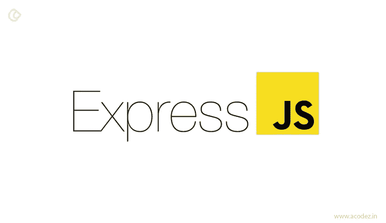
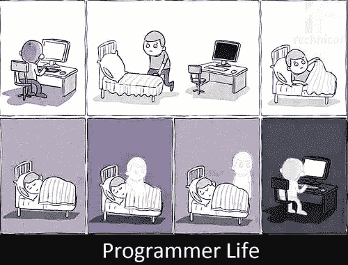

# NodeJS Series — Belajar ExpressJS Dari Awal yok!

> 原文：<https://medium.easyread.co/nodejs-series-belajar-expressjs-dari-awal-yok-400d9a88e73a?source=collection_archive---------0----------------------->

## Part 0 — Motivation

[https://cdn.acodez.in/wp-content/uploads/2017/11/Express.js.jpg](https://cdn.acodez.in/wp-content/uploads/2017/11/Express.js.jpg)

Terinspirasi dari tulisan Bang [Simanjuntak](https://medium.com/easyread/laravel-series-belajar-laravel-dari-awal-yok-c21dc47863da) di [*Easyread*](https://medium.com/easyread) , saya juga jadi kepikiran ingin membuat satu *series* tentang NodeJS Framework dengan ExpressJS. Dengan motivasi yang sama, pembuatan series ini juga dikarenakan belum banyak tulisan yang membahas mengenai ExpressJS secara komprehensif. Untuk saat ini tutorial yang ada kebanyakan hanya membahas pembuatan CRUD (Create, Read, Update, Delete). Meskipun pada dasarnya target akhir dari series ini juga adalah CRUD, *nah* hanya saja saya akan membahasnya dengan cara yang detail, ringkas, padat dan jelas.

Series ini akan terdiri dari 18 part, yaitu:

**0\. NodeJS Series — Belajar ExpressJS dari Awal yok! — (You’re here)** [**1\. Persiapan untuk Pengerjaan Proyek dengan ExpressJS**](https://medium.com/easyread/persiapan-untuk-pengerjaan-proyek-dengan-expressjs-7d2c30196dc0)[**2\. Pengenalan ExpressJS dan Instalasi ExpressJS**](https://medium.com/easyread/nodejs-series-pengenalan-expressjs-dan-instalasi-expressjs-5fda39b9ea58) **3\. Pengenalan Router Pada ExpressJS
4\. Uji Coba Beberapa Template Engine (HBS, EJS)
5\. Pengenalan Http Request dan Http Response pada Express JS
6\. Struktur Folder ExpressJS (MVC)
7\. Pengenalan Middleware pada ExpressJS
8** . **Input Validasi pada ExpressJS
9\. Integrasi dan CRUD Menggunakan Mysql Biasa pada ExpressJS
10\. Upload File pada ExpressJS
11\. Integrasi Text Editor WYSIWYG pada Template Engine
12\. Pengenalan ORM Sequelize (Migrate, ORM Model, Etc)
13\. Integrasi dan CRUD Menggunaka Sequelize pada ExpressJS
14\. Integrasi dan CRUD Menggunakan MongoDB
15\. Membuat REST API pada ExpressJS
16\. Belajar Unit Testing Pada ExpressJS
17\. Mencicipi ORM Knex** *(bonus)* **18\. Mengintegrasikan ReactJS pada Aplikasi ExpressJS** *(bonus)*

*Image taken from Google Images*

Sampai jumpa di- *part* berikutnya yah! 🍪