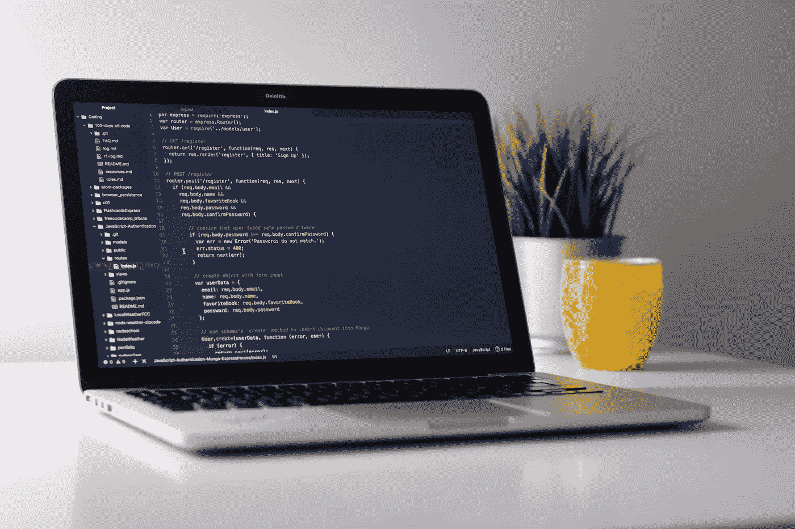

# NodeJS Series — Pengenalan ExpressJS dan Instalasi ExpressJS

> 原文：<https://medium.easyread.co/nodejs-series-pengenalan-expressjs-dan-instalasi-expressjs-5fda39b9ea58?source=collection_archive---------4----------------------->

## Part 2: Instalasi ExpressJS



by : Clement H. Unplash

# ExpressJS Series List

[**0\. NodeJS Series — Belajar ExpressJS dari Awal yok!**](https://medium.com/easyread/nodejs-series-belajar-expressjs-dari-awal-yok-400d9a88e73a)[**1\. Persiapan untuk Pengerjaan Proyek dengan ExpressJS**](https://medium.com/easyread/persiapan-untuk-pengerjaan-proyek-dengan-expressjs-7d2c30196dc0) **2\. Pengenalan ExpressJS dan Instalasi ExpressJS — (You’re here)**

# **Mengenal ExpressJS**

***ExpressJS*** adalah *framework* NodeJs yang didesain sederhana, simple, fleksibel dan mudah digunakan. ExpressJS dengan kesederhanaannya memberikan pengalaman kepada developernya untuk lebih memahami aplikasi yang dibuatnya. Beda halnya dengan Framework Laravel, ExpressJS memberikan kebebasan bagi developer dalam mendesain aplikasinya sehingga setiap developer mungkin bisa berbeda-beda konsep/arsitektur dalam aplikasi yang mereka bangun.

## **Sosok di Balik ExpressJS**

ExpressJS dikebangkan pertama kali oleh developer bernama **TJ Holowaychuk** , sosok ini dikenal tertutup, jarang mengikuti meetup, konferensi, dan dikenal sebagai programmer yang tidak pernah membaca. Sosok TJ jarang kelihatan, tapi dikenal di kalangan *open source* terutama di javascript dan golang, bukan hanya ExpressJS, TJ jugalah sosok dibalik *framework* KoaJS. Keren ya, semoga dapat menginspirasi teman-teman developer di indonesia agar menelurkan karya-karya yang bermanfaat. Pengen kenal lebih jauh tentang TJ ? Silahkan baca di [artikel ini](https://medium.com/@kelas/how-is-tj-holowaychuk-so-insanely-productive-604818b4e9eb) .

# **Instalasi ExpressJS**

Pada tutorial ini kita akan menggunakan skeleton express generator. ExpressJS ini bermanfaat karena dapat memangkas waktu konfigurasi aplikasi pada ExpressJs, cukup dengan menjalankan CLI express generator langsung tercipta boilerplate project ExpressJs. Jalankan perintah dibawah ini untuk install express-generator terlebih dahulu:

```
**npm install -g express-generator**
```

Setelah berhasil terinstall, jalankan perintah dibawah ini untuk mengcreate projek:

```
**express --view=ejs Book**
```


Perintah `**--view=ejs**` adalah perintah untuk memilih template engine yang kita gunakan di projek kita, pada tutorial ini kita menggunakan ejs.

Untuk melihat pilihan *template engine* yang ada bisa menggunakan perintah `**express -h**` . Pada dasarnya perintah diatas hanya membuat V belum termasuk **instalasi depedencies** . Jika ingin mengetahui package apa saja yang dibutuhkan dalam projek ini silahkan buka file **package.json.**


File package.json ini adalah tempat dicatatnya semua package yang ada, jika kamu menambah library baru maka akan tercatat disini.

Selanjutnya masuk ke directory project jalankan perintah command line:

```
**cd Book**
```

Kemudian install *depedenci* yang dibutuhkan dengan perintah:

```
**npm install**
```

Untuk menjalankan servernya jalankan command line berikut:

```
**DEBUG=book:* npm start**
```

Jika berhasil maka akan muncul route http:3000/ seperti gambar berikut :


selanjutnya silahkan akses di browser kesukaanmu.


# **Install Nodemon**

Pada tutorial ini kita juga akan menggunakan tool nodemon, fungsi dari tool ini adalah untuk merestart projek secara otomatis setiap kali ada perubahan pada aplikasi kita sehingga kita tidak mesti berulang-ulang menjalankan server secara di command line. Untuk menginstal nodemon jalankan perintah berikut:

```
**npm install -g nodemon**
```

Jika telah berhasil terinstall, selanjutnya ubah konfigurasi di file package.json, dan tambahkan script **“devstart”: “nodemon ./bin/www”** di object scripts, seperti dibawah ini:

```
“scripts”: { “start”: “node ./bin/www”**,** **“devstart”: “nodemon ./bin/www”**}
```

Selanjutnya jalankan server dengan perintah:

```
**DEBUG=book:* & npm run devstart**
```


Kemudian akses url [http://localhost:3000](http://localhost:3000)

Eureka..!! Prose instalasi expressjs telah selesai. Sampai ketemu di seri berikut nya ya. :D


Image taken from Google Images