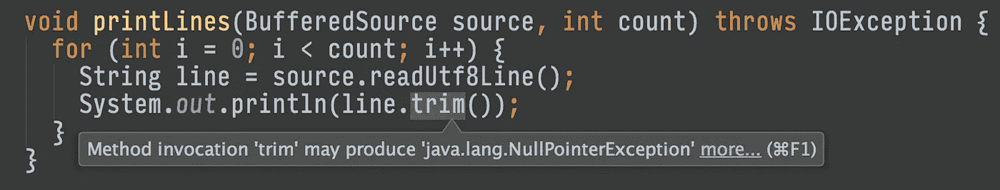

# 非 null 是默认值

> 原文：<https://medium.com/square-corner-blog/non-null-is-the-default-58ffc0bb9111?source=collection_archive---------0----------------------->

> 注意，我们已经行动了！如果您想继续了解 Square 的最新技术内容，请访问我们的新家[https://developer.squareup.com/blog](https://developer.squareup.com/blog)

昨天[我写了](/square-corner-blog/rolling-out-nullable-42dd823fbd89)关于我们如何在 Square 的开源 Java 库中推出`@Nullable`。它帮助我们的工具提醒我们可能的`NullPointerExceptions`。

IntelliJ warns about potential NullPointerExceptions

`@Nullable`给价值的消费者强加了一项义务:他们必须为价值的无效做好准备。但是当我创造价值的时候会发生什么呢？假设我调用了上面的方法。

This doesn’t look broken!

我们有麻烦了。如果文件不存在，这个方法将一个空源传递给`printLines()`，这将触发一个崩溃。我们需要与`@Nullable`相反的东西:一个注释，如果我们把 null 放在不属于它的地方，它会提醒我们。

JSR-305 注解包有这个，叫做`@Nonnull`。我们只需要把它放在我们还没有`@Nullable`的地方。

@Nonnull everywhere!

明确哪些值不能为空可以让我们的工具在我们出错时发出警告。

Yay, broken code looks broken.

可惜，`@Nonnull`到处都是样板文件。这些额外的代码分散了我们正在解决的真正问题的注意力。谢天谢地，有一个解决方案:JSR 305 的`@ParametersAreNonnullByDefault`表明整个包中的所有内容都是非空的，除非另有说明。通过在每个包中创建一个`package-info.java`文件来应用它。

Copy and paste our [package-info.java](https://github.com/square/okhttp/blob/master/okhttp/src/main/java/okhttp3/package-info.java) to get started!

通过耦合`@ParametersAreNonNullByDefault`和`@Nullable`，我们能够安全地使用 null。

如果你正在定义 Kotlin APIs，你不需要非空的注释。默认情况下，整个语言都是非空的，只有以`?`为后缀的类型才可以为空。

如果你从 Kotlin 调用 Java APIs，你需要更加小心。当用于调用 Java APIs 时，这种语言还不支持`@ParametersAreNonnullByDefault`。JetBrains 正在[跟踪这个](https://youtrack.jetbrains.com/issue/KT-10942)，希望它在未来的版本中得到支持。

今天我们发布了 [OkHttp 3.8](https://github.com/square/okhttp/blob/master/CHANGELOG.md) ，这个库在默认情况下一切都是非空的。更新在三个方法中对传入的空值更加严格。请阅读更改日志以避免任何意外！

这篇文章是 Square 的“ [Square 开源♥s·科特林](/square-corner-blog/square-open-source-loves-kotlin-c57c21710a17)系列的一部分。