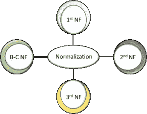
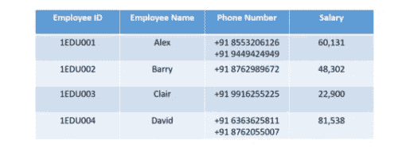
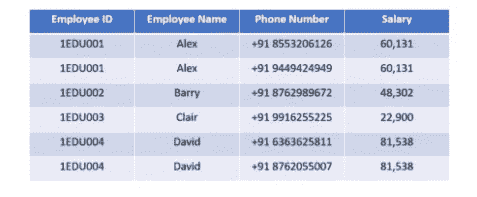
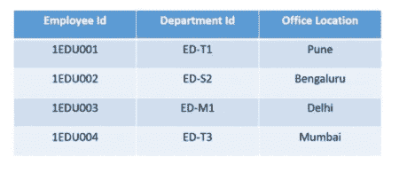
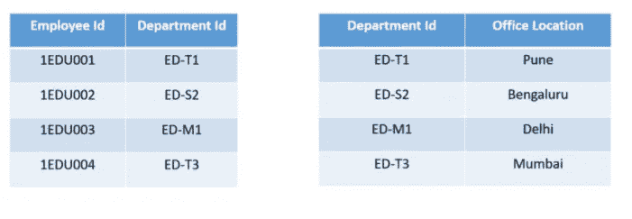
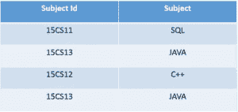
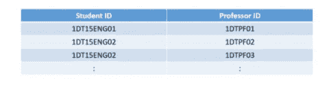
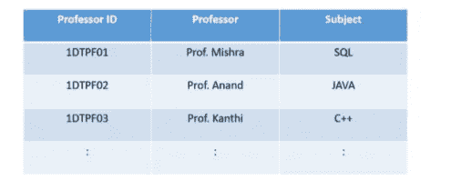

# SQL 及其类型中的规范化

> 原文：<https://medium.com/edureka/normalization-sql-97d38ffb32e?source=collection_archive---------1----------------------->

数据库中的数据存储数量巨大。如果数据没有正确组织，检索某些数据将是一项单调乏味的任务。在规范化的帮助下，我们可以组织这些数据并减少冗余数据。通过这篇文章，我将让您全面了解 SQL 中的规范化。

本文将涵盖以下主题:

1.  什么是数据库中的规范化？

2.什么是 1NF、2NF、3NF 和 BCNF 范式？

*   第一范式(1NF)
*   第二范式(2NF)
*   第三范式
*   博伊斯-科德范式(BCNF)

# 什么是数据库中的规范化？

它是减少表中数据冗余并提高数据完整性的过程。那么，为什么需要这样做呢？如果没有 SQL 的规范化，我们可能会面临许多问题，例如

1.  ***插入异常*** :在没有其他属性存在的情况下，我们无法向表中插入数据时，就会出现这种情况
2.  ***更新异常*** :数据冗余和数据部分更新导致的数据不一致。
3.  ***删除异常*** :因删除其他属性而丢失某些属性时发生。

简而言之，规范化是组织数据库中数据的一种方式。规范化需要组织数据库的列和表，以确保它们的依赖关系由数据库完整性约束来正确实施。

它通常会将一个大表分成多个小表，因此效率更高。1970 年，Edgar F Codd 定义了第一个范式，最终，其他范式也被定义了。

介于两者之间的一个问题是，SQL 与规范化有什么关系。SQL 是用来与数据库交互的语言。要启动任何交互，数据库中的数据必须是规范化的形式。否则我们无法继续下去，因为它会导致异常。

SQL 中的规范化将增强数据的分布。现在让我们用例子来理解每一个范式。

## 第一范式(1NF)

在这种范式中，我们处理原子性的问题。在这里，原子性意味着表中的值不应该被进一步划分。简单来说，一个单元格不能保存多个值。如果表包含复合属性或多值属性，则违反了第一范式。

在上表中，我们可以清楚地看到`Phone Number`列有两个值。因此，它违反了第一 NF。现在，如果我们将第一个 NF 应用于上表，我们得到下表作为结果。

这样，我们实现了原子性，并且每一列都有唯一的值。

## 第二范式(2NF)

第二个 NF 中的第一个条件是表必须在第一个 NF 中。该表也不应包含部分依赖项。这里的部分依赖意味着候选关键字的真子集决定了一个非主属性。为了更好地理解，让我们看下面的例子。

考虑一下桌子

该表有一个复合主键`**Emplyoee ID**, **Department ID**`。非关键属性为`**Office Location**`。在这种情况下，`**Office Location**`只依赖于`**Department ID**`，T3 只是主键的一部分。所以这个表不满足第二范式。

为了使这个表达到第二范式，我们需要把它分成两部分。这将为我们提供以下表格:

如您所见，我们已经移除了最初的部分功能依赖。现在，在该表中，`**Office Location**`列完全依赖于该表的主键`**Department ID**`。

现在我们已经学习了第一和第二范式，让我们进入 SQL 文章中规范化的下一部分。

## 第三范式

同样的规则也适用于前面，即在进行到 3NF 之前，表必须在 2NF 中。另一个条件是非质数属性不应该有传递依赖。这意味着非主属性(不构成候选键)不应该依赖于给定表中的其他非主属性。所以传递依存关系是一种函数依存关系，其中 X → Z (X 决定 Z)通过 X → Y 和 Y → Z 间接实现(Y → X 不存在)

让我们借助一个例子来更清楚地理解这一点:

上表中，`**Student ID**`决定`**Subject ID**`，而`**Subject ID**`决定`**Subject**`。因此，`**Student ID**`通过`**Subject ID**` **决定`**Subject**`。**这暗示我们有一个传递性的函数依赖，这个结构不满足第三范式。

现在为了实现第三范式，我们需要如下所示划分表格:

从上表中可以看出，所有非键属性现在都完全依赖于主键。在第一个表格中，列`**Student Name**` **、** `**Subject ID**`和`**Address**`仅依赖于`**Student ID**`。在第二个表中，`**Subject**`只依赖于`**Subject ID**`。

## Boyce Codd 范式(BCNF)

这也被称为 3.5 NF。它是 3NF 的更高版本，由 Raymond F. Boyce 和 Edgar F. Codd 开发，用于解决某些 3NF 没有解决的异常情况。

在进入 BCNF 之前，该表必须满足第三范式。

在 BCNF 中，如果每个函数依赖关系 **A → B** ，那么 **A** 必须是那个特定表的**超级键**。

考虑下表:

*   一个学生可以注册多个科目。
*   可以有多位教授教授一门课程
*   而且，对于每一门学科，都会给学生指派一名教授

在这个表中，除了 BCNF，所有的范式都满足。为什么？

如您所见，`**Student ID,**`和 `**Subject**`构成了主键，这意味着`**Subject**`列是一个**主属性**。但是，还有一个依赖，→ `**Subject**`。

而`**Subject**`是主属性，`**Professor**`是**非主属性**，这是 BCNF 不允许的。

现在为了满足 BCNF，我们将把桌子分成两部分。一个表将保存已经存在的和新创建的列`**Professor ID**`。

在第二个表中，我们将有列`Professor ID`、 `Professor`和`Subject`。

通过这样做，我们对 Boyce Codd 范式感到满意。

这样，我们就结束了 SQL 文章中的规范化。我希望现在您对规范化概念有了清晰的认识。

至此，我们结束了对 SQL 和 NoSQL 的比较。我希望你们喜欢这篇文章，并理解所有的差异。如果你想查看更多关于人工智能、DevOps、道德黑客等市场最热门技术的文章，那么你可以参考 [Edureka 的官方网站。](https://www.edureka.co/blog/?utm_source=medium&utm_medium=content-link&utm_campaign=normalization-in-sql)

请留意本系列中的其他文章，它们将解释 SQL 的各个方面。

> *1。*[*SQL 之间的差异& NoSQL 数据库*](/edureka/sql-vs-nosql-db-5d9b69ace6ac)
> 
> *2。*[*SQL For Data Science*](/edureka/sql-for-data-science-a8fe10fe2ef9)
> 
> [*3。前 65 个 SQL 面试问题*](/edureka/sql-interview-questions-162f97f37ac2)

*原载于 2019 年 10 月 3 日 https://www.edureka.co**的* [*。*](https://www.edureka.co/blog/normalization-in-sql/)