# NoSQL 数据库并不意味着没有模式

> 原文：<https://medium.com/capital-one-tech/nosql-database-doesnt-mean-no-schema-a824d591034e?source=collection_archive---------1----------------------->

## 手工甜甜圈>手工数据

如果我给你一个手工制作的甜甜圈，它可能会得到一个强调的回答，*“好的，请！”*但是你对我提供的手工数据会有什么反应呢？不规则的、唯一的数据不是很吸引人，所以我猜你会不那么热衷。什么是手工数据？想象一下，每笔商业交易的数据都被写成体育赛事的彩色解说词，*“今天，一对老夫妇买了一盒我们最好的……”*，然后被要求对其进行分类、排序和解释。这就是手工数据的样子——它并不是非常有用。那么，我们能做些什么来确保我们有可用的数据集合，用于有意义的决策呢？

这当然引发了关于数据质量、数据管理甚至数据的基本含义的问题。如何才能相信独一无二的数据？如果它与其他数据不符，它是如何创建的？保存它有什么实际价值吗？虽然 NoSQL 数据库在处理这种情况时提供了很好的灵活性，但是正式的模式定义非常有用。但首先，有一点背景知识，然后我们将看看为什么以及如何才能避免创建手工数据。

当使用 SQL 数据库时，我们经常会遇到定义数据结构的复杂模式。当我们想要对数据库进行更改时，我们可能还必须处理模式更改。进行模式更改的含义包括确保现有数据适合新的模式。或者，更常见的是，当我们修改数据库模式时，现有的应用程序编程不会中断。

为了避免模式更新的成本，聪明的工程师发明了各种打破 SQL 模式的数据库。这里我将使用 [Mongo](https://www.mongodb.com/) 数据库作为例子，但是我们也可以使用 [CouchDB](http://couchdb.apache.org/) 或 [Elasticsearch](https://www.elastic.co/cloud) 数据库。这也适用于所有试图减少或消除与正式模式定义冲突的数据库。

这种方法的缺点是软件永远不会真正摆脱模式的约束。最糟糕的情况是一个非正式的、混乱的模式，其中每个事实都是一片独特的、闪闪发光的雪花。为了进行批量分析，必须对数据进行某种排序。虽然让应用程序代码灵活并能对变化做出响应是件好事，但在某种程度上，过于灵活可能会让人觉得步履蹒跚。那么，我们如何实现高度的灵活性，同时仍然对数据施加有意义的约束呢？

而且没错，这是一个*《蟒蛇来营救》*的故事。很像[我上一篇博文](/capital-one-developers/automating-nosql-database-builds-a-python-to-the-rescue-story-that-never-gets-old-1d9adbcf6792#.r33wlemze)。

# 多重图式

一种 SQL 数据库策略需要使用三种密切相关的模式来描述我们的数据。这些模式提供了一个整洁、正式的定义，可以确保数据和处理一致。这三种模式是:

● **作为数据分析师**，我们关心能够回答我们问题的有意义的数据。在关系数据库中，这个模式是逻辑模型的视图定义和表。

● **作为应用程序开发人员**，我们关心数据的逻辑模型。这个模式将在应用程序代码上强加一个结构。该模式还应该满足许多技术约束，以减少数据重复，并防止“更新异常”。(想象一下当您更新一笔交易而总余额不变时的混乱。数据库工程师称之为“范式”违规。)

● **作为数据库管理员**，我们关心数据的物理模型。此模式定义了数据在某些计算机的文件和磁盘驱动器中的位置。

虽然核心思想是优雅的，但实现可能会导致成本和复杂性的增加。请注意，这些图式没有抓住意义；他们专注于结构。例如，作为数据分析师，我们可能知道理解数据所需的不同策略和约束。像“不完整”和“不适用”这样的值之间的区别不是数据库模式的一部分:在数据库中，它们仅仅是一串字母。然而，对于处理数据的人来说，这些字符串可能反映了意义上的深刻差异。

此外，为了使事情稍微复杂一点，这些模式中的每一个都有几种表示。模式以 SQL 语言语句的形式表示。它们也存在于数据库中，可供数据库引擎使用。此外，它们也反映在应用程序中。开发人员和数据库管理员将编写和执行 SQL 语句来定义和修改数据库结构。开发人员还将编写反映数据库结构的代码(例如，用 Python)。

保持数据库、应用程序处理和 SQL 代码同步是成本和复杂性增加的原因。虽然三模式的想法将不同的社区相互隔离，但这也意味着一个社区的变化会波及到另一个社区。如果开发人员更改了逻辑视图，用户视图的定义可能也需要更改，以便视图保持一致。当业务模型改变时，开发人员可能必须调整逻辑模式——可能还有物理模式——以确保可以处理新的特性。

随着我们的深入，我们将看到不同的模式表示。实际上，应用程序代码是逻辑模式的副本，但是是用 Python 这样的编程语言编写的。这意味着开发人员必须协调模式的代码版本和模式的 SQL 版本。

# NoSQL 自由

一种 NoSQL 数据库方法是避开 SQL 语言。这是减轻正式模式定义负担的一部分。当然，这种自由有可能演变成无政府状态。NoSQL 无政府状态是指似乎需要太多代码才能使数据可用的那种感觉。

以下功能有助于避免无政府状态:

●正式的模式

●仅定义一次

●最好是在代码中

我们需要一个正式的模式来提供数据组织的一个整洁的、集中的定义。我们希望在一个地方定义它，这样我们就不会有冲突。将模式放入应用程序代码意味着应用程序开发人员可以创建模式定义并定义数据处理。几乎显而易见的好处是消除了编写 SQL 语句。另一个好处是允许应用程序开发人员做一些数据库管理工作。这可以降低模式更改的成本和复杂性。

我们如何在没有开销的情况下获得模式的好处？下面我将介绍 Python 中几种可用的技术。

# 即席模式

最容易导致无政府状态和手工数据的方法是隐藏在代码中的完全特定的模式。这里有一个例子，隐藏了一个可能的大失败。

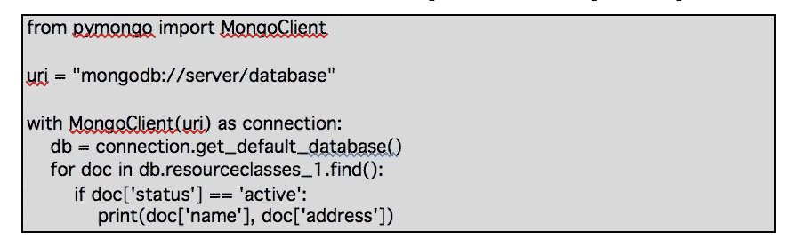

这个失败藏在哪里？在这段代码中， **doc['status']** 、 **doc['name']** 和 **doc['address']** 都基于一些隐式模式定义。其他程序也使用这些字段吗？与该数据库交互的所有程序都同意该模式吗？如果他们不这样做，会发生什么？

正如您所看到的，这种方法会导致手工数据。不同的应用程序可能对数据库中文档结构和集合名称的定义有不同意见。这意味着数据库中的文档没有一个通用的模式，我们的大数据分析变成了大数据清理。更糟糕的是，我们可能有应用程序看不见的数据，或者应用程序产生错误的结果，因为产生数据的程序与分析数据的程序没有相同的模式。

# 对象-文档映射层

有许多 Python 项目提供了 Mongo 数据库文档和 Python 对象之间的映射。可以看 [mongoengine](http://mongoengine.org/) 、 [MongoKit](http://namlook.github.io/mongokit/) ，或者[明基础层](https://ming.readthedocs.io/en/latest/)来解决。

这些都允许我们通过类定义来定义模式。我们可以这样使用:

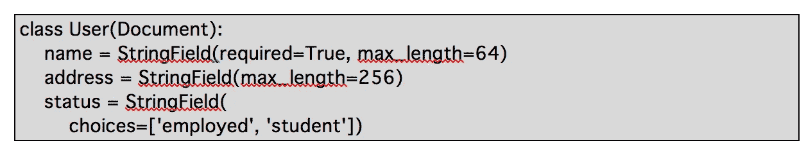

这具有优雅清晰的优点。我们可以将特定于文档的处理作为方法添加到类定义中。添加方法可能有一些优点，但是，它并不是普遍有价值的。

然而，在一些应用中，尤其是大数据分析，细节文档没有任何方法可言。创建这些 Python 对象的处理开销可能没有好处。直接处理低级的 Mongo 友好的 BSON 对象也可能更有效。

如果我们只在 Python 中工作，这些类定义的优点是为数据库中的文档提供了一个整洁、完整的定义。我们可以利用这一点来避免人工数据。

此外，如果我们在多语言环境中工作，我们可能必须在多种编程语言之间共享定义。在这种情况下，Python 类定义并不理想，因为它不能跨语言共享。

# 作为单独元数据的模式

避免混乱的一个好方法是用某种语言不可知的形式来定义模式。这可以在程序和工具之间共享。不同的程序可以在模式上达成一致，我们可以避免手工数据。许多 NoSQL 数据库用 JSON 符号表示文档。我们也可以用 JSON 符号表示模式定义。

***参见***[***http://json-schema.org/***](http://json-schema.org/)***关于使用 JSON 文档的优雅的正式模式规范。***

基于 JSON 的模式定义是 OpenAPI(也称为 Swagger)规范的支柱。它提供了一套相当完整的规则，为我们可以保存在 NoSQL 数据库中的各种文档定义一个模式。我们可以使用 JSON 模式定义来表示模式。然后，在加载数据库文档之前，我们可以使用各种工具来验证文档。在这篇文章中，我们将关注用 jsonschema 项目验证模式和数据。

***详见*******。****

*当我们以 Python 列表和字典的形式处理数据库文档时，我们可以使用 **jsonschema** 来确定这些数据结构是否匹配给定的模式定义。Mongo SON 对象是 Python 字典的扩展，这使得它非常适合使用 **jsonschema** 进行验证。*

*我们将看看 JSON 模式定义的三个用例:**设计和建模**、**数据验证**，以及**模式迁移**。之后，我们将查看三个可以存储模式定义的地方，以便所有 Python(和非 Python)程序都可以使用它。最后，我们将看看 Python 元类，它使这变得相对简单。*

## ***设计和建模***

*数据库设计通常从白板开始。我在骗谁呢？它似乎经常始于一张装满甜甜圈屑的咖啡店餐巾纸。和 ***然后*** *移动到白板。)**

*在某些时候，一个有形的例子比白板上的另一个演示或草图更有价值。使用 Python 时，这一点可能会在项目生命周期的早期出现。我们越早找到具体的例子，就能越早发现反例和性能瓶颈。*

*我个人认为，用 Python 创造技术高峰可能是探索设计替代方案的理想方式。简单地构建 Python 代码并显示数据和性能影响的细节，通常比在相互竞争的演示文稿中反复推敲更容易。*

*假设我们有几百万条客户档案记录。让我们进一步假设我们正在分析统一来自几个业务线的信息的源数据，每个业务线都有一个独特的客户关系视图。*

*我们可以这样开始这个项目。首先，我们可以将近似我们将要使用的文档定义的类放在一起。具有嵌入式模式定义的类可能如下所示:*

*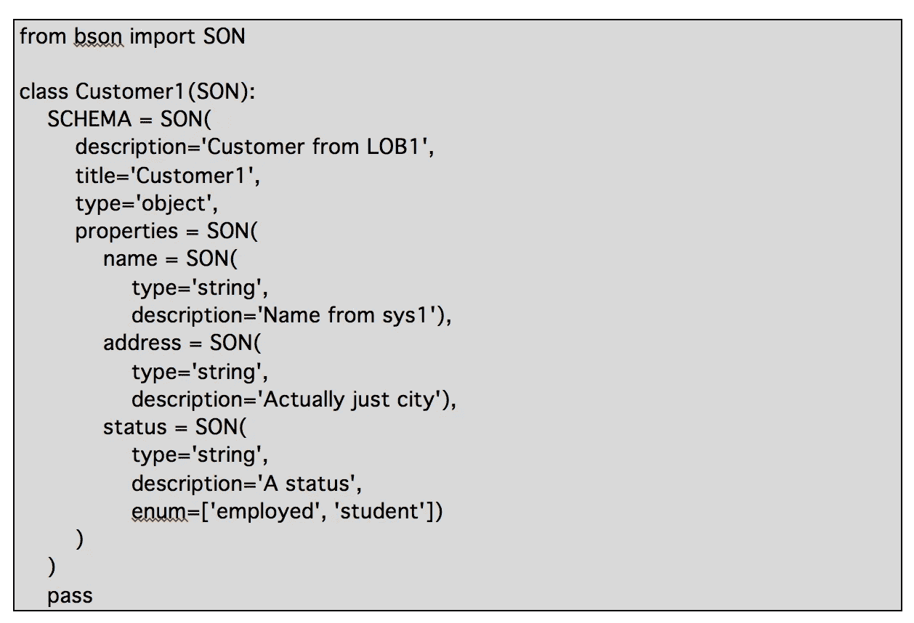*

*该类扩展了 PyMongo **bson。子**类定义。这个类是一个有序的字典，添加了一些 Mongo 友好的特性。*

*在 **Customer1** 类中，我们以 SON 对象的形式提供了 JSON 模式，分配给类级变量 **SCHEMA** 。这个模式可以用于很多事情。*

*因为这个类本质上是一个字典，所以我们可以自由地试验不同种类的文档。我们能够以非常低的成本填充文档并草拟实验处理流程。这就是用 Python 构建的技术尖峰的好处。*

*我喜欢包含 *pass* 语句来确认类中除了 docstring 之外真的没有其他东西。该语句不做任何事情，也不是必需的，但是我发现它是一个有用的提示，表明类定义是完整的。*

*现在，我们可以把用具体例子说明模式的文档放在一起。创建模式的两个实例如下所示:*

*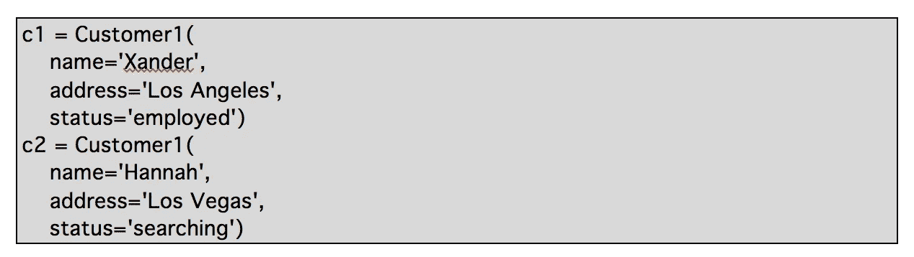*

*我们可以使用这些对象来设计算法和 HTML 表示。当我们更好地理解问题和每个潜在的解决方案时，我们也可以改进模式。*

***注意:**SON 作为基类有一个缺点。属性引用使用大量语法，导致如下表达式:*

*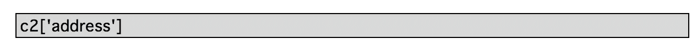*

*通常我们更喜欢使用 **c2.address** 来引用一个属性的值。为此，我们必须使用复杂的元类。这里的要点是快速处理想法，而不是构建最终的应用程序。*

*对于设计和建模，它有助于在每次使用时验证每一个文档。这增加了一点处理开销。知道文档符合模型的好处远远超过成本。*

*那么我们如何知道模式本身是有效的呢？对模式语法的检查如下所示:*

*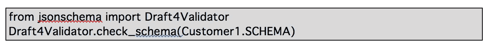*

*我们可以快速检查一下，确保模式本身符合 JSON-Schema 标准。除了一些小的例外，符合 JSON 模式标准的模式也将符合 Open API (Swagger)标准。如果你好奇的话:Swagger 改变了 JSON 模式的一些更高级的特性。Swagger 不使用 ***allOf*** *关键字；它还限制了什么可以出现在一个* ***项*** *，* ***属性*** *和* ***附加属性*** *关键字中。】**

*我们可以使用下面的代码来生成一个 JSON 文档，作为 Swagger 规范中的外部引用:*

*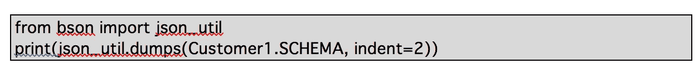*

*这将把**模式**文档翻译成 JSON 符号。*

## ***数据验证***

*仔细观察示例文档——如上所示的 **c1** 和**C2**——我们可以看到文档 **c2** 不符合模式:状态字段具有无效值。当创建技术尖峰时，这是一个方便的特性。一种放松的验证方法允许我们探索问题空间，而不同时与技术障碍作斗争。*

*随着我们向健壮、可扩展的解决方案迈进，数据必须是有效的。数据验证是一个复杂的主题，有几种有效程度:*

*●原子字段值。在 **jsonschema** 验证中很好地涵盖了值是原始类型的单个实例的字段。*

*●文档结构。具有复杂数组或文档值的字段也被 **jsonschema** 验证很好地覆盖了。*

*●记录关系。我们可能有一个文档，其中有一个余额数组和一个包含该数组总计的字段。JSON 模式没有提供一种正式的方式来指定项目之间的关系。我们可以为此提供描述文本。*

*●收集文件。我们可能有更深层次的约束，Mongo 数据库中的一个集合有描述另一个集合中的文档的汇总信息。*

*字段验证的一个简单例子如下:*

*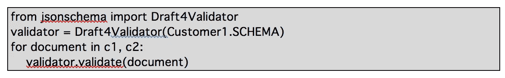*

*这将对一个文档应用 **validate()** 方法，该方法将对任何无效值引发异常。我们可能还想使用一个 **try** :语句来为引发的异常打印一些有意义的内容。我们稍后将回到这一点。*

*异常摘要如下所示:*

*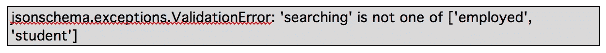*

*当我们在做设计工作时，这可以帮助我们确定设计涵盖了示例。我们可以利用这种简单的技术来快速构建示例和细化模式。*

*通常，我们需要观察我们进行数据验证的频率。对于大量的数据和复杂的文档，处理时间会增加。创建文档时对其进行验证是非常重要的。另一个重要的时候是在进行模式迁移的时候。*

*然而，对于应用程序代码中的操作，我们不想做这种手动验证。为此，我们需要更智能的东西。下面，我们将展示一个元类的一些代码，它在创建对象时处理验证过程。*

## ***模式迁移***

*当我们要对集合中的文档结构进行大规模更改时，例如向所有现有文档添加一个字段或重命名字段，就会发生模式迁移。添加一个可选字段对应用程序的影响较小:代码可以继续使用没有字段的旧文档和有字段的新文档。*

*当对数据库中的现有文档进行更改时，在尝试任何更改之前，确保文档确实符合旧的模式是很有帮助的。我们还应该检查所有文档，以确保它们符合新的模式，然后在更改后尝试使用数据库。*

*我们可以像这样使用 **jsonschema** 验证:*

*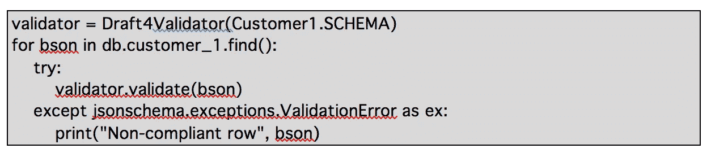*

*我们使用了**客户 1。模式**验证 **customer_1** 集合中的每个对象。我们使用了一个 **try** :块，这样我们就可以打印每个引发的异常并显示不兼容的文档。*

*对于大型数据库或数据库中的复杂文档，这需要时间。必须权衡所需的时间和不合规文件的成本。因为代码非常简单，所以很容易将处理分解成多个并发进程，每个进程验证一个大型数据库的一部分。*

*迁移可能涉及额外的处理。在这种情况下，我们可以创建一个 **Customer** 1 类的实例，如下所示:*

*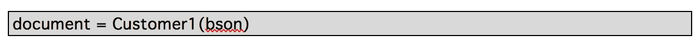*

*这将把底层的 Mongo BSON 文档转换成 **Customer1** 的一个实例。如果我们已经定义了定制的方法，它们可以在**文档**中使用。*

# *保存模式的位置*

*在上面的例子中，我们使用一个类级变量 **SCHEMA** 将模式包含在类定义中。对于保存模式的位置，我们有另外三种常见的选择: ***在文件中，在服务器中，在数据库中*** *。**

## ***在一档***

*要包含文件中的模式，我们可能会使用如下代码:*

*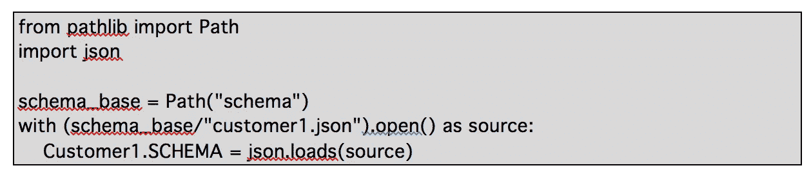*

*我们已经为包含模式定义的目录定义了一个**路径**。然后，我们可以打开一个特定的模式文件，并使用该对象来填充与应用程序类相关联的定义。*

## ***服务器中的***

*我们也可以使用一个 URL 从一个 **api-docs** 目录中加载一个模式。我们可以使用 **urllib.request** 来读取模式定义。*

*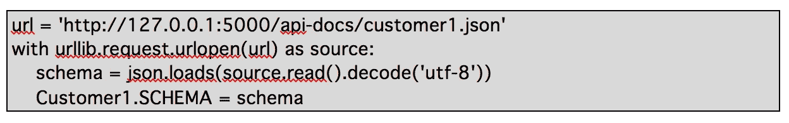*

*现在我们已经打开了一个 URL 并阅读了 JSON 规范。这些通常以字节的形式提供，我们需要解码这些字节来恢复正确的文本。然后，我们可以解析该文本来创建应用程序可以使用模式文档。*

## ***数据库中的***

*如果我们想在数据库中保存模式信息，我们可以使用类似这样的东西来读取模式细节。*

*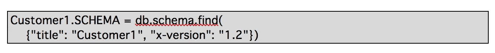*

*这里假设我们有一个名为 **db** 的 PyMongo 客户端。它还要求数据库有一个包含各种模式文档的**模式**集合。我们已经使用了模式标题和扩展( **x-version** )来定位在我们的应用程序中使用的模式定义的正确版本。*

*在 MongoDB 中，有一个可以附加到集合的模式验证规则集。这为在数据库插入和更新操作期间实现 JSON 模式验证的某些方面提供了一种方法。*

*在这三种情况下，从外部源加载模式所需的代码量都很少。这是 Python 的一个令人欣喜的特性！因为 Python 是一种动态语言，我们可以编写非常聪明的类来适应模式细节。*

*通常，我们希望模式验证基本上是不可见的。创建无缝验证的最佳方式是使用元类。*

# *Python 元类*

*我们的应用程序代码通常关注一些数据模型的实例。上面，我们创建了扩展 SON 集合的类。这需要一点人工开销来进行验证。我们可以使用元类使验证步骤无缝。*

*添加一个元类将把我们带到一个抽象的**模型**类。拥有这个定义基类和元类的抽象类将会简化我们的应用程序。下面是我们可以用于经验证的 NoSQL 数据模型的超类:*

*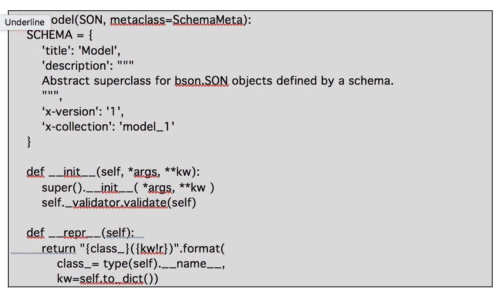*

*这个**模型**类是 PyMongo 的**儿子**类的子类。我们可以以直接和低开销的方式与 Mongo **SON** 对象进行交互。*

*任何子类都需要为**模式**提供一个值，给定的模式定义将用于数据验证。这将涉及到一点元类的魔力，如下所示。*

*例如， **__init__** 方法利用了元类创建的名为 **_validator** 的属性。根据模式定义的细节设置一些其他类级别的值是很有帮助的。*

*我们可以如下使用**模型**类:*

*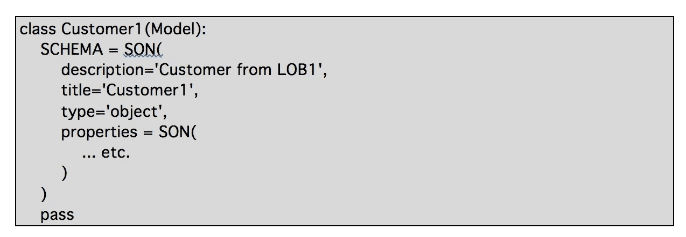*

*这与上面给出的例子基本相同。我们做了一个实质性的改变:我们用**型号**替换了**子**。类定义的其余部分是相同的，但是我们现在有了可用的验证特性。*

*我们如何创造**自我。_validator** ？下面是根据模式定义构建 **_validator** 属性的元类:*

*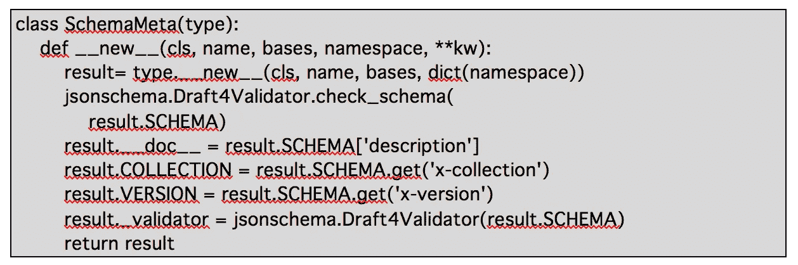*

*我们已经做了一些事情来准备一个通用的**模型**的子类。首先，我们检查了模式，以确保根据 JSON 模式规范它是有效的。这一步不是必需的，因为当我们试图构建 **_validator** 时，也会执行这一步。但是，单独做这件事很方便，因为它可以帮助调试模式定义的问题。*

*如果模式有效，那么我们将从模式中提取四个值。*

*●我们将使用模式的**描述**属性作为整个类的文档字符串。*

*●模式扩展 **x-collection** 用于设置集合属性。这对于识别正确的 MongoDB 集合名称非常方便。*

*●模式扩展 **x-version** 设置版本属性。这对于检查应用程序兼容性非常方便。*

*●最后，我们创建类的**_ 验证器**属性。这使我们能够**利用自我。_validator.validate()** 根据需要检查类实例的有效性。默认情况下，我们只在创建新实例时这样做。我们可以添加同样使用 **_validator** 的方法。同样，其他类可以使用 **Customer1。_validator** 作为数据准备或清理操作的一部分。*

# *结论*

**

*NoSQL 数据库消除了数据库解决方案开发中的一些复杂性和开销。虽然它允许我们放弃正式的模式定义，但这可能太自由了。对数据缺乏控制的 NoSQL 数据库可能会变成手工数据，从而降低数据的价值。共享模式的一般思想对于确保所有使用数据库的应用程序在数据库结构上保持一致是至关重要的。一盒 12 个甜甜圈不应该包括网球、牡蛎或小猫。(*也不应该包括果冻甜甜圈*。)*

*我们可以将模式嵌入 Python 类定义中，我们可以用 JSON 符号将它保存在外部文件中，我们可以从服务器提供它，甚至可以将它保存在 Mongo 数据库中。重要的是我们坚持三个核心原则:*

*●正式的模式*

*●仅定义一次*

*●最好是在代码中。*

*我们可以在项目生命周期的几个点上将模式应用于数据验证。我们可能希望在初始设计阶段有很大的灵活性。当我们构建应用程序时，我们希望确保对象实例符合模式。当对数据库进行结构更改时，我们希望在尝试任何更改之前确认所有文档都与模式匹配。我们还希望在做出更改后确认所有文档都匹配一个模式。*

*为了获得 NoSQL 数据库的灵活性，并避免手工数据，我们需要模式的灵活定义。使用像 **jsonschema** 这样的模块允许我们用 JSON 表示一个模式。该模式可以嵌入到类定义中，并且可以用于验证该类的所有实例。*

*上面的例子包括一个小的(10 行代码)元类定义， **SchemaMeta** ，和另一个小的(18 行代码)超类定义，**模型**。有了它，我们可以利用一个具有面向数据库的类定义的模式。这使我们能够保证数据的质量，并避免创建无法分析的数据，或对数据应用错误的分析。*

*Python 的强大意味着几行代码就可以提供管理数据的基本功能。这可以避免 NoSQL 数据库可能带来的混乱。我更喜欢手工制作的甜甜圈，而不是纠结于复杂的手工数据。我打赌你也有同感。*

*要了解更多关于 Capital One 的 API、开源、社区活动和开发人员文化的信息，请访问我们的一站式开发人员门户网站 DevExchange。*