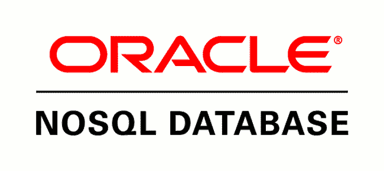
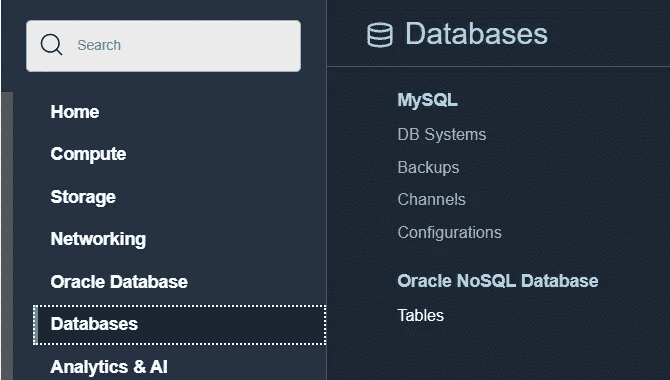
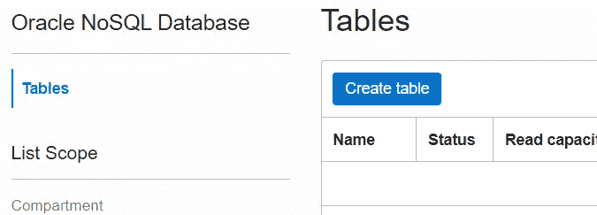

# NoSQL——现在显示在您附近的免费层中

> 原文：<https://medium.com/oracledevs/nosql-now-showing-in-a-free-tier-near-you-508978a0ef61?source=collection_archive---------1----------------------->

NoSQL 数据库以其高可用性和速度著称。使用多个节点时，如果一个节点出现存储故障，其他节点上的数据仍然部分可用。

所有主要的云提供商都提供 NoSQL 数据库。目前最流行的 NoSQL 数据库提供以下存储模型:

*   JSON 存储模型。比如 Mongo DB。
*   宽列存储模型。比如卡珊德拉 DB。

但是还有另一个 NoSQL 数据库值得您考虑:Oracle NoSQL。

幸运的是，您可以通过[注册一个 Oracle 免费层帐户](https://signup.cloud.oracle.com/?language=en)来免费访问 Oracle NoSQL 数据库。

事实上，让我们比较一下 Oracle NoSQL 的免费入门和其他主要云提供商的 NoSQL 数据库。

## 谷歌云

Google 提供 Bigtable 作为他们的 NoSQL 数据库。

> Bigtable 非常适合在键值存储中存储大量数据…

键/值配对是 NoSQL 数据库的另一种流行的存储模型。

然而，Google 并没有在他们的任何免费层中提供 Bigtable。

https://cloud.google.com/free/docs/gcp-free-tier

## **阿里云**

阿里巴巴在亚洲是一个受欢迎的云服务，对于他们的 NoSQL 数据库，他们为 MongoDB 提供 ApsaraDB。

他们提供如下免费服务。

1 个月免费试用:

*   MongoDB 3.4/4.0/4.2 1C2G
*   20 GB 存储空间
*   3 个节点

ApsaraDB for MongoDB 在试用版之外的任何免费等级中都不可用。

ApsaraDB for MongoDB 服务提供高可用性，但免费 1 个月，存储空间为 20 GB。

[https://www.alibabacloud.com/free](https://www.alibabacloud.com/free)

## **微软 Azure**

Azure Cosmos DB 是微软的一个 NoSQL 数据库。

> Azure Cosmos DB 是一个多模型数据库服务，它为所有主要的 NoSQL 模型类型提供了一个 API 投影；列族、文档、图形和键值。 [Gremlin (graph)](https://docs.microsoft.com/en-us/azure/cosmos-db/gremlin-support) 和 SQL (Core)文档 API 层是完全可互操作的。

Azure Cosmos DB 有许多可用的 API:

*   原生核心 API。
*   Mongo DB API。
*   卡珊德拉数据库 API。

还有一个使用键/值格式的表 API。

有两种免费产品可供选择:

12 个月免费试用:

该产品适用于每秒 400 个请求，每月提供 25 GB 的吞吐量和存储。该报价有效期为 12 个月。

永远免费:

该产品适用于每秒 1000 个请求单位的调配吞吐量，每月 5 GB 存储。这个提议永远是免费的。

微软一直免费提供存储模式和 5 GB 的存储空间。

[https://azure.microsoft.com/en-us/free/](https://azure.microsoft.com/en-us/free/)

## **亚马逊 AWS**

Amazon DynamoDB 是一个 NoSQL 数据库，它也有多种存储模型。

有两种免费产品可供选择:

3 个月免费试用:

AWS 提供名为 Amazon Keyspaces 的 NoSQL 服务(用于 Apache Cassandra)。

该服务免费试用三个月，具有以下特点:

*   每月 3000 万次点播阅读
*   每月 3000 万次按需写入
*   每月 1 GB 的存储空间

永远免费:

Amazon DynamoDB 始终免费提供，具有以下特性:

*   25 个调配的写容量单位(WCU)。
*   25 个调配的读取容量单位(RCU)。
*   足以处理每月高达 2 亿次的请求。
*   25 GB 的存储空间。

亚马逊 DynamoDB 一如既往地免费提供，并配有 25 GB 的存储空间。

【https://aws.amazon.com/free/ 

## 甲骨文云

甲骨文有自己的 NoSQL 产品:甲骨文 NoSQL。

> Oracle NoSQL 数据库利用 Oracle Berkeley Database Java Edition 高可用性存储引擎为大容量、延迟敏感的应用程序或 web 服务提供分布式、高可用性的键/值和表存储。

Oracle NoSQL 基于当前名为 Oracle Berkeley DB 的产品。

与其他 NoSQL 数据库类似，Oracle NoSQL 数据库也有多种存储模式。

**永远免费**

Oracle NoSQL 使用以下存储模型:

*   桌子
*   键值对。

Oracle NoSQL 始终免费提供，具有以下特性:

*   每月 1.33 亿次阅读。
*   每月 1.33 亿次写入。
*   每张桌子 25 GB 存储，最多 3 张桌子。

**Oracle 提供非常慷慨的免费服务，每张桌子有 25 GB 存储空间，每张桌子最多三个。**

因此，让我们从 OCI 控制台进行设置。

然后选择表格选项。

目前，始终免费的 Oracle NoSQL 数据库云服务仅在以下网站提供:

*   美国西部(凤凰城)。

如果您所在的地区不是美国西部(凤凰城)，那么您需要升级到付费帐户。

同样，您可以通过 [OCI 自由层](https://signup.cloud.oracle.com/?language=en)享受这种 NoSQL 体验。我们保证不会用大量的电子邮件来打扰你😉

# 加入对话！

如果你对甲骨文开发人员在他们的自然栖息地发生的事情感到好奇，请加入我们的[公共休闲频道](https://oracledevrel.slack.com/join/shared_invite/zt-uffjmwh3-ksmv2ii9YxSkc6IpbokL1g#/shared-invite/email)！我们不介意成为你的鱼缸🐠

Paul Guerin 是一名专注于 Oracle 数据库的国际顾问。此外，他还出席了一些世界领先的甲骨文会议，包括甲骨文 2013 年世界开放大会。自 2015 年以来，他的工作一直是 IOUG 最佳实践技巧小册子以及 AUSOUG、Oracle Technology Network、Quest 和 Oracle Developers (Medium)出版物的主题。2019 年，他被授予 My Oracle 支持社区最有价值贡献者。他是一名 DBA OCP，并将继续参与 Oracle ACE 计划。