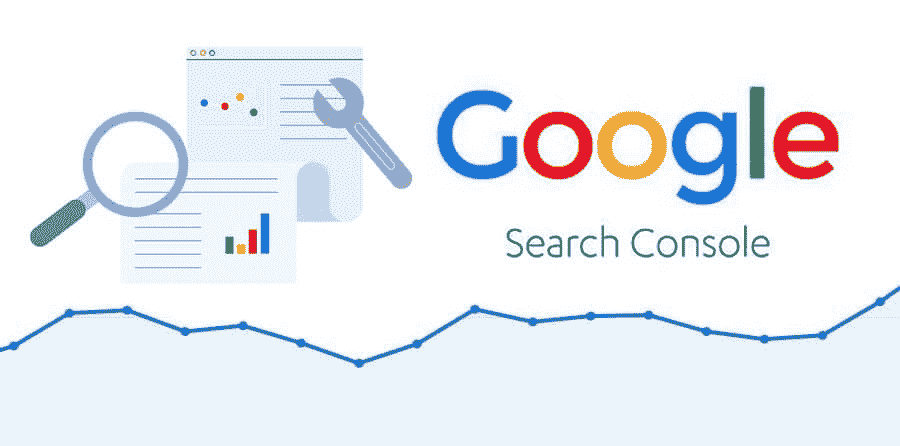
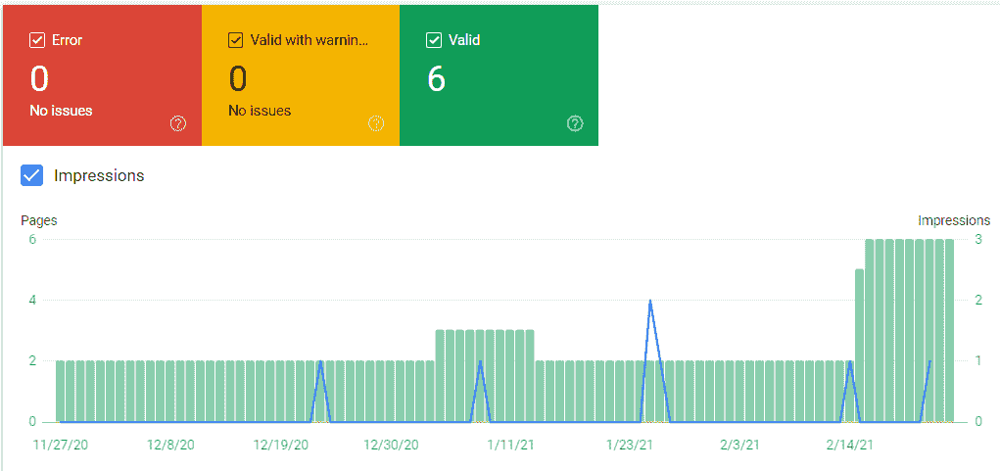
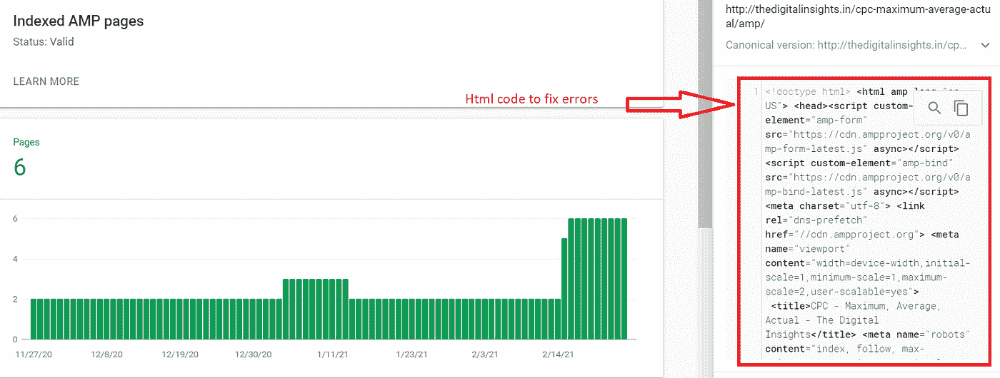
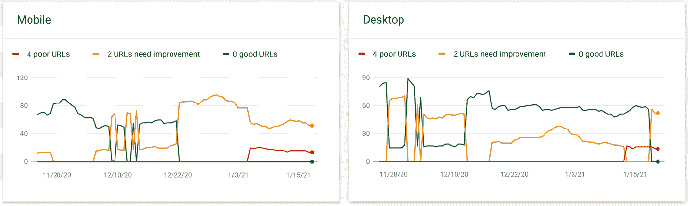
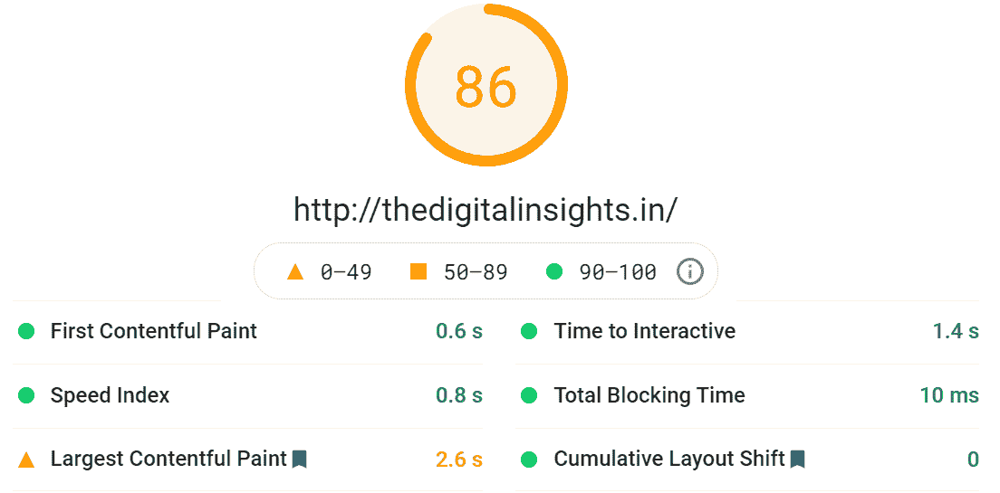
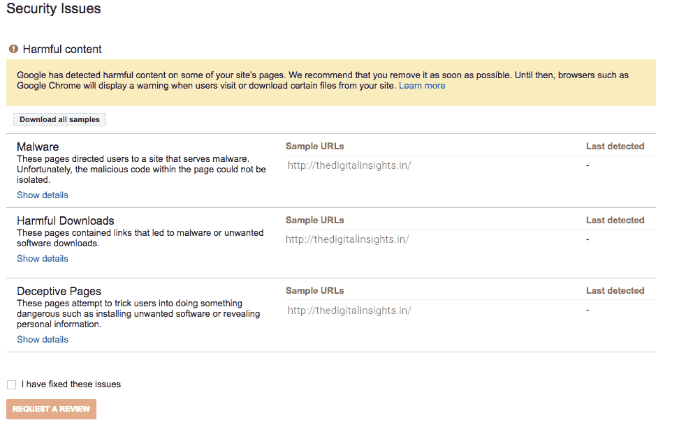
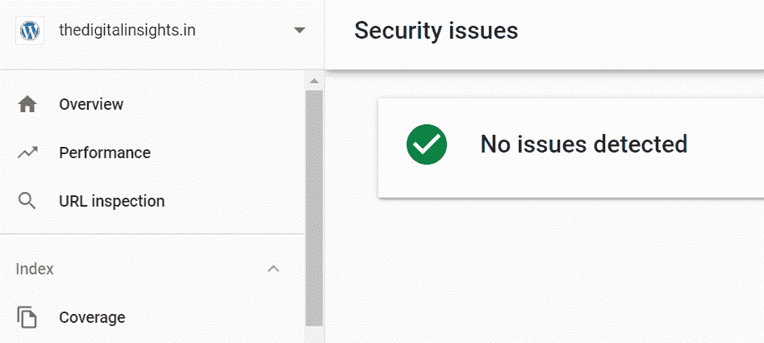
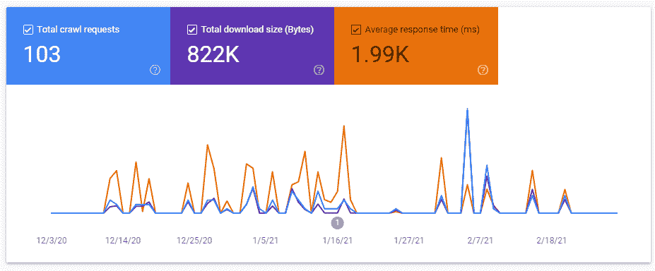
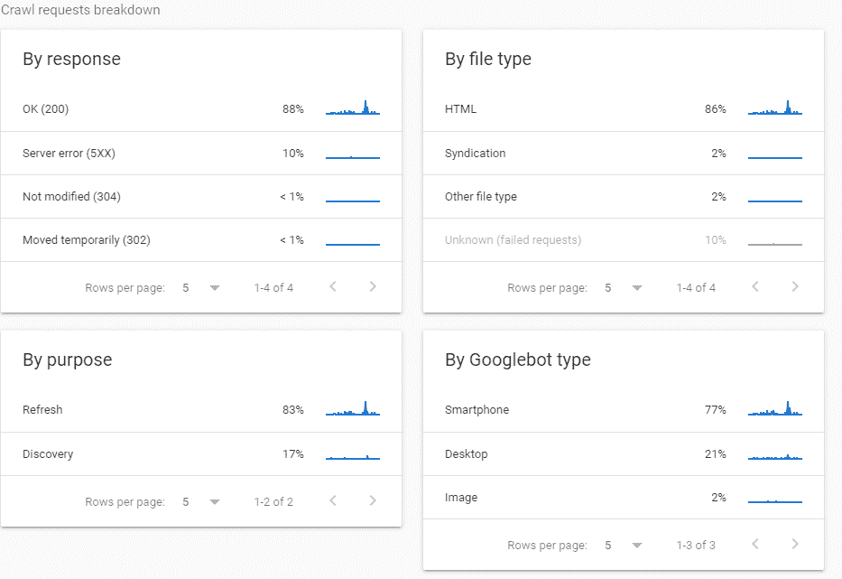

# 不仅仅是虚荣心指标——让我们充分利用谷歌搜索控制台报告

> 原文：<https://medium.com/globant/not-just-vanity-metrics-lets-make-most-out-of-google-search-console-reports-4c112e8a82cc?source=collection_archive---------3----------------------->

我曾使用过多的洞察工具来衡量网站的性能、搜索流量等等，但在所有这些洞察工具都失败的地方，只有一个工具真正流行，即谷歌搜索控制台。我开始使用这个工具的那一天，它给了我优化网页、提高有机可见性、与机器人通信、修复抓取错误等等的完美方法。简单地说，GSC 是你的控制面板，用于监控搜索引擎如何查看网站。让我分享我的一个经历:几天前我删除了我的一个网页，我忘记把它重定向到正确的页面。下一次当我打开我的 GSC 账户时，一个 404 错误出现在我面前。这个 404 警报挽救了我的网站，使其免于流量骤减，并告诉我应该在哪里添加重定向。我必须说，这个工具在你的营销之旅中非常有用，是你的救星。

是什么让 GSC 脱颖而出？

1.  这个平台在网站和搜索引擎之间架起了一座桥梁。
2.  它对监控、维护和改善网站在搜索结果中的显示非常有帮助。
3.  它是让你自由管理网站地图的最佳工具。
4.  它给你网站排名提升的空间。
5.  不需要害怕网络威胁。它不时提供网络威胁的最新信息。
6.  这个工具可以让网站更好地适应加速移动页面
7.  它提供了网站内发生的实时变化。
8.  GSC 让网站对移动用户更敏感。

为了提高网站在搜索引擎中的表现，不仅仅是点击量、浏览量和转换率会给你带来整体的洞察力。我觉得几乎每个人都在用 GSC 来衡量虚荣心。在这篇文章中，我将阐述 GSC 有效的报道特色，你可以用它来产生有效的见解。让我们充分利用它。

**AMP 状态报告:**这个 GSC 的报告功能允许您修复那些使您的网页不能分别出现在搜索结果和多媒体结果中的错误和警告。在下图 1.1 中，你可以看到谷歌抓取了 6 安培的网页，并显示空错误和警告。但是，如果您在 AMP 网页上收到任何警告，请不要忽略它们。警告不会让您的网页停止索引和出现在搜索结果中，但肯定会阻止它们出现在 AMP 多媒体结果中。因此增加了更高的跳出率和更低的点击率。

图 1.1

图 1.2

在图 1.2 中，你可以看到一个没有错误的页面的 html 代码。如果您的 AMP 页面出现错误，您可以直接点击这些 AMP 页面链接，并检查其 html 代码中的错误。这是验证错误并使您的网页在 SERPS 上可搜索的最佳方式。一旦您的错误得到修复，请确保重新浏览这些 AMP 页面，以查看实际的错误解决方案。在您的 AMP 页面上修复错误和警告会为您的移动用户带来出色的体验。

**核心 Web 生命周期报告:**GSC 的这一报告功能将让您深入了解访问者在移动和桌面设备上与您的网页进行交互的时间、他们加载您的网页的速度以及您的网页的视觉稳定性。简而言之，这份核心 web 重要报告将告诉你你的网页在速度、交互性和视觉稳定性方面的表现。

图 1.3

在前面提到的图 1.3 中，你可以看到 4 个 URL 表现不佳，2 个 URL 在移动和桌面设备上都需要改进。基于上述见解，我修复了那些不良的链接以及那些需要改进的链接。在图 1.4 中，你可以看到这个报告功能让我对我的网站的速度、交互性和视觉显示有了深入的了解。在这个报告的帮助下，我能够看到我的网站的 LCP 受到了多大的影响。为了解决这个问题，我研究了各种因素，如缓存资产、渲染阻塞 JavaScript、缩小 CSS 文件，最终解决了这个问题。这都要归功于网络核心生命体征报告。

图 1.4

**安全问题报告:**如果谷歌在你的网站上发现可疑行为，这个报告功能会给你一个定时提醒。这种可疑行为包括网络钓鱼攻击、恶意软件安装和 URL 或代码注入。在图 1.5 中，你可以看到，谷歌搜索控制台在网站[http://the digital sights . in，](http://thedigitalinsights.in,)上检测到一些威胁，这些威胁与你从谷歌搜索控制台中的手动操作报告中获得的洞察截然不同，而且很有帮助。您通常从手动操作中得到的问题对您的用户来说并不危险，但是如果您从安全问题报告中得到的问题，不要忽略它们。他们需要得到修复，以保护您的网站免受任何流量损失。

图 1.5

在图 1.6 中，您可以看到上述所有问题都已解决。我可以说数码相机现在是安全的。

抓取统计报告:抓取错误会极大地损害你网站的排名，破坏用户体验。这份报告告诉你谷歌是否在抓取你的网站时遇到了任何问题。最重要的是，它将为您提供一段时间或一天内的爬行请求总数、平均响应时间和总下载数据。在图 1.7 中，您可以深入了解爬网数据。如果您的网站被 Googlebot 抓取请求超载，您可以在此报告中跟踪问题，并请求 Google 减少抓取请求。这种报告功能在调试抓取问题时非常有用，对于提高网站的搜索引擎优化也非常有用。

图 1.7

现在你知道如何充分利用谷歌搜索控制台报告，这里有一些你在检查数据时不应该忽视的行动项目。

1.  尝试根据印象数对查询进行排序。
2.  找到那些点击率低，但 PR 高的网页。
3.  按设备过滤性能报告(例如，展示次数、点击数、平均点击率),以检查是否存在任何参与问题。
4.  检查表现良好的国别数据，以防您忽略它。

所以，下一次当你使用搜索控制台获取见解来创建网站性能的深度报告时，试着充分利用它。