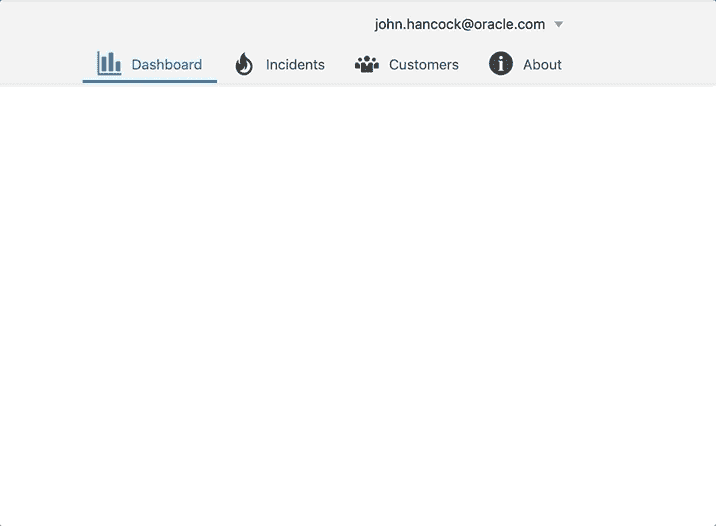
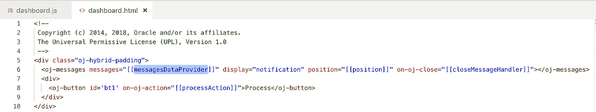
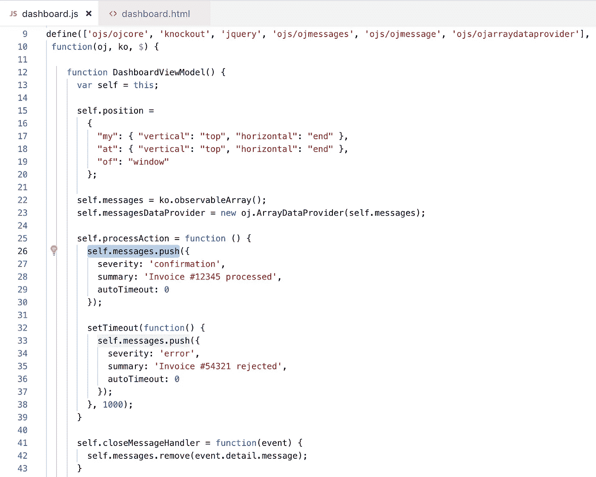

# Oracle JET 中的通知消息

> 原文：<https://medium.com/oracledevs/notification-messages-in-oracle-jet-bbc72280862e?source=collection_archive---------0----------------------->

让我们来看看 Oracle JET 中的一个很酷的组件——通知消息(可以用不同的方式显示消息——内嵌或叠加。查看 JET Cookbook [示例](https://www.oracle.com/webfolder/technetwork/jet/jetCookbook.html?component=messages&demo=pageNotification)中有关消息功能的更多信息。

这是通知消息显示的方式，非常酷的向用户发送信息的方式:

消息由 *oj-messages* 组件实现。该组件接受要显示的可观察的消息数组。我们可以指定如何显示消息(在这种情况下是通知)、位置信息和关闭监听器(在这里我们可以从 messages 数组中删除消息信息条目):

在示例 processAction 函数中，我将新条目推入消息数组。要模拟第二条消息的延迟，按下第二个条目时会有 1 秒的延迟。一旦消息在标准延迟时间后关闭，函数 *closeMessageHandler* 被调用，我们从数组中删除条目:

示例应用程序代码可以在我的 GitHub [repo](https://github.com/abaranovskis-redsamurai/jetmessages) 上获得。

*原载于 2018 年 11 月 28 日*[*andrejusb.blogspot.com*](http://andrejusb.blogspot.com/2018/11/notification-messages-in-oracle-jet.html)*。*