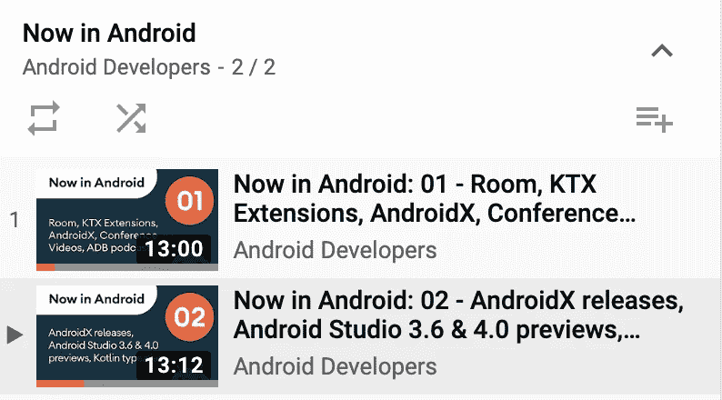
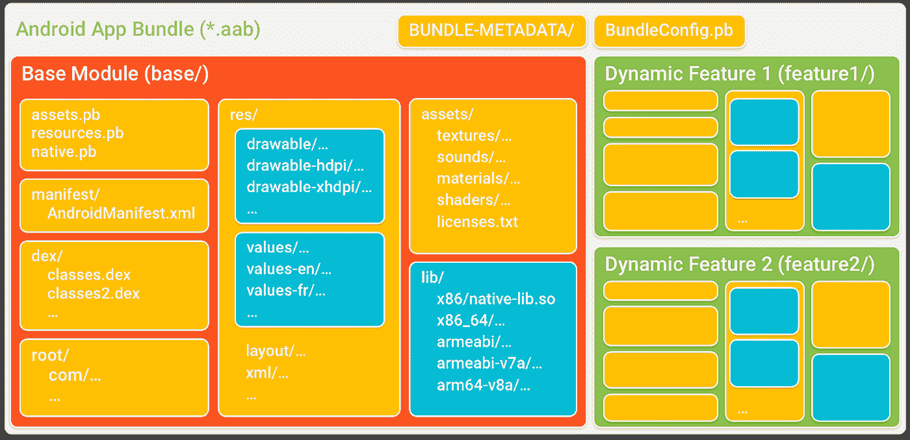

# 现在在 Android #12 中

> 原文：<https://medium.com/androiddevelopers/now-in-android-12-f221038fa0d5?source=collection_archive---------0----------------------->

## 现在在 Android video+podcast 中，AndroidX 发布，Jetpack 导航中的动态功能模块，关于 Kotlin 内联类和 Android 风格的文章，以及另一个 ADB podcast 集

Illustration by [Virginia Poltrack](https://twitter.com/VPoltrack)

欢迎来到 Android 中的[，这是您对 Android 开发世界中新的和值得注意的事物的持续指导。](https://medium.com/androiddevelopers/tagged/now-in-android)

# 现在在 Android #12:视频版本

The video version of this Now in Android episode. Less text, more pixels.

现在在安卓系统中也提供视频形式。同样的内容，但是更多的动作和更少的文本。点击这里查看视频，或者忽略它，继续阅读下面的文字。

# 现在在 Android 中…现在在视频和音频中

Now in Android is more than just a series of articles: it’s a playlist on YouTube!

对于那些喜欢以不同格式接收科技新闻的人来说，我们现在已经在 Android 中扩展到以[文章](https://medium.com/androiddevelopers/tagged/now-in-android)、[视频](https://www.youtube.com/playlist?list=PLWz5rJ2EKKc9AtgKMBBdphI-mrx8XzW56)，甚至[播客](http://nowinandroid.googledevelopers.libsynpro.com/)的形式存在。

现在，每一集都应该以这些[文章的“经典”形式出现在](https://medium.com/androiddevelopers/tagged/now-in-android)媒体上。此外，还会有一个视频版本的文章，我对着镜头谈论相同的内容，将它发布在 YouTube 上的 Android 开发者频道的新的 Android 播放列表中。

只要我们有视频，我们就从视频中提取音频，在 Android 播客中发布新的[，现在无论你在哪里使用播客都可以看到。](http://nowinandroid.googledevelopers.libsynpro.com/)

 [## 现在在 Android 中

### 这个节目让听众快速了解了 Android 团队最近所做的、开发者可能想要的事情…

nowinandroid.googledevelopers.libsynpro.com](http://nowinandroid.googledevelopers.libsynpro.com/) 

还有，我在改剧集标题(又来了！)在所有这些格式中保持一致。所以从这一集开始，这篇文章的编号(#12)应该与相关视频和播客的编号相匹配。我这样做是因为即使你更喜欢视频或音频作为你的选择格式，你可能仍然想访问该集的媒体文章以获得其方便的链接。

因此，无论你喜欢什么，现在就获取 Android 更新吧:内容是一样的，只是交付机制不同。然后每隔几周(差不多)检查一下下一个，因为关于软件的一个事实是:总是有更多的。

# AndroidX 释放

AndroidX 最近发布了一些有趣的库。

先是有几个[稳定的](https://developer.android.com/jetpack/androidx/versions/stable-channel)发布。大多数，像[片段](https://developer.android.com/jetpack/androidx/releases/fragment#1.2.1)、[媒体 2](https://developer.android.com/jetpack/androidx/releases/media2#1.0.2) 、[导航](https://developer.android.com/jetpack/androidx/releases/navigation#2.2.1)和[工作管理器](https://developer.android.com/jetpack/androidx/releases/work#2.3.1)，主要是错误修复。但是也有一个 [Core 1.2.0](https://developer.android.com/jetpack/androidx/releases/core#1.2.0) 的发布，增加了通知、BlendMode(为旧版本提供新的平台功能)、ShortcutInfo 和 WindowInsets 的新功能。另外注意[ViewModel-saved state](https://developer.android.com/jetpack/androidx/releases/lifecycle#viewmodel-savedstate-2.2.0)2 . 2 . 0 和 1.0.0 完全一样；它只是升级了版本号，以便与其他生命周期工件的版本号保持同步。

也有几个新的库首次进入 alpha 测试:

[表情符号 1.1.0](https://developer.android.com/jetpack/androidx/releases/emoji#1.1.0-alpha01) 有一些新的表情符号，所以如果你急于将任何来自 [v12](https://www.unicode.org/emoji/charts-12.0/emoji-released.html) 或 [v12.1](https://www.unicode.org/emoji/charts-12.1/emoji-released.html) 的新表情符号添加到你的应用程序中，那就来吧。

导航 2.3.0 包括新的动态导航功能(见下文)，以及一个新的导航测试构件。

# 导航和动态功能模块

[Wojtek Kaliciński](https://medium.com/u/b913acc64439?source=post_page-----f221038fa0d5--------------------------------) tweeted about the new library that he and [Ben Weiss](https://medium.com/u/65fe4f480b1c?source=post_page-----f221038fa0d5--------------------------------) launched.

> 问:什么比新的 API 更好？
> 答:一个 ***现有的*** API，做*新东西*。

Wojtek Kaliciński 和 [Ben Weiss](https://medium.com/u/65fe4f480b1c?source=post_page-----f221038fa0d5--------------------------------) 一直在开发导航组件中的新 API，该 API 使动态功能模块更易于使用，使用的导航 API 与非动态目的地相同。

首先，一些历史和术语:

[Android 应用捆绑包](https://developer.android.com/guide/app-bundle)是新的应用格式(自 APK 发明以来的第一个！)允许开发者上传所有用户需要的超集。然后，播放商店确定要安装在任何给定设备上的子集(基于设备配置)。这为开发者提供了一种更简单的方式来针对所有可能的场景，而不必上传许多不同的 apk，同时允许 Play Store 将下载大小减少到仅需要的大小。

[动态特性模块](https://developer.android.com/guide/navigation/navigation-dynamic)为开发人员提供了额外的能力，将他们的应用拆分成不需要立即安装的独立部分(模块)。这样，应用程序可以在首次启动时安装一些所需的最小子集，以后的模块(比如，应用程序可选路径的附加资产)可以在需要时安装。

开发者可以使用 [Play 核心库](https://developer.android.com/guide/app-bundle#playcore)中的 API，手动请求下载安装动态特性模块。

但是现在，使用导航组件的[2 . 3 . 0 版本，动态特性模块甚至更加容易。可以使用通常的调用来导航()。当目的地是在一个动态特性模块中时，库将负责下载和安装所需部分的细节。](https://developer.android.com/jetpack/androidx/releases/navigation#2.3.0-alpha01)

该库目前处于 alpha 版本，所以它可能还没有为您的生产代码做好准备。但是如果你想要这个功能，请尝试一下并给我们反馈。查看[文档](https://developer.android.com/guide/navigation/navigation-dynamic)获取更多信息，并试用[本·维斯](https://medium.com/u/65fe4f480b1c?source=post_page-----f221038fa0d5--------------------------------)上周刚刚发布的[样本](https://github.com/android/app-bundle-samples/tree/master/DynamicFeatureNavigation)。

# 文章

## [kot Lin 中的零成本*抽象](/androiddevelopers/zero-cost-abstractions-in-kotlin-19b953f3a936)

 [## Kotlin 的零成本*抽象

### 科特林词汇:内联类

medium.com](/androiddevelopers/zero-cost-abstractions-in-kotlin-19b953f3a936) 

弗洛里纳·蒙特内斯库继续她的 Kotlin 词汇系列，这篇文章是关于内联类的，这是 Kotlin 1.3.50 中的一个实验性特性。

内联类可以为变量提供增强的类型安全级别，否则这些变量可能会发生冲突并导致运行时错误。更好的是，通过编译成简单使用底层类型的代码，而不是实际创建包装该类型的类，他们可以在不引入任何开销的情况下做到这一点。

* *取决于你如何使用类。有关详细信息和陷阱，请参阅文章。*

## [安卓风格:主题 vs 风格](/androiddevelopers/android-styling-themes-vs-styles-ebe05f917578)

 [## Android 风格:主题与风格

### Android 风格系统提供了一种强大的方式来指定你的应用程序的视觉设计，但它很容易被误用…

medium.com](/androiddevelopers/android-styling-themes-vs-styles-ebe05f917578) 

混淆主题和样式背后的概念和用法很容易，也很常见。毕竟两者都使用了

Nick Butcher 开始了一个新的系列文章来帮助更深入地解释 Android 开发的这个领域。

在本系列的第一篇文章中，Nick 着眼于主题和风格之间的差异，以及开发人员可能选择其中一个而不是另一个的地方。

注:本系列文章详述了 [Nick Butcher](https://medium.com/u/22c02a30ae04?source=post_page-----f221038fa0d5--------------------------------) 和 [Chris Banes](https://medium.com/u/9303277cb6db?source=post_page-----f221038fa0d5--------------------------------) 在 Android Dev 峰会上介绍的内容:

# ADB 播客片段

有一集 Android 开发人员在后台发布，因为最后一个现在在 Android 中。请点击下面的链接，或在您最喜欢的播客客户端查看:

## ADB 132:使用存储存储数据

 [## 第 132 集:用 Store 存储数据

### 在这一集中，Chet 和 Romain 与 Jetpack 团队的 Yigit Boyar 和 Dropbox 的 Mike Nakhimovich 进行了对话。迈克…

androidbackstage.blogspot.com](http://androidbackstage.blogspot.com/2020/02/episode-132-storing-data-with-store.html) 

在我们的[应用架构指南](https://developer.android.com/jetpack/docs/guide)中，我们推荐的数据存储和检索模式之一是使用存储库，它在数据来源的基础上提供一个抽象层。例如，您可能将数据存储在本地缓存中，也可能存储在网络另一端的服务器中。这种方法允许您的代码获取数据，而不用担心数据位于何处或如何获取，将这些细节留给存储库。

有一个建议的技术是很好的，但是如果有一个 API 来简化这个部分不是更好吗？

[商店图书馆](https://github.com/dropbox/store)(目前在阿尔法)就是这么做的。在这一集里，我们采访了 Dropbox 的[迈克·纳希莫维奇](https://twitter.com/friendlyMikhail)和 Android Toolkit 团队的[伊吉特·博雅](https://medium.com/u/55a38e86cfa7?source=post_page-----f221038fa0d5--------------------------------)。Mike 负责商店开源库的开发(Yigit 也在业余时间研究这个库)。

# 那么现在…

这次到此为止。去看看 Android [视频系列](https://www.youtube.com/playlist?list=PLWz5rJ2EKKc9AtgKMBBdphI-mrx8XzW56)和[播客](http://nowinandroid.googledevelopers.libsynpro.com/)！试试最新的 [AndroidX 发布](https://developer.android.com/jetpack/androidx/versions/all-channel)！查看[新的导航库](https://developer.android.com/jetpack/androidx/releases/navigation#2.3.0-alpha01)，使用动态功能模块进行导航！阅读 Kotlin 中关于[内联类](/androiddevelopers/zero-cost-abstractions-in-kotlin-19b953f3a936)和[主题 vs 风格](/androiddevelopers/android-styling-themes-vs-styles-ebe05f917578)的文章！听最新的 [ADB 播客插曲](http://androidbackstage.blogspot.com/)！请尽快回到这里，收听 Android 开发者世界的下一次更新。