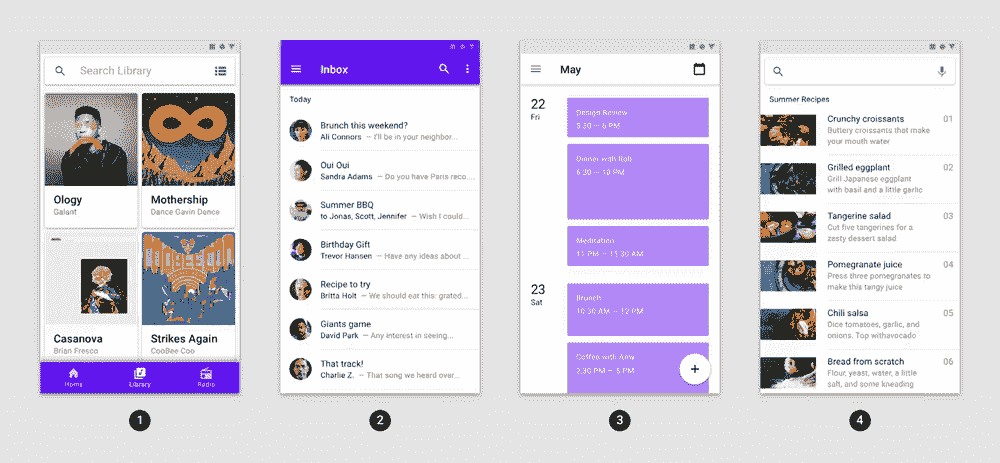

# 现在在 Android #13 中

> 原文：<https://medium.com/androiddevelopers/now-in-android-13-483740e711c0?source=collection_archive---------1----------------------->

Illustration by [Virginia Poltrack](https://twitter.com/VPoltrack)

## Android 11 开发者预览版、Android Studio 3.6 稳定版和 4.0 beta 版、后台位置指南、更轻松的动态功能模块测试、材料运动指南和库、文章、视频和 AndroidX 发布

欢迎来到 Android 中的 Now，这是您对 Android 开发世界中新的和值得注意的事物的持续指导。

酒店和 13 楼。但也许你喜欢在生活中避开 13 这个数字(13 楼，一打面包师的最后一个甜甜圈，在你到达 12 之后 14 之前一个一个地数)。如果是这样的话，就把它想象成 14 号。下一次，当我发布第 14 条时，告诉你自己，因为它是关于软件的，所以它一定是一个错误。

与此同时，在过去的几周里发生了很多事情，所以让我们开始吧。

# 视频和播客形式的 NiA13

这个*现在在 Android* 中也以视频和播客的形式提供。内容是一样的，但是需要的阅读量更少。文章版本(继续阅读！)仍然是链接到所有内容的地方。

## 录像

## 播客

点击下面的链接，或者在你最喜欢的客户端应用程序中订阅播客。

 [## 现在在 Android: 13 - Android 11 预览版，Android Studio 3.6 稳定& 4.0 测试版，素材运动…

### 欢迎来到 Android 中的 Now，这是您对 Android 开发世界中新的和值得注意的事物的持续指导。在这个…

nowinandroid.googledevelopers.libsynpro.com](http://nowinandroid.googledevelopers.libsynpro.com/13-android-11-preview-android-studio-36-stable-40-beta-material-motion-guide) 

# Android 11:开发者预览版 1

The latest Android release turns it up to 11

过去几周，Android 开发者的重大新闻是，Android 11 的第一个[开发者预览版现已发布。您不仅可以安装系统映像并在您的开发人员设备(Pixel 2、3 或 4)上使用它，您还可以(并且应该！)也测试一下你的应用程序，看看它在新版本上是什么样子(使用其中一个测试设备或模拟器)。当您在那里时，请查看一些您可能想要使用的新特性和 API。](https://developer.android.com/preview)

以下是您将在第一次预览中看到的功能的一个小示例:

*   **支持 5G** ，使用新的 API 来检查[未计量](https://developer.android.com/reference/android/net/NetworkCapabilities.html#NET_CAPABILITY_NOT_METERED)状态和[带宽](https://developer.android.com/reference/android/net/NetworkCapabilities.html#getLinkDownstreamBandwidthKbps())能力
*   [**气泡**](https://developer.android.com/guide/topics/ui/bubbles) ，用于查看正在进行的对话的全系统 UI。Android 10 中引入了气泡，但隐藏在开发者选项后面；现在它们已经在平台中启用了，API 也可以使用了。
*   **:Android 10 中引入的三态位置权限(仅允许在应用程序处于前台时访问位置)很受用户欢迎，因此我们扩展了这一概念，使该权限仅在应用程序处于前台时才可用。此外，我们还将麦克风和摄像头添加到权限列表中，增加了一层用户控制。**
*   ****始于 Android 10 的范围存储**保护正在扩大。一些[新功能](https://developer.android.com/preview/privacy/storage)使得访问作用域存储更加容易，包括批量编辑和访问原始文件和路径。**
*   **[**生物计量提示 API**](https://developer.android.com/reference/android/hardware/biometrics/BiometricManager.Authenticators.html)在 Android 11 中引入了处理更多种设备功能的 API，为了兼容，也可以在[生物计量 AndroidX 库](https://developer.android.com/reference/androidx/biometric/BiometricPrompt)中获得。**
*   ****数据 blob**(代表“二进制大对象”，但我更喜欢“blob”这个术语)现在可以通过 [BlobStoreManager API](https://developer.android.com/reference/android/app/blob/BlobStoreManager) 在应用程序之间共享。这对于一个大的下载来说可能是有用的，比如一个 ML 模型，一个应用程序想要让其他相关的应用程序也可以使用这个数据。**

**关于 Android 11 的更多信息，请查看 Android 开发者博客上的[文章，并前往](https://android-developers.googleblog.com/2020/02/Android-11-developer-preview.html)[预览网站](https://developer.android.com/preview)阅读具体的变化并[下载系统映像](https://developer.android.com/preview/download)。**

# **安卓工作室**

**我们的 IDE 最近发布了几个重要的版本。**

## **3.6:稳定**

**Android Studio 版本最近趋于稳定。我已经在 Android 的 Now 的前一个版本中谈到了 3.6，也许你已经在使用它了。但是如果你想在更新前等待它完成，现在就是时候了。**

**跳到[工作室下载页面](http://d.android.com/studio/)去获得你自己的副本。以下是您将在该版本中找到的一些内容:**

*   **改进和更容易的泄漏检测**
*   **代码和设计资源文件编辑的拆分视图**
*   **查看绑定(见[肖恩的文章](/androiddevelopers/use-view-binding-to-replace-findviewbyid-c83942471fc)关于这一点，参考下文)**
*   **针对位置和多显示器情况的模拟器改进。**

## **4.0:测试版**

**最近也讲了 4.0。但是如果你在等待它走出阿尔法阶段，现在你的机会来了。在 [4.0 测试版](https://developer.android.com/studio/preview)中你会发现一些有趣的特性，包括:**

*   **MotionEditor，新的 MotionLayout API 的可视化编辑工具，支持更丰富的动画**
*   **现场布局检查员**

**更多关于 4.0 设计工具的变化，请查看 [Nicolas Roard](https://medium.com/u/c006d5238349?source=post_page-----483740e711c0--------------------------------) 的 Twitter 帖子:**

## **4.1:金丝雀**

**只是为了完善产品，你也可以住在野外，下载 Android Studio 的最新版本[，4.1](https://developer.android.com/studio/preview) ，现在可以在金丝雀频道获得。**

**我在这里提出它的主要原因是 Jetpack Compose 编译器已经从 4.0 版本中删除了。因此，如果您想使用 alpha Compose UI toolkit APIs 之前的版本，您需要使用 4.1 版本。**

# **背景位置指南**

> **问:关于用户隐私，最重要的三件事是什么？
> 答:位置，位置，位置。**

**在最近的版本中，隐私变化的一个较大的方面是围绕位置。至关重要的是，访问用户位置的应用程序必须有权限这样做，并且这种访问对用户是透明的和可控制的。但是这种行为可能需要应用程序开发人员的努力才能实现。**

**为了提供帮助，我们创建了新的[指南](https://developer.android.com/training/location/background)来帮助您了解如何在后台访问位置，并为您提供如何更新您的应用程序以提供此类访问的替代方法的提示。**

# **动态特征模块测试**

** [## 使用 FakeSplitInstallManager 进行本地开发和测试

### Bundletool 和 Play Core 库的新版本使得本地迭代更快，并且可以按需测试…

medium.com](/androiddevelopers/local-development-and-testing-with-fakesplitinstallmanager-57083e1840a4) 

动态功能模块是改善用户下载和安装体验的一种强大方式，它将首次启动时不需要的应用程序元素移动到可在以后安装的可选模块中。

但是测试动态功能模块被证明是困难的，因为它需要在 Play Store 上安装软件包。

Wojtek Kaliciński 一直致力于通过增强[游戏核心库](https://developer.android.com/guide/playcore#include_playcore)以及文档和样本来简化这一过程。现在，您可以使用 1.6.5 版本的库并在本地测试功能。

查看 [Wojtek 的文章](/androiddevelopers/local-development-and-testing-with-fakesplitinstallmanager-57083e1840a4)了解详情，以及[关于模块安装的本地测试的新文档](https://developer.android.com/guide/playcore/testing-fakesplitinstallmanager)。** 

# **物质运动**

****

**动画是使应用程序用户界面更容易理解和交互的一种强有力的方式。但是…动画可能很难实现，特别是对于涉及元素和活动之间的过渡的丰富运动。**

**材料设计团队最近发布了一份全面的[指南，用于处理应用程序中的 UI 转换](https://material.io/design/motion/the-motion-system.html)。更好的是:[材料设计组件库](https://github.com/material-components/material-components-android)的 1.2.0-alpha05 版本提供了实现该指南的转换，可以在您的应用中使用。**

**查看[优秀文档](https://github.com/material-components/material-components-android/blob/master/docs/theming/Motion.md)和[文章](/google-design/implementing-motion-9f2839002016)了解如何将这些新的过渡整合到您的应用中。**

# **文章**

**[Nick Butcher](https://medium.com/u/22c02a30ae04?source=post_page-----483740e711c0--------------------------------) 为他正在进行的 Android 风格系列增加了两篇新文章，都围绕主题属性:**

## **Android 样式:通用主题属性**

** [## Android 样式:通用主题属性

### 在本系列关于 Android 风格的前一篇文章中，我们讨论了主题和风格之间的区别…

medium.com](/androiddevelopers/android-styling-common-theme-attributes-8f7c50c9eaba) 

在这篇文章中，Nick 回顾了许多你应该考虑在应用程序中使用的常见主题值，以避免创建你自己的甚至是硬编码的值。这些值非常方便，不仅可以避免在创建自己的资源时麻烦的输入，还可以在整个应用程序和整个平台中创建一致性。例如，有许多标准的颜色主题值(包括材质指南中的一个标准集)可以很好地配合使用。而且还有常见的文本外观、形状(对于材质应用程序)、按钮样式等等。

## Android 风格:偏好主题属性

 [## Android 风格:偏好主题属性

### 所有事物的主题属性

medium.com](/androiddevelopers/android-styling-prefer-theme-attributes-412caa748774) 

在 Android 风格系列的第三篇文章中，Nick 讨论了如何(以及为什么)在你的应用中使用颜色的主题属性，而不是资源引用(剧透:它们提供了灵活性以及语义澄清)。

## 使用视图绑定替换 findViewById

 [## 使用视图绑定替换 findViewById

### Android Studio 和 Android Gradle Plugin 3.6 中的新功能，视图绑定让您能够用…替换 findViewId

medium.com](/androiddevelopers/use-view-binding-to-replace-findviewbyid-c83942471fc) 

在 Android Studio 3.6 的背景下，我在《T2》的前一集《Android Now》的第三集中谈到了视图绑定。简而言之:视图绑定是集成到 Android Studio 中的一个特性，它允许您轻松地获得对布局中视图的类型安全引用，而无需使用我们都非常熟悉的冗长乏味的 findViewById()调用。

但是如果你想知道如何使用它，它是如何工作的，[肖恩·麦克奎蓝](https://medium.com/u/83518fe480be?source=post_page-----483740e711c0--------------------------------)在[他的文章](/androiddevelopers/use-view-binding-to-replace-findviewbyid-c83942471fc)中深入探讨了这个问题。

## 对加密对象使用生物识别提示

 [## 将 BiometricPrompt 与 CryptoObject 结合使用:方式和原因

### 生物识别和加密不是一回事。它们实际上是完全相互独立的:

medium.com](/androiddevelopers/using-biometricprompt-with-cryptoobject-how-and-why-aace500ccdb7) 

[Isai Damier](https://medium.com/u/a2d70bdb57?source=post_page-----483740e711c0--------------------------------) 的文章展示了加密技术和生物识别技术如何协同工作来保护数据，尤其是针对政府、金融、医疗保健和企业应用的数据。Isai 的[代码示例](https://github.com/isaidamier/blogs.biometrics.cryptoBlog)中也展示了这些概念。

# 代码示例:生物识别登录

 [## Android/安全-示例

### Androidx 生物特征库样本版权所有 2020 Google LLC。保留所有权利。根据阿帕奇许可…

github.com](https://github.com/android/security-samples/tree/biometriclogin/BiometricLoginKotlin) 

说到生物识别， [Isai Damier](https://medium.com/u/a2d70bdb57?source=post_page-----483740e711c0--------------------------------) 创造了[一个新的样本](https://github.com/android/security-samples/tree/biometriclogin/BiometricLoginKotlin)来帮助开发者如何使用 [AndroidX 生物识别库](https://developer.android.com/jetpack/androidx/releases/biometric)来正确地将生物识别整合到你的应用中。

# 录像

## 矢量资产

Android 开发者关系团队做的事情之一就是在会议、聚会、公交车站……无论我们身在何处，当有人递给我们一个麦克风和一个投影仪，却忘记关掉它们时，我们都会做技术演讲。

通常，这些谈话会被记录下来，并在事后公布。但有时，更广泛地分享内容是值得的，否则可能会被分享。因此，我们在事后录制了一些谈话，以创建优化版本，在 [Android 开发者频道](https://www.youtube.com/user/androiddevelopers)上进行更广泛的分享。

这些录制的会议演讲的第一个例子是 Nick Butcher 关于矢量资产的视频，他在视频中展示了如何使用矢量来提供清晰、可调整大小和可制作动画的图像。

[Nick Butcher](https://medium.com/u/22c02a30ae04?source=post_page-----483740e711c0--------------------------------) gives a conference talk to an empty room and a camera

## 密封类

[Florina Muntenescu](https://medium.com/u/d5885adb1ddf?source=post_page-----483740e711c0--------------------------------) continues her Kotlin explorations with a video about sealed classes

弗洛里纳·芒特内斯库继续她的科特林词汇系列，带来了这个关于密封课堂的新视频。密封类对于表示只能有有限值的数据很有用，但这比使用枚举需要更大的灵活性。

# AndroidX 释放

最近几个图书馆走得[稳定](https://developer.android.com/jetpack/androidx/versions/stable-channel):

*   [片段 1.2.2](https://developer.android.com/jetpack/androidx/releases/fragment#1.2.2)
*   [媒体 2 1.0.3](https://developer.android.com/jetpack/androidx/releases/media2#1.0.3)
*   [2 . 2 . 4 室](https://developer.android.com/jetpack/androidx/releases/room#2.2.4)
*   [过渡 1.3.1](https://developer.android.com/jetpack/androidx/releases/transition#1.3.1)

这些主要都是错误修复版本，但是[片段](https://developer.android.com/jetpack/androidx/releases/fragment#1.2.2)库也添加了一些有用的 lint 检查。

# 那么现在…

这次到此为止。去看看 [Android 11 开发者预览](https://developer.android.com/preview)！下载 Android Studio 的 [3.6 稳定版](https://developer.android.com/studio/)或 [4.0 测试版](https://developer.android.com/studio/preview)发布！查看背景位置的新[指南！为您的动态功能模块启用](https://developer.android.com/training/location/background)[更简单的测试](/androiddevelopers/local-development-and-testing-with-fakesplitinstallmanager-57083e1840a4)!去看看新的[材料运动指南](https://material.io/design/motion/the-motion-system.html)并下载[库](https://github.com/material-components/material-components-android/blob/master/docs/theming/Motion.md)使这一切变得更容易。阅读 Medium 上的 [Android 开发者出版物](https://medium.com/androiddevelopers)中的最新技术文章！在[生物识别登录](https://github.com/android/security-samples/tree/biometriclogin/BiometricLoginKotlin)上查看新样本！观看关于矢量资产的[技术演讲或者关于 Kotlin 的密封类](https://youtu.be/fgbl34me3kk)功能的[视频！获取最新的 AndroidX 库](https://youtu.be/OyIRuxjBORY)[稳定版本](https://developer.android.com/jetpack/androidx/versions/stable-channel)！请尽快回到这里，收听 Android 开发者世界的下一次更新。**