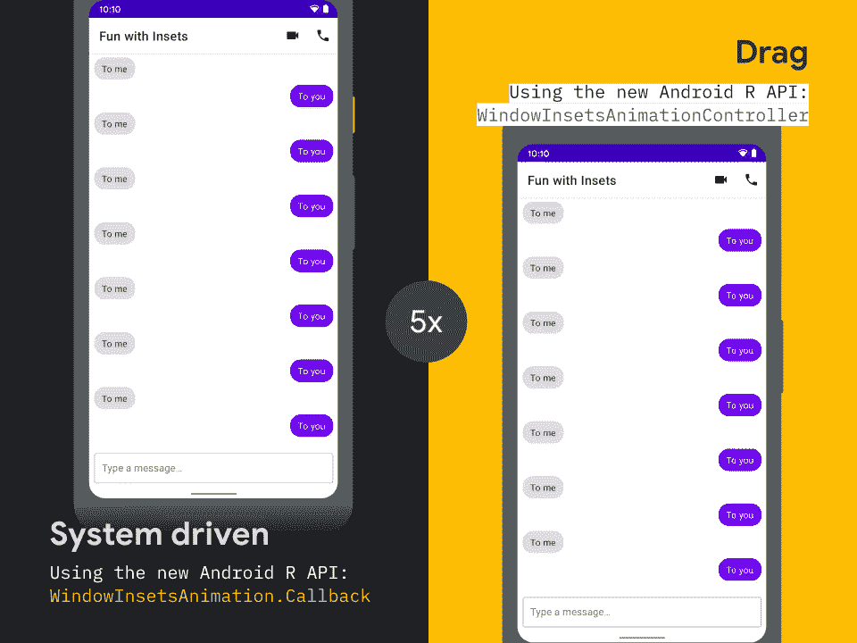
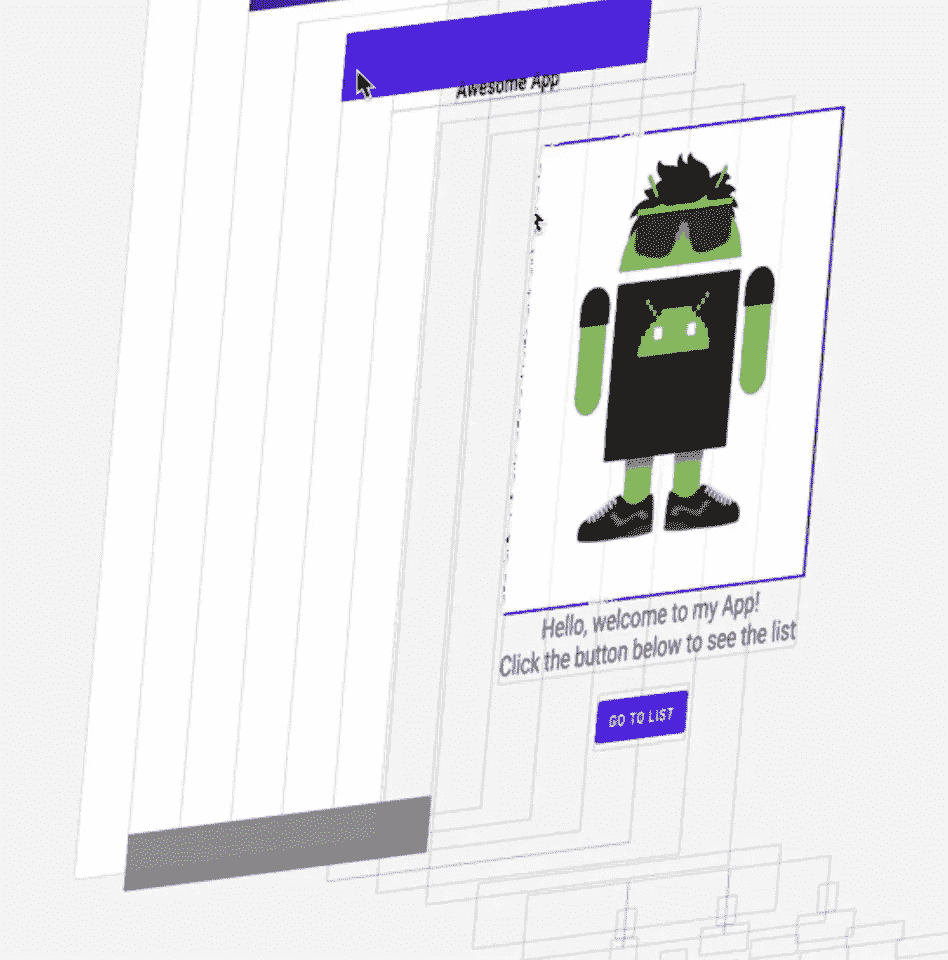

# 现在在 Android #15 中

> 原文：<https://medium.com/androiddevelopers/now-in-android-15-44bf3307a8f2?source=collection_archive---------0----------------------->

Illustration by [Virginia Poltrack](https://twitter.com/VPoltrack)

## Android 11 特性、AndroidX 版本和迁移指南、截屏、关于 Kotlin、Jetpack 和 Android Studio 的视频和文章，以及关于…音频的音频播客

欢迎来到 Android 中的 Now，这是您对 Android 开发世界中新的和值得注意的事物的持续指导。

# 视频和播客形式的 NiA15

这个*现在在 Android* 中也以视频和播客的形式提供。内容是一样的，但是需要的阅读量更少。文章版本(继续阅读！)仍然是链接到所有内容的地方。

## 录像

## 播客

点击下面的链接，或者在你最喜欢的客户端应用程序中订阅播客。

 [## 现在在 Android: 15 - Android 11 功能，AndroidX，视频，文章，等等！

### 欢迎来到 Android 中的 Now，这是您对 Android 开发世界中新的和值得注意的事物的持续指导。在这个…

nowinandroid.googledevelopers.libsynpro.com](http://nowinandroid.googledevelopers.libsynpro.com/15-android-11-features-androidx-videos-articles-and-more) 

# 安卓 11

Android dialed up to 11

这次 [Android 11](https://developer.android.com/preview) 发布没有新的进展:它仍然在开发者预览版 2 中，我在上一集已经谈到了。但是有几件与该版本相关的事情很有意思:

## 🥵，你能承受高温吗？

首先，对于那些在那里的原生程序员(你知道你是谁)，随 Android 11 开发者预览版 2 发布的 NDK 增加了[热 API](https://developer.android.com/ndk/reference/group/thermal) ，允许开发者找出设备的当前状态，以便他们做出相应的反应。

## 在仿真器上运行原生 ARM 应用的系统映像

Android Studio 团队的 Michael Hazard 在 Android 开发者博客上发表了一篇关于 ARM 二进制文件更快仿真的文章。

 [## 在 Android 模拟器上运行 ARM 应用

### 作为 Android 11 开发者预览版的一部分，我们已经发布了 Android 11 系统映像，它能够执行 ARM…

android-developers.googleblog.com](https://android-developers.googleblog.com/2020/03/run-arm-apps-on-android-emulator.html) 

如果你的应用完全是用 Kotlin 或者 Java 编程语言编写的，这并不会影响到你。但是如果您使用只有 ARM 二进制文件的本地库，那么您就不能在 x86 机器上使用 x86 加速的仿真器功能。相反，你不得不在物理设备(本机使用 ARM)上测试你的应用程序，或者用一个慢得多的模拟器映像来测试。

现在，通过 Android 11 版本中包含的新的 ARM 兼容系统映像，我们能够从 ARM 翻译到 x86 指令，这使仿真器能够利用硬件加速并在运行 ARM 二进制文件时保持性能。

## IME 动画示例应用程序

上次，我一直在说我在 Android 11 中最喜欢的功能:ime 动画。这个新的平台功能允许应用程序监听动画的进度，以便它们可以相应地调整它们的内容。同样，反过来，他们可以直接控制键盘的动画。

Chris Banes 写了一个例子来展示如何做到这一点，[windowinsetanimation](https://github.com/android/user-interface-samples/tree/master/WindowInsetsAnimation)，它展示了如何对 IME 进入和离开屏幕做出反应，以及如何控制 IME 的进入/退出。

# 安卓克斯

4 月初发布了许多 AndroidX 库，包括以下稳定版本:

*   [ExifInterface 1.2.0](https://developer.android.com/jetpack/androidx/releases/exifinterface#1.2.0) 增加了对将 EXIF 元数据写入 PNG 文件和为 WebP 读写 EXIF 的支持。现在 ExifInterface 处理对 PNG、JPEG 和 WebP 的写入(以及从各种其他文件类型读取)。
*   [片段 1.2.4](https://developer.android.com/jetpack/androidx/releases/fragment#1.2.4) 提供 Proguard 和 Lint 改进。

还有几个 AndroidX 库达到了 [beta](https://developer.android.com/jetpack/androidx/versions/beta-channel) 和 [alpha](https://developer.android.com/jetpack/androidx/versions/alpha-channel) 的不同阶段，所以请查看[所有版本](https://developer.android.com/jetpack/androidx/versions/all-channel)以了解更多细节。

## 大迁徙

说到 AndroidX， [Nick Anthony](https://medium.com/u/35e240284563?source=post_page-----44bf3307a8f2--------------------------------) 写了一篇文章，讲述了如何从这些库的以前支持库版本迁移到 AndroidX。

 [## 迁移到 AndroidX:提示、技巧和指导

### 充分利用最新的喷气背包。

medium.com](/androiddevelopers/migrating-to-androidx-tip-tricks-and-guidance-88d5de238876) 

如果你一直在拖延，这是一个最终做这件事的好时机。支持库在这一行的末尾；版本 28 是最后一个将接受任何修复的版本，所以请转到未来的 AndroidX 版本。

# 视频和文章

正常情况下，我会在 Android 中的*中单独列出视频和文章。但是只要有可能，我们会尝试以两种格式发布开发者内容(软件就是为了重用！).因此，为了减少内容重叠带来的混乱，这次我将尝试把文章和视频融合在一起。*

## 截屏

在目前我们所有人都在家工作的情况下，录制视频…不像我们有专业录音室和制作团队时那么容易。但事实证明，每个人都可以编写代码并解释它，所以截屏可能是未来(或至少是现在)的开发人员视频。

[Jose Alcérreca](https://medium.com/u/e0a4c9469bb5?source=post_page-----44bf3307a8f2--------------------------------) 发布了四个新的截图，展示了一些基本的 Android 开发技术。这些视频涵盖了[视图绑定](https://www.youtube.com/watch?list=PLNUr_cTShrWZNKJlnurh5MB1wkSEU2nlw&v=5VaWzrX6VZA)、 [UI 测试](https://www.youtube.com/watch?v=EPcpKzAGZuI&list=PLNUr_cTShrWZNKJlnurh5MB1wkSEU2nlw&index=3&t=0s)、 [LiveData 和 ViewModel 使用](https://www.youtube.com/watch?v=j1WdWCAkYig&list=PLNUr_cTShrWZNKJlnurh5MB1wkSEU2nlw&index=4&t=0s)，以及[数据绑定](https://www.youtube.com/watch?v=j8xeUqKylBE&list=PLNUr_cTShrWZNKJlnurh5MB1wkSEU2nlw&index=5&t=0s)。对于总共七分钟的内容来说，这已经不错了。

## 科特林

发布了一些关于 Kotlin 开发的文章和视频:

[Manuel Vivo](https://medium.com/u/3b5622dd813c?source=post_page-----44bf3307a8f2--------------------------------) 发布了视频 [Kotlin Coroutines 101](https://youtu.be/ZTDXo0-SKuU) 。在这个演示中，Manuel 解释了什么是协程，它们解决了什么问题(剧透:它们简化了异步编程)。他还讨论了协程取消和测试。

弗洛里纳·蒙特内斯库发布了[科特林词汇](https://www.youtube.com/playlist?list=PLWz5rJ2EKKc_T0fSZc9obnmnWcjvmJdw_)系列的下一集，以[视频](https://youtu.be/wAQCs8-a6mg)和[文章](/androiddevelopers/inline-functions-under-the-hood-12ddcc0b3a56)的形式发布。这一次，她讨论内联函数。内联函数使编译器将函数代码复制到调用点，消除了 lambda 函数参数的开销，否则这些开销会导致底层分配。但是内联函数不是万能的。当确实有函数参数开销需要减轻时，可以考虑使用它们。不要在大型复杂的函数中使用它们，否则你的代码会因为这些副本而膨胀。

Inline Functions: The video

 [## 嵌入式功能—在引擎盖下

### 科特林词汇

medium.com](/androiddevelopers/inline-functions-under-the-hood-12ddcc0b3a56) 

Manuel 发布了一篇名为[协程&的文章，针对不应该被取消的工作模式](/androiddevelopers/coroutines-patterns-for-work-that-shouldnt-be-cancelled-e26c40f142ad)。有时您想要异步执行您想要继续运行的工作，即使您开始工作的范围已经结束。本文将讨论如何使用自定义范围来实现这一点，并讨论有助于确定在不同情况下使用哪种方法的开发模式。

 [## 不应该取消的工作的协程和模式

### 协同程序中的取消和异常(第四部分)

medium.com](/androiddevelopers/coroutines-patterns-for-work-that-shouldnt-be-cancelled-e26c40f142ad) 

## 喷气背包

有一些关于各种 Jetpack APIs 的东西值得一试。

[Tiem Song](https://medium.com/u/52873e9e8e?source=post_page-----44bf3307a8f2--------------------------------) 发布了[组装您的 Jetpack](https://youtu.be/2h-vuXC0SF8) ，其中讨论了 Jetpack APIs，概述了 API 以及如何在您的应用程序中使用它们，包括如何迁移到新的 AndroidX 版本的库。所有新的开发都发生在 AndroidX 库中，而不是旧的支持库版本。说到迁移，一定要看看上面讨论的 Nick Anthony 的[文章](/androiddevelopers/migrating-to-androidx-tip-tricks-and-guidance-88d5de238876)，它更详细地讨论了迁移。

Tiem 使用 [Sunflower 示例应用程序](https://github.com/android/sunflower)来展示运行中的 Jetpack APIs。

[Pietro Maggi](https://medium.com/u/1810439c8f4b?source=post_page-----44bf3307a8f2--------------------------------) 发布了关于工作管理器系列的第五篇文章，定制工作管理器—基础。本文展示了如何为 WorkManager 创建一个定制配置，以及为什么有时您可能希望这样做。

 [## 自定义工作管理器—基础

### 一篇关于 WorkManager 定制配置的文章。它是什么，为什么你可能需要一个和如何实现它。

medium.com](/androiddevelopers/customizing-workmanager-fundamentals-fdaa17c46dd2) 

[弗洛里纳](https://medium.com/u/d5885adb1ddf?source=post_page-----44bf3307a8f2--------------------------------)发了一篇关于 RecyclerView 的文章:[用 MergeAdapter](/androiddevelopers/merge-adapters-sequentially-with-mergeadapter-294d2942127a) 依次合并适配器。有了这个在 alpha02 版本的 [recyclerview-1.2.0](https://developer.android.com/jetpack/androidx/releases/recyclerview) 中添加的新 API，你就可以使用多个适配器(它们是*合并*成一个的——明白了吗？)而不是从单个适配器提供所有视图。

 [## 用 MergeAdapter 按顺序合并适配器

### 用例示例:显示列表页眉和页脚

medium.com](/androiddevelopers/merge-adapters-sequentially-with-mergeadapter-294d2942127a) 

[Manuel](https://medium.com/u/3b5622dd813c?source=post_page-----44bf3307a8f2--------------------------------) 发布了一篇文章，其中提供了显示 Dagger 为注释生成的代码的备忘单。本文还提供了一些有用的链接，包括依赖注入指南、在 Android 中使用 Dagger 的代码实验室，以及关于 Dagger 在 Android 中的未来的视频。

 [## Dagger 代码生成备忘单

### 你有没有想过匕首在引擎盖下是做什么的🤔？

medium.com](/androiddevelopers/dagger-code-generation-cheat-sheets-6b4fa2da4e7a) 

同样在 Jetpack 中:[肖恩·麦克奎蓝](https://medium.com/u/83518fe480be?source=post_page-----44bf3307a8f2--------------------------------)为 [Jetpack Compose](https://developer.android.com/jetpack/compose) 更新了 [JetNews 示例应用](https://github.com/android/compose-samples/releases/tag/dev08)以与 Compose 的[最新版本同步，dev08。除了其他变化，这个版本使用新的 fluent API 作为修改器。](https://developer.android.com/jetpack/androidx/releases/compose)

## 安卓工作室

[Murat Yener](https://medium.com/u/e947fef0dfe0?source=post_page-----44bf3307a8f2--------------------------------) 发表了一篇关于 Android Studio 4.0 测试版[中新布局检查工具的文章。布局检查器并不是新功能，但它已被重新编写了许多强大的功能，包括当您在设备上与应用程序交互时的实时更新，允许您跳转到定义属性的代码的属性解析，以及允许您更好地了解应用程序中的视图和包含层次的 3D 可视化模式。](https://developer.android.com/studio/preview)

 [## 布局检查器

### 调试 UI 问题可能很棘手。Android Studio 4.0 带有一个更新的布局检查器，可以让你调试你的…

medium.com](/androiddevelopers/layout-inspector-1f8d446d048) 

# ADB 播客片段

自从上一期*Android*发布以来，又有一期 [Android 开发者后台](http://androidbackstage.blogspot.com/)播客发布。点击下面的链接，或者在你最喜欢的播客客户端查看:

## ADB 135:音频播客

我们的第一次完全远程播客(我们都在自己的豪华壁橱里录制自己)与从事音频技术的客人一起进行，这是很恰当的。我们与 Android 音频团队的工程师 Phil Burk(我们在第 39 集谈到 Android 上的 MIDI 时曾与他交谈过)和来自开发者关系团队的 [Don Turner](https://medium.com/u/7f5a2cb6598e?source=post_page-----44bf3307a8f2--------------------------------) 讨论了音频延迟，特别是关于[双簧管](https://github.com/google/oboe)。Oboe 是一个原生(read: C++)库，让开发者更容易在 Android 上实现更低延迟的音频。

 [## 第 135 集:音频播客

### 在这有史以来第一次全远程插曲，Tor 和切特讨论音频编程与唐特纳从 Android DevRel…

androidbackstage.blogspot.com](http://androidbackstage.blogspot.com/2020/04/episode-135-audio-podcast.html) 

# 那么现在…

这次到此为止。所以，来看看 Android 11 的一些特性和 API 吧！去拿[最新发布的安卓系统](https://developer.android.com/jetpack/androidx/versions/all-channel)！在[安卓开发者频道](https://www.youtube.com/user/androiddevelopers)观看一些[的截屏](https://www.youtube.com/playlist?list=PLNUr_cTShrWZNKJlnurh5MB1wkSEU2nlw)和最新视频！看一些 Android 开发者[的文章](https://medium.com/androiddevelopers)！查看最新的[亚行播客剧集](http://androidbackstage.blogspot.com)！请尽快回到这里，收听 Android 开发者世界的下一次更新。