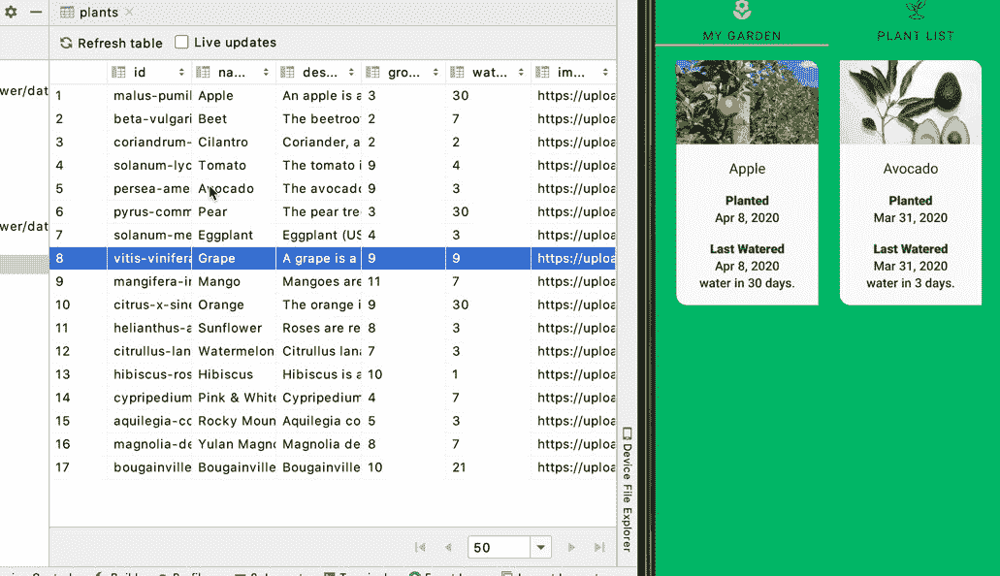
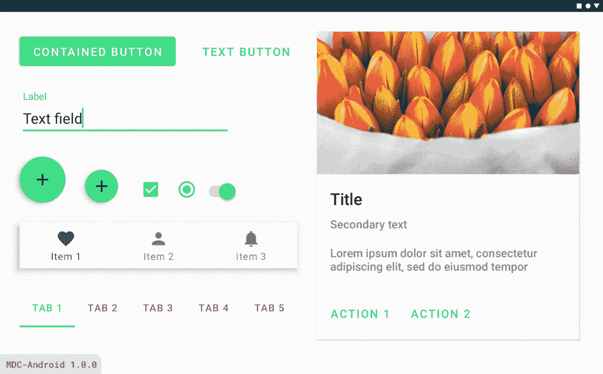

# 现在在 Android #16 中

> 原文：<https://medium.com/androiddevelopers/now-in-android-16-9a282ebd3f42?source=collection_archive---------0----------------------->

Illustration by [Virginia Poltrack](https://twitter.com/VPoltrack)

## AndroidX 发布、文章和视频、代码实验室和样本以及 ADB 播客

欢迎来到 Android 中的 Now，这是您对 Android 开发世界中新的和值得注意的事物的持续指导。

# AndroidX 释放

像往常一样，最近发布了许多 AndroidX 库。这包括带有错误修复的新稳定版本:

*   [导航 2.2.2](https://developer.android.com/jetpack/androidx/releases/navigation#2.2.2)
*   [首选项 1.1.1](https://developer.android.com/jetpack/androidx/releases/preference#1.1.1)

也有很多名副其实的 [RC](https://developer.android.com/jetpack/androidx/versions/rc-channel) 、 [beta](https://developer.android.com/jetpack/androidx/versions/beta-channel) 和 [alpha](https://developer.android.com/jetpack/androidx/versions/alpha-channel) 版本。我想叫出几个与动画相关的新阿尔法。首先是作为[核心动画 1.0.0-alpha01](https://developer.android.com/jetpack/androidx/releases/core#core-animation-1.0.0-alpha01) 以及新的[Vectordrawable-Seekable 1 . 0 . 0-alpha 01](https://developer.android.com/jetpack/androidx/releases/vectordrawable#vectordrawable-seekable-1.0.0-alpha01)的一部分的 Animator APIs 的后端。

你可能想知道为什么我们要拆分 Animator API。毕竟，这些 API 在平台中存在的时间比你的应用程序目前可能支持的版本更长(大多数都是在 Android Honeycomb 3.0–3.2 中发布的)。答案就在另一个库中:Vectordrawable-Seekable。

AnimatedVectorDrawable 对象经常要求的功能之一是使它们“可查找”的能力——能够暂停和恢复它们，并以编程方式设置它们的动画位置，而不仅仅是原始的“一劳永逸”功能。问题是这种能力依赖于平台暂停和寻找底层*动画师*的能力，直到比最初的蜂巢时代的 API 晚了很多才被添加进来。

因此，为了能够寻找/暂停/恢复 AnimatedVectorDrawable 对象(特别是在 AndroidX 非捆绑库中，跨旧版本)，我们需要反向移植 Animator APIs 以获得所有正确的功能和修复。

> 寻找，你就会找到[动画]

# 视频和播客形式的 NiA16

这个*现在在 Android* 中也以视频和播客的形式提供。内容是一样的，但是需要的阅读量更少。文章版本(继续阅读！)仍然是链接到所有内容的地方。

## 录像

## 播客

点击下面的链接，或者在你最喜欢的客户端应用程序中订阅播客。

 [## 现在在 Android: 16 - AndroidX 发布，文章，视频，代码实验室，样本，等等！

### 欢迎来到 Android 中的 Now，这是您对 Android 开发世界中新的和值得注意的事物的持续指导。在这个…

nowinandroid.googledevelopers.libsynpro.com](http://nowinandroid.googledevelopers.libsynpro.com/16-androidx-releases-articles-videos-codelabs-samples-and-more) 

## 数据潜水

[Murat Yener](https://medium.com/u/e947fef0dfe0?source=post_page-----9a282ebd3f42--------------------------------) 写了一篇名为[数据库检查器](/androiddevelopers/database-inspector-9e91aa265316)的文章，展示了如何在 [Android Studio 4.1 canary 6](https://developer.android.com/studio/preview) 中使用新的数据库检查器工具。

有了这个新工具，你现在可以看到应用的 SQLite 数据库中正在发生什么(无论你是直接使用 SQLite 还是通过 [Room persistence 库](https://developer.android.com/topic/libraries/architecture/room))。您可以直接在工具中对数据进行更改。您还可以在工具中查看数据的实时更新，或者在应用程序中查看工具对数据的更新(如果您正在使用 Room 并观察更改)。

## 运算符重载++

[梅根·梅塔](https://medium.com/u/401951cd4c3e?source=post_page-----9a282ebd3f42--------------------------------)在[科特林词汇](/androiddevelopers/search?q=Kotlin%20Vocabula)系列中发表了一篇关于[操作符重载](/androiddevelopers/code-expressivity-with-operator-overloading-ada22a0ca633)的文章。Kotlin 允许重载像+、-和*这样的标准操作符，甚至像[]和<这样的访问和比较操作符。当对不能直接使用运算符的类型执行标准操作时，运算符重载可以使代码更具可读性。例如，添加两个点对象或将两个矩阵对象相乘看起来很自然，使用重载操作符会更简洁。

本文涵盖了如何使用该特性的基础知识，并指出为什么在某些情况下您可能不希望这样做。像其他 Kotlin 词汇表一样，也有对它如何工作的描述。

 [## 带有运算符重载的代码 expressivity++

### 科特林词汇

medium.com](/androiddevelopers/code-expressivity-with-operator-overloading-ada22a0ca633) 

## 材料设计组件

Migrate your app to take on the latest material guidance

[Nick Rout](https://medium.com/u/37290b859aca?source=post_page-----9a282ebd3f42--------------------------------) 发表了[迁移到 Android 的 Material Components】，其中谈到了新的 Material Design Components 1.1.0 库的变化，以及如何从 MDC 的早期版本和更早的设计支持库进行迁移。Pro 提示如果还在用设计支持库:先迁移到 MDC 1.0.0(兼容 AndroidX)，再向上迁移到 1.1.0。](/androiddevelopers/migrating-to-material-components-for-android-ec6757795351)

1.1.0 中的一些新功能包括深色主题、对颜色、排版和形状的完整材质主题支持、新的小部件(如扩展 FAB 和日期选择器)以及各种可访问性改进和错误修复。

这是一篇很长的文章，有很多细节、链接和示例；请查看它，充分利用您向 MDC 的迁移。

 [## 迁移到 Android 的材料组件

### 来自设计支持库👉MDC 1.0.0👉MDC 1.1.0 及更高版本

medium.com](/androiddevelopers/migrating-to-material-components-for-android-ec6757795351) 

尼克还发布了该内容的视频版本:

## 一次敲击

[肖恩·麦克奎蓝](https://medium.com/u/83518fe480be?source=post_page-----9a282ebd3f42--------------------------------)发表了一篇文章，解释了如何在你的应用中使用新的 One Tap API 来认证用户。如果用户对注册或登录过程感到失望，为了避免失去用户，身份验证可能是一个需要优化的重要体验。

One Tap 是作为谷歌身份服务的一部分提供的更广泛的认证库套件的一部分。该套件仍在开发中，稍后将添加更多功能，但现在您可以使用一个点击来创建一个简单的注册或登录流程。请稍后继续关注更多功能。

 [## 一键登录 Android 应用

### Android 上新的 One Tap 登录和注册功能可帮助您优化在应用中验证用户身份的流程。对于…

medium.com](/androiddevelopers/one-tap-sign-in-for-android-apps-2259ce15bc2c) 

## LiveData

[Jose Alcérreca](https://medium.com/u/e0a4c9469bb5?source=post_page-----9a282ebd3f42--------------------------------) 在其正在进行的[截屏系列](https://www.youtube.com/playlist?list=PLNUr_cTShrWZNKJlnurh5MB1wkSEU2nlw)中，在 LiveData 上发布了一个由两部分组成的视频:

第 1 部分:一次性操作解释了如何使用 LiveData 协同程序构建器 KTX 扩展函数来保存样板代码。

[第 2 部分:带有 SwitchMap 的参数](https://www.youtube.com/watch?v=KUn0-D6DpuY&list=PLNUr_cTShrWZNKJlnurh5MB1wkSEU2nlw&index=6)建立在前面的例子上，展示了如何传递带有动态数据的参数。

# 示例代码

## 位置，位置，位置

在最近的版本中，该平台最大的变化之一是围绕位置，因为我们让用户更清楚地知道哪些应用程序正在使用位置信息，以及他们如何控制这种使用。

[Jeremy Walker](https://medium.com/u/73335236659e?source=post_page-----9a282ebd3f42--------------------------------) 已经重写了 [Android 位置代码实验室](https://codelabs.developers.google.com/codelabs/while-in-use-location/index.html?index=..%2F..index#0)以包含更多关于使用位置的详细说明，包括新政策变化的最佳实践，更重要的是，支持新的 Android 11 限制。

 [## 使用 Kotlin 在 Android 中接收位置更新

### Android 10 和 11 让用户可以更好地控制应用程序对设备位置的访问。当一个运行在 Android 11 上的应用程序…

codelabs.developers.google.com](https://codelabs.developers.google.com/codelabs/while-in-use-location/index.html?index=..%2F..index#0) 

codelab 涵盖了最常见的用例:在应用程序被积极使用时(当您的活动可查看或作为前台服务运行并带有通知时)检索位置。

您可能还会注意到，codelab 不再包括从后台检索位置。除非您有有效的用例，否则不推荐这种行为。如果你 *do* 脑子里有这样一个用例，还有一个新的[背景位置样本](https://github.com/android/location-samples/tree/master/LocationUpdatesBackgroundKotlin)要检验。它遵循位置策略的最新最佳实践。

 [## Android/位置-示例

### 演示在后台检索位置更新。此应用程序允许用户在中接收位置更新…

github.com](https://github.com/android/location-samples/tree/master/LocationUpdatesBackgroundKotlin) 

## 易接近

Shailen Tuli 创建了几个 codelabs 来帮助开发者实现可访问的应用程序。

事实证明，大多数可访问性问题都是由 Android 库为您解决的(尤其是在使用标准小部件时，而不是自定义视图)。但即使有问题，也往往相对容易解决；诀窍是知道如何找到问题，以便你能解决它们。第一个 codelab 帮助识别应用程序中的常见问题，以及这些问题的简单修复方法。

 [## 启动 Android 辅助功能

### Android 应用应该是每个人都可以使用的，包括有无障碍需求的人。影响…的常见条件

codelabs.developers.google.com](https://codelabs.developers.google.com/codelabs/starting-android-accessibility/#0) 

一旦你实现了一个可访问的应用程序(每个人都应该！)，您可能希望添加一些自动化测试，以确保将来对该应用程序的任何更改都能够继续保持您从一开始就构建的高水平的可访问性。Shailen 的下一个 codelab 涵盖了一些要使用的工具，以及如何将可访问性测试集成到现有的 Espresso 测试中。

 [## 使用 Espresso 进行自动化可访问性测试

### 最近更新:2020-04-21 有几个高层次的测试方法，开发人员可以利用它们来…

codelabs.developers.google.com](https://codelabs.developers.google.com/codelabs/a11y-testing-espresso/#0) 

# ADB 播客片段

自从上一期《现在》发布以来，已经有几集 Android 开发人员在后台发布了。点击下面的链接，或者在你最喜欢的播客客户端查看它们:

## 亚行 137:无障碍

说到可访问性(我刚刚提到了——参见上面示例部分中的两个 codelabs！)、 [Tor Norbye](https://medium.com/u/8251a5f98c9d?source=post_page-----9a282ebd3f42--------------------------------) 、 [Romain Guy](https://medium.com/u/c967b7e51f8b?source=post_page-----9a282ebd3f42--------------------------------) 和我与 Android Accessibility 团队的 Qasid Sadiq 和 Sally Yuen 进行了一次对话，讨论开发者如何让他们的应用程序更容易被更多人访问和使用。

 [## 第 137 集:无障碍

### 这一集，罗曼、切特和托尔对话(远程！)与来自可访问性团队的 Sally Yuen 和 Qasid Sadiq 一起…

androidbackstage.blogspot.com](https://androidbackstage.blogspot.com/2020/04/episode-137-accessibility.html) 

## 第 136 集:遥控

这一集偏离了我们与工程师谈论他们所从事的技术的正常主题，而是我和[托尔](https://medium.com/u/8251a5f98c9d?source=post_page-----9a282ebd3f42--------------------------------)、[罗曼](https://medium.com/u/c967b7e51f8b?source=post_page-----9a282ebd3f42--------------------------------)之间的一次对话，内容是关于我们如何[大部分]适应新的在家工作的现实。

 [## 第 136 集:遥控

### 在这一集里，Romain、Chet 和 Tor 与 zero guests 讨论了当前在家工作的现状，以及…

androidbackstage.blogspot.com](http://androidbackstage.blogspot.com/2020/04/episode-136-remoting.html) 

# 那么现在…

这次到此为止。去获取最新的 AndroidX 库版本吧！阅读关于 Android 开发技术的最新[文章！玩](https://medium.com/androiddevelopers)[位置](https://codelabs.developers.google.com/codelabs/while-in-use-location/index.html?index=..%2F..index#0)或[可访问性](https://codelabs.developers.google.com/codelabs/starting-android-accessibility/#0) codelab，或位置访问上的[样本](https://github.com/android/location-samples/tree/master/LocationUpdatesBackgroundKotlin)！听最新的 [ADB 播客](http://androidbackstage.blogspot.com/)集！请尽快回到这里，收听 Android 开发者世界的下一次更新。