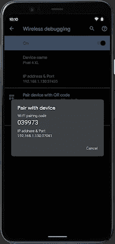

# 现在在 Android #17 中

> 原文：<https://medium.com/androiddevelopers/now-in-android-17-9d73f7bed7f?source=collection_archive---------5----------------------->

Illustration by [Virginia Poltrack](https://twitter.com/VPoltrack)

## Android 11 DP3，关于 CameraX、Dagger、Kotlin 和渲染的文章，AndroidX 发布，以及关于 IME 动画的 ADB 播客

欢迎来到 Android 中的 Now，这是您对 Android 开发世界中新的和值得注意的事物的持续指导。

# 视频和播客形式的 NiA17

这个*现在在安卓*中也以视频和播客的形式提供。内容是一样的，但是需要的阅读量更少。文章版本(继续阅读！)仍然是链接到所有内容的地方。

## 录像

## 播客

点击下面的链接，或者在你最喜欢的客户端应用程序中订阅播客。

 [## 现在在 Android: 17 - Android 11 DP3，文章，AndroidX 发布，和一个播客

### 欢迎来到 Android 中的 Now，这是您对 Android 开发世界中新的和值得注意的事物的持续指导。在这个…

nowinandroid.googledevelopers.libsynpro.com](http://nowinandroid.googledevelopers.libsynpro.com/17-android-11-dp3-articles-androidx-releases-and-a-podcast) 

# Android 11:开发者预览版 3

Dial it up to Android 11

最近推出的 Android 11 最新预览版，除了正在进行的预览版通常带来的修复外，还增加了一些新功能。

## 调试改进

捕捉真实世界的问题可能很困难，因为设备和情况与开发人员可用的测试大相径庭。能够获得更多关于现场发生的崩溃和问题的信息是很有帮助的。

Android 11 中有一些改进应该会有所帮助。首先是一个新的 [API](https://developer.android.com/reference/kotlin/android/app/ActivityManager#gethistoricalprocessexitreasons) ，用于查询关于你的应用退出的原因的信息。

此外，对于 NDK 开发者来说，Android 11 提供了[GWP-阿桑](https://developer.android.com/ndk/guides/gwp-asan)，这是一个低开销的库，有助于跟踪用户设备上的内存问题，使其更容易在现场发现这些难以发现的问题。我们已经将它用于平台库；现在您可以为您的应用程序启用它。

## 无线调试

说到让调试更容易…

Much of software development is a porting problem, USB ports included.

Wireless debugging at last

在这些不确定的日子里，我们珍惜生活中那些我们可以依赖的东西。就像从来没有足够的 USB 端口来连接我们的机器。

这就是为什么新的[无线调试功能](https://developer.android.com/preview/features#wireless-adb)应该是所有 Android 开发者工具箱中受欢迎的新增功能。现在，您可以通过命令行访问这个新工具，但是随着我们的不断努力，可以期待将来的改进。

## 亚行增量 APK 安装

作为我们努力改进 Android 游戏开发的一部分，我们已经[添加了一个新工具](https://developer.android.com/preview/features#incremental)来使推送大型 apk 的速度更快(高达 10 倍！).该过程包括使用新的 APK 签名方案对您的应用程序进行签名，并使用更新的 ADB 命令行工具。此外，请注意，这目前仅适用于 Pixel4/4XL 设备，因为它需要设备级的文件系统更改，但该功能将适用于所有与 Android 11 一起推出的新设备。

## 数据访问审计

Android 11 还增加了[审计你的应用](https://developer.android.com/preview/privacy/data-access-auditing)中发生的私人数据访问的能力。现在，您的应用程序可以看到它(或者它所依赖的库)何时访问需要用户许可的数据。如果您有一个非常大的应用程序或使用第三方库，并且您需要更好地了解数据是如何被访问的，无论是有意还是无意，这个 API 都很有用。

[Jeremy Walker](https://medium.com/u/73335236659e?source=post_page-----9d73f7bed7f--------------------------------) 写了一个 [Kotlin 示例](https://github.com/android/permissions-samples/tree/master/DataAccessAuditingKotlin)，教你如何使用 API，包括使用一个单独的模块/库，以你意想不到的方式访问数据。(不用担心，你学会了怎么识别那样的代码。)

 [## Android/权限-示例

### 此示例演示了如何通过…中提供的数据访问审核 API 来审核对应用程序中私有数据的访问

github.com](https://github.com/android/permissions-samples/tree/master/DataAccessAuditingKotlin) 

## 诸如此类…

查看[博客](https://android-developers.googleblog.com/2020/04/android-11-developer-preview-3.html)了解 DP3 发布的概述，查看 [Android 11 开发者预览网站](https://developer.android.com/preview)了解更多关于这些 DP3 特性以及 Android 11 所提供的一切的信息。如果你还没有在 Android 11 上试用你的应用，现在是时候了；我们延长的预览期是为了确保最终版本提供尽可能最大的兼容性和健壮性，所以请测试它，如果您有任何问题，请[告诉我们](https://developer.android.com/preview/feedback)。

# 文章

## CameraX 预览

 [## 用预览视图显示相机预览

### Android Jetpack CameraX:预览视图

medium.com](/androiddevelopers/display-a-camera-preview-with-previewview-86562433d86c) 

[侯赛因·哈基姆](https://medium.com/u/9ed81b63628d?source=post_page-----9d73f7bed7f--------------------------------)写了一篇文章展示如何使用 CameraX 创建一个简单的预览视图。您可以让 CameraX 为您管理，而不是手动管理曲面、配置、旋转和其他一切。它创建自定义视图并在内部管理图面。您可以实现一些有用的功能，如轻触对焦和捏放变焦，而无需直接处理包含摄像头馈送的表面。

## 安卓工作室里的匕首

 [## Android Studio 中的匕首导航支持

### 导航您的 Android 应用程序的匕首图从未如此简单！

medium.com](/androiddevelopers/dagger-navigation-support-in-android-studio-49aa5d149ec9) 

Manuel Vivo 写了一篇文章，介绍了 Android Studio 4.1 canary 版本中支持 Dagger 的一项新功能。特别是，您可以使用 IDE 来查看代码是如何被 Dagger 注入调用的，以及从调用点注入了哪些函数。

## 科特林物体

 [## 唯一的一件物品

### 科特林词汇

medium.com](/androiddevelopers/the-one-and-only-object-5dfd2cf7ab9b) 

Murat Yener 在 Kotlin 词汇系列中写了另一篇文章，探讨了 Kotlin `object`关键词。我们在 Java 中使用`static`来创建单例项，但是在 Kotlin 中没有`static`限定符。相反，我们使用`object`，它定义并创建一个实例。对象可以用来实现[单例模式](https://en.wikipedia.org/wiki/Singleton_pattern)(样板代码更少！)，以及 Kotlin 中的匿名内部类。

与 Kotlin 词汇表文章一样，Murat 的文章通过展示反编译的字节码实现，展示了幕后真正发生的事情。

## 动态刷新率

 [## Android 上的高刷新率渲染

### 长期以来，手机的显示屏以 60Hz 的频率刷新。应用程序和游戏开发人员可以假设…

android-developers.googleblog.com](https://android-developers.googleblog.com/2020/04/high-refresh-rate-rendering-on-android.html) 

图形工程团队的紫琳·亚伯拉罕在 Android 开发者博客上发布了一篇关于[可变刷新率](https://android-developers.googleblog.com/2020/04/high-refresh-rate-rendering-on-android.html)的文章，这是一些新设备上可用的功能，由 Android 11 中的新 API 实现。

多年来，设备的典型刷新率一直固定在每秒 60 帧左右，这给了应用程序大约 16 毫秒来呈现每帧的内容。如果应用程序不能达到那个帧速率，但希望保持一致的速率，它们必须降到默认速率的一半，以每秒 30 帧的速度发送新帧。可变刷新显示器有时可以支持 90 甚至 120 Hz 的速度，如果应用程序无法实现最高速率，则可能会有更高的帧速率和更多的后退速率可变性。

本文讨论了渲染系统的一般工作原理，以及应用程序如何使用 Android 11 中的新 API 向系统请求不同的渲染速率。

*(注意:这个话题是游戏或其他自定义渲染器开发者感兴趣的；它不是适用于大多数使用标准 Android UI 工具包的应用程序的 API 或技术。但仍然是一个有趣的阅读风格，“哦，原来事情是这样的！”)*

# 安卓克斯

各种 [AndroidX](https://developer.android.com/jetpack/androidx/versions) 库最近发布了(通常如此，因为 AndroidX 每两周发布一次)。它们都是增量中期[Alpha](https://developer.android.com/jetpack/androidx/versions/alpha-channel)/[Beta](https://developer.android.com/jetpack/androidx/versions/beta-channel)/[RC](https://developer.android.com/jetpack/androidx/versions/rc-channel)版本，所以我将跳过细节，除了我想特别指出的几个:

## [导航 2.3.0-alpha06](https://developer.android.com/jetpack/androidx/releases/navigation#2.3.0-alpha06)

这个版本包含一个新的 Kotlin DSL，用于动态创建导航图(与使用 Android Studio 中的导航图编辑器创建图形的传统机制相比，还有它的底层 XML 代码)。它支持的一个用例是新的动态功能导航功能，现在您可以使用导航组件导航到尚未安装的动态功能模块中的目的地。

[本·维斯](https://medium.com/u/65fe4f480b1c?source=post_page-----9d73f7bed7f--------------------------------)创造了一个[新样本](https://github.com/android/app-bundle-samples/tree/master/DynamicFeatureNavigation/DSL)来展示这是如何工作的，并且在新的[导航 DSL](https://developer.android.com/guide/navigation/navigation-kotlin-dsl) 上也有新的指南。

## [片段 1.3.0-alpha04](https://developer.android.com/jetpack/androidx/releases/fragment#1.3.0-alpha04)

这个新的片段库版本有一个新的片段结果 API，它取代了现在已经废弃的`setTargetFragment()`。更好的是，有一个关于如何在片段之间传递数据的新指南。

# Android 开发者后台:播客

自从上一期《现在》在安卓发布后，又有一集安卓开发者在后台发布。

点击下面的链接或者在你最喜欢的播客客户端查看。

## 亚行 138:动画 IME:哦，我的天！

我已经不停地谈论我在 Android 11 中最喜欢的功能:同步 IME 动画，开发人员可以控制和监听键盘动画，以创建更无缝的应用程序/键盘交互。在这一集里，[罗曼·盖伊](https://medium.com/u/c967b7e51f8b?source=post_page-----9d73f7bed7f--------------------------------)，[托尔·诺布耶](https://medium.com/u/8251a5f98c9d?source=post_page-----9d73f7bed7f--------------------------------)和我与来自窗口管理器工程团队的乔里姆·贾吉、阿德里安·鲁斯和塔兰·辛格谈论了这一切是如何运作的。

 [## 第 138 集:动画 IME -哦，我的天！

### 在这一集里，Tor，Chet 和 Romain 与来自 Window Manager 团队的 Jorim，Adrian 和塔兰一起。我们讨论了…

androidbackstage.blogspot.com](http://androidbackstage.blogspot.com/2020/04/episode-138-animated-ime-oh-my.html) 

# 那么现在…

这次到此为止。去看看最新的 [Android 11 预告](https://developer.android.com/preview)！阅读关于 [CameraX 预览](/androiddevelopers/display-a-camera-preview-with-previewview-86562433d86c)的观点！在安卓工作室玩[匕首功能！了解](/androiddevelopers/dagger-navigation-support-in-android-studio-49aa5d149ec9) [Kotlin 对象](/androiddevelopers/the-one-and-only-object-5dfd2cf7ab9b)如何实现简单的单例编码！了解更多关于 Android 渲染管道以及[动态刷新率](https://android-developers.googleblog.com/2020/04/high-refresh-rate-rendering-on-android.html)如何工作的信息！下载并使用最新的[导航](https://developer.android.com/jetpack/androidx/releases/navigation#2.3.0-alpha06)和[片段](https://developer.android.com/jetpack/androidx/releases/fragment#1.3.0-alpha04) AndroidX 库！收听亚洲开发银行关于 IME 动画的最新播客[！请尽快回到这里，收听 Android 开发者世界的下一次更新。](http://androidbackstage.blogspot.com/2020/04/episode-138-animated-ime-oh-my.html)