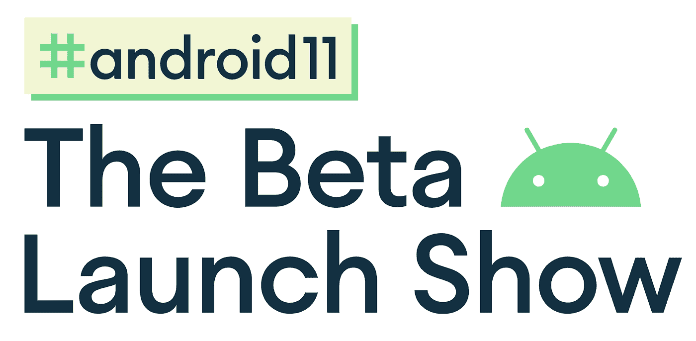

# 现在在 Android #18 中

> 原文：<https://medium.com/androiddevelopers/now-in-android-18-4ee70b267765?source=collection_archive---------7----------------------->

Illustration by [Virginia Poltrack](https://twitter.com/VPoltrack)

## Android 11 更新、# Android 11:Beta 发布会、文章、codelabs 和 ADB 播客

欢迎来到 Android 中的 Now，这是您对 Android 开发世界中新的和值得注意的事物的持续指导。

# 视频和播客形式的 NiA18

这个*现在在 Android* 中也以视频和播客的形式提供。内容是一样的，但是需要的阅读量更少。文章版本(继续阅读！)仍然是链接到所有内容的地方。

## 录像

## 播客

点击下面的链接，或者在你最喜欢的客户端应用程序中订阅播客。

 [## 现在在 Android: 18 - Android 11，#Android11:测试版发布会，文章，代码实验室，和一个…

### 欢迎来到 Android 中的 Now，这是您对 Android 开发世界中新的和值得注意的事物的持续指导。在这个…

nowinandroid.googledevelopers.libsynpro.com](http://nowinandroid.googledevelopers.libsynpro.com/18-android-11-android11-the-beta-launch-show-articles-codelabs-and-a-podcast) 

# Android 11 更新

Dial it up to Android 11

我们仍在努力完成 Android 11 版本的开发者预览阶段。

自从上一个*以来，Android* 中已经出现了几个相关的项目:

## 开发者预览版 4

下一个预览版在几周前发布。开发者预览版 4 更具增量，所以没有关于它的大公告，但请查看[发布说明](https://developer.android.com/preview/release-notes)(包括 [API 29 - > DP4](https://developer.android.com/sdk/api_diff/r-dp4/changes) 的差异报告或只是 [DP3 - > DP4](https://developer.android.com/sdk/api_diff/r-dp4-incr/changes) )了解细节，或[预览网站](https://www.google.com/search?q=android+11+developer+preview+4&oq=android+11+developer+preview+4&aqs=chrome..69i57j69i64l4j69i60.4499j0j7&sourceid=chrome&ie=UTF-8)查看 Android 11 的所有细节。

## 测试计划

戴夫·伯克在 Android 开发者博客上发表了一篇文章，谈论 Android 11 将会发生什么。特别是，在发布时间表上有一个微小的调整，因为我们将所有的测试版(和最终版)推迟了大约一个月。你可以在文章中或者更新的预告[时间线网站](https://developer.android.com/preview/overview#timeline)上看到细节。

说一个软件时间表改变了，就像说地球昨天绕着它的轴旋转。这是生活和物理的事实。代码被编写，错误被修复(并被创建！)和时间表的变化。欢迎使用软件。

# #Android11:测试版发布会

为了帮助你了解你需要知道的关于 Android 11 的一切，我们正在举办一场名为#[Android 11:Beta 发布会](https://developer.android.com/android11)的在线活动。请尽快加入我们由 Dave Burke 主持的节目，随后是几个深入的技术讲座。*(注:本次活动原定于 6 月 3 日，但已延期。查看网站，了解何时会发生)。*

此外，紧接着节目的是#AskAndroid 的特别会议。我们现在正在 Twitter 上收集你的问题(见已经发布在[节目网站](https://developer.android.com/android11)上的一些问题)；使用标签#AskAndroid 向我们发送您的问题，我们将在会议期间尝试回答这些问题。

请立即查看展会网站，并注册获取活动的最新消息。到时见！

# 文章

## App 签约问答

[Wojtek Kaliciński](https://medium.com/u/b913acc64439?source=post_page-----4ee70b267765--------------------------------) 写了一篇文章，解释了 Google Play 应用程序签名背后的许多细节:

 [## Google Play 应用签名常见问题解答

### 根据我们的开发者关系团队听到的问题，以下是一些关于启用 Google Play 应用签名的建议…

medium.com](/androiddevelopers/answers-to-common-questions-about-app-signing-by-google-play-b28fef836af0) 

允许 Google Play 签署您的应用程序可以提供安全保障，防止密钥丢失(这是许多开发人员面临的一个现实问题)或被盗。

开发人员向我们询问了许多关于新应用程序签名流程和应用程序签名的问题。Wojtek 的文章遍历了那些问题(奖金:有答案！)来解释事情是如何工作的，将开发人员管理他们自己的密钥的旧模型与使用 Google 的安全基础设施来管理密钥的新世界进行比较。

作为奖励，选择应用程序签名的开发者可以开始利用[应用程序捆绑包](https://developer.android.com/platform/technology/app-bundle)(Play 可以提供较小的特定于配置的应用程序版本，而无需您提供处理所有情况的大型 apk 或管理大量特定于配置的 apk)。

## WindowManager 库

Kenneth Ford 和 Andrii Kulian 写了一篇关于 Jetpack 中新的 WindowManager 库的文章。

 [## 通过新的 Jetpack WindowManager 库支持新的外形

### WindowManager 是 Android Jetpack 的新成员，旨在帮助应用程序开发人员支持新的设备形式…

medium.com](/androiddevelopers/support-new-form-factors-with-the-new-jetpack-windowmanager-library-4be98f5450da) 

这个库是专门为处理最近上市的一些新设备外形(阅读:可折叠)而创建的。允许开发人员跨版本访问关于这些替代显示的信息，而不是受到只在最新版本中添加到核心平台的 API 的限制，这难道不是很有帮助吗？团队也是这么想的，所以他们写了这个库。

随着时间的推移，可能会有更多的功能和 API 添加到库中，但目前的重点是这些可折叠设备，以确保您的应用程序可以拥有关于设备的信息，帮助您确定如何处理这些新情况。例如，如果一个设备是半折叠的，你的 UI 控件应该在一个折叠上显示，而媒体内容在另一个折叠上显示吗？

库目前在 alpha(确切的说是 alpha01 请继续关注未来的测试版和稳定版。

另外，一定要查看一下 [WindowManager 示例](https://github.com/android/user-interface-samples/tree/master/WindowManager)应用程序，它展示了如何使用这些 API。

# Codelabs

## 手势导航

[Murat Yener](https://medium.com/u/e947fef0dfe0?source=post_page-----4ee70b267765--------------------------------) 发布了一个[新的 codelab](https://codelabs.developers.google.com/codelabs/gesture-navigation/index.html?index=..%2F..index#0) 展示如何正确地做手势导航。

 [## 手势导航和边缘到边缘的体验

### 对于 Android 版本 10 或更高版本，导航手势作为一种新模式受到支持。这让您的应用程序可以使用整个…

codelabs.developers.google.com](https://codelabs.developers.google.com/codelabs/gesture-navigation/index.html?index=..%2F..index#0) 

手势导航是 Android 10 中的一项新功能，通过使用手势取代导航栏中的传统按钮，将更多的屏幕空间还给用户。你不用点击返回按钮，只需将该活动退回即可。

但 Android 中的这一新功能需要由开发人员正确处理，以便正确处理各种情况，如避免在屏幕上的一些区域使用交互式 UI，这些区域现在将由手势使用。

Murat 的 codelab 涵盖了细节和最佳实践；学习如何在你的应用中正确实现手势导航。

## CameraX 入门

Meghan Mehta 上周更新了 CameraX codelab 入门。

 [## CameraX 入门

### 在这个 codelab 中，您将学习如何创建一个使用 CameraX 显示取景器、拍摄照片和…

codelabs.developers.google.com](https://codelabs.developers.google.com/codelabs/camerax-getting-started/index.html?index=..%2F..index#0) 

现在，codelab 可以使用最新的测试版 CameraX。我们在最近的 [CameraX 测试视频](https://youtu.be/HGSj-JRpuxo)上得到一些评论，说 codelab 因最近的 API 变化而被破坏，所以显然有一群人在等待这次更新。

除了更新到 Beta 版本，codelab 现在还包括更多的代码解释(在教程中总是很方便……)。此外，最新版本的 Android R 模拟器现在支持并发分析和捕获。

# ADB 播客片段

自从上一期《现在》在安卓发布后，又有一集安卓开发者在后台发布。点击下面的链接，或者在你最喜欢的播客客户端查看:

## ADB 139: AndroidX。喷气背包。安卓克斯。喷气背包。随便啦。

在这一集里， [Romain](https://medium.com/u/c967b7e51f8b?source=post_page-----4ee70b267765--------------------------------) ， [Tor](https://medium.com/u/8251a5f98c9d?source=post_page-----4ee70b267765--------------------------------) ，我和 AndroidX 团队的 Nick Anthony 和 Alan Viverette 讨论了每两周运送一套庞大的 AndroidX 库的库、流程、惯例和现实。

 [## 第 139 集:安卓克斯。喷气背包。安卓克斯。喷气背包。随便啦。

### 在这一集中，Romain，Chet 和 Tor 与 AndroidX 团队的 Nick Anthony 和 Alan Viverette 谈论了…

androidbackstage.blogspot.com](http://androidbackstage.blogspot.com/2020/05/episode-139-androidx-jetpack-androidx.html) 

# 那么现在…

这次到此为止。去看看最新的 [Android 11 预告](https://www.google.com/search?q=android+11+developer+preview+4&oq=android+11+developer+preview+4&aqs=chrome..69i57j69i64l4j69i60.4499j0j7&sourceid=chrome&ie=UTF-8)！加入我们即将到来的 [Android 11 Beta 发布会](https://developer.android.com/android11)！阅读所有关于 Google Play 的[应用签名和新的](/androiddevelopers/answers-to-common-questions-about-app-signing-by-google-play-b28fef836af0) [Jetpack WindowManager](/androiddevelopers/support-new-form-factors-with-the-new-jetpack-windowmanager-library-4be98f5450da) 库！尝试新的[手势导航](https://codelabs.developers.google.com/codelabs/gesture-navigation/index.html?index=..%2F..index#0)和更新的 [CameraX](https://codelabs.developers.google.com/codelabs/camerax-getting-started/index.html?index=..%2F..index#0) codelabs！听最新的 [ADB 播客](https://androidbackstage.blogspot.com)集！请尽快回到这里，收听 Android 开发者世界的下一次更新。