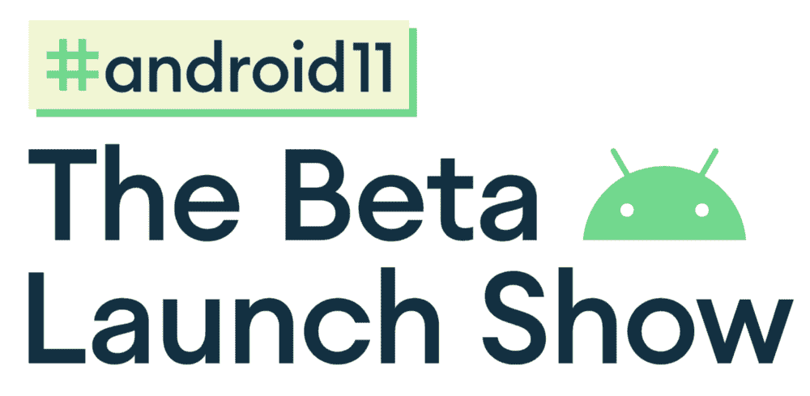
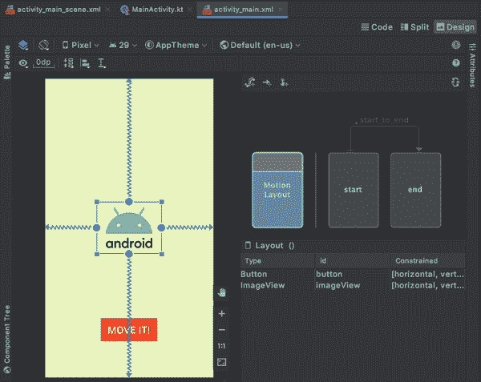
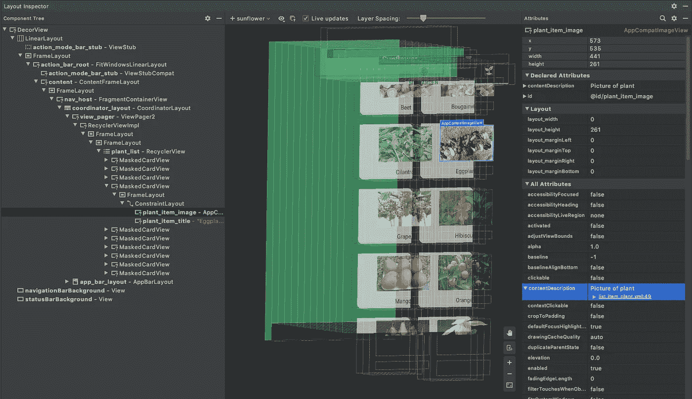
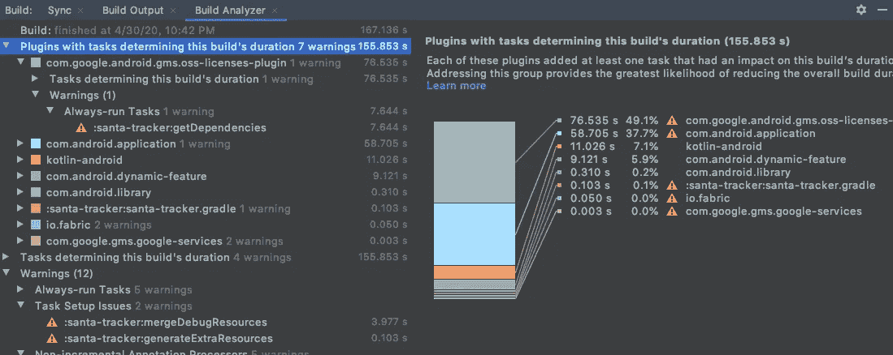

# 现在在 Android #19 中

> 原文：<https://medium.com/androiddevelopers/now-in-android-19-37b130cc657a?source=collection_archive---------6----------------------->

Illustration by [Virginia Poltrack](https://twitter.com/VPoltrack)

## Android 11 测试版发布更新、Android Studio 4.0 稳定版、Kotlin 文章和视频、示例代码以及关于泡泡的 ADB 播客

欢迎来到 Android 中的 Now，这是您对 Android 开发世界中新的和值得注意的事物的持续指导。

# 视频和播客形式的 NiA19

这个*现在在 Android* 中也以视频和播客的形式提供。内容是一样的，但是需要的阅读量更少。文章版本(继续阅读！)仍然是链接到所有内容的地方。

## 录像

## 播客

点击下面的链接，或者在你最喜欢的客户端应用程序中订阅播客。

 [## 现在在 Android: 19 - Android Studio 4.0 稳定发布，Kotlin 文章+视频，样本代码，等等

### 欢迎来到 Android 中的 Now，这是您对 Android 开发世界中新的和值得注意的事物的持续指导。在这个…

nowinandroid.googledevelopers.libsynpro.com](http://nowinandroid.googledevelopers.libsynpro.com/19-android-studio-40-stable-release-kotlin-articlevideo-sample-code-and-more) 

# #安卓 11:测试版发布会…推迟了

你可能已经知道了，但是原定于 6 月 3 日的 [Beta 发布会](https://developer.android.com/android11)已经被推迟了。在网站上寻找关于时间和细节的更新。与此同时，更多的细节已经公布，当它发生时，你可以期待看到的内容。[敬请期待](https://developer.android.com/android11)，我们很快会有更多的相关信息。

# Android Studio 4.0

Android Studio 最近发布了 [4.0 进入稳定通道](http://d.android.com/studio)。所以，如果你一直在等待它出测试版，现在是时候了。

我已经在 Android 的前几集[中讨论过这个版本，但这里有一些你可以期待的亮点:](https://medium.com/androiddevelopers/tagged/now-in-android)

## 运动编辑器

Motion Editor simplifies the creation of rich and flexible UI animations

[MotionLayout](https://developer.android.com/training/constraint-layout/motionlayout) 是一个 API(具体来说是 ConstraintLayout 的一个子类)，可以用来在 UI 中创建强大的动画。它允许您创建之前/之后状态，然后在这些状态之间定义灵活的动画，包括与用户交互的集成，这实质上是在这些状态之间“磨合”。把 MotionLayout 想象成类固醇上的[过渡](https://developer.android.com/training/transitions)，具有更大的力量和灵活性。

但是 MotionLayout 总是旨在与可视化工具一起使用；在 XML 文件中创建这些动画是…乏味的，不适合胆小或害怕打字的人。因此，请使用 4.0 版的 Motion Editor 工具来享受 MotionLayout 的真实体验。

## 布局检查器

Layout Inspector, showing off its new 3D containment hierarchy visualization

布局检查器工具已经被彻底重写，提供了强大的新功能，比如能够点击属性值，找出它们被分配到哪里以及如何分配。此外，您可以看到您的三维用户界面，以可视化的包容层次结构。现在，随着设备上的应用程序发生变化，您可以在工具中实时查看您的 UI 更新。

## 构建分析器

Build analyzer helps catch bottlenecks in build performance

[Build Analyzer](https://developer.android.com/studio/build/build-analyzer) 帮助您发现构建中的瓶颈，帮助您找出如何修复它们并加快构建速度。

这个版本中有更多的特性。你可以在 Adarsh Fernando 的博客文章中了解更多关于 4.0 的特性:

 [## Android Studio 4.0

### 在这个不确定的时期，我们为世界上许多开发者找到继续做下去的方法而感到谦卑…

android-developers.googleblog.com](https://android-developers.googleblog.com/2020/05/android-studio-4.html) 

另外， [Yacine Rezgui](https://medium.com/u/f51b24785c0d?source=post_page-----37b130cc657a--------------------------------) 在 4.0 版本上发布了这个视频概述:

# 文章和视频

Murat Yener 在 Kotlin 词汇系列中发表了一篇关于具体化的文章:

 [## 被抹去者的具体化

### 科特林词汇，具体化

medium.com](/androiddevelopers/reification-of-the-erased-41e246725d2c) 

泛型为 API 和结构启用了编译类型的类型安全，否则它们不会提供这种安全，但代价是无法在运行时检索这些类型。这种情况是*型擦除*的结果。类型通知编译步骤(以确保，例如，您没有将一个`Integer`值传递给一个`String`类型的`ArrayList`)，但是没有保存在字节码中(允许它与没有类型的 API 兼容)。

Kotlin 通过使用`reified`关键字和内联函数提供了一种变通方法。如果你同时声明了一个函数为`reified`和`inline`，那么 Kotlin 编译器会添加必要的字节码，以便在运行时可以获得类型信息。

[Murat](https://medium.com/u/e947fef0dfe0?source=post_page-----37b130cc657a--------------------------------) 还在 [Kotlin 词汇表](https://www.youtube.com/watch?v=OyIRuxjBORY&list=PLWz5rJ2EKKc_T0fSZc9obnmnWcjvmJdw_)系列中发布了一个关于 Object 的视频，该视频与他几周前发布的文章 [The One and Only Object](/androiddevelopers/the-one-and-only-object-5dfd2cf7ab9b) 齐头并进(该文章在 Android #17 的[中出现)。](/androiddevelopers/now-in-android-17-9d73f7bed7f)

# 示例代码

[Bubbles 示例](https://github.com/android/user-interface-samples/tree/master/People)已经更新，以反映 Android 11 中 Bubbles API 的变化和改进。

# ADB 播客片段

自从上一期《现在》在安卓发布后，又有一集安卓开发者在后台发布。点击下面的链接，或者在你最喜欢的播客客户端查看:

## 亚行 140:泡沫！

其中 [Tor Norbye](https://medium.com/u/8251a5f98c9d?source=post_page-----37b130cc657a--------------------------------) 、 [Romain Guy](https://medium.com/u/c967b7e51f8b?source=post_page-----37b130cc657a--------------------------------) 和我与系统 UI 团队的 Mady Melor 和 Artur Tsurkan 讨论了 Android 11 中的气泡功能。这项功能最初是在 Android 10 中作为开发者选项推出的，允许用户在整个 Android UI 中访问你的应用程序中的对话。

还可以看看[泡泡样本](https://github.com/android/user-interface-samples/tree/master/People)(上面叫出来的)，已经为 Android 11 更新了。

 [## 第 140 集:泡泡！

### 在这一集中，Romain、Chet 和 Tor 与来自系统 UI 团队的 Mady Melor 和 Artur Tsurkan 讨论了…

androidbackstage.blogspot.com](http://androidbackstage.blogspot.com/2020/06/episode-140-bubbles.html) 

# 那么现在…

这次到此为止。[查看 Android 11 测试版计划的更新](https://developer.android.com/android11)！下载 [Android Studio 4.0](https://developer.android.com/studio) ！阅读[的博客](https://android-developers.googleblog.com/2020/05/android-studio-4.html)，观看[关于 4.0 版本特性的视频](https://youtu.be/f1fHPqAYj5I)！了解[科特林具体化](/androiddevelopers/reification-of-the-erased-41e246725d2c)和[对象关键字](https://www.youtube.com/watch?v=KUk6k865Vgg)！玩更新的[泡泡样品](https://github.com/android/user-interface-samples/tree/master/People)！听最新的 [ADB 播客](http://androidbackstage.blogspot.com/)集！请尽快回到这里，收听 Android 开发者世界的下一次更新。