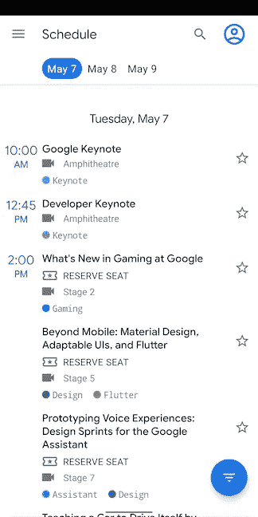

# 现在在 Android #20 中

> 原文：<https://medium.com/androiddevelopers/now-in-android-20-9f2072f43ed6?source=collection_archive---------4----------------------->

Illustration by [Virginia Poltrack](https://twitter.com/VPoltrack)

## Android 11 测试版、Android 11 周、Android 11 Meetups、AndroidX 发布、IOSched 示例代码、文章、视频、新文档和一些播客片段。我们一直很忙。

欢迎来到 Android 中的 Now，这是您对 Android 开发世界中新的和值得注意的事物的持续指导。

还记得上次没有太多内容要讲吗？现在你知道为什么了；我们把它保存起来，以备过去几周发布的大量优秀开发者内容。所以这一集有点长…

# 视频和播客形式的 NiA20

现在安卓系统中的《T2》也以视频和播客的形式提供。内容是一样的，但是需要的阅读量更少。文章版本(继续阅读！)仍然是链接到所有内容的地方。

## 录像

## 播客

点击下面的链接，或者在你最喜欢的客户端应用程序中订阅播客。

 [## 现在在 Android: 20 - Android 11 测试版，样本，文章，视频，等等！

### 欢迎来到 Android 中的 Now，这是您对 Android 开发世界中新的和值得注意的事物的持续指导。

nowinandroid.googledevelopers.libsynpro.com](http://nowinandroid.googledevelopers.libsynpro.com/20-android-11-beta-samples-articles-videos-and-more) 

# 安卓 11 测试版…推出！

原计划为 Android 11 举行的“发布”活动被改为一个更安静的版本；我们只是提供了[测试版](https://www.google.com/android/beta)，以及几个涵盖 Android 11 各种功能细节的视频，以及相关工具和非捆绑库。

要了解关于这个版本以及如何利用 Android 11 中所有新功能(以及我们的工具和非捆绑库)的更多信息，请查看[博客，其中概述了版本](https://android-developers.googleblog.com/2020/06/unwrapping-android-11-beta-plus-more.html)，[下载测试版](https://g.co/androidbeta)，然后观看 [Android 11 视频播放列表](https://www.youtube.com/playlist?list=PLWz5rJ2EKKc9hqKx4qZWolQxy59Bt20t_)。坐下来，放松，了解 Android 11、Android Studio、Jetpack Compose、Hilt、分页、系统 UI、Play Console 等所有新的开发人员功能。

# 安卓 11 周

因为仅仅 14 个视频不足以涵盖我们为开发者所做工作的所有细节，我们推出了一个新的内容系列，名为[Android 的 11 周](https://developer.android.com/11weeksofandroid)。每周都会带来特定领域的新内容，比如 UI、Jetpack 和语言。

## 第 1 周:人员和身份

查看[博客](https://android-developers.googleblog.com/2020/06/11-weeks-of-android-people-identity.html)了解上周的所有细节，包括视频、文章等链接。

 [## 安卓 11 周:人与身份

### 这篇博文是#11WeeksOfAndroid 每周系列的一部分。每周我们都会深入 Android 的一个关键领域，所以…

android-developers.googleblog.com](https://android-developers.googleblog.com/2020/06/11-weeks-of-android-people-identity.html) 

## 第二周:机器学习

本周仍在进行中，内容包括 codelabs、截屏和 Android 开发者挑战赛获胜者的信息。请继续关注 Twitter 上的 [Android 开发者](https://twitter.com/AndroidDev) (#11WeeksOfAndroid)以捕捉发布的内容，并在周末查看 [Android 开发者博客](https://android-developers.googleblog.com/)的摘要和所有链接。

## 下周:隐私与安全

# Android 11 Meetups

随着目前面对面活动的暂停，很高兴看到开发人员社区真正倾向于举办在线活动，演讲者播放演示文稿并参与现场问答。为了帮助这些努力，并向每个需要的人提供更多关于 Android 11 的信息，我们与我们的 GDG 团队合作，专门围绕 Android 11 和相关内容举办了一系列活动。

这些活动已经开始了([缪拉·耶纳尔](https://medium.com/u/e947fef0dfe0?source=post_page-----9f2072f43ed6--------------------------------)、[伊吉特·博雅](https://medium.com/u/55a38e86cfa7?source=post_page-----9f2072f43ed6--------------------------------)，我在[伊斯坦堡](https://www.meetup.com/GDGIstanbul/events/271109645/)参加了其中的第一个活动，而[罗曼·盖伊](https://medium.com/u/c967b7e51f8b?source=post_page-----9f2072f43ed6--------------------------------)、[缪拉](https://medium.com/u/e947fef0dfe0?source=post_page-----9f2072f43ed6--------------------------------)、[伊吉特](https://medium.com/u/55a38e86cfa7?source=post_page-----9f2072f43ed6--------------------------------)和我参加了上周末在班加罗尔[的](https://www.meetup.com/blrdroid/events/271246510/)BLR droid 会议)，这些活动将持续到整个夏天。它们无时无刻不在世界各地发生。仅这一周，我就将参加在柏林、[雅加达、](https://www.meetup.com/GDG-Jakarta/events/271222230/)伦敦和科拉奇的活动。

我从来没有这么快地旅行了这么远，时差还没倒过来。而且飞行里程很少！

查看 [Android 11 Meetups 网站](https://developer.android.com/android11/meetups)找到一个发生在你附近的网站。

# 安卓克斯

在过去的几周里(像往常一样)，有几个 [AndroidX 库发布了](https://developer.android.com/jetpack/androidx/versions)。我不会说出太多，因为它们大多数是 [alpha](https://developer.android.com/jetpack/androidx/versions/alpha-channel) 、 [beta](https://developer.android.com/jetpack/androidx/versions/beta-channel) 和 [RC](https://developer.android.com/jetpack/androidx/versions/rc-channel) 通道中的中间版本，但这里有一些值得注意的例外。

## 现在在阿尔法！

首先，有太多的库发布了他们的第一个版本。请查看这些内容，了解我们在 AndroidX 中启用的一些新功能。

这是新的[剑柄库](https://dagger.dev/hilt/)的第一次发布，用于 Android 上的依赖注入。它建立在 Dagger 之上，是在 Android 上进行 DI 的推荐方法。

请注意，虽然 AndroidX 版本是 1.0.0-alpha01，但这个库来自 Google 的内部版本，该版本已经与 Dagger 一起发布，这就是为什么如果它对您有用，我们推荐它。然而，作为一个 alpha 版本，我们希望 API 在成为 beta 版本之前会根据您的反馈有所改变，所以您可以按照自己的想法来使用和采用。

此外，一定要看看下面提到的[柄文章](/androiddevelopers/dependency-injection-on-android-with-hilt-67b6031e62d)，以及 iosched 应用程序的代码(下面讨论)，其中[现在使用柄](https://github.com/google/iosched/commit/9c20fdd52d446e5fdb03369e50fb196c31ae16e3)。

[分页 3.0.0](https://developer.android.com/jetpack/androidx/releases/paging#3.0.0-alpha01) :这是分页库总重写的第一个版本。它在 Kotlin 中被重写，以利用协程和流，尽管它也支持 RxJava 和 Guava ListenableFuture 原语，如果您喜欢这些其他方法的话。分页简化并优化了 RecyclerView 的数据加载处理，它完全是关于异步更新的，因此这些变化应该使分页的使用更加强大和优雅。

[Startup 1.0.0](https://developer.android.com/jetpack/androidx/releases/startup#1.0.0-alpha01) :与产生许多不同的 ContentProvider 的传统方法(每个 content provider 都有很大的启动开销)相比，Startup 库通过简化和收集启动任务(如共用一个 content provider)来帮助加速应用程序的启动。

[Room 2.3.0](https://developer.android.com/jetpack/androidx/releases/room#2.3.0-alpha01) :这个版本的 Room 主要是关于 bug 修正，但也增加了对新分页 3 库的支持(见上图)。

[基准测试 1.1.0](https://developer.android.com/jetpack/androidx/releases/benchmark#1.1.0-alpha01) :这个库让你更容易测试你的代码的性能(请听我们和团队一起参加的 [ADB 播客第 121 集](http://androidbackstage.blogspot.com/2019/09/episode-121-benchmarking.html)了解更多细节)。这个最新版本支持分配指标、与 Android Studio profiler 工具的集成、更简单的设置和(当然)错误修复。

[核心 1.5.0](https://developer.android.com/jetpack/androidx/releases/core#1.5.0-alpha01) :该版本与 Android 11 中的新 API 同步，包括 ShortcutInfo、通知等。

安全加密 1.1.0 :在其他变化中，这个库现在支持回到 API 21 (Android Lollipop)的版本。

## 现在稳定了！

此外，下面的库刚刚达到[稳定状态](https://developer.android.com/jetpack/androidx/versions/stable-channel)，所以如果这是你一直在等待的里程碑，这就是你的机会:

[片段 1.2.5](https://developer.android.com/jetpack/androidx/releases/fragment#1.2.5) :这个 bugfix 版本刚刚达到稳定，一些修复的回溯将进入未来的 1.3.0 版本。

# 示例代码:IOSched

每年，对于 Google I/O 和 Android 开发者峰会，该团队继续开发现有的 [IOSched](https://github.com/google/iosched) 应用程序，该应用程序有两个目标:为会议与会者提供一个日程安排应用程序，并提供一个丰富的真实应用程序环境，在其中添加最新的功能和最佳开发实践，以便与社区共享。

今年，随着谷歌 I/O 的取消，只有后一个目的得到了满足。但是我们继续努力，最近完成了应用程序的工作。我们添加了一些东西，比如 Kotlin coroutine 支持和一些新的 AndroidX 库的使用，比如 benchmarking、ViewPager2 和 Hilt，并且刚刚在 GitHub 上发布了代码。

# 文章和视频

## 基于 Hilt 的 Android 依赖注入

[Manuel Vivo](https://medium.com/u/3b5622dd813c?source=post_page-----9f2072f43ed6--------------------------------) 发布了一篇关于在 Android 上进行依赖注入的新的 Hilt 库的文章(关于 Hilt 的更多信息，请参见上面的 AndroidX 部分。或者直接去看这篇文章)。

 [## 基于 Hilt 的 Android 依赖注入

### Jetpack 为 DI 推荐的库

medium.com](/androiddevelopers/dependency-injection-on-android-with-hilt-67b6031e62d) 

## Jetpack 的新功能

[弗洛里纳·蒙特内斯库](https://medium.com/u/d5885adb1ddf?source=post_page-----9f2072f43ed6--------------------------------)发布了这篇文章，它是作为 Android 11 播放列表的一部分发布的[伊吉特·博雅](https://medium.com/u/55a38e86cfa7?source=post_page-----9f2072f43ed6--------------------------------)的[视频](https://youtu.be/R3caBPj-6Sg)的扩展版本。文章给出了近期库的概述，包括 Hilt，Paging 3，Autofill，SeekableAnimatedVectorDrawable，使用 Android Studio 中的数据库检查器调试房间应用程序，WindowManager 和 MotionLayout。这篇文章还谈到了现有库中的新功能，比如…您知道吗，如果您直接阅读这篇文章来获得这些东西可能是最简单的:

 [## Jetpack 的新功能

### Android Jetpack 是一套库，旨在帮助您轻松编写高质量的应用程序，支持旧版本…

medium.com](/androiddevelopers/whats-new-in-jetpack-1891d205e136) 

## 在 Android Studio 中调试

[Android Studio 团队的大卫·赫尔曼](https://medium.com/u/df454f901d55?source=post_page-----9f2072f43ed6--------------------------------)发布了[一篇文章](/androiddevelopers/debugging-in-android-studio-dfbbf8a8d03c)，其中有他从团队中收集到的调试技巧:

 [## 在 Android Studio 中调试

### 探索 Android Studio 中一些强大的调试功能。

medium.com](/androiddevelopers/debugging-in-android-studio-dfbbf8a8d03c) 

我从这件作品中学到了很多，包括:

*   为 logcat 设置过滤器，以便只查看您想要的信息
*   将调试器附加到已经运行的应用程序(而不是用调试器重新启动它)
*   关于断点的几点提示
*   堆栈跟踪分析有助于确定哪些部分来自您的代码
*   …还有更多更多！(说真的，这是一篇很长的文章，有很多技巧)

如果你喜欢的话，也有这个信息的视频版本；这篇文章基于 2019 年 10 月 Android 开发者峰会的一篇演讲:

## 系统跟踪

[杨熠](https://medium.com/u/fba4233df186?source=post_page-----9f2072f43ed6--------------------------------)发布了这篇关于 Android Studio 中系统跟踪工具最近改进的文章。

 [## Android Studio 系统跟踪的新功能

### Android Studio 4.0 和 4.1 测试版中 CPU Profiler 改进的亮点

medium.com](/androiddevelopers/whats-new-in-android-studio-system-trace-5841465c5935) 

系统跟踪是 Android Studio 版本的[系统跟踪工具](https://developer.android.com/topic/performance/tracing/command-line)，我们已经在内部使用多年来分析困难的性能问题。Systrace 允许您查看应用程序中所有线程正在做什么的详细信息，以及整个系统中正在发生什么的信息。系统跟踪允许您直接在 IDE 中查看这些信息。

创建系统跟踪是为了使 systrace 的用户界面更简洁，更容易捕获和可视化结果。这两个版本的 systrace 的一个显著区别是，systrace 的输出可以在浏览器中看到，而 System Trace 集成在 Android Studio 中。此外，系统跟踪(Studio 版本)仅包含您正在调试的应用程序的信息，而不包含系统中运行的其他进程的信息(SurfaceFlinger 进程的一些附加信息是一个明显的例外，该进程与应用程序的渲染管道密切相关，因此有助于分析渲染性能问题)。系统跟踪在 API 28+上内部使用 [Perfetto](https://perfetto.dev/) ，以利用我们最新的检测技术。

## 具体化

[Murat Yener](https://medium.com/u/e947fef0dfe0?source=post_page-----9f2072f43ed6--------------------------------) 在 Android #19 中发布了我在[中报道的文章](/androiddevelopers/now-in-android-19-37b130cc657a)[具体化的视频版本:](/androiddevelopers/reification-of-the-erased-41e246725d2c)

# 文件（documents 的简写）

## 喷气背包

Jetpack 有一个新的[登陆页面](https://developer.android.com/jetpack)，上面有关于 Jetpack 的全部信息以及这个庞大的库套件中的一些最新开发。

## 现代 Android 开发

在过去的几年里，我们已经讨论过几次现代 Android 开发。但我们认为是时候更具体地定义我们所说的短语的含义了(剧透:它是我们提供的 API、工具、语言和分发机制的子集，我们认为所有的 Android 开发者都应该采用它来创建最好的 Android 应用程序)。新的[登录页面](https://developer.android.com/modern-android-development?hl=en)涵盖了更多的细节，并提供了有用的链接来帮助您入门，或者(因为你们中的许多人已经使用了许多这些组件)在您的开发生涯中使用更多这些组件。

# ADB 播客片段

自从上一期《现在》在安卓发布后，又有一集安卓开发者在后台发布。点击下面的链接，或者在你最喜欢的播客客户端查看:

## ADB 142:机器学习

我和 Tor Norbye 与 T2 Hoi Lam 和 Matej Pfajfar 讨论了 Android 上的机器学习。收听了解 ML Kit、TensorFlow Lite、迁移学习、联邦学习、ML 模型绑定、Android 神经网络 API 等等！

 [## 第 142 集:机器学习

### 在这一集中，Chet 和 Tor 与 Hoi Lam 和 Matej Pfajfar 讨论了 Android 上的机器学习。收听了解…

androidbackstage.blogspot.com](http://androidbackstage.blogspot.com/2020/06/episode-142-machine-learning-learning.html) 

## 亚行 141:讨论对话

其中 [Tor Norbye](https://medium.com/u/8251a5f98c9d?source=post_page-----9f2072f43ed6--------------------------------) 、 [Romain Guy](https://medium.com/u/c967b7e51f8b?source=post_page-----9f2072f43ed6--------------------------------) 和我与系统 UI 团队的 Julia Reynolds 和 Stefan Franks 讨论了 Android 11 中新的以人为本的功能——对话。对话通知现在出现在通知阴影顶部的专用空间中。请注意，这个功能与泡泡功能一起工作，我们最近在[第 140 集:泡泡中也谈到了泡泡功能！](http://androidbackstage.blogspot.com/2020/06/episode-140-bubbles.html)。

 [## 第 141 集:讨论对话

### 都是人的问题！在这一集里，托尔、切特和罗曼加入了朱莉娅·雷诺兹和斯特凡·弗兰克斯的队伍…

androidbackstage.blogspot.com](http://androidbackstage.blogspot.com/2020/06/episode-141-discussing-conversations.html) 

# 那么现在…

这次到此为止。前往[阅读](https://android-developers.googleblog.com/2020/06/unwrapping-android-11-beta-plus-more.html)和[下载](https://g.co/androidbeta) Android 11 测试版，观看所有关于开发最新 Android 功能的[视频演示](https://www.youtube.com/playlist?list=PLWz5rJ2EKKc9hqKx4qZWolQxy59Bt20t_)！查看 Android 站点的 [11 周，包括来自](https://developer.android.com/11weeksofandroid)[周 1(人&身份)](https://android-developers.googleblog.com/2020/06/11-weeks-of-android-people-identity.html)和 2(机器学习)的新内容！收听世界各地举行的众多 [Android 11 聚会](https://developer.android.com/android11/meetups)之一！下载并使用最新的 [AndroidX 库](https://developer.android.com/jetpack/androidx/versions)如 Hilt 和 Paging3！查看 [IOSched 示例应用](https://github.com/google/iosched)的源代码！去看看关于[手柄](/androiddevelopers/dependency-injection-on-android-with-hilt-67b6031e62d)、 [Jetpack](/androiddevelopers/whats-new-in-jetpack-1891d205e136) 、 [Android Studio 调试](/androiddevelopers/debugging-in-android-studio-dfbbf8a8d03c)、[系统追踪](/androiddevelopers/whats-new-in-android-studio-system-trace-5841465c5935)、 [Kotlin 具体化](https://youtu.be/Xj45hobMI78)的新文章和视频吧！参见 [Jetpack](https://developer.android.com/jetpack) 和[现代 Android 开发](https://developer.android.com/modern-android-development?hl=en)的新登陆页面！听一听关于对话的播客！请尽快回到这里，收听 Android 开发者世界的下一次更新。