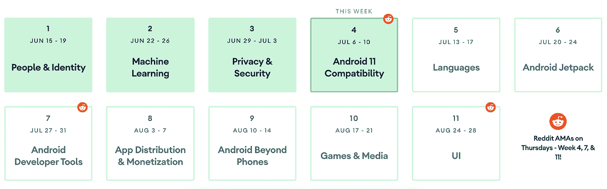
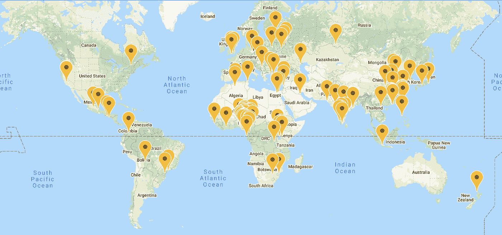

# 现在在 Android #21 中

> 原文：<https://medium.com/androiddevelopers/now-in-android-21-209e665554cb?source=collection_archive---------0----------------------->

Illustration by [Virginia Poltrack](https://twitter.com/VPoltrack)

## #11WeeksofAndroid 具有 ML、隐私和兼容性；安卓团队的 Reddit AMA；更多 Android 11 meetupsAndroidX 释放；文章、视频和代码实验室；和一个新的亚行播客插曲

欢迎来到 Android 中的 Now，这是您对 Android 开发世界中新的和值得注意的事物的持续指导。

# 视频和播客形式的 NiA21

这个*现在在 Android* 中也以视频和播客的形式提供。内容是一样的，但是需要的阅读量更少。文章版本(继续阅读！)仍然是链接到所有内容的地方。

# 录像

# 播客

点击下面的链接，或者在你最喜欢的客户端应用程序中订阅播客。

 [## 现在在 Android: 21 - A Reddit AMA，关于 ML 和隐私的文章、视频和样本，AndroidX…

### 欢迎来到 Android 中的 Now，这是您对 Android 开发世界中新的和值得注意的事物的持续指导。在这个…

nowinandroid.googledevelopers.libsynpro.com](http://nowinandroid.googledevelopers.libsynpro.com/21-a-reddit-ama-articles-videos-and-samples-on-ml-and-privacy-androidx-releases-and-more) 

# 安卓 11 周

我们继续 [11 周的 Android](https://developer.android.com/11weeksofandroid) ，每周都有新的话题。自从上一集《T4》在 Android 第五集播出后，我们完成了机器学习，花了一周时间在隐私安全上，现在正处于 Android 11 兼容性的中期。以下是了解每个主题的更多信息的方法:

## 第二周:机器学习

本周以宣布专注于 ML 的 Android 开发者挑战赛的获胜者开始。随后是 ML Kit(支持自定义分类器和新的早期访问计划)、TensorFlow Hub(新的移动优化模型)、Android Studio ML 绑定、多个新的 codelabs、视频和文章的新发布。

这么多[机器]学习！

查看上周末发布的[博客](https://android-developers.googleblog.com/2020/06/full-spectrum-of-on-device-machine.html)，了解所有内容和信息的摘要:

 [## Android 上的全套设备机器学习工具

### 这篇博文是#11WeeksOfAndroid 每周系列的一部分。每周我们都会深入 Android 的一个关键领域，所以…

android-developers.googleblog.com](https://android-developers.googleblog.com/2020/06/full-spectrum-of-on-device-machine.html) 

此外，请查看 [ML week 视频播放列表](https://www.youtube.com/playlist?list=PLWz5rJ2EKKc9znUgvI7lFPE-v5Vw4mGwG)。

## 第 3 周:隐私与安全

第三周带来了旨在保护用户隐私的平台变化内容，以及我们为使平台更加安全所做的工作的信息。出于隐私考虑，有文章和视频介绍了 Android 11 中的一些重要行为变化，如一次性权限、后台位置、作用域存储和自动重置权限。在安全方面，该团队发布了他们在保护平台方面所做的内容，以及为开发人员提供的功能，如生物识别 API，以使应用程序更加安全。

首先，看看介绍博客:

 [## 安卓 11 周:隐私和安全

### 发布者:安卓隐私和框架产品负责人李思欣·德席尔瓦安卓工程负责人纳拉扬·卡马斯…

android-developers.googleblog.com](https://android-developers.googleblog.com/2020/06/11-weeks-of-android-privacy-and-security.html) 

另外，请务必查看本周的[视频播放列表](https://www.youtube.com/playlist?list=PLWz5rJ2EKKc82becEmw0oxCB0YffWutWB)。

最后，看看下面文章& Codelabs 部分中链接的隐私和安全项目。

## 第四周:Android 11 兼容性

本周的主题是如何确保你的应用与最新 Android 版本的变化兼容。

本周将会有更多兼容性内容发布。关注推特上的 [@AndroidDev](https://twitter.com/AndroidDev) 来了解事情的进展。同时，你可以从这个博客开始:

 [## Android 11 周:测试 Android 11 中的应用兼容性

### 这篇博文是#11WeeksOfAndroid 每周系列的一部分。对于每周# 11 的 Android，我们将深入了解一个关键…

android-developers.googleblog.com](https://android-developers.googleblog.com/2020/07/testing-app-compatibility-Android.html) 

下周:**语言**。

# 问我[和许多其他人]任何事情！

我们为 Android 11 周做的事情之一是举办一系列 Reddit AMAs。这些中的第一个[发生在**本周**，7 月 9 日星期四。这个 AMA 专注于 Android 平台。你可以向平台团队的人询问关于 Android 11 版本变化的技术问题(作为奖励，我们将尝试回答这些问题)。](https://www.reddit.com/r/androiddev/comments/hk3hrq/were_on_the_android_engineering_team_ask_us/)

Add your questions or follow the discussion on the [AMA site](https://www.reddit.com/r/androiddev/comments/hk3hrq/were_on_the_android_engineering_team_ask_us/)

根据你阅读这篇文章的时间(或者看/听 Android 中的 Now[视频](https://www.youtube.com/watch?v=x_lHJED37o8&list=PLWz5rJ2EKKc9AtgKMBBdphI-mrx8XzW56)或者[播客](http://nowinandroid.googledevelopers.libsynpro.com/))，这个 [AMA](https://www.reddit.com/r/androiddev/comments/hk3hrq/were_on_the_android_engineering_team_ask_us/) 可能已经完成了。但是你可以在[同一个链接](https://www.reddit.com/r/androiddev/comments/hk3hrq/were_on_the_android_engineering_team_ask_us/)查看你的问题和我们的回答，以跟上我们的对话。

# Android 11 Meetups

我上次提到的在线聚会一直在快速发展，世界各地都在举办活动。查看 [Android 11 Meetups 网站](https://developer.android.com/android11/meetups)找到一个发生在你附近的。

# 安卓克斯

在过去的几周里(像往常一样)，有几个 [AndroidX 库发布了](https://developer.android.com/jetpack/androidx/versions)。

新的[稳定](https://developer.android.com/jetpack/androidx/versions/stable-channel)版本包括:

*   [CustomView 1.1.0](https://developer.android.com/jetpack/androidx/releases/customview#1.1.0) :新增`[Openable](https://developer.android.com/reference/androidx/customview/widget/Openable)`接口，由 [DrawerLayout 1.1.0](https://developer.android.com/jetpack/androidx/releases/drawerlayout#1.1.0) 和[sliding panel layout 1 . 1 . 0](https://developer.android.com/jetpack/androidx/releases/slidingpanelayout#1.1.0)实现，供[导航 2.3.0](https://developer.android.com/jetpack/androidx/releases/navigation#2.3.0) 使用。
*   [DrawerLayout 1.1.0](https://developer.android.com/jetpack/androidx/releases/drawerlayout#1.1.0) :增加了对处理手势导航 insets 的更好支持，现在在 [CustomView 1.1.0](https://developer.android.com/jetpack/androidx/releases/customview#1.1.0) 中实现了新的`[Openable](https://developer.android.com/reference/androidx/customview/widget/Openable)`接口。
*   [表情符号 1.1.0](https://developer.android.com/jetpack/androidx/releases/emoji#1.1.0) :这个表情符号字体现在包括表情符号 [12](https://www.unicode.org/emoji/charts-12.0/emoji-released.html) 和 [12.1](https://www.unicode.org/emoji/charts-12.1/emoji-released.html) 。
*   [导航 2.3.0](https://developer.android.com/jetpack/androidx/releases/navigation#2.3.0) :该版本集成了[动态特性模块](https://developer.android.com/guide/navigation/navigation-dynamic)功能(允许导航到不存在的模块，然后自动下载安装)。这个版本中的其他特性包括将结果返回到后台堆栈中的前一个目的地，使用导航测试工件改进测试能力，`[NavigationUI](https://developer.android.com/reference/androidx/navigation/ui/NavigationUI)`支持新的`[Openable](https://developer.android.com/reference/androidx/customview/widget/Openable)`接口(现在`DrawerLayout`和`SlidingPaneLayout`已经实现了)，以及增加对深层链接的支持。
*   [sliding panel layout 1 . 1 . 0](https://developer.android.com/jetpack/androidx/releases/slidingpanelayout#1.1.0):该布局现在实现了 [CustomView 1.1.0](https://developer.android.com/jetpack/androidx/releases/customview#1.1.0) 中新的`[Openable](https://developer.android.com/reference/androidx/customview/widget/Openable)`接口。
*   [SwipeRefreshLayout 1.1.0](https://developer.android.com/jetpack/androidx/releases/swiperefreshlayout#1.1.0) :这个布局现在实现了`NestedScrollingChild3`和`NestedScrollingParent3`。

# 文章、视频和代码

发表了几篇文章，包括几篇专门针对隐私与安全周的文章。

## 艰难的选择

安全团队发布了 Android 11 中的[系统强化，其中涵盖了内存分配鲁棒性和调试方面的一些最新进展(包括 Android 11 的 GWP-ASAN，我早在](https://android-developers.googleblog.com/2020/06/system-hardening-in-android-11.html)[中提到过，现在在 Android #17](/androiddevelopers/now-in-android-17-9d73f7bed7f) 中)，以及其他有助于使 Android 平台更加安全的功能。

 [## Android 11 中的系统加固

### 在 Android 11 中，我们继续增加 Android 平台的安全性。我们已经转移到更安全的默认设置…

android-developers.googleblog.com](https://android-developers.googleblog.com/2020/06/system-hardening-in-android-11.html) 

## 存储常见问题

在过去几个版本中，平台的一个较大的行为变化是在作用域存储领域，我们引入了新的 API、权限和限制来进一步保护用户数据。nandana 发布了一个 FAQ 来帮助回答开发人员的一些常见问题。

 [## Android 11 存储常见问题

### 首次在 Android 10 中引入，作用域存储旨在保护应用程序和用户数据，并减少文件混乱。自从…

medium.com](/androiddevelopers/android-11-storage-faq-78cefea52b7c) 

## 包装可见性

[Yacine Rezgui](https://medium.com/u/f51b24785c0d?source=post_page-----209e665554cb--------------------------------) 发表了一篇文章，讨论了 Android 11 中限制应用程序访问设备上安装的其他应用程序信息的新行为。

 [## Android 11 中的包可见性

### 在 Android 10 和更早的版本中，应用程序可以使用以下方法查询系统中已安装应用程序的完整列表…

medium.com](/androiddevelopers/package-visibility-in-android-11-cc857f221cd9) 

## 为什么我的应用会这样？

Sara N-Marandi 发表了一篇文章，讨论了 Android 11 中的几个新 API，这些 API 应该可以帮助开发人员更好地了解他们的应用程序正在做什么以及为什么做。[数据访问审计](https://developer.android.com/preview/privacy/data-access-auditing)让应用程序更容易发现他们的应用程序何时以及为何请求需要用户许可的数据。[进程退出原因](https://developer.android.com/preview/features#app-process-exit-reasons)帮助开发人员(和崩溃报告服务)确定现实世界中用户设备上的应用程序崩溃的原因，以帮助解决这些问题。

 [## 新的 Android 11 工具使应用程序更加隐私和稳定

### 作为我们帮助您构建高质量应用的持续努力的一部分，我们经常寻找我们可以投资的领域…

medium.com](/androiddevelopers/new-android-11-tools-to-make-apps-more-private-and-stable-c9dcea0af415) 

## 玩那些钞票

我确信我们都是为了纯粹的乐趣而写代码，对吗？但是有时我们需要从我们写的应用程序中赚钱。这就是 Google Play 计费的用武之地。

应用赚钱的主要方式之一是通过应用内购买，这是通过 Play Billing 的工具、服务和 API 实现的。

Caren Chang 发表了一系列文章的第 1 部分来帮助你开始。第一部分介绍了 Play Billing，包括向 Google Play 控制台添加项目，并使用 Play Billing APIs 查询这些项目。

 [## 使用 Google Play 计费—第 1 部分

### 对于许多 Android 应用程序来说，主要收入来源是通过应用程序销售数字内容。这可以在…

medium.com](/googleplaydev/working-with-google-play-billing-part-1-387677bd632b) 

## 安卓 11 问答

Daniel Galpin 和 Fred Chung 与印度开发者在线交流，回答关于 Android 11 和 Android 开发的问题。

## 生物识别代码实验室

[Isai Damier](https://medium.com/u/a2d70bdb57?source=post_page-----209e665554cb--------------------------------) 发布了一个新的 codelab，展示如何使用设备的生物识别功能和 [AndroidX 生物识别库](https://developer.android.com/jetpack/androidx/releases/biometric)登录您的应用。

 [## 在 Android 上使用生物识别登录

### 图 1 生物识别登录提供了一种便捷的方法来授权访问您的应用程序中的私人内容…

codelabs.developers.google.com](https://codelabs.developers.google.com/codelabs/biometric-login/#0) 

# ADB 播客片段

自从上一期《现在》发布以来，又有一集 Android 开发者在后台发布。点击下面的链接，或者在你最喜欢的播客客户端查看。

目前 ADB 的很多剧集都是围绕# 11 weeks of Android focus(focus？关注点？我们关注的事情？嗯:“话题”怎么样，关于隐私的最新一集也不例外:

## 亚行 143:嘘！私人！

其中，Tor Norbye 和 T2 Romain Guy 和我与 Android 框架团队的 Sara N-Marandi 和 Philip Moltmann 讨论了 Android 11 中一些新的权限变化。我们讨论为什么要做这些改变，如何在你的代码中正确地使用它们，以及事情在内部实际上是如何工作的。

 [## 第 143 集:嘘！私人！

### 在这一集中，Tor、Chet 和 Romain 与 Android 框架团队的 Sara N-Marandi 和 Philip Moltmann 进行了交谈…

androidbackstage.blogspot.com](http://androidbackstage.blogspot.com/2020/06/episode-143-shhhh-private.html) 

# 那么现在…

这次到此为止。去[机器学习](https://android-developers.googleblog.com/2020/06/full-spectrum-of-on-device-machine.html)、[隐私&安全](https://android-developers.googleblog.com/2020/06/11-weeks-of-android-privacy-and-security.html)、[兼容性](https://android-developers.googleblog.com/2020/07/testing-app-compatibility-Android.html)上了解一下 [11 周的 Android](https://developer.android.com/11weeksofandroid) 内容吧！加入我们的 AMA 红迪网[！收听您附近的](https://www.reddit.com/r/androiddev/comments/hk3hrq/were_on_the_android_engineering_team_ask_us/) [Android 11 Meetup](https://developer.android.com/android11/meetups) 查看最新的 AndroidX 版本！阅读关于隐私、安全和应用程序盈利的文章！做一个关于生物识别登录的 [codelab](https://codelabs.developers.google.com/codelabs/biometric-login) ！听[播客](http://androidbackstage.blogspot.com/)关于[隐私](http://androidbackstage.blogspot.com/2020/06/episode-143-shhhh-private.html)！请尽快回到这里，收听 Android 开发者世界的下一次更新。