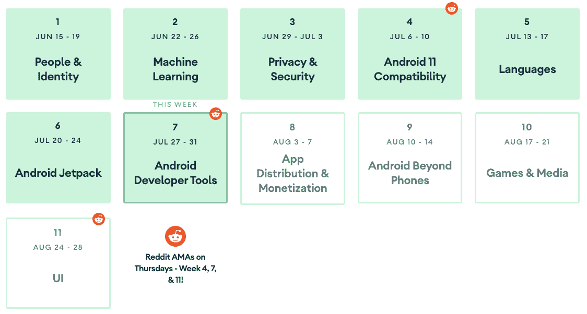
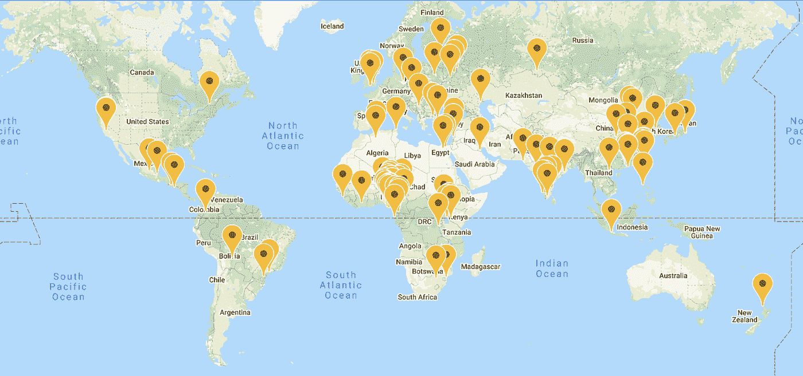

# 现在在 Android #22 中

> 原文：<https://medium.com/androiddevelopers/now-in-android-22-637baa57124e?source=collection_archive---------3----------------------->

Illustration by [Virginia Poltrack](https://twitter.com/VPoltrack)

## Android 11 Beta 2、AndroidX、文章和视频、AMA Android 工作室、培训、Android # 11 weeks、Android 11 在线会议以及更多 ADB 播客

欢迎来到 Android 中的 Now，这是您对 Android 开发世界中新的和值得注意的事物的持续指导。

哇，*这么多内容*贴自[最后一集](/androiddevelopers/now-in-android-21-209e665554cb)。我认为 Android 周的真正名称应该是“11 周内发布的一年的内容。”没有那么朗朗上口，但看起来更坦诚。

# 视频和播客形式的 NiA22

这款*现在在 Android* 中也以视频和播客的形式提供。内容是一样的，但是需要的阅读量更少。文章版本(继续阅读！)仍然是链接到所有内容的地方。

## 录像

## 播客

点击下面的链接，或者在你最喜欢的客户端应用程序中订阅播客。

 [## 现在在 Android: 22 - Android 11 Beta 2，AndroidX，文章，视频，培训等等！

### 欢迎来到 Android 中的 Now，这是您对 Android 开发世界中新的和值得注意的事物的持续指导。在这个…

nowinandroid.googledevelopers.libsynpro.com](http://nowinandroid.googledevelopers.libsynpro.com/22-android-11-beta-2-androidx-articles-videos-training-and-more) 

# Android 11 Beta 2:平台稳定性

Dial it up to Android 11

Android 11 发布刚刚打了 [Beta2](https://developer.android.com/preview) ，也叫[平台稳定性](https://developer.android.com/preview/overview#timeline)。这个新的发布里程碑意味着 API 和行为是锁定的，在最终版本中不会有任何其他的兼容性变化。因此，现在是测试你的应用程序的好时机，看看它在 Android 11 设备上的表现如何。

查看 [Beta2 文章](https://developer.android.com/preview/overview#timeline)和 [Android 11 预览网站](https://developer.android.com/preview)了解所有细节和下载内容。

# 安卓克斯

## 新发布！

有几个[库在不同的阶段发布](https://developer.android.com/jetpack/androidx/versions/all-channel)，从 Compose 发布 dev15 到几个库达到稳定。其中大部分是 bugfix 版本，或者是稳定的中间版本。但我想特别提醒你们注意 AndroidX 的几项发展:

[WorkManager 2.4](https://developer.android.com/jetpack/androidx/releases/work#2.4.0) :除了许多错误修复之外，这个版本还有一些重要的新功能，包括:

*   支持 RxJava 3
*   一个新的 WorkQuery API，这样您就可以了解您的 WorkInfo 请求的情况
*   诊断信息为您提供事情进展的度量

## AndroidX 在 Github 上！

Alan Viverette 在[上发布了一篇关于 AndroidX 已经在 GitHub 上发布的文章](/androiddevelopers/introducing-jetpack-on-github-c2c9f12e62a9)。这是一个来自社区的长期请求，很难处理。我们在内部使用完全不同的基础设施，由于许多因素(你不关心)，我们无法改变这一点。但是我们知道大多数用户熟悉 Github 的工作流程，而不是 AOSP+Gerrit，所以我们已经开始通过 GitHub 提供一些 AndroidX 库。

现在还为时尚早，到目前为止只有一小部分人(Room 和 WorkManager)可以投稿。但这是一个重要的开始。请阅读这篇文章了解所有细节。

 [## GitHub 上的 Jetpack 简介

### 对查看 Jetpack 库的源代码或为其做贡献感兴趣，并且您喜欢 Github？我们有…

medium.com](/androiddevelopers/introducing-jetpack-on-github-c2c9f12e62a9) 

# 文章和视频

## 游戏节目

[Daniel Galpin](https://medium.com/u/2e0fc9a4a8c2?source=post_page-----637baa57124e--------------------------------) 一直在致力于一个新的 [YouTube 节目](https://youtu.be/O-ho31_UNsU)为游戏开发者提供内容。他最近放弃了几集新剧:

**介绍 Android Performance Tuner** 介绍了 Games SDK 中的新工具，它可以让您在用户设备上查看有关应用性能的详细信息，所有信息都在 Play 控制台的 [Android Vitals](https://developer.android.com/distribute/best-practices/develop/android-vitals) 中。

[播放资产交付](https://youtu.be/AJmMD-UIcd0)谈论在正确的时间向用户设备交付正确资产的能力。

查看以上这些节目，关注播放列表，并尽快寻找更多内容。

## 为工作档案构建应用程序

您是否正在开发一款用户可以在企业设备上的工作档案中使用的应用程序？

Aser Samak 发布了这个视频，其中包含一些最佳实践，可以让你的应用程序在工作简介中运行良好。

## 但是我现在就想要！

您可能很熟悉 WorkManager，它是一个可以帮助您运行延迟作业的 API。但是该库中有新的功能，这也使它现在有助于运行作业。

[Ben Weiss](https://medium.com/u/65fe4f480b1c?source=post_page-----637baa57124e--------------------------------) 发表了这篇关于使用 WorkManager 处理需要立即执行的长期任务的文章:

 [## 使用工作管理器进行即时后台执行

### 有些任务不应该被推迟

medium.com](/androiddevelopers/use-workmanager-for-immediate-background-execution-a57db502603d) 

## IOSched +刀柄

除了#11WeeksOfAndroid 链接(如下)中提到的所有精彩的 Hilt 内容，还有一篇由[何塞·阿尔塞雷卡](https://medium.com/u/e0a4c9469bb5?source=post_page-----637baa57124e--------------------------------)发表的文章，详细介绍了团队如何将 IOSched 应用从使用 Dagger 迁移到使用 Hilt。IOSched 是我们开发的应用程序(并且是开源的),它既是一个事件调度应用程序(用于 Google I/O 和 Android 开发者峰会),也是一个示例应用程序，供开发者了解如何使用各种 Android 技术和最佳实践。

之前版本的 IOSched 使用 Dagger 进行依赖注入。团队将其移植为使用 Hilt。我会让你阅读这篇文章的细节和优点。(剧透:他们删除的代码行(2000 行)比添加的代码行(500 行)多得多……而且不仅仅是通过写更长的代码行。

 [## 将 Google I/O 应用程序移植到 Hilt

### Hilt 是建立在 Dagger 之上的新库，它简化了 Android 应用程序中的依赖注入(DI)。但是，多少…

medium.com](/androiddevelopers/migrating-the-google-i-o-app-to-hilt-f3edf03affe5) 

## LiveData +协同例程

[Jose](https://medium.com/u/e0a4c9469bb5?source=post_page-----637baa57124e--------------------------------) 也根据[在去年](https://youtu.be/B8ppnjGPAGE) [Android 开发者峰会](https://developer.android.com/dev-summit)上与 [Yigit Boyar](https://medium.com/u/4ee17deb0f17?source=post_page-----637baa57124e--------------------------------) 的谈话写了一篇文章。这是一个三部曲，所以系好安全带，把它们都看完。或者您可以使用协程和流来异步读取它们。从第 1 部分开始:

 [## 带有协程和流的 LiveData 第一部分:反应式用户界面

### 本文是我在 2019 年 Android Dev 峰会上与 Yigit Boyar 的谈话摘要。

medium.com](/androiddevelopers/livedata-with-coroutines-and-flow-part-i-reactive-uis-b20f676d25d7) 

# 培养

## 新课程:科特林的 Android 基础

最近，我们在 Kotlin 课程中推出了 [Android 基础知识，让没有任何编程经验的人有机会同时学习 Android 和 Kotlin 开发。](https://g.co/android/basics)

 [## Kotlin 课程中的 Android 基础知识| Android 开发者

### 欢迎学习科特林的 Android 基础知识！在这五个单元的课程中，您将学习使用……

g.co](https://g.co/android/basics) 

## 科特林通路

我们还推出了一些新的途径来帮助你快速掌握重要的语言功能。

[**协程**](https://developer.android.com/courses/pathways/android-coroutines?linkId=93760706) :协程是 Android 中异步编程的推荐方法。如果你还没有使用它们，也许一些培训会有所帮助。[这条途径](https://developer.android.com/courses/pathways/android-coroutines?linkId=93760706)通过 codelabs 和文章帮助你指明正确的方向。

 [## 在常见 Android 用例中使用协程| Android 开发人员

### 使用协程来简化常见用例的后台任务管理，例如进行网络调用和访问…

developer.android.com](https://developer.android.com/courses/pathways/android-coroutines?linkId=93760706) 

[**面向 Java 开发人员的 Kotlin**](https://developer.android.com/courses/pathways/kotlin-for-java?linkId=94119824):您是一名 Java 开发人员，正在努力了解如何用 Kotlin 编写，或者如何将 kot Lin 代码添加到您现有的 Java 项目中吗？[这条途径](https://developer.android.com/courses/pathways/kotlin-for-java?linkId=94119824)将有所帮助，codelabs 和文章专门针对 Kotlin+Java 互操作和迁移。

 [## 面向 Java 开发人员的| Android 开发人员

### 使用 Android Studio 将 Java 代码合并并转换成 Kotlin

developer.android.com](https://developer.android.com/courses/pathways/kotlin-for-java?linkId=94119824) 

# AMA 安卓工作室

还记得我在 Android #20 中谈到 Android 平台的 Reddit AMA 吗？我们又做了一次，[这次是为了 Android Studio](https://www.reddit.com/r/androiddev/comments/hwiffd/were_on_the_engineering_team_for_android_studio/) 。

本周四，加州时间 7 月 30 日中午，我们将举办一场 [AMA](https://www.reddit.com/r/androiddev/comments/hwiffd/were_on_the_engineering_team_for_android_studio/) ，许多 Android 工作室团队的人将会尽快回答你的问题。

如果可以，请加入我们的现场直播。但是考虑到通知时间很短，你可能在事情发生后才得到这个信息。在这种情况下，只要看看 AMA 的网站就知道发生了什么！

# 安卓 11 周

我们继续 [11 周的 Android](https://developer.android.com/11weeksofandroid) 每周都有新的话题。从上一集开始，我们完成了 Android 11 的兼容性，然后花了一周时间学习语言，又花了一周时间学习 Jetpack，现在我们花了一周时间学习开发者工具。以下是了解每个主题的更多信息的方法:

# 第四周:Android 11 兼容性

本周的重点是你可以做些什么来确保你的应用程序与 Android 11 版本兼容(以及与新的 Android 版本兼容)。有文章、视频和代码实验室来帮助你了解我们提供的工具和你需要知道的事情，比如允许你切换行为改变的[兼容性框架](https://youtu.be/82einkyFns4)，以及 Android 11 中新的[资源加载 API](https://developer.android.com/reference/android/content/res/loader/ResourcesLoader) 。

对于本周必须提供的内容的概述，请查看此[学习途径](https://developer.android.com/courses/pathways/android-week4-compatibility)以及[总结博客](https://android-developers.googleblog.com/2020/07/11-weeks-of-android-compatibility.html)和[视频播放列表](https://www.youtube.com/playlist?list=PLWz5rJ2EKKc-Rkjav7zN93x4gJPOruB26)。

## 第五周:语言

本周的特色是围绕你用来编写 Android 应用程序的语言的学习内容:Kotlin、C++和 Java 编程语言。有关于 Kotlin 语言特性的视频和文章，比如 coroutines，一个关于支持更新的 Java 语言特性的视频和文章，以及关于 C++开发人员改进的信息。

查看[总结博客](https://android-developers.googleblog.com/2020/07/11-weeks-of-android-languages.html)了解所有细节，以及本周的[视频播放列表](https://www.youtube.com/watch?v=fkZ1WA4IJSQ&list=PLWz5rJ2EKKc_OyeYcCO97J7kd22mQu38Y)。

## 第 6 周:安卓喷气背包

JETPACK 周有大量的内容，因为 Jetpack 提供了如此多的东西！这里有文章、视频和代码实验室，内容涉及从[分页 3](https://youtu.be/1cwqGOku2a4) 到[手柄](https://youtu.be/B56oV3IHMxg)到[相机](https://youtu.be/LUw_LpTMTto)到导航库中的[新特性](https://www.youtube.com/watch?v=09qjn706ITA&list=UUVHFbqXqoYvEWM1Ddxl0QDg&index=1)的所有东西。

查看[总结博客](https://android-developers.googleblog.com/2020/07/11-weeks-of-android-jetpack.html)了解所有细节，以及[视频播放列表](https://www.youtube.com/watch?v=CtnpvR4ZNec&list=PLWz5rJ2EKKc9wZnLd8uWSK3VpnxS-Jjfo)播放这些视频。

## 第 7 周:Android 开发者工具

本周的主题是你用来编写精彩应用的工具。已经有文章和视频发布，本周还会有更多。关注[@ AndroidDev # 11 weeksofadroid](https://twitter.com/search?q=(%2311WeeksOfAndroid)%20(from%3Aandroiddev)&src=typed_query)feed，了解发布的内容。此外，看看[视频播放列表](https://android-developers.googleblog.com/2020/07/11-weeks-of-android-jetpack.html)看看那里有什么，并在周末观看总结博客。

**下周** : App 分发&货币化。

# Android 11 Meetups

我上次提到的在线聚会一直在快速发展，世界各地都在举办活动。例如，本周四我将在一个由波士顿、纽约、墨西哥和阿根廷的谷歌开发团队联合主办的活动上发表演讲(这些在线活动真的是*将人们聚集在一起……)。*

查看 [Android 11 Meetups 网站](https://developer.android.com/android11/meetups)，找到一个发生在你附近的网站。

 [## Android 11 Meetups | Android 开发者

### 这是一个由社区主导的全球系列在线活动，将您与附近的其他开发人员联系起来，以了解您…

developer.android.com](https://developer.android.com/android11/meetups) 

# ADB 播客片段

自从上一期《现在》发布以来，又有两集《安卓开发者的后台》发布了。点击下面的链接，或者在你最喜欢的播客客户端查看它们。

## 亚行 144:汇编者

正好赶上#11WeeksOfAndroid 的语言周， [Tor Norbye](https://medium.com/u/8251a5f98c9d?source=post_page-----637baa57124e--------------------------------) 和我与 Android Studio 编译器团队的 Mads Ager 讨论了 R8/D8 优化、Kotlin 编译器前端和后端以及新的 Kotlin 符号处理器。

 [## 第 144 集:编译器

### 在这一集中，Chet 和 Tor 与 Android Studio 编译器团队的 Mads Ager 进行了交谈。我们涵盖了许多…

androidbackstage.blogspot.com](http://androidbackstage.blogspot.com/2020/07/episode-144-compilers.html) 

## 抓住匕首的柄

在 Jetpack 周， [Romain Guy](https://medium.com/u/c967b7e51f8b?source=post_page-----637baa57124e--------------------------------) 和我与工程师和 Eric Chang 聊天，讨论 Android 新推荐的执行依赖注入的方式。

 [## 抓住匕首的柄

### 埃里克、丹妮和罗曼。切特没有掩饰他在整个录音过程中脸上困惑的表情…

androidbackstage.blogspot.com](http://androidbackstage.blogspot.com/2020/07/episode-145-grab-that-dagger-by-hilt.html) 

# 那么现在…

这次到此为止。所以去用 [Android 11 Beta 2](https://developer.android.com/preview) 测试你的应用吧！看看最新发布的 AndroidX 比如 [WorkManager 2.4](https://developer.android.com/jetpack/androidx/releases/work#2.4.0) ，在 GitHub 上看看 [AndroidX！在 YouTube 上观看](/androiddevelopers/introducing-jetpack-on-github-c2c9f12e62a9)[游戏节目](https://youtu.be/O-ho31_UNsU)！了解[开发工作档案应用程序的最佳实践](https://www.youtube.com/watch?v=09qjn706ITA&list=UUVHFbqXqoYvEWM1Ddxl0QDg&index=1)！阅读关于使用工作管理器运行[即时作业的信息！参加 Kotlin](/androiddevelopers/use-workmanager-for-immediate-background-execution-a57db502603d) 课程中全新的 [Android 基础课程！加入我们的安卓工作室 Reddit AMA](https://g.co/android/basics) ！查看[文章](https://medium.com/androiddevelopers)、[视频](https://www.youtube.com/c/AndroidDevelopers/playlists?view=50&sort=dd&shelf_id=12)、 [codelabs](https://codelabs.developers.google.com/?cat=Android) 以及更多最新[# 11 weeksofadroid](https://developer.android.com/11weeksofandroid)内容。收听世界各地举行的众多 [Android 11 聚会](https://developer.android.com/android11/meetups)之一！听最新的[亚行播客](http://androidbackstage.blogspot.com/)集！请尽快回到这里，收听 Android 开发者世界的下一次更新。